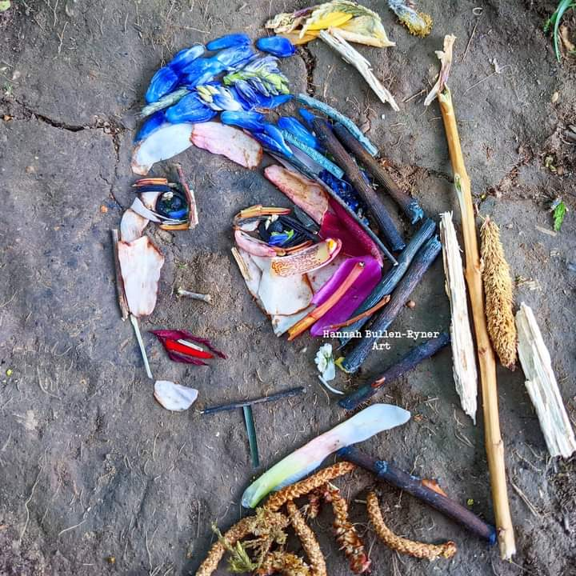

+++
date = 2022-12-03
title = "Ziua 326"
description = "Nu-mi mai pun pumnul în gură pentru că da, am dreptate să fiu nervoasă. Nu pe mama, ci pe situație, am reușit s-o dezlipesc pe mama din dreptul degetului meu acuzator, acum arunc săgețile nervoase către situație. Nu sunt limpede încă în mine dacă nu cumva shiftul ăsta nu e o falsitate, e ca aia 'trebe să se facă și să se dreagă' fără numire de responsabil dar, cel puțin acum, pentru emoționala din mine, e bine să știe că nu mai împroașcă cu gânduri spurcate câmpul mamei de energie, și așa faultat probabil de demență."
authors = ["Biannca Locatelli"]
[taxonomies]
tags = []
[extra]
math = false
diagram = false
image = "images/ziua-326.png"
+++
---

Ora asta 3 din noapte mi-e când prilej de descoperiri, când prilej de enervări. Depinde de stratul pe care-l am pe pielea minții la momentul la care-mi sună alarma. Să zicem că în noaptea asta, primul impuls a fost ok, hai să bifez!, dar al doilea, care m-a înșfăcat brusc și fără niciun drept de apel când am intrat la mama în cameră, m-a aruncat direct în spume: e un miros acolo de mă taie. Mă strâng instant, mi se pare că Universul ăsta îmi testează rezistența la nerespirat, și curăț mizeria din baie care sunt convinsă că a oripilat până și pereții.

Doar mama doarme liniștită. Oare mama o avea vise? Dacă da, ce-o visa? O strig încetișor, să n-o aduc rapid în realitatea asta irespirabilă, îi dau pastila repede și ies înainte să mi se facă rău. Pur și simplu plămânii mei n-au primit decât firișoare mici-mici de aer, dar acum, în afara camerei ei, simt nevoia să ies în afara casei, să trag pe nări tot aerul disponibil, să-mi încarc cu el toată cavitatea pulmonară. Deși, dacă stau puțin să gândesc, poate c-ar trebui să fac asta înainte să intru la ea, să am ceva rezerve, să nu mă mai ia leșinul așa, din prima.

Sunt deja iritată și mi se pare o ironie îndesată pe gât ca acum să mă duc și să mă așez frumușel în pat, ba chiar să și adorm, ca o floare. Și cu cât stau mai mult trează, cu atât mă înflăcărez mai rău.

Dar mă duc în pat, rațiunea sau vocea corpului îmi spune că am nevoie de somn, de odihnă, că nici el nu poate să meargă cu rezervorul pe minim, mult timp. Încerc respirațiile magice, dar pentru că am dat drumul la gândurile nebune, nu reușesc să rămân atentă la aerul care-mi intră și-mi iese pe nări. Mă prinde văicăreala cu amândouă mâinile și, deși văd asta, îmi dau voie să mă aolesc. Nu-mi mai pun pumnul în gură pentru că da, am dreptate să fiu nervoasă. Nu pe mama, ci pe situație, am reușit s-o dezlipesc pe mama din dreptul degetului meu acuzator, acum arunc săgețile nervoase către situație. Nu sunt limpede încă în mine dacă nu cumva shiftul ăsta nu e o falsitate, e ca aia "trebe să se facă și să se dreagă" fără numire de responsabil dar, cel puțin acum, pentru emoționala din mine, e bine să știe că nu mai împroașcă cu gânduri spurcate câmpul mamei de energie, și așa faultat probabil de demență.

Mai încep un ritual, mai pun stop, că nu se leagă, mai o respirație, reușesc să plec în visuri plate, fără culori și fără amintiri, din care mă trezesc scurt mustățile coconetului, aka Chichirica, aka Spikylina, care s-a odihnit ca belfera toată noaptea și acum vrea să sondeze întunericul plin de necunoscut și mirosuri de afară. Pentru asta, mă vrea trează. Și mă obține.

***

Sunt prea plină de fiere ca să mai intre ceva în mine. Apa de abia alunecă, cu o tonă de lămâie, să-mi alunge greața asta existențială și-mi pun și smoothie-ul la făcut. Mă gâdilă plăcut pe nări mirosul crud de fructe zdrobite și-n clipa asta mică de prezență la tot ce fac eu aici în bucătărie, zâmbesc. Ce sens are să car după mine caii morți ai unei nopți nașpa?!

Îmi fac și ceaiul de măceșe tocate și mușețel și, după ce-am validat că mama e bine-mersi, mă trântesc în living, să urmăresc prima mea dragoste în materie de castele: Chateau Diaries.

De fiecare dată sunt inspirată grozav de femeia asta frumoasă, Stephanie, o enciclopedie ambulantă, o ființă angelică, de-o bunătate și de-o incluziune, cum eu nu am mai văzut la nimeni niciodată și-mi dau seama, acum, de câtă putere e nevoie să concentrezi în jurul tău un nucleu de oameni frumoși, hotărâți să pună mâna și umărul la a readuce la viață castelul Lalande. Nu e de ajuns să ai o dorință, trebe să fii felinar arzând, flacără inspirațională și motivațională care să tragă, ca un magnet, după ea oameni cu ochi spălați, minte limpede și robuști emoțional. Nu e simplu iar azi mi-a fost clar atât efortul cât și consumul din spate. Da, nu întâmplător ea are un castel pe mâini, s-a crescut și s-a format și acum e capabilă să-l cuprindă. Iar asta n-are absolut nicio legătură cu fizicalitatea.

***

Respir adânc, să am provizii, și urc să-i dau mamei pastila pentru tiroidă. N-am prea multe cuvinte, că nu pot să-mi țin și respirația și să și vorbesc în același timp, dar deschid repede larg fereastra de la baie, apoi și de la dormitor, mă echipez cu veșnicul zâmbet și-mi aduc din mine întrebarea ce i-o pun în fiecare dimineață: cum ai dormit, domniță? Da, știu, sunt două întruna, una adevărată dar lașă și una falsă sau atentă la a nu răni.

Mă spăl de o mie de ori pe mâini și mă apuc să-i pregătesc micul dejun. Sunt destul de absentă, plecată într-un trecut din care să-mi reamintesc cum era mama. Încep să mi se estompeze amintirile cu ea, bulucite de un prezent urât dar, chiar și așa, distrasă, simt că nu e corect nici pentru mama și nici pentru mine, să las lucrurile astfel. Încă nu pot face mare lucru să schimb percepția, că mă lovește constant și zilnic, dar am eu așa o vagă bănuială, că voi ajunge la un timp în care nuanțele puse pe capitolul "mama" din mine, vor deveni mai prietenoase, mai calde, mai blânde. Toate au timpul lor.

***

Strecor și-un aluat de ștrudel până se trezește Mr. H și apoi mă avânt cu stoicism afară, să curăț și să dezinfectez mașina cu care am făcut traseele cu Sett. Azi vine copila să facem schimb de mașini, să-mi iau "sarcofagul" înapoi și să-i dau ei mașina, în cel puțin aceleași condiții în care mi-a adus-o.

Afară-i cam rece, dar cred că azi cel mai mare spațiu din programul meu artistic este ocupat de modulul de a face. Aspir și spăl și șterg mașina și zău dacă știu unde-a zburat ora. Evident, că-n tot timpul ăsta, gândurile mele n-au stat cu corpul meu în mașină. D-aia nici nu știu unde mi-a zburat timpul.

Păi dacă tot sunt în priză, bag ștrudelul la cuptor și pân' se face, hai cu aspiratorul și-n casă, la parter, că parcă-mi scârțâie țărâna sub papuci.

La foc automat, după ștrudel, intră-n cuptor și niște cartofi aromatizați și niște șnițele din proteină de soia.

Le termin p-astea și încă nu-s terminată, deci mai intră și curățenia de la etaj, plus spălatul și lustruitul mamei și a lui Sassy. Chiar dacă știu că mâine sau chiar mai devreme o să uite, îi dau eu cu spray antiperspirant la subraț, să nu se mai dea ea cu parfum, că ăsta, amestecat cu altele, e un cocktail Molotov pentru mine.

Pun masa pentru noi, strâng masa după noi, pun masa pentru ea, strâng masa după ea.

***

Și trag frâna. Am făcut multe, e drept, dar de fapt m-au făcut ele pe mine. În tot amalgamul pe care mi l-am îndesat în timpul vieții din ziua de azi, am fost arareori prezentă la ce fac. Parțial pentru că m-am extras dintr-un prezent pe care l-am considerat sec, fără substanță, parțial pentru că așa mi-e natural și-n sânge să fac. Mă lovește cât de atașată sunt de rezultat. Dacă mă privesc cu un ochi cât de cât obiectiv, mă văd clar cum alerg ca disperata, câteodată și la propriu, dar în mod sigur la figurat, să le fac pe toate și-mi culeg satisfacția doar din linia aia cu care am tăiat sarcina respectivă de pe listă. Nu-mi iau și nici nu-mi dau timp să mă dezmeticesc oleacă, să văd dacă e vreo sămânță de bucurie, vreo idee, vreun ceva nou ce poate s-a strecurat într-o banală facere de mâncare sau curățenie sau whatever, nu, eu mă gonesc nebună spre finiș. Pe de altă parte, dac-aș sorbi clipele, nu le-aș lungi? Ori eu, la modul cel mai sincer, p-alea în care fac șmotru sau treburi d-astea casnice, de-am făcut o facultate pentru ele (haha), le vreau cât mai scurte. P-altele vreau eu să le lungesc și ele să mă mărească. O să iau la rumegat cândva, să înțeleg cum mi-e mai bine, dar azi n-am timp.

***

Fac focul în șemineu, îmi adun sufletul și gândurile înapoi în matcă și citesc. În timpul ăsta cald, de carne și de suflet, realizez cât de fantastică poate să fie ființa umană. De la robot la boemă, în aceeași zi, fără fracturi de minte și de păreri, am trecut de la a face la a fi, lin și mângâietor.

Iar starea asta mi se gogoșește și mai fain cu copila alături, mă umplu de plăcerea cu care povestește despre viața ei și-i mulțumesc, intim și neștiut, Universului care a făcut el minuni și-a spălat cumva, chiar și parțial, bucăți din dramele puse de mine în ea, atunci când i-am înfrânt voința de a face ce vrea ea, cu voința mea de a face ce dă bine în societate. Uite că acum, câțiva ani, grei pentru ea, mai târziu, înflorește. Într-o formă sau altă, mai greu sau mai ușor, viața îți dă testare, de mai multe ori, pân-o treci.

***

Cu pleoape grele, de plumb, mulțam cuminte:
1. Pentru mușețel!
2. Pentru miile de vieți pe care le trăiești citind și aha-urile care-ți vin la tot pasul!
3. Pentru copila mea frumoasă și bună și puternică!

Clipa de fain este:

  

 

 

  

    <a href="/blog/ziua-325/">Postarea anterioară</a>
  

  

    <a href="/blog/ziua-327/">Postarea următoare</a>
  

