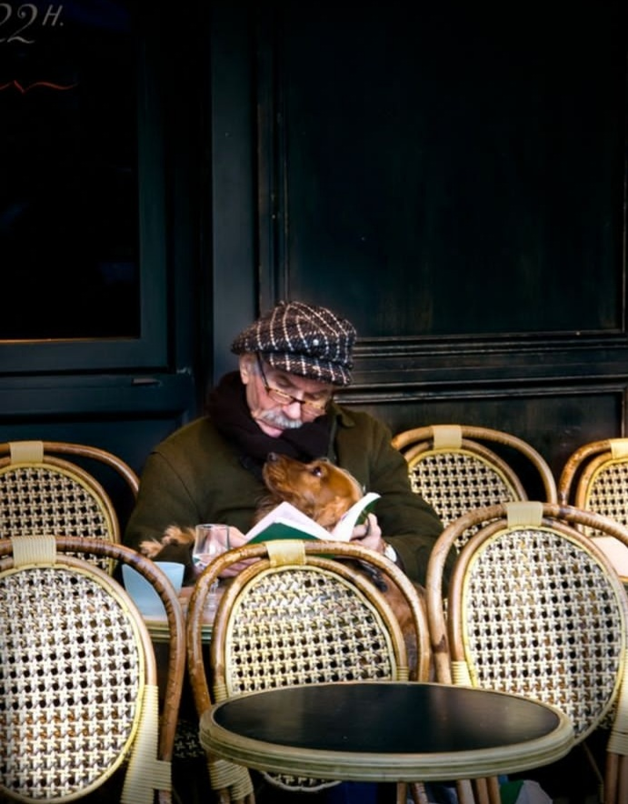

+++
date = 2022-12-04
title = "Ziua 327"
description = "Ajung în punctul ăsta destul de des, viața mă aduce mereu și mereu aici și zice: hai fetiță, începi și tu să înveți a-ți mânui instrumentele din penarul vieții? Că ai primit și stilou, sub formă de minte, să-ți scrii tu singurică scenariul, și cerneală, sub formă de corp, să ai carburant pentru orice-ți imaginezi că poți trăi, și radieră, sub formă de inimă, să ștergi tu acolo unde scapi mai multă suferință decât trebe. Ce mai aștepți?!"
authors = ["Biannca Locatelli"]
[taxonomies]
tags = []
[extra]
math = false
diagram = false
image = "images/ziua-327.png"
+++
---

Pârleazul de la ora 3, de care mi-era frică și pe care-l împingeam într-o margine a mea, să nu mă gândesc, să nu mă irite, să nu mă schimbe, s-a dovediut a nu fi chiar al naibii de greu de trecut așa că, dacă nu iau în calcul micul popas pe tărâmurile lumești generat de pastila mamei, aș putea spune că am dormit blană, dintr-o bucată, mă rog, din două, și niciun vis nu m-a mai înghiontit, fie să mă înece, fie să mă sufere în vreun fel. Chiar dacă în viața mea, am fost preponderent mentală și-am crezut eu că dezvoltarea intelectului și trecerea tuturor informațiilor prin filtrul deșteptăciunii (da, știu, nici modestă nu prea am fost) îmi va da toate răspunsurile, acum simt și înțeleg că mintea-mi slujește, e doar o unealtă, nu e totul. La fel ca și corpul, care a preluat o țâră frâiele scăpate de mine pe miriște și m-a readus acum înapoi pe potecuță, să-mi mai încarc bateriile.

Ajung în punctul ăsta destul de des, viața mă aduce mereu și mereu aici și zice: hai fetiță, începi și tu să înveți a-ți mânui instrumentele din penarul vieții? Că ai primit și stilou, sub formă de minte, să-ți scrii tu singurică scenariul, și cerneală, sub formă de corp, să ai carburant pentru orice-ți imaginezi că poți trăi, și radieră, sub formă de inimă, să ștergi tu acolo unde scapi mai multă suferință decât trebe. Ce mai aștepți?! Numa' că eu, pierdută în nuanțe, am uitat să văd esența. Viața e mult mai simplă decât o croșetez eu.

Trezirea cu aromă de duminică mi-a venit destul de natural și liber, și-așa a fost și Spiky în peisajul dormitorului nostru, trează și fremătândă de zi nouă. În traseul spre parter am auzit televizorul mergând la mama în cameră, semn că-i trează sau cel puțin a fost la un moment dat.

Nu mă rabdă sufletul prea mult așa că, ajunsă în bucătărie, verific camera de supraveghere și-o văd cum stă, cu pilota făcută guler, uitându-se la sau spre televizor, cu mâinile împreunate, într-o frământare continuă. Nu vreau să-mi iau nicio părere sau impresie din imaginea asta, doar notez că e bine, restul oricum mi se va dezvălui în zi.

***

Azi vreau să introduc în smoothie o lingură de unt de arahide, făcut de mine în casă, să văd dacă-mi place. Vreau să încerc variante, să experimentez, să găsesc formula optimă pentru corpul meu iar el să-mi dea sănătatea optimă de care am atâta nevoie. Eu nu-mi aduc aminte de perioade lungi în care m-am simțit sănătoasă complet, în care am radiat de bine. Nici acum, în demență, dar nici înaintea ei.

Spiky a tulit-o afară, în ploaie și-n friguț, dar e alegerea ei, iar eu nu vreau să-i stau în cale. Chiar dacă stau cu grija ei și cu urechile ciulite mai mult spre afară decât spre în casă, asta e alegerea mea și trăiesc cu ea.

Urmăresc filmulețe noi de la castelani și-mi sorb cu plăcere smoothie-ul, varianta nouă. Pișcătura de sărat de la untul de arahide e pe placul papilelor gustive așa că upgrade-ul a trecut testul, merg așa mai departe. Plăcerea asta de pe limbă mi se plimbă prin carne și-mi poposește întâi în ochi, ș-apoi în inimă, iar ce văd îmi dă o stare foarte blândă, caldă și calmă. E incredibil cum fiecare ne culegem crâmpeie din ce ne dau alții, voluntar sau involuntar, și ne inspiră în direcții care mai de care mai interesante, fără ca ei măcar să știe.

***

Sunt sinceră cu mine și-mi sondez niște adâncuri de unde să-mi aduc niște chef, măcar așa empiric, de suprafață, cu care să mă spoiesc, să urc la mama, pentru Euthyrox și curățenie. Mi-e așa de bine cu mine și cu atmosfera de aici, din living, plină de blajin, că mă înțeapă și numa' gândul și amintirea a ce mă așteaptă sus. Dar, vreau-nu vreau, trebe s-o fac. Mă închid o țâră, să nu aspir vreun praf de iritare de pe traseu, trag aer puternic în piept și mă avânt. It is what it is.

***

Atunci când mă micesc, și pe mine, și-mi micesc și viața, ca să nu mă atingă momente d-astea mirositoare, am eu impresia că impresionez, că ating cumva Universul ăsta, că-mi aduce câteodată așa, a dregere de busuioc, momente faine.

D-asta probabil a "plantat-o" pe nebunica asta frumoasă cu botic frumos și nas dungat în împrejurările mele: în timp ce mama își împarte oul fiert în dumicați bine delimitați, egali, împănați cu bucățele de cașcaval și ardei gras, la fel de bine proporționate ca dimensiune, pe Spiky a apucat-o un zoomie, aleargă ca o șturlubatică din bucătărie direct pe colțar, de pe colțar direct pe scaunul din bucătărie, mai are puțin și-o văd atârgățată de candelabru. Aleargă cu coada îndoită, cu corpușorul puțin într-o parte, un strop înfoiată, ca și cum ar putea face din țânțarul care este, elefantul care se visează. Se stropșește din când în când la papucii mei, pe care-i prinde cu gheruțele a luptă, apoi fuge iar, se ascunde după ușă și, din nou, îmi sare în picioare, umflată ca un curcan. Reușește mititica asta să-mi netezească, mie, dunga dintre sprâncene, iar mamei să-i stârnească interesul, mai presus de dumicații înșirați. Încă două ture d-astea de raliu și mama râde, cu gura plină și până la urechi. Gata, m-am dezimflamat. Iar mama radiază zâmbete. Mulțam, coconet!

***

Domnul meu mă răsfață cu o omletă vegană delicioasă, cu de toate, dar pune-n ea și o stare de bucurie, de fain, de drag, de suflete la o vorbă, de planuri, mai mici sau mai mari, de ascultare, de prietenie, de inimă. M-am umplut de fiecare în parte și-am aruncat afară, că nu mai e loc, tot ce m-a zgândărit mai devreme. Aha, deci asta e tot ce trebe făcut: să te prinzi cu ce te ocupi în interior, să te sortezi, să scuipi departe de tine ce te înveninează, iar dacă nu poți să scuipi, să te umpli într-atât încât, veninul înghesuit, să zică "bine frate, plec d-aci, că mă enervezi!". Simplu. Dar de câte ori mi-o fi ieșit?!

***

Rămân pe aceeași lungime de undă mișto și-mi pun niște coffee jazz pe televizor, de pe youtube. Video-ul are și o imagine frumoasă, care rămâne pe ecran îndeajuns de mult încât să mă prind și eu, care-s câteodată mai înceată la semnalele Universului, de frumusețea momentului. Ba, mai mult decât atât, de frumusețea din jurul meu. Că e multă. Imensă.

Cu Chichirica făcută colac lângă mine, scriu pe acorduri de jazz potolit. În casă e cald, am un adăpost, ai mei sunt în viață și sănătoși, eu la fel, ce pot cere mai mult?

În clipa asta atârnată în eternitate, AM tot. Nu pot numi o lipsă și chiar dacă m-aș strădui să concep, cu mintea asta a mea elastic și-n direcția cu plus dar și-n aia cu minus, un ritual al lipsurilor, ACUM nu mi-ar intra pe gura inimii. Niciun castel, niciun vârf de munte, nicio Toscană sau o plajă, nu-mi scade nivelul de împlinire totală care mă trăiește acum. Mă bucură imens gândul ăsta care mi s-a așezat blând pe tâmple, pentru că face completă clipa și-i dă un bobârnac cât Universul de mare, mentalității ăleia care susură că o să fiu fericită, liberă, extaziată, CÂNDVA, când o să le bifez. Iote-mă că sunt, aici și acum, cu ce am și ce n-am.

***

Prânzul mamei a fost lung și plin de povestiri.

Azi s-a dus în copilăria ei și mi-a adus de acolo aceleași istorioare, dar în culori noi, date de starea minții ei de acum, apoi în tinerețea ei, aia nemarcată încă de apariția craiului meu tată și a stat acolo cam trei sferturi de prânz. N-am grăbit-o cu nimic, m-am lăsat dusă de ea acolo unde a plecat și-am trăit, cu ea, acum, căldura clipelor cam cum cred că le-a trăit ea atunci. Cred că asta a fost perioada cea mai fericită din viața ei, nu copilăria marcată de violuri, nici căsnicia, marcată de infidelități. Asta a fost bucata ei de viață bună și-am simțit-o azi cum n-am simțit-o niciodată până acum. În clipele astea încărcate maxim de nostalgie, mama a fost completă, nicio demență nu i-a mâncat vreun coltuc de personalitate, niciun egoism nu m-a alungat din timpul ăsta al ei.

Prânzul de azi al mamei a fost o premieră în viața mea: mama mea m-a inclus în ea, în fascia sufletului ei, într-o intimitate atât de adâncă, că în momentul în care am realizat ce comoară mi-a dăruit, aproape că nu mi-a mai venit să respir, de teamă să nu ușuiesc a plecare clipa.

***

M-am întors la scris, dar sunt alta decât cea care a plecat de lângă laptop, înaintea prânzului. Biannca asta nouă, mai bogată cu o bucată de suflet de-al mamei, parcă are o mai mare grijă și tandrețe față de sine, să nu cumva să risipească căldura ce mi-a împrejmuit inima și-o ține în palme calde. Mă văd și mă simt și mă iau la cântărit cu un strop de curiozitate.

De când îmi articulez în scris zilele, am devenit acut atentă la carnea cuvintelor. Deși am în mine tomuri întregi de cuvinte, nu le-am luat niciodată la puricat îndeaproape, dar le-am folosit, adecvat evident, cu nonșalanță. Nu mi-am aplecat curiozitatea asupra lor, asupra a ceea ce implică cu adevărat, le-am luat înțelesul pur și simplu doar cognitiv și de etichetă.

Noi am venit aici să trăim, să experimentăm, să ne umplem, să ne bucurăm. SĂ TRĂIM. Simt atât de intens tot universul cuvântului ăsta și-mi dau seama cât timp din viața mea el a fost umplut de mâncat, dormit, sex, muncit și 2 săptămâni de vacanță pe an. Plus alea mai light, nu atât de grosiere, cum ar fi dezvoltarea personală, inteligența, validarea exterioară, iubirea aia bolnavă care pune piedici, în loc să dea libertăți și multe de aceeași teapă.

În trăitul ăsta nou, pe care-l văd cu alți ochi acum, tot ce poți să faci este să te arzi cu tot ce ești, să cutezi să faci dar și să permiți celor din jur la fel. Mi-am dat seama, prin demența mamei, că eu nu voi fi niciodată impasibilă la emoții. Și nici nu vreau să mă ciuntesc să fiu așa. Eu când simt, simt cu tot ce sunt, când sufăr, sufăr cu tot sângele și să fac un cocktail din a trăi, a permite și a mă arde fix cum sunt și cum nu sunt, e cheia pentru existența mea. Iar pentru asta n-am nevoie de nicio validare exterioară, aia dinăuntrul meu mă liniștește total, simt că-s pe drumul bun. Atâta timp cât nu uit esențialul, că ăsta e un loc de joacă, orice abis sau înalt, sunt pentru mine numa' bune de trăit, experimentat, mestecat, pritocit.

***

Mi-a fost ziua asta diamant. Fix ca el, ce-am primit azi s-a născut într-un foc și-o presiune crescute cât o viață de-a mamei, așa că-mi rămâne să pun degetul pe alte două recunoștințe, deși-mi par mult mai palide decât diamantul:
1. Bunătatea dintr-un căuș de duminică!
2. Bogăția din mine și din afara mea!

Frumosul din clipă:

  

