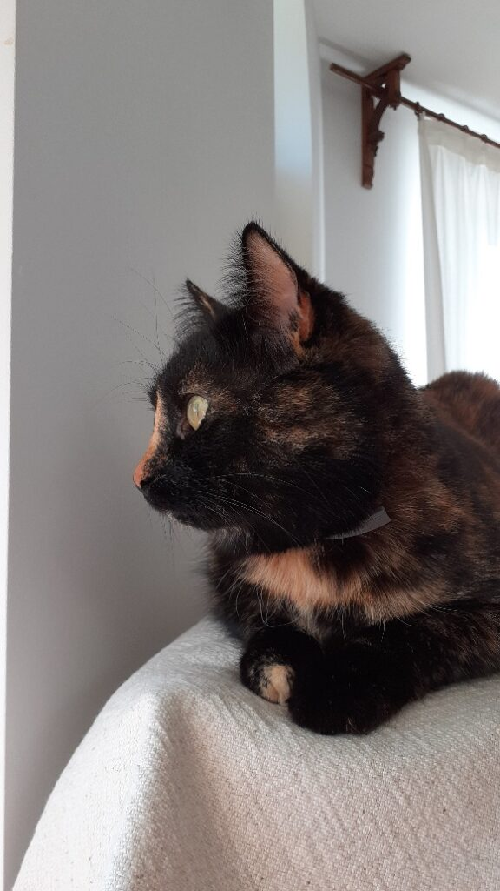

+++
date = 2022-02-13
title = "Ziua 33"
description = "Mă gândeam azi că scrisul ăsta va rămâne pentru nepoții mei, să mă cunoască. Apoi mi-am dat seama că scrisul ăsta e și pentru ai mei, să mă cunoască și ei. Dar cel mai mult, scrisul ăsta e pentru mine, să mă cunosc eu. Să mă citesc și să mă accept și acolo unde aș vrea să mă șterg. Să mă rotunjesc acolo unde acum sunt colțuroasă. Să mă iubesc acolo unde acum de abia mă-ncumet să pun lanterna că nu prea-mi place ce văd."
authors = ["Biannca Locatelli"]
[taxonomies]
tags = []
[extra]
math = false
diagram = false
image = "images/ziua-33-final.jpg"
+++
---

4.36 prima trezire. 5.38 a doua. Între ele, printre picături de somn, am dat drumul și la întrebări către Univers. Junghiul s-a mai domolit, de data asta pe bune. Mi-am propus în dimineața asta să aleg bucuria de viață pentru azi. Să vedem dacă-mi și iese.

***

Spikylina mea, cu ochii cârpiți de somn, are chef de joacă și drăgăleală. Se tot lipește de picioarele mele și se aruncă pe spate, cu burtica în sus. Are fata asta niște reminișcențe de cățel în ea, altfel nu-mi explic dezvelirea de burtică așa cu una, cu două. Nu m-am trezit încă atât de bine încât să mă aplec la drăgăleală dar nu pot să nu zâmbesc. Hai că-i bine, so far! Într-adevăr animăluțele sunt îngeri fără aripi.

  

***

Se trezește și mama în scurt timp, ceea ce mă bucură: azi e duminică, azi vreau să fac o aroganță, să mă dedulcesc la timpul meu liber cu toată libertatea posibilă. Mă grăbesc să fac curat la fete, mama e mai bine decât ieri, parcă se aliniază planetele să-mi iasă faza cu bucuria.

***

Sunt în linie dreaptă cu blogul. Nu-mi trebe cine știe ce “rachetă” ci unul care să fie ușor de citit. Și mie să-mi mănânce puțin timp cu încărcarea zilnică a postărilor.

***

Încă nu știu dacă acest descărcat de emoții pe un ecran de laptop a mai descătușat din strânsoarea traumei. Nu știu dacă articularea experiențelor și a gândurilor zilnice ajută la spălarea lor și împiedică săpatul în straturi adânci, cu manifestarea mai târzie. Încă nu-mi dau seama pentru că, deși au trecut 2 luni aproape, eu nu m-am dezmeticit. Am parcă în sânge o așteptare de așezare a lucrurilor, o normalizare, care evident, în demență, nu se întâmplă. Dar nu am procesat acest “nu se întâmplă” și stau puțin suspendată. O să se rupă și craca asta cândva și atunci pesemne voi fi capabilă să trag o linie și să fac un total.

***

Până una-alta, scrisul ăsta a stat cu mine 33 de zile. Încă 33 de zile și o să intre în rutină.

Mă gândeam azi că scrisul ăsta va rămâne pentru nepoții mei, să mă cunoască. Apoi mi-am dat seama că scrisul ăsta e și pentru ai mei, să mă cunoască și ei. Dar cel mai mult, scrisul ăsta e pentru mine, să mă cunosc eu. Să mă citesc și să mă accept și acolo unde aș vrea să mă șterg. Să mă rotunjesc acolo unde acum sunt colțuroasă. Să mă iubesc acolo unde acum de abia mă-ncumet să pun lanterna că nu prea-mi place ce văd. Dar să o pun, să las la vedere, pentru mine și pentru cei din jur, și partea aia mascată, ascunsă, care nu dă bine. Că așa sunt eu întreagă.

***

Mama a mâncat bine la micul dejun. Am înlocuit cafeaua cu un ceai tare bun de la Tea Hug, de vanilie și portocală. Miroase demențial! Îi pun plicul pe la nas și mă aștept la o reacție pe măsura parfumului. Ei, aș! Nimic. Zero. O țâră iritată, îi zic că nimic nu o mulțumește. Se face că nu m-aude și mă întreabă ce scrie pe o cutie de medicamente. Așa a făcut toată viața: când ceva nu i-a convenit, a schimbat brusc subiectul.

Hotărăsc să nu-mi stric feng shui-ul. A mâncat tot, a băut și ceaiul, a mai povestit niște experiențe d-alea struțo-cămilă, amestecate de nu mai înțeleg nimic, dar per ansamblu, a fost bine.

***

Mă apuc de puțină ordine, de pregătit prânzul, mai scriu, mai fac un test și s-a făcut de masă din nou.

A mâncat și supa și grătarul de pui cu poftă, e clar mult mai bine decât ieri și fizic și emoțional.

***

Spiky a ieșit din nou la plimbare. Din nou, ne dă emoții. S-a făcut beznă și ea nu s-a întors… Nu am terminat cele 2 ore de table cu mama pentru că am ieșit să o căutăm.

Universul ăstă îmi tot dă șah. Azi m-am hotărât să am bucurie de viață. Fără niciun firicel de nehotărâre sau teamă sau cedare. Am vrut să-mi fie bine dar n-am reușit până la capăt.

În așteptarea lui Spiky, mi-am cercetat trăirile: nu m-a mai năvălit panica de data trecută, era ceva dar nu atât de intensă, o parte din mine simțea că totul e în regulă, o parte croșeta apocalipse, eram tristă dar și ok. Încă două plecări d-astea și devin zen la capitolul ăsta.

A venit mademoisella, ca o floare, pe beznă totală, ca și cum nimic nu s-a întâmplat.

Mi s-a luat greutatea de pe suflet total dar cred că am intrat într-un program în care mie trebe să-mi fie greu. Mi se pare că sunt într-o cursă și merg din obstacol în obstacol.

Mi-e dor de viața mea! Mi-e atât de dor de oamenii pe care îi credeam aproape, pentru care aș fi mers până la capătul lumii, mi-e dor de libertate!

***

Eu nu mai știu când trec zilele. Dacă nu ar fi acest blog, nici nu aș ști cum am “consumat” 33 de zile din viața asta! Am o senzație acută de suspendare, de trăire numai în emoții și stări consumatoare, toate în miros de mic dejun și prânz sau spălat și făcut curat. Doamne, cât aș vrea să călătoresc, să consum frumos, să trăiesc frumos. Ce trăiesc acum e un simulacru de viață și simt asta până în măduva oaselor!

***

Am început ziua cu speranță și o închei cu deznădejde. Nu găsesc ieșirea din nivelul ăsta de joc. Sunt într-o buclă și încerc, cad, o iau de la început, iar cad, mai am “vieți”, tot reiau dar nu reușesc trecerea mai sus.

Cica e  nevoie de tristețe pentru a înțelege fericirea, e nevoie de zgomot pentru a aprecia liniștea, e nevoie de absență ca să înțelegi valoarea prezenței unei persoane.

Dacă jur că le-am înțeles până la sânge, pot să trec mai departe?!
