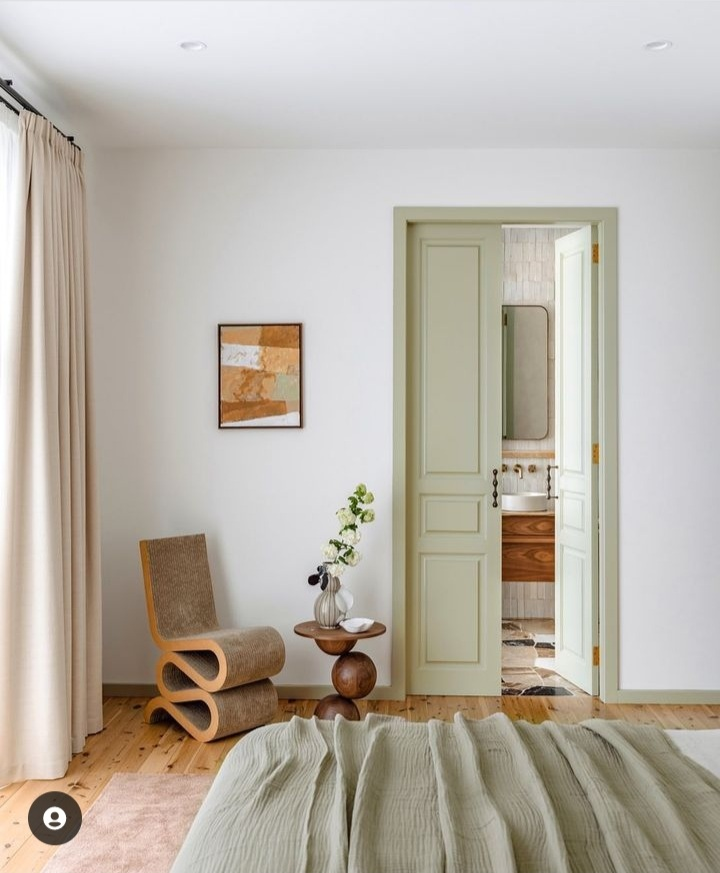

+++
date = 2022-12-07
title = "Ziua 330"
description = "Lucrurile pe care eu cred că le-am pierdut, de fapt nu mi-au fost niciodată menite 'etern', sau măcar egal cu durata vieții mele. Nope, era nevoie doar să-mi atingă viața, să-mi devieze o țâră traseul, care altfel probabil că m-ar fi dus în cap. Numa' că eu, obtuză și strângătoare, m-am pus cu tentaculele pline de ventuze pe toate, pe situații, lucruri, stări, dar cel mai mult pe oameni, pe care nu-i voiam dați din viața mea sub nicio formă."
authors = ["Biannca Locatelli"]
[taxonomies]
tags = []
[extra]
math = false
diagram = false
image = "images/ziua-330.png"
+++
---

Nu m-am trezit că m-am săturat de somn, m-am trezit că mă ciocăne insistent în toată mine durerea, cu precădere pulsatilă în cap. În genere, eu zic că pot să le duc pe toate, mai cocoșată sau mai lejer, măi dar durerea asta care vine destul de des prin ograda mea, începe să mă sece și să mă sature. Mi-e pragul ridicat la suferința fizică, dar încep să mi se tocească nervii ăia nervioși și să nu mă mai țină baierile să duc atâta durere, mai ales că nu am pauze mari de timp în care să-mi îmbățoșez o țâră mai mult țâțânile.

În clipele astea, cel mai mult mă îmbracă deznădejdea, ea e prima care vine repede să mă "aline". Când îmi simt marginile sau, și mai dramatic, miezul, înghiotit de durere, nu-mi mai arde de nimic și vin să mă locuiască toate gândurile negre, care-mi sunt prin preajmă mai tot timpul, ascunse de după draperiile stărilor de bine atât de volatile. Încep să gogoșesc scenarii, să mă înfior, să cred că e sfârșitul lumii, de fapt doar al meu, dar tot aia e, că-s echivalente la o adică, și țopăi ca o viespe dintr-o apocalipsă-n alta. În dimineața asta, de exemplu, nici nu vreau să mă trezesc. Dacă la orizontală mă doare așa, apăi când m-oi ridica la verticală, mă ia cu leșin, clar. Nu, mersi! Mai bine stau așa, mai lâncezesc în starea asta înțepătoare, dar suportabilă, până mi-oi face curaj să mă avânt. Lasă că nu pică cerul lumii dacă nu-s eu în picioare, mai bine mă asigur că nu pic eu grămadă peste cerul meu întunecat acum.

***

Ca să aduc puținică lumină prin mine în dimineața asta cam gri, încerc să mă agăț de ritualul meu cu recunoștințe. Mda, ritualul ăsta nu e doar de spus, e mai ales de simțit, iar în pulsația asta dureroasă care sunt acum, nu mai are loc nicio altă simțire, pare-se. Nu mă pot aduna să-mi încep ziua ca de obicei, poate și pentru că sunt plină de gânduri ce n-au nicio legătură cu feng shui-ul.

Ok, ia să văd eu, ce se poate întâmpla dacă stau eu cu mine și cu durerea asta și cu gândurile-corbi negri?! Hai Universule, hit me as hard as you can!

***

Degeaba fac eu pe cocoașa, n-am avut niciun succes cu donșoara durere, nu am impresionat-o de niciun fel, așa că mă adun și-mi iau coada dintre picioare în jos, spre parter. N-am căzut grămadă încă și sunt șanse mari să nici n-o fac. Cu alte cuvinte, o s-o duc pe picioare.

Evident că durerea-n carne se traduce cu lipsă de chef în stare și se împănează cu nervi, acolo unde sesizez că intervine implacabilul "trebe". De multă vreme mă irită ce implică cuvântul ăsta, dar în vremuri d-astea chinuitoare, sensul se exacerbează și dau în clocot. Apa caldă se duce cu chiu cu vai în largul și lungul meu, îmi fac și smoothie-ul și ceaiul și le las cumincioare pentru mai târziu un pic, poate reușeșsc să mă și bucur de ele, dacă nu s-o lăsa cu savurare.

***

Nu mi se leagă de-un timp liber până la pastila mamei pentru tiroidă și de aici îmi începe sufocarea cu "trebe": să fac curat în camera ei, când asta mi se pare cea mai odioasă și osânditoare sarcină ever, să pregătesc mic dejunul, când mirosurile îmi faultează bila sau trila sau ce dumnezeului o fi și să stau popândău la masă cu mama, ca să ocup un loc în spațiul bucătăriei, varianta ad-hoc, de azi, a mea, a "drumului cu proști". Fix așa mă simt, nu știu ce sens am acolo, lipită de scaun, când nu-mi arde să fiu acolo, când nu știu dacă mamei îi este util sau necesar sau măcar plăcut să fiu acolo. Dar stau și încerc să port o conversație minimală, la volum redus, că n-am prea multă vervă-n vocabular.

***

Duc umbra care a a rămas din mama la etaj și rămân și eu acolo, în dormitorul nostru, în pat. Doar puțin, măcar puțin, să stau întinsă.

Nu pot dormi, nu pot sta trează, sunt într-o stare duală dar, la orizontală, parcă pot s-o duc mai ușor. Doar am învățat că orice se poate duce, așa că aștept să-și facă spațiu în mine durerea asta, ca să nu o mai simt cum mă strânge, înghesuită în coaste sau în craniu. De obicei, în momente d-astea, ca să nu mă dau de ceasul morții, iau la ronțăit percepții sau momente pe care le-am parcat cândva, pentru când oi avea timp. Caut febrilă prin mintea mea, organizatoare de fișiere, să extrag lozul norocos pentru ziua de azi.

N-apuc s-o fac, că mă derutează un zgomot, care vine dinspre camera mamei. Văd pe camera de supraveghere că vorbește la telefon și rămân cu ochii, dar și cu urechile, conectată la ce se întâmplă la ea în cameră.

O aud cum toarnă inepții cu atâta cursivitate și fluență, că știu sigur impresia pe care i-o lasă interlocutoarei: _măi, dar ce bine e Lia!_ Am auzit asta de nenumărate ori de la prietenele ei și, dacă la început, încercam să îndrept falsul, acum nu mă mai obosesc. Azi nici n-aș putea, de altfel. Dar altceva mă ia în primire azi: o aud râzând într-un fel aparte și asta dă cu toată forța la o parte ideea mea că mama e un bau-bau inconștient. Mama e și ea o ființă care trage cu dinții de viață, indiferent cum îi vine viața asta în clipele de acum. În spatele deranjului generat de o minte plecată, e o poftă de viață pe care eu nu numai că n-am mai văzut-o, dar nici n-am mai crezut-o posibilă. Sau dacă am văzut-o câteodată, am uitat-o complet, zăpăcită de demența care își face de cap cu mintea mamei.

Boala asta are extraordinar de multe fațete, deși am crezut că e simplu, că pun eticheta de Alzheimer, presupun că uită multe și în final tot și asta e, realitatea e mult mai complexă și mai năucitoare. Pentru că dacă pe multe le poți cuprinde cu mintea, singurul lucru pe care nu reușesc deloc să-l integrez în mine este determinarea exactă a momentelor când mama mea e din nou în ea și când nu. Nu reușesc să mă prind mereu și cu siguranță nu prind șpilul motivului care-i taie, câteodată al naibii de brusc, prezența în viața ei.

În mine se combină încântarea noii descoperiri cu umbra noii descoperiri, c-așa-s eu, duală. Nu pot doar să mă bucur c-am văzut ceva-ul din spatele aparențelor, c-am simțit o viață care încearcă să iasă la suprafață, dar e băgată la fund de o minte alterată, eu mă tot agăț de tristețea că clipele astea bune nu (mai) durează. De parcă ar dura ceva în viața asta.

***

Plecată pe gândul efemerului de la fiecare pas și clipă ale noastre aici, pe pământ, mă prind, în rumegarea de azi, că lucrurile pe care eu cred că le-am pierdut, de fapt nu mi-au fost niciodată menite "etern", sau măcar egal cu durata vieții mele. Nope, era nevoie doar să-mi atingă viața, să-mi devieze o țâră traseul, care altfel probabil că m-ar fi dus în cap, să-mi dea ce aveau de dat și să plece. Numa' că eu, obtuză și strângătoare, m-am pus cu tentaculele pline de ventuze pe toate, pe situații, lucruri, stări, dar cel mai mult pe oameni, pe care nu-i voiam dați din viața mea sub nicio formă. La o scară mai mică, că totuși m-am fript ceva și am mai învățat din lecție, nici acum nu m-am vindecat. Doar am redus numărul. Situațiilor, stărilor, lucrurilor, oamenilor. Cu cât înaintez în viață cu atât sunt mai duală la capitolul ăsta: parcă mă dezlipesc mai greu dar și mai ușor. Îmi ia mai mult timp să decid ghilotinal că "gata", dar mai puțin timp să mă vindec, după ce am decis. Probabil că-n mine ticăie un ceas și-ncep să-l aud din ce în ce mai clar: viața e scurtă.

***

Pentru că mi-am luat porția de noutăți pe ziua de azi, prânzul mamei nu mă surprinde prin placiditatea lui. Ba chiar mă las și eu cu totul în impasibilitatea asta și vreau să îl bifez, să mă întorc repejor în pat, în atmosfera aia tare plăcută a dormitorului nostru.

Cu excepția unor pauze clar delimitate în timp și scop, am stat aproape toată ziua în pat, mâncând doar banane si bând doar ceai. Dar, deși corpul mi-e chinuit de dureri, sufletul mi-e plecat departe, pe-o aripă a imaginației, acolo unde mi-ar plăcea sa fiu. Sunt în corp și sunt și evadată din corp. Mă folosesc de clipele astea dureroase și ca să văd ce pot să scot din ele. Asta, când reușesc să respir o țâră în afara menghinei durerii.

***

Dacă n-am avut apă la moară prea mult, pe seară îmi vine din plin: de azi mama începe tratamentul cu nitrofurantoină, pentru infecția urinară, și ăsta durează 10 zile, frecvență administrare din 6 în 6 ore. Asta înseamnă că reiau postul de cucurigu de la ora 3 noaptea pentru 10 zile la rând. Feerie.

***

Că n-o fi dracu' atât de negru, încerc să nu mă încarc acum, la ceas de seară și culcare, cu toate negurile, ci mă smulg, cu greutate, că drama e dulce și addictive, să-mi număr recunoștințele zilei, pentru:
1. Zvâcul din mine care, chiar și așa, terfelită ba de una, ba de alta, nu mă lasă acolo jos, capitulată!
2. Ființa din viața mamei și viața din ființa mamei!
3. Corpul meu care le duce pe toate!

Stropul de fain de azi mi-a fost:

  

Hegi Design
