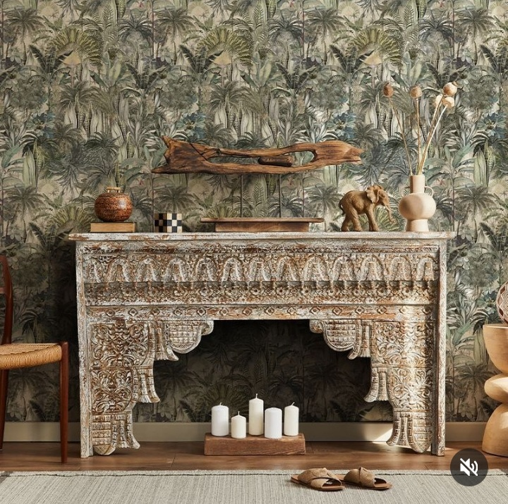

+++
date = 2022-12-16
title = "Ziua 339"
description = "Cum ar fi să fii deschisă posibilității, oricărei posibilități, tot timpul? Să primești în viața ta oameni, care nu bifează corespunzător toate căsuțele în care ai pus tu, ordonat, cerințele de calificare, să lași loc imprevizibilului superb? Să te lași surprinsă, fără frică sau oroare, de împrejurări în care controlul nu a fost întins atotcuprinzător pe toate detaliile și o margine nesupravegheată a dospit ceva neașteptat de bun?"
authors = ["Biannca Locatelli"]
[taxonomies]
tags = []
[extra]
math = false
diagram = false
image = "images/ziua-339.png"
+++
---

După o noapte scurtă și zbuciumată, înțepată pe ici, pe colo, de vise grele, de fugă și neputință, de trezirea de la ora 3 și de nervii care ai venit la pachet cu toate astea, trezirea într-o nouă dimineață mi s-a simțit, sau poate mi-am dorit eu să simt așa, ca un reset. Mi-am văzut cu extremă claritate dualitatea care mă formează: o parte din mine, care alimentează câteodată voluntar, alteori inconștient, ghemul ăla de gânduri grele, din care mintea-mi croșetează pânze la fel de grele și cealaltă parte din mine care vrea cu îndârjire să iasă la un liman, care face eforturi, uneori disperate, să șteargă, să integreze, să înțeleagă, să accepte lucrurile care nu-i plac, ca să facă loc lucrurilor bune ce stau la coadă după buluceala asta creată, să intre și ele în mine. Iar între cele două părți ale mele e doar un act de voință. Sau o putirință. Sau ambele.

Nu știu pe la care nivel de joc din evoluția umană, i s-a părut omului că exteriorul e mai interesant decât interiorul, și-a pus gena asta în generațiile ce-au venit după. Mie mi se pare că avem o nesățioasă dorință de a lua din exterior, dorință care care nu e potolită niciodată, dar care, la o privire mai adâncă, e extrem de consumatoare de timp și energie și viață. Aia interioară, aia pe care de fapt ar trebui să fim cu geana tot timpul, spre binele nostru. Și credeam că doar io-s hapsână, de fapt cred că e genă-n toți, doar că nu toți se prind sau recunosc. Eu, care învăț pe zi ce trece că nu mai am ce pierde și că de fapt n-am avut niciodată, recunosc cu gura plină că fug din mine și din viața mea de nenumărate ori într-o zi, numa' să nu fiu nevoită s-o trăiesc, cu toate durerile și mirosurile și lipsirile și lipsurile ei. Dar recunosc și că practic, cât mă ține cureaua, și statul în clipa rotundă și plină și totală. Doar că e mai roz câteodată să întinzi mâna afară și să iei. Stări, impresii, imagini, dorințe.

***

Mr. H pleacă la birou azi și are și petrecerea de Crăciun. Din experiență știu că ne vom revedea mâine. Mă bucur pentru el și mă bucur pentru mine că am inima ușoară, mica invidie, care mă locuia cândva, a plecat spre alte zări și alte mări și i-a luat locul o bucurie sinceră. Cu toții avem nevoie de socializare, știu asta acum mai mult ca niciodată până acum în viața mea și dacă eu nu am parte de ea, acum, nu înseamnă că nici el nu o poate avea.

După ce mă întorc de la stația de autobuz unde l-am debarcat pe Mr. H, îmi reiau cu religiozitate ritualul dimineților: apa caldă, de data asta simplă, smoothie-ul bun, ceaiul. În trebăluirea asta, încep să-mi aștern pe coala zilei sarcinile care mă așteaptă și pe măsură ce coala imaginară se înnegrește de treburi de făcut, simt că Biannca întoarsă de la stația de autobuz a plecat alungată de o Bianncă îngrămădită de multe to do-uri ce o așteaptă. M-am scămoșat în doi timpi și trei mișcări și, culmea, nici măcar n-am început ziua, d-apăi alergăturile. Îmi prind gândurile colțuroase și pornirile interioare butucănoase care mă agită mai mereu și îmi mut fizicul și energia în living, să schimb locul și norocul și să mă mufez la ceva frumos până la micul de dejun al mamei. Că tocmai ce-mi spuneam mai devreme de înfruptarea din exterior când interiorul îmi dă cu virgulă…

***

Micul dejun al mamei este de fapt foarte micul spre inexistentul mic dejun al mamei. O iau aproape cu japca din pat, unde doarme non-stop dacă o las, mă postez lângă pat până se dezmeticește, știu că nu are niciun chef, nici nu e greu de văzut, dar pur și simplu nu pot s-o las așa. Se ridică, amețește, nu mai poate merge dacă nu o susțin, e terifiantă căderea asta atât de abruptă și pentru mine, dar și pentru ea. Cred că prin atingerea asta care ne leagă acum, în drum spre bucătărie, circulă trăirile ei și simt că e speriată, îi simt tristețea, îi simt renunțarea și abandonarea. Mă cutremur, la propriu. Se simte oribil în carne.

Cel mai mult a durat coborâtul și urcatul înapoi, nu e în stare decât să bea lapte bătut. Agăț o banană și-o fac să-mi promită că o va mânca, când o avea chef, "mai încolo". Cred că amândouă știm că nu se va întâmpla asta, dar tot amândouă ne prefacem. Așa mamă, așa fiică.

***

Prima sarcină din lista zilei este depunerea actelor strânse până acum la primărie, pentru ancheta socială, necesară la dosarul care va demonstra unei comisii că mama nu mai e funcțională.

Niște hârtii rezumă în ele viața unui om și-l anulează, îl ostracizează, când nu mai e de niciun folos nimănui. Chiar dacă la nivel mental, înțeleg asta, și poate așa e și normal să fie, emoțional mă strânge tare nepăsarea asta cu care oamenii tropăie peste viețile altor oameni și ștampilează scurt "out of function". Mi se pare odioasă scormonirea asta prin creierul absent al mamei și prin amintirile ei, comori dragi cu siguranță ale clipelor în care e doar ea cu ea sau când doarme sau când e "plecată". Această nedelicatețe mi se pare un jaf la care o supun pe mama, fără ca ea măcar să-și dea seama. Dar eu știu și nu reușesc să ies din bucla asta în care mă simt vinovată că îi fac acest dosar. Pe de altă parte, va fi nevoie de el atunci când eu nu voi mai putea face față, fizic și medical, bolii mamei. Așa că dau flit sentimentului de vină care mă sapă pe interior și de la primărie fug și la medicul de familie, să atârn la ușă, fără programare, pentru a obține ultimul referat necesar.

Defilările astea pe la instituții, pe la medici, convențiile astea sociale create de om pentru om, mi-au adus aminte și mi-au validat ca fiind corectă dorința mea de a mă rupe de ele, de a ieși din normalul ăsta care-i înghite pe mulți, deveniți roboți. Ruptura care s-a produs între mine și viața asta trăita așa, orbește, e ireversibilă. N-oi fi eu cu toate simțurile cuplată la tot ce se întamplă în viața mea, mai dau câte-un skip la realitatea mea, dar nu o să mă mai întorc niciodată în somnul "cel de moarte" pe care l-am dormit 40 și de ani.

***

Reîntoarsă acasă, mă apuc de curățenia din garaj, așa de final de an, să-mi scot ornamentele și bradul fals, să-mi împrăștii prin curtea de flori cartoanele strânse de-a lungul timpului, curățate de scotch și alte plastice, să înăbușe buruienile ce-or vrea să-și ițească capul, să le ud, să mătur garajul, să spăl. Oare o să scap în viața asta de obsesia asta compulsivă de a avea toate lucrurile aliniate, așezate, ordonate?! Sau asta e o traducere în fizic a faptului că de fapt nimic din viața mea acum nu e aliniat, așezat, ordonat așa cum aș vrea eu?

Pentru că la parter sunt toate cutiile cu împodobeli de Crăciun împrăștiate, îi duc mamei prânzul la ea în cameră, nu mă simt în stare s-o car în spate și pe scări și să fac și slalom.

Cum deja mă așteptam, două guri de ciorbă au fost suficiente să-i elimine stropșorul de foame pe care l-a avut mama. Nu vrea să mănânce deloc, vrea doar să fie lăsată în pace și nu înțelege absolut deloc de ce mă încăpățânez să n-o las. Vrea doar să stea în pat, cu Sassy a ei, liniștită.

***

Dau drumul la un podcast, despre sănătate, și mă apuc de împodobit casa. Recunosc că anul ăsta aș fi sărit peste etapa asta, nu mai înțeleg obiceiul, de fapt, nu-i mai găsesc în mine rezonanța, dar pricep cu un colț de minte că nu trebe să întind elastic peste toată viața mea statul ăsta în suspendare pe care-l am în vene. Chiar dacă pentru mine Crăciunul nu mai are aroma aia pe care o avea cândva, simt că mi-ar face bine un altfel de ambient acum.

Am pus decorațiunile, am împodobit bradul, am schimbat fundalul sonor al podcastului cu un jazz blând și m-am cufundat, fără să mă prind, în Crăciunul de acum 2 ani, în care am creat cu copila mea, multe decorațiuni cu tematică. Doamne, unde au zburat 2 ani?! Parcă o și văd cum a pus muzică pe televizor, cum am cântat ca nebunele amândouă, cum am făcut brăduți, globulețe, șoșete pentru șemineu, amintiri. Mi-a scăpat printre dinți, efectiv fără să mă prind, judecata: ce parșivă e viața asta! Acum ești în al nouălea cer, în secunda următoare ari pe fundul mării.

Și-n timpul ăsta, brusc invadat de judecăți, de amărăciune, de obidă, pe același fundal de jazz fain, a venit să mă încălzească un gând blajin: cum ar fi să fii deschisă posibilității, oricărei posibilități, tot timpul? Să primești în viața ta oameni, care nu bifează corespunzător toate căsuțele în care ai pus tu, ordonat, cerințele de calificare, să lași loc imprevizibilului superb? Să te lași surprinsă, fără frică sau oroare, de împrejurări în care controlul nu a fost întins atotcuprinzător pe toate detaliile și o margine nesupravegheată a dospit ceva neașteptat de bun? Cum ar fi să nu te mai ciocăne disperarea unei situații pe care nu o vrei în viața ta, și, în loc s-o ții pe loc cu atenția cu care-o gogoșești, o lași să curgă prin tine și să ia în trecere și scame și bucăți de suflet și trăiri ce nu-ți mai folosesc, ca să primenească spațiul? Yep, sună bine. La fel ca jazzul din spate. Dar, acum, utopic.

***

Îi duc și mamei un brăduț mic, împodobit cu roșu și, deși e pierdută într-o altă dimensiune unde nu știu dacă e Crăciunul acum, deși e confuză și mică, pierdută și printre perne și pilotă, fața pergamentoasă i se umple de-un zâmbet. Parcă despre asta predică toți că e Crăciunul.

Sunt frântă dar și bucuroasă că am adus un strop de sărbătoare în casă. Mă așez în living și mă cuprinde cu totul magia momentului: singura lumină, difuză, este dată de instalația din brad, în casă e o liniște aproape totală, și la fel e și în mine.

***

Nu-mi mai chestionez ziua, ci iau cu mine, spre noaptea care mă așteaptă, doar recunoștințele pentru:
1. Sertarul magic cu amintiri care mi-a livrat căldura Crăciunului de acum doi ani!
2. Jazz!
3. Conștientizarea că între o trezire și-o culcare e un "deal with life"!

Frumosul zilei mele:

  

Vladila wallpaper
