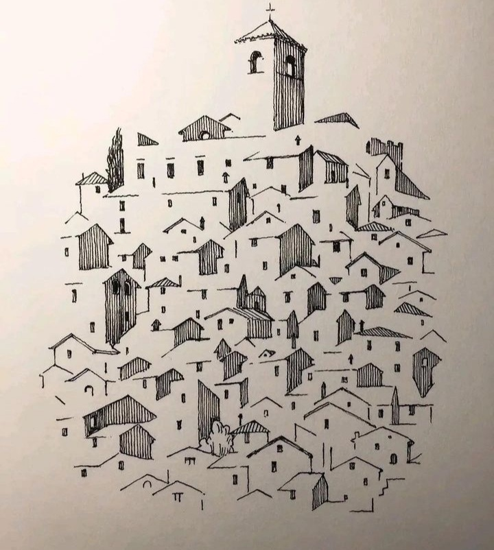

+++
date = 2022-12-17
title = "Ziua 340"
description = "Chiar dacă aș avea inelul fermecat al Arabelei, nu cred că aș vrea să schimb ceva altfel. Simt că m-aș jefui de pașii mici din drumul către țintă, pași care ascund sub talpa lor mici comori și perle ce-mi vor face șiragul complet la finalul acelei călătorii sau experiențe. Nu aș vrea să ard etape."
authors = ["Biannca Locatelli"]
[taxonomies]
tags = []
[extra]
math = false
diagram = false
image = "images/ziua-340.png"
+++
---

Noaptea ce mi-a trecut prin corp și spirit mi-a fost prietenă bună, a fost înțelegătoare cu mine, mi-a făcut spațiu să mă liniștesc la adăpostul hainei ei de întuneric și m-a ocrotit de vise-furci. Cred eu că ieri, în procesul împodobirii casei, am lăsat involuntar să mi se desfacă niște încrâncenări din mine, îmbiate de jazz-ul fain, dar și de ideea de Crăciun. Oricât nu m-aș mai mula eu pe concept, realitatea asta globală, care se pregătește de sărbătorile de iarnă, n-are cum să nu impregneze totul cu energia specifică. Pentru că s-a întipărit în memoria colectivă obiceiul sărbătorilor "De Crăciun, fii mai bun!", și energia e o țâră mai îngăduitoare, invită la păsuire, la dezmierdare de luptă, la îmblânzire.

Cum încep să mă percep din ce în ce mai evident ca fiind din mai multe aluaturi, chiar dacă-mi "văd" mintea mai așezată, mai domoală, carnea îmi trimite semnale de durere. Le simt, dar nu mă mișc din loc, nu vreau să le amplific, vreau să mă mai scald un picuț prin starea asta de potolire care mă umple și-n ea vreau să dau drumul și la micul meu ceremonial al recunoștințelor. Mecanic, încep să turui în mine poezia. Am observat că de multe ori obiceiul, rutina, care s-a instalat în mine, o ia înaintea inimii mele și mă prind pe la jumătatea recitalului că nu am fost în zonă. Chiar dacă mintea mea își face treaba, mi-ascultă comanda și-mi livrează conținutul cerut, de multe ori mă surprinde cât de sec sună și se simte ceremonialul ăsta fără atenție și fără căldura pe care numai o inimă prezentă o are în buzunare. Așa că o iau de la început, tot nemișcată fizic, dar cu atenție pe mulțumirile astea de care și eu și ziua și viața mea suntem pline.

***

Verticala nu mai e la fel de faină cu orizontala din care m-am dezlipit cu greu și picuri de regret dar, chiar și așa, nu pot să nu văd zorii superbi cu care mă salută ziua asta în care am avut norocul să deschid ochii.

  

Bifez cu iuțeală și apa caldă, și făcutul de smoothie și ceaiul, și mă întorc la orizontala care parcă nu mă înghiontea așa de tare. Ochiul stâng mă străpunge cu o durere acută, de nici nu-mi vine să dezlipesc pleoapele. În traseul spre colțarul din living, agăț și un prosopel, îl pun sub apă fierbinte și-i mulțumesc cu un oftat adânc atunci când îmi ușurează intensitatea durerii.

Pentru că azi noapte am terminat și cele 10 zile de nitrofurantoină date pentru infecția urinară a mamei, până la micul dejun al ei nu mai am nicio franjurare, nu mai trebe să fac nimic, nu trebe să mă duc pe vreundeva. Parcă și asta mă ajută la ușurarea durerii și, fără să vreau, din piept pornește cu elan neașteptat un sunet ca de cântec. M-am auzit și mi-am simțit încă o dată dualitatea: chiar de carnea mă faultează, uite că spiritului meu îi vine să cânte. Poate găsesc o cale să le aduc pe la mijloc pe amândouă. Nici nu-mi vine să sper că pot aduce carnea la bucuria ștrengărească a spiritului.

***

O aduc cu chiu, cu vai, pe mama la micul dejun, de data asta suntem amândouă lovite în aripi, dar pe cât sunt eu de atentă să-i simt starea, pe atât e ea de absentă să mă vadă. The story of my life.

Mănâncă o așchie de cașcaval și înghite cu greu 4 guri de lapte bătut și le împinge deoparte. Nu îi e foame, nu are putere în glas, dar ceva din ea, din atitudinea ei, din trăirea ei, a ajuns la mine ca și cum ar fi strigat s-o las în pace. Oftează, parcă resemnată că n-o pricep și repetă obsesiv: _Urâtă-i bătrânețea! Dacă știam, nu mă înscriam la ea!_ I-am văzut muguri de lacrimi în ochi și compasiunea mi-a cuprins fiecare milimetru al ființei. Îmi rețin cu greu lacrimile la ele acasă, picur în glas toată căldura și grija de care sunt capabilă și cătinel, o duc înapoi la ea sus, în patul în care se scurge aproape instant.

Femeia asta a rezistat violurilor, divorțului, singurătății, unui cancer, celui de-al doilea cancer, dar Alzheimer-ul a trântit-o. În istoria vieții ei, cel puțin în partea în care eu am fost prezentă și am ajutat-o, nu am văzut-o niciodată pe mama atât de prăbușită, resemnată, dezarmată. Trinitatea din ea a fost străpunsă fix în călcâiul lui Ahile, mintea. A rezistat asalturilor vieții și circumstanțelor nefavorabile asupra trupului de carne, inima și-a închis-o ea ermetic, cândva, demult, doar mintea mai rămăsese vivace și o antrena de zor cu rebusurile ei complicate și emisiunile de cultură generală.

O părere adâncă de rău că i-am văzut tăria prea târziu în viața asta, că am judecat-o atât de greșit și-am lipsit-o de înțelegerea mea, când poate ar fi contat și ar fi ajutat, se așează cu viteză în interiorul meu. Nu pot s-o pun în vorbe, că oricum n-ar pricepe ea ce resorturi s-au atins în mine, dar în interiorul meu, pe burtiera știrilor care-mi împresoară inima în astă dimineață, circulă constant, cu litere mari și îngroșate și apăsate, ÎMI PARE RĂU, MAMĂ!

***

E sâmbătă, la etaj într-un dormitor zace mama, care doarme deja, epuizată de efortul de a coborî, în altul doarme Mr. H, iar la parter zac eu, cu zvâcnit nesimțit în ochi. În casă e curat, e împodobit, e liniște, așa că încerc să mă bucur de astea și să ignor ciocănitul ăsta vulgar al durerii. Zău dacă mai înțeleg de la ce mi se trage, nu e ca și cum ieri am săpat cu scobitoarea toată curtea, nu am dărâmat munți și i-am reconstruit la loc și totuși mă simt epuizată și sleită.

Filmele de Crăciun, majoritatea lor americane, au în centru ideea de familie, cred că deja e standard.

Nu știu când am lăsat garda spiritului jos, dar pe măsură ce se derulează filmul în fața ochilor mei, realizez, a câta oară, cât de multe arde în inimă lipsa unei familii, a unei figuri paterne și materne. Mereu am invidiat pur fetele care au avut în tații lor un sprijin, un ajutor, o îmbrățișare, o asigurare. Deși m-am prins repede că nu voi avea în jur figură paternă, că tata nu prea stătea pe acasă, m-am sucit către mama și i-am pus ei în brațe, cu toată forța, nevoia mea de părinți. Doar că ea, stângace, a scuturat-o cât colo și nevoia mea a ajuns ca o păpădie în vânt.

Ud din belșug partea în care, tot a nu știu câta oară, prind integral sensul fazei: la capitolul familie de sânge, n-ai decât one shot, o ai sau n-o ai, n-o mai poți încropi pe parcurs. Ăsta a fost, cred, cel mai mare handicap al vieții mele.

***

S-a trezit și domnul meu și bine a făcut, că m-a scos din starea în care mă scufundasem, cu povestirile lui despre petrecerea de Crăciun la care a stat până dimineață. Ca să se trezească de-a binelea, iese p-afară și face și niște cumpărături minimale, printre care și doi covrigi proaspeți pentru mine. Nu le rezist, deși știu că nu mi-aduc nicio contribuție în nutrienți dar la naiba, azi vreau să mă las pradă plăcerii papilelor, mi-ajunge și durerea din corp și aia din inimă. N-o să mor mai repede de la doi covrigi și după smoothie-ul de dimineață, e tot ce pot mânca acum.

Mă întorc la filmele astea nerealiste și siropoase de Crăciun, parcă trase la indigo, dar nu mă mai judec pentru asta. Am nevoie de ceva ușurel, care să nu-mi solicite prea multă atenție, nu am chef de podcasturi sau de citit, iar altceva nu prea pot face.

În timpul și spațiul ăsta fluid și neaglomerat de altele, alunec ușor în introspecție.

Cred și știu că eu m-am născut nemulțumită. Oare nu asta e calea spre înainte? Când nu te culcușești în mulțumire, când îți dai singură șuturi să te împingi mai departe, cred că și găsești calea spre înainte. Dar stai, că cică e bine să te mulțumești cu ce ai, să nu alergi după mai mult, după și mai mult. Ups, nu mai înțeleg nimic, dar un lucru știu sigur: chiar dacă aș avea inelul fermecat al Arabelei, nu cred că aș vrea să schimb ceva altfel. Simt că m-aș jefui de pașii mici din drumul către țintă, pași care ascund sub talpa lor mici comori și perle ce-mi vor face șiragul complet la finalul acelei călătorii sau experiențe.

Nu aș vrea să ard etape. Dacă aș da din baghetă și aș avea mâine castelul pe care atâta mi-l doresc, n-aș putea să mă bucur de el, pentru simplu fapt că aș pune în el o versiune a mea nepregătită pentru castel. Chiar dacă e visat cu ochii deschiși. D-aia și pierd și se pierd cei care câștigă la loterie sau le vine o pleașcă din senin, ei nu s-au muncit, strunjit, rotunjit, ajustat și modelat pentru câștig, pur și simplu versiunea lor de ființă nu e pe aceeași treaptă vibrațională cu norocul sau pleașca.

Eu vreau să-mi trăiesc viața intențional, nu reacțional.

***

Prânzul mamei n-a fost despre mâncare, ci despre motivare. Nu-mi mai trebe nimic să mă prind că nu poate să mănânce pentru că nu are nici poftă de mâncare, dar nici senzație de foame, așa că în loc să mă focusez pe asta, îi torn în urechi cuvinte care s-o motiveze: că am vorbit cu doctorița ei și sigur, după înjumătățirea dozei și terminarea tratamentului cu nitrofurantoină, o să-și revină la normal, că am citit prospectul la medicamente și astea au efecte secundare somnolența și lipsa apetitului, că sunt convinsă că în câteva zile o să-i revină puterile, după ce corpul ei se scutură puțin. Am atâta convingere, că glasul nu trădează picătură din îndoiala care mă traversează acum. Manipulez grosier și convertesc teama, care crește în mine pe zi ce trece, într-o siguranță, în fața mamei, care s-o facă să vrea să lupte, să se ridice, așa cum a făcut-o mereu până acum. Chiar dacă pare că nu ajung la ea cuvintele mele, sigur îmbărbătarea asta pe care o fabric pătrunde prin colțurile ei. Și, recunosc, o las să mă umple și pe mine. Am mare nevoie.

***

Ca să mă asigur că am înțeles eu bine, că genetica nu ne dictează viața ca o predestinare, ci mediul în care ne creștem și cum ne creștem o face, îl ascult din nou pe Bruce Lipton, cu epigenetica lui. Îmi face bine să aud că pot să întorc în favoarea mea orice, atâta timp cât sunt hotărâtă să o fac. Iar dacă nici demența mamei nu m-a hotărât definitiv, apăi nu știu ce altceva ar putea-o face.

***

Mă scurg, molcomă și un strop mai liniștită, sper eu către o noapte portocalie, după o zi cu tente de gri. Dar cum și griul e frumos, îi mulțumesc zilei pentru:
1. Zorii faini pe care i-a aruncat pe cer și-n ochii mei!
2. Inconfundabilele filme de Crăciun!
3. Oamenii care nu obosesc și nu pregetă în cercetările lor utile întregii umanități!

Frumosul unei clipe:

  

Cityscape sketches by Mark Poulier
