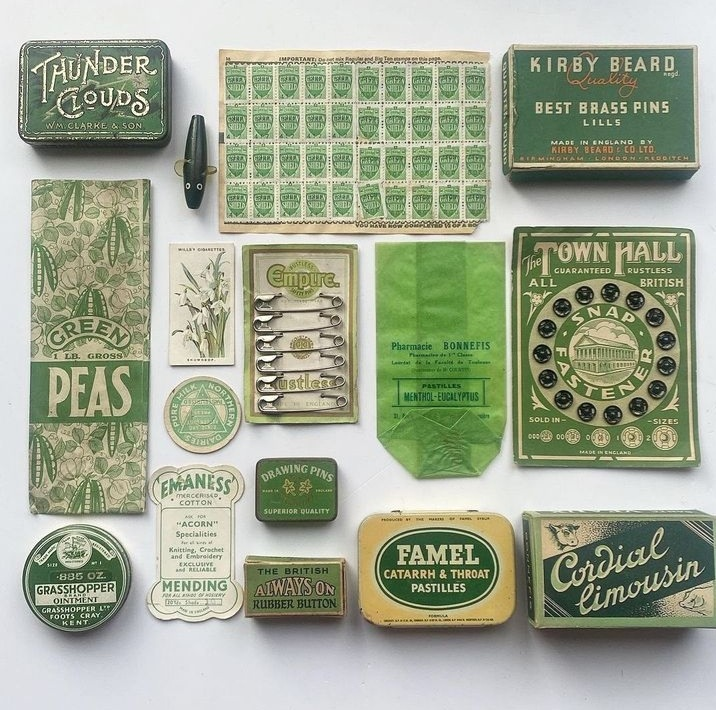

+++
date = 2022-12-18
title = "Ziua 341"
description = "Atâtea Biennci, câte stări. Nici nu-i de mirare că nu reușesc să mă cuprind. Într-un fel mă pot trezi la prima oră, într-altul sunt pe la mijloc de zi și altă Bianncă petrece seara. Iar părțile astea de zi se desfac și ele la rândul lor în mini părți, cu diverse stări, cu diverse comportamente. Iar mini părțile în momente cu tușe personale, momentele în mini-momente și uite așa, dacă trag linia seara, simt că m-au cutreierat mii de Biennci, ca ielele."
authors = ["Biannca Locatelli"]
[taxonomies]
tags = []
[extra]
math = false
diagram = false
image = "images/ziua-341.png"
+++
---

Noaptea, neîntreruptă de treziri pentru pastile, s-a scurs neutră către o dimineață de duminică la fel de neutră. Deși alarma mea internă mă ciocăne-n ochi a trezire când încă zorii nu-s împrăștiați pe cerul de smoală, în mine locuiește o Biannca impasibilă la ceasul ăsta crud de zi.

Mi se pare incredibil câte feluri de Biannca fac cu rândul în costumul ăsta de carne, câte Biennci colorate și nuanțate vin în mine în fiecare zi sau, chiar și mai granulat, în fiecare clipă a zilelor. Atâtea Biennci, câte stări. Nici nu-i de mirare că nu reușesc să mă cuprind, nu știu cum m-am rafinat în 40 și ceva de ani să mă schimb atât de cameleonic. Iar asta mi se pare fascinant, o dată ce reușesc să pun lămpașul pe idee: nu mi-e doar mie caracteristic, mi-e evident că așa-i la toată lumea, că ne lepădăm rapid de un aspect de-al nostru atunci când nu ne servește sau când suntem inconștienți sau iritați sau euforici. Că într-un fel mă pot trezi la prima oră, odihnită sau bumbuțată din loc în loc, într-altul sunt pe la mijloc de zi și altă Bianncă petrece seara. Iar părțile astea de zi se desfac și ele la rândul lor în mini părți, cu diverse stări, cu diverse comportamente. Iar mini părțile în momente cu tușe personale, momentele în mini-momente și uite așa, dacă trag linia seara, simt că m-au cutreierat mii de Biennci, ca ielele. Yep, fac eu ce fac, mă faultez singură, mă înțep în realitatea pe care-o percep contondentă, mă ustură, mă seacă, măi, dar nu pot să nu văd cât de mișto și de plină și de extraordinară e călătoria asta printr-un timp și-un spațiu care cică nici nu există de fapt, prin viața de aici de pe pământ. Că alta deocamdată nu știu.

Din aceeași energie de imparțialitate, nici c-aș fi supărată, dar nici c-aș fi caldă, azi parchez ritualul meu de mulțumiri, pentru că nu simt c-aș putea să mă bag în același pliu cu el, într-o exaltare d-aia curată. Nu mă dau cu fundul sufletului nici de abisuri hâde, dar nici nu zbor prin înălțimi. E și asta o variantă de Biannca pe care aleg s-o onorez azi, fix așa cum se manifestă, fără să mai judec, fără să încerc să-i bag pe gât recunoștințe sau mirări sau uimiri calde. It is what it is.

***

Noutatea dimineții este renunțarea la smoothie. Deși mi-e greu, că deja devenise o extensie a mea în toate diminețile, mi-au ajuns la urechi, și au rezonat a adevăr în mine, cercetări care atestă că centrifugarea robotului de bucătărie distruge fibrele din fructe, adică fix alea de care vreau eu să mă bucur din plin.

Mi se pare interesant modul ăsta mlădios al meu prin care aleg să accept variante noi în viața mea, în locul unora de care m-am atașat, ba mai mult, pe care le iubesc. Mie-mi vine apă-n gură numa' la gândul unui smoothie, dar uite că atunci când vine un alt adevăr cu putere mai înaltă, fac cum fac, mă regrupez și aderez. De azi începe implementarea și, după apa caldă băută, mă apuc de pregătit: banană, pară, afine, avocado, prune uscate. Tot de azi în ceai, pe lângă măceșe și salcâm, pun și ceai verde. Am decis să fiu mai deschisă la experimente pe mine, pe ce mănânc, cum și când, că m-am săturat să nu mă simt bine.

***

În timpul mic și liber pe care-l mai am până la micul dejun al mamei, montez o Biannca avidă de frumos la TV, pe youtube, la noutățile apărute pe canalele de design interior la care sunt abonată. Nu cred că mă voi sătura vreodată să sorb și să absorb culorile, ideile, imaginația, perspectivele, combinațiile, inedite și neașteptate, pe care alți oameni, cu alți ochi și alte trăiri, le pun în practică. Mă mufez cu toată forța la canalul ăsta prin care curge frumos în semeni de-ai mei și-mi încarc sufletul de fain. Să-mi fie pătură pentru alte clipe din zi, mai necolorate, dacă or fi și-or veni peste mine.

***

Lehamitea cu care întoarce capul spre mine când intru pe ușă mi-arată că nu s-a schimbat nimic în starea precară a mamei. E la fel de fragilă, nu are niciun chef să se miște, d-apăi să și coboare la masă dar, deși people pleaser-ul din mine a avut impulsul s-o lase în pace, să rămână în pat, Biannca fermă a câștigat meciul și iată-ne pe amândouă coborând scările cu încetinitorul.

Mie nu-mi tace gura, mamei nu-i arde de nicio vorbă. Deși nu-mi vine să fiu volubilă la gradul la care mimez că sunt, am devenit acut conștientă că dacă mă aliniez cu starea ei, nu e decât o direcție pentru ea, în jos. Atât timp cât simt că ține și de mine, de ce fac eu, măcar că o țin pe o linie de plutire și tot e ceva.

Cred că și corpul ei vibrează la energia și la gândurile mele în ceea ce o privește, că mă încântă priveliștea ce mi se arată: prima alegere a mamei de pe masă au fost ardeiul gras roșu și castravetele. Cresc în mine a bucurie când văd că vrea crud și sănătos și chiar dacă ar mânca numai astea acum, aș fi mulțumită. Un sfert din oul fiert închide foarte micul ei dejun, dar eu sunt cu inima sus. A mâncat.

Urcatul scărilor devine o povară din ce în ce mai grea de dus de un corp gârbovit și ostenit ca al mamei, dar cum asta e singura mișcare pe care o face, nici nu mă gândesc s-o tai de pe listă. Când timp poate mișca picioarele, va urca și va coborî.

***

Domnul meu pleacă la ai lui, iar eu rămân cu "ai mei", cu filmele de Crăciun și cu gândurile la un trecut, care mi se pare din ce în ce mai îndepărtat și din ce în ce mai cețos, în care am avut și eu o mamă, un tată și o soră. Sunt atât de departe de vremurile alea și de trăirile de atunci și totuși îmi vin, în astă duminică, frânturi de imagini sau de mirosuri de mâncare din alte duminici în care eram toți patru la masă. Singura masă pe săptămână în care eram patru. Masa aia în care nu "pupam" desert, dacă nu terminam ciorba și felul doi. Masa aia în care, de multe ori, rămâneam și fără desertul atât de așteptat că mi-l lua sor-mea, înghiontindu-mă "delicat" cu câte-o furculiță înfiptă în picior, pe sub masă. Cu toate astea, așteptam masa asta de duminică "ca și când". Ce departe sunt toate… și cât de puțin contează acum, dar cât de mult mi-au sculptat vederile asupra vieții care urma să-mi vină.

***

Pierdută printr-un trecut și cald dar și extrem de rece, și la propriu și la figurat, m-a lovit ideea: trebe să mă interesez de un loc de veci. Dacă firul vieții mamei se termină brusc, eu habar n-am ce trebe să fac. Realizarea asta s-a lăsat cu fiori oribili pe șira spinării și cu transpirații subite. Nu m-am gândit la asta niciodată pentru alții, știu că la mine singura variantă pe care o văd este crematoriul, dar la mama chiar nu știu. Nu pot să deschid subiectul ăsta cu ea, nici nu m-aș putea oricum baza pe un posibil răspuns de-al ei.

Rumeg și rumeg, transpir și transpir, trag aer în piept și decid să-i scriu vărului meu, copilul singurei surori a mamei, moartă când eu eram copilă. Scriu întrebarea și pe măsură ce scriu, mi se încețoșează ochii de lacrimi. Frate, nimic nu te pregătește îndeajuns pentru clipele astea. Nici măcar priveliștea dezolantă a corpului mamei, auzul respirației ei greoaie, știutul că mintea-i umblă pe alte meleaguri câteodată, nimic nu te poate monta și susține drept, fără să te-ndoaie, în momente d-astea. Chiar dacă este vorba doar de pură logistică, nu pot s-o dezlipesc pe Biannca emoționala de Biannca care tranșează și organizează lucrurile în așteptarea unui potențial rezultat.

Da, e loc lângă sora ei, mi-a răspuns vără-miu, ocazie cu care am văzut aspectul ăla al meu organizatoric cum se relaxează, știind soluția, și partea aia emoțională a mea cum se crispează sub povara unei imagini greu de dus acum. Oare cum te poți "antrena" să faci față morții cuiva apropiat? Oare poți? Oare EU aș putea? Nu vreau să știu răspunsul. Și întrebarea e tâmpită, de altfel.

***

La prânz, altă reprezentație, de data asta mai redusă ca intensitate, că mă simt sleită pe interior. Nici nu o pot privi în ochi, mi se pare un act de mârșăvie din partea mea ceea ce tocmai am făcut prin discuția cu vără-miu. Deși știu că astea-s lucruri ce pot părea de bun simț pentru alții, lucruri care trebe puse la punct, ca să nu te ia totul prin surprindere atunci când oricum va fi și durerea la apogeu, nu mă pot uita la ea, știind că întreb de loc de veci pentru ea. Mi se pare oribil că trebe să trăiesc asta și deși știu că moartea nu iartă pe nimeni și că fiecare din noi trece prin astea, cel puțin o dată în viață, știutul ăsta nu scade intensitatea macabrului. Eu încerc din răsputeri s-o țin pe mama în viață, să-i fie un bine molcuț, nu vreau să stau și să caut loc unde să-i pun trupul rece. Dar cum nu am cu cine împărți asta, înghit și împing în mine tot nevoitul ăsta, alung și neg tot știutul ăsta și fac eforturi uriașe să mă aduc în prezent, aici și acum, cu mama, la prânzul ei pe care nu-l mănâncă.

***

Mi se pare ironic dar și de joasă speță cum trebe s-o pierd a doua oară, la fix un an de la șocul inițial, ca să-mi înmoi inima, s-o deschid și să torn blândeți și toleranțe și acceptări acolo.

Azi se împlinește un an de când mama e la mine. CÂND a trecut? Habar n-am, știu că mai prindeam frânturi din trecerea asta teribilă, când se termina organizatorul săptămânal de pastile. Uite așa a zburat: săptămănă cu săptămână, zi cu zi, mic dejun cu prânz cu duș.

Cât de necopți și de puerili suntem, chiar și la vârste înaintate, să credem că putem controla cu mintea conștientă, mintea non-conștientă. 5% versus 95%. Matematica bate viața și viața bate filmul.

***

Am trăit azi stări extreme, deși mi-am început ziua median. Am simțit visceral că dacă din mine iese vibrație faină, se întâlnește, în eter, tot cu vibrație faină și se întoarce gogoșită la mine. Dar la fel e și cu aia grea, densă. Că vibrațiile astea sunt straturi diferite, clare, separate și delimitate, nu se amestecă între ele, nu pui una galbenă și una albastră și-ți dă una verde. Alergatul ăsta printre stări m-a obosit și mi-a tăiat din aripi. Mă așteaptă niște vremuri grele. De parcă astea de până acum n-au fost.

Deși nu mi-am onorat ritualul matinal, închei ziua cu recunoștință pentru:
1. Cumulul ăsta mișto ce sunt, cu toate ale mele, și alea de pe rafturile de sus dar și de pe alea cel mai de jos!
2. Corpul mamei care a făcut opinie separată de mintea ei și azi a mâncat!
3. Animăluțele din casă și de pe lângă casă!

Clipa de frumos:

  

Verde

 

 

  

    <a href="/blog/ziua-340/">Postarea anterioară</a>
  

  

    <a href="/blog/ziua-342/">Postarea următoare</a>
  

