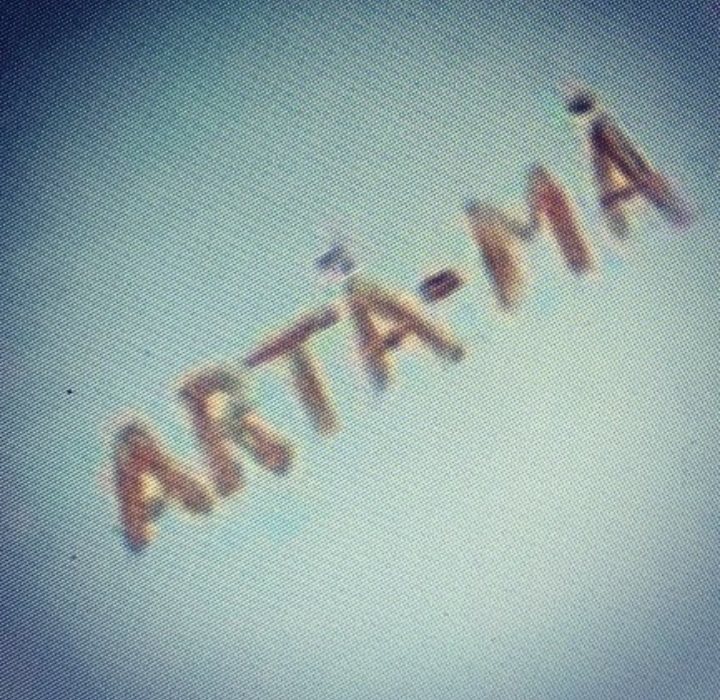

+++
date = 2022-12-20
title = "Ziua 343"
description = "Așternutul pe blog de viață dezbrăcată are două 'tăișuri': primul, că spun lucrurilor pe nume, astfel că dacă cineva, ce trece prin ce trec eu, citește, să vadă că nimic nu e abominabil la el, că nu e un monstru dacă simte că nu mai poate, că nu vrea, că amândouă, că mai e cel puțin una care a simțit la fel, iar al doilea e ăla prin care mă las 'golușă', cum zicea copila mea, în fața judecăților care nu au întârziat să apară. Noroc că eu am început mai demult antrenamentul ăla prin care înveți că fiecare are dreptul la părerea lui. "
authors = ["Biannca Locatelli"]
[taxonomies]
tags = []
[extra]
math = false
diagram = false
image = "images/ziua-343.jpg"
+++
---

Prea binecunoscuta deja noapte de decartare mi-a fost servită azi-noapte și-am ieșit din ea hotărâtă să mai scrijelesc o liniuță în răbojul nopților în care chiar simt că m-am odihnit.

La mine asta cu (ne)somnul nu e nouă,  cred că a început cam de pe la 24 de ani când am avut-o pe fiică-mea care, ca orice în viața mea de altfel, a fost "grea", se trezea și de 10 ori pe noapte. Tot de pe atunci mi s-a înfășurat în carne și somnul de iepure, starea aia de semi-veghe pe care o au mai toate femeile după ce devin mame, iar pe parcursul vieții mele, s-a acuzatizat. Acum știu că nici nu avea cum să fie altfel, la cât de mult îmi alimentam viața cu agitație de toate felurile, practic mâncam cortisol pe pâine, pe mine mă stresa aproape orice. Mă consumam intens pentru nimicuri și pentru toate, dar nu puneam nimic bun înapoi. Să faci asta 40 de ani fără să știi că există și altă viață, nu numai că mi se pare o imensă pierdere de timp, mi se pare și o prostie la fel de mare. Dar atât am putut eu să cuprind atunci, așa că acum fac pași timizi înspre vindecare, înspre odihnă și fizică, dar și de suflet. Numa' că, în potecuța asta pe care am pornit eu agale, mai apare câte-un hop, poate să-mi testeze încrederea și perseverența: mai niște cancere de-ale mamei, mai niște balauri de-ai mei ce-au moțăit și acum sunt deranjați de lumini de adevăr, mai o demență, tot a mamei. Doar că eu încă-s batman, I keep walking.

***

Dacă niște energii faine tot au complotat și s-au unit să mă țină într-o odihnă binevenită și să mă ungă pentru pornirea-ntr-o nouă zi și viață, parcă mă simt și prost în dimineața asta să fac eu pe de-a-ndoaselea. Mă afund mai cu poftă în moalele cald al patului, preiau torsul mic pe care-l încarcă Chichirica în saltea și-l simt în corp, mă mufez cu putere la pacea asta ce mă înconjoară și-mi cânt cu tril de pasăre măiastră în interior recunoștințele. Am senzația că sângele mi s-a transformat în auriu și că-n mine sălăsluiește o putere de care habar n-am. Nu e ceva ce gândesc cu mintea, e ceva ce-mi vine la simțit și știu că astea, care nu izvorăsc dintr-o minte pervertită de-a lungul evoluției umane, sunt de obicei acurate. N-am reușit eu încă să pătrund tainele și să înțeleg ce vor să-mi transmită toate, dar am făcut măcar primul pas: să le deosebesc în funcție de origine și să le ascult sau ignor, în funcție de ea.

Cele mai multe amintiri ale mele sunt vizuale, imagini statice, mai reacționez și la vreun miros sau vreo melodie, dar, în genere, vizualele sunt majoritare. Când eram eu copilă, aveam o cărticică cu povești ce avea pe copertă o pasăre măiastră aurie. Știu că am citit povestea aia de multe ori, doar pentru că sorbeam imaginile cu pasărea măiastră și cred că acea copertă a fost sursa iubirii mele pentru auriu pe care am avut-o toată viața. În dimineața asta, în timpul ritualului meu tăcut și plin, m-am simțit pasărea măiastră de pe coperta cărții copilăriei mele. De la începutul zicerilor mele și până la sfârșit, m-am simțit impetuoasă, semeață, liberă, neîmblânzită și nedoborâtă de programe, de societate, de conjuncturi, de viața asta pe pământ. A fost naturală simțirea, nu m-am efortat eu să simt nimic, doar am primit pachetul de trăiri, l-am desfăcut și mi le-am aruncat curcubee pe cerul de inimă. Tare bine e să te simți așa!

***

Poate că mai stăteam în mândrețea asta de stare, dacă nu suna alarma domnului meu, ce pleacă la birou azi. Cu senzația că am coborât pe pământ dintr-un înalt de simțire, m-am rostogolit din pat înfășurată toată într-o manta de bun și bine. Dă, Doamne, să nu apară niciun pârjol în zi s-o topească. Sau, și mai bine, dă, Doamne, să învăț o dată cum să nu mai accept topirea, dar să primesc pârjolul.

Plecarea lui Mr. H la birou e mai mereu înconjurată în agitație și mișcare, dar după ce pleacă, parcă sunt și mai acut atentă la liniștea și la starea asta de plăcut pe care o percep în casa noastră.

Deși recunosc că demența mamei a adus în casa nouă o umbră, nu vreau s-o gogoșesc și nici n-o vreau impregnată în pereții ăștia, așa că nu mă gândesc decât rareori la ea. De cele mai multe ori văd și simt bine în casa asta pe care-am ridicat-o cu atâta drag, iar ea mi-l întoarce ori de câte ori sunt deschisă să văd darul.

N-am stare să stau, așa că-mi sorb apa, pe care-am încălzit-o prea tare, plimbându-mă prin casă, să mișc energia și să mă îmbib de frumosul pe care l-am adunat eu din vechiturile altora, l-am curățat, primenit și-mi strălucește a mulțumire înapoi. Știu fiecare obiect de unde l-am luat, știu câți firfirei am dat pe ele, aproape toate niște super mega dealuri de pe olx sau diverși vânzători de "antichități", cum se autoproclamă ei, pentru că sună bine. De fapt, sunt tare puține antichități pe piață la noi, adică lucruri mai vechi de 100 de ani, pentru că noi, ca popor, n-am fost educați să respectăm istoria. Ruinele din toată țara sunt niște martori tăcuți, dar dureroși, pentru cineva ca mine care apreciază altfel trecutul. Foarte rar cumpăr ceva nou și când o fac, încerc să iau de la mici meșteșugari sau afaceri de familie sau pasionați, care pun în obiect și o țâră de pasiune pentru obiect și pentru artă, nu doar pentru galbeni.

Tot din picioare mi-am mâncat și fructele și mi-am petrecut restul timpului meu liber făcându-l magic prin privitul pe fereastră, în curte. Mă simt ca o coală albă și pare că mintea, deși încearcă, nu așterne încă niciun gând mai amănunțit, niciun to do pentru programul zilei, nicio analiză sau judecată sau părere. Sunt observatorul vieții de după fereastră, de acolo, de afară, dar în același timp și observatorul vieții din partea asta de fereastră, de aici, din mine. Asta e exprimarea fizică a filozofiei populare care spune că atunci când ești odihnit, altfel vezi lucrurile. Chiar că altfel.

***

Pentru că în mine nu a avut spațiu decât ideea că mama e pe panta ascendentă a stării de bine fizice, realitatea n-a avut încotro și mi s-a supus. Am găsit o mamă bine dispusă într-o cameră nu la fel, dar azi parcă nu mai contează și nu mă mai atinge. Strâng repede, curăț și aerisesc și cobor cu ea la micul dejun. Mănâncă bine, corpul ei o ghidează spre natural și mă bucură imens să văd că mănâncă mai multe legume și mai puțină pâine, ea care înainte făcea sendviș din pâine cu pâine.

Dac-am asculta și ne-am lăsa corpul să ne ghideze alegerile, oare am mai ajunge aici, la boală, la pierderea minților și a abilităților? Ceva din mine îmi spune că nu. Dar suntem 8 miliarde de corpuri, fiecare cu putirința și cu voința și cu caracteristicile lui. D-aia cred eu că e esențial să începem să ne educăm și să ne prindem, în al zecelea ceas, că nu există panacee universale, că nu există diete general valabile, că ce e bun pentru mine, poate tu nu tolerezi și tot așa. Singura armă pe care însă o avem cu toții la îndemână este voința, dar e din ce în ce mai greu de accesat în toată nebunia asta de abundență de produse procesate.

***

Cu jazz instrumental pe fundal, mă las deschisă inspirației și-mi aștern pe blog viața dezbrăcată. Articularea asta de gânduri și de trăiri, fix așa cum vin ele, are două "tăișuri": primul că spun lucrurilor pe nume, astfel că dacă cineva, ce trece prin ce trec eu, citește, să vadă că nimic nu e abominabil la el, că nu e un monstru dacă simte că nu mai poate, că nu vrea, că amândouă, că mai e cel puțin una care a simțit la fel, iar al doilea e ăla prin care mă las "golușă", cum zicea copila mea când era mică, în fața judecăților care nu au întârziat să apară. Noroc că eu am început mai demult antrenamentul în care tutorialul de bază e ăla prin care înveți că fiecare are dreptul la părerea lui, cel care te judecă, la judecata lui, tu, cea care trăiești, la trăirea ta, și nici unul și nici altul, nu trebe să se disculpe pentru ce și cât poate, așa că nu mă mai înțep în coaste de părerile celor din jur. Până la urmă, nu toți putem toate și e ok așa.

***

Fac pauză la scris doar cât să-i pun mamei masa (să mă sperii un strop și de cât de repede trece timpul!) și o aduc, mult mai sprintenă decât era săptămâna trecută, pe vremea asta. Eu sunt molcomă, starea asta parcă de transă îmi domolește mult și mișcările, și amplitudinile vocale, sunt cumincioară, cred că și eman asta și-o cooptez, fără să vreau și fără să vrea, și pe mama, în aceeași bulă de energie. Mănâncă, suntem calme și așezate amândouă, parcă împărtășim un secret și nu ne vine niciuneia să deschidem vreun subiect, să nu zburătăcim blândețea momentului. O cuprind pe mama într-o privire scurtă, să văd dacă mă îmbăt eu cu apă rece și ea de fapt e plecată iar departe dar nu, mama e senină și liniștită, în aceeași linie cu mine. Mulțam cu uimire!

***

E loc în mine și e și poftă să văd niște design interior, așa că mă las în voie pe colțar și mă umplu de design de biblioteci.

E limpede că nu-s atrasă de stilul modern de bibliotecă, de fapt, cu cât înaintez în vârstă, cu atât văd că nu se mai poartă bibliotecile în case. La designerii americani tineri, apăruți ca ciupercile după ploaie, e un trend acum să așeze cărțile în corpuri de bibliotecă după culori sau, și mai "mișto" să cumpere cărți după culoarea cotorului de copertă, nu după conținut. Înainte îmi repugna moral la cote maxime bucățica asta de design, acum încerc să-i fac loc să existe, atât cât știu că e loc pentru toți sub soare. Eu prețuiesc mult mai mult esența decât forma și o să fiu atrasă tot de bibliotecile vechi, alea care ocupă o cameră întreagă, nu care sunt doar corpuri de mobilă pe un perete, alea care au o atmosferă masculină în ele, un mister feminin, un miros de tipăritură, un aer de cunoaștere. Neapărat cu pereți închiși la culoare, dacă cumva mai rămân pereți goi de cărți. Și cu tavane înalte. Cu fotolii grase. Cu măsuțe solide. Lemn masiv. Țesătură veche în carouri. Nu piele. Lampadar înalt. Mici veioze ici, colo. Miros de bergamotă.

***

Îmi reiau scrisul și Mr. H întâlnește o Bianncă cu sufletul în ape pașnice.

Mi-am început ziua bine, o închei bine și-i dau o mare bilă albă. Tot ei, dar și vieții, le sunt recunoscătoare pentru:
1. Momentul ăsta al meu în viața mea, chiar și așa, lovită într-o pană de demența mamei!
2. Prezența mamei în ea!
3. _"Să-ți dea Dumnezeu sănătate, că tare bine e!"_\-ul mamei, după duș!

Frumosul din zi:

  

 

 

  

    <a href="/blog/ziua-342/">Postarea anterioară</a>
  

  

    <a href="/blog/ziua-344/">Postarea următoare</a>
  

