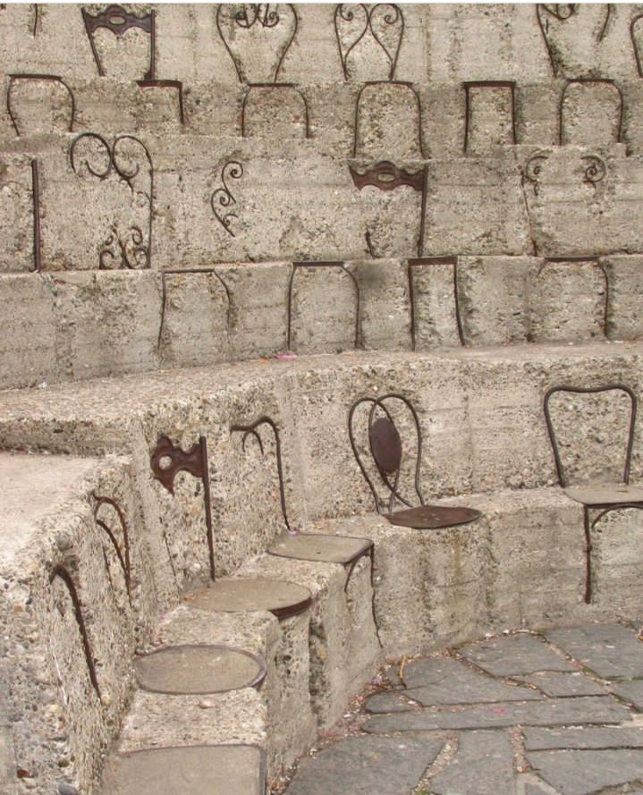

+++
date = 2022-12-21
title = "Ziua 344"
description = "'Timpul le vindecă pe toate' e o mare abureală. Timpul nu vindecă nimic. Poate uitarea, care se așează confortabil pe post de pansament sau tampon peste bubă. Dar pe ea, buba, o doare-n cot de pansament sau de uitare, ea coace în continuare și strânge mizerii dospitoare. De fapt, vindecarea presupune o acțiune conștientă, un suflecat de mânecă și un spălat, cauterizat, uscat și-o lăsare roz de fund de bebeluș acolo unde cândva locul supura."
authors = ["Biannca Locatelli"]
[taxonomies]
tags = []
[extra]
math = false
diagram = false
image = "images/ziua-344.jpg"
+++
---

Cațavenca asta de minte a luat boarea de gând pe care abia l-am atins aseară că l-am și alungat rapid, cum că n-aș avea eu norocul să am două nopți de odihnă una după alta, și s-a dus cu el la magicianul nopților, pe care l-a rugat să-l înfăptuiască în realitatea mea neagră de nelumină. De ce ți-e frică, d-aia nu scapi. N-a fost o noapte grea, numa' că n-a mai avut dulceața aia mișto de odihnă, care-mi înmoaie toate duritățile și mă îmbie la a fi bună, și cu alții, dar mai ales cu mine.

Am tot țopăit din vis în trezie, cu ochii pe orele roșii care pâlpâie proiectate-n tavan, de-un ceas ce clar nu ține cu mine, din trezie înapoi în vise, care mai de care mai întortocheate. Cred eu că am mintea extrem de aglomerată, nu neapărat de ce trăiesc acum, ci mai degrabă de ce am înghesuit în viața mea până acum, de gânditul ăsta obsesiv și constant și consumator și inutil de cele mai multe ori, de ronțăitul în van care așează în biblioteca minții mele mii de bibliorafturi cu idei, de toate soiurile și de toate neamurile, pe alese, să fie. Am adunat în 40 și ceva de ani, spre juma' de secol (wtf?!) miliarde de informații, ca să înțeleg de abia acum că extrem de puține din ele îmi sunt folositoare și, pe și mai puține din astea, le-am strâns din curiozitate și din aviditatea de a le afla pentru mine. Am devenit un fel de wikipedia ambulantă pentru alții, ca să dau bine, să mă aprecieze, ca și cum d-aia nu mai pot ei, nu pot să pună capul seara pe pernă liniștiți dacă nu zic mantra aia, care pe mine mă ungea pe toate încheieturile egotice, _"băi, da' ce deșteaptă e Biannca asta!"_. Toate informațiile astea acum se răzbună și-mi mănâncă din spațiul intern de stocare pentru lucruri cu adevărat interesante sau utile pentru mine. Cândva, când oi avea timp, o să mă apuc să dau delete la fișiere întregi, să fac curățenie la mansardă, să las spațiu pentru noutățile vieții noi care mă trăiește zilele astea. Și-n spațiul ăsta creat, poate mă apuc de învățat italiana, că tot îmi curge sângele prin vene. Dintr-o supărare pe un tată absent, am zis eu odată că nu vreau să știu boabă din limba asta, care-mi dă licurici înăuntru ori de câte ori o aud și pentru care sunt echipată din născare cu dicție și intonație. Sau să lucrez în lut. Sau ceramică. Să creez. Să învăț să fiu. Să multe.

Mă trezesc super matinal și-mi fac ritualul de mulțumire on and off, întrerupt de gândurile astea care aleargă ca nebunele în toate părțile și mă iau și pe mine pe spinările lor. Acu' sunt în copilărie, acu' mi-aduc aminte de-o situație din viața mea de corporatistă, acu' sunt cu tălpile goale, în satul unde am trăit o bucată scurtă, dar caldă, de fericire, în iubirea unei măițe din afara lumii ăsteia, acu' simt în stomac alergătura vieții de una singură cu un copil și cu o mamă, ambele de crescut. Ce șaorma cu de toate a fost și viața mea de până acum și, vorba ardeleanului neaoș, the night is young and so are we!

Dezlipesc căldura asta blănoasă care mi s-a lipit de șoldul drept și coborâm amândouă să luăm în piept sau în brațe o nouă zi, o nouă viață. În timp ce cobor, zâmbesc la codița pe care o continuă mintea la gândul meu de nouă viață: cum ar fi ca în fiecare zi să ai o viață nouă? Să te duci la magazinul de vieți în fiecare dis-de-dimineață și să-ți alegi o viață după pofta inimii sau a momentului și p-aia s-o trăiești în ziua aia? Fără limitări, fără "nu e în cărți pentru mine viața asta", fără false credințe, singura regulă să fie doar aia că nu poți trăi aceeași viață de două ori. Ajung în bucătărie cu zâmbetul încă pe față, mă amuz singură eu pe mine la cât de bine reușește mintea mea să mă distreze. Yep, nu există limită la imaginație, asta e clar.

Spiky o zbughește pe ușă atât de rapid că nici nu l-a sesizat pe Hitlerică, dar cred eu că nici el n-a fost pe fază sau îi e prea comod și bine în cușcuță.

***

Bifez ochiul pe camera de supraveghere a mamei, totul pare ok, mă apuc de pregătit platoul de fructe, nelipsitul ceai și-mi umplu timpul cel mai bun din zi cu design interior în temă crăciunistică. În urmă cu ceva ani, după o viață de căutare și strofocare, am lăsat din frâul inimii nevoia de a crede într-un zeu, fie el și creștin dar, exact așa cum fac și cu veganismul, respect alegerile și preferințele, conștiente sau inconștiente, ale fiecăruia, așa că din sărbătorile de iarnă mă mufez doar la partea cu bucuria, cu frumosul și cu adunatul de oameni dragi alături. După ce am dezlipit partea religioasă, aia responsabilă cu "trebe să faci așa!", de partea estetică și de suflet împletit cu alte suflete pe aceeași lungime de undă sau din același sânge, lucrurile s-au simplificat dramatic. Și e mult mai sărbătoare așa.

***

Fiecare îmbucătură a mamei din sendvișul cald, udat cu guri de lapte bătut, e însoțit de câte o turuială de-a mea, croșetez subiecte pe bandă rulantă și în dimineața asta sunt responsabilă cu ridicatul stării de spirit a mamei. Cred că și ei i-a fost frică de hăul ăla în care aluneca, cred că pe undeva, prin mintea ei care înțelege secvențial și doar ce-i convine, a avut impact starea fizică deplorabilă în care s-a scăldat zilele alea, prea multe și prea grele, că pare că are ceva zvâc în ființă, ceva scântei, ca și cum ar saluta un nou început. Iar eu simt asta în energia ei și îi întind mâna a ajutor. Greul a trecut. Ducă-se!

***

Din paleta de trei, câte sunt la număr acțiunile principale la care m-a "condamnat" demența mamei, azi le vine rândul cumpărăturilor, mâncarea și curățenia sunt în episoadele următoare.

Înarmată cu listă, îmi fac și traseul și dau bice, și la propriu, și la figurat: prima oprire e la Hornbach, să iau sare pentru dedurizator și recunosc că am avut gânduri necurate pentru angajații de la raionul de drive in, care, fix atunci când apare vreun client, au de obicei treabă în direcția opusă. M-am opintit cu sacii de 25 de kg să-i pun în portbagaj, mi-am adunat rinichii de pe la glezne unde-mi căzuseră de la efort și-am intrat să fac plata sării. Eram hotărâtă să zic casierelor că colegii lor, masculii de afară, n-au nicio treabă cu customer care, dar până mi-a venit rândul la casă, m-am mai îndulcit și m-am gândit că nu-i tocmai roz și cald să stai mai toată ziulica afară, iarna, să-i ajuți pe toți. Chiar dacă ăsta le e jobul, până la urmă, toți suntem oameni și toți simțim disconfortul frigului.

Tot pe tema frigului, următoare oprire e la Jysk, de unde vreau să cumpăr o păturică din bumbac, am primit notificare că-i la reduceri. Trec și pe la brutăria din sat să rectific livrarea de cozonaci cu devansare o zi, fuga și-n Carrefour și aici iar mă scap cu niscaiva gânduri nefericite.

Nu știu de ce ființa asta umană trebe să complice mereu lucrurile. Nu înțeleg, nici când sunt în ape mai calme și mai limpezi, de ce nu putem funcționa simplist, curat, natural.

Carrefour are o aplicație de făcut bine, Act for Good, prin care scanezi codurile fiecărui produs pe care-l cumperi și ți-l pune într-un coș virtual. La final, la casă doar scanezi codul aplicației, faci plata și-ai plecat. Fără să mai stai să scanezi la casă, e simplu, eficient și faci și-un bine. În teorie, practica însă ne dă la gioale mai de fiecare dată. Deși până de curând, puteai să scanezi codul la orice casă, mai nou, din multele case disponibile, nu-s decât două case pentru aplicația Act for good, semn că nu prea se înghesuie omul să facă ceva și pentru altul. Ok, asta e, pot să înțeleg, n-o fi pentru toată lumea, deși azi rar mai vezi pe cineva fără smartphone. Partea mișto acu' vine: te duci la una din cele 2 case unde te întâmpină 2 suporți de plastic de care atârnă, râzând a zeflemea, un lanț cu zale mari din plastic. Zic "întâmpină" ca să întorc și eu zeflemeaua, practic te blochează să înaintezi cu căruciorul, e ca un cordon d-ăla de muzeu, să nu atingi exponatele. Pfiu, să ajungi să faci o faptă bună a devenit între timp piesă de muzeu. Giiiz, eu unde oi fi fost între timp?! În fine, văd panoul mare pe care scrie și mai mare "Casă SelfService Act for Good" în dreptul casei mele, așa că degajez, cu satisfacția învingătorului, lanțul infam și ajung la casă. Ghinion de neșansă, pe ecranul casei apare semnul satanic de Interzis, X-ul mare și roșu se lăbărțează pe juma' de ecran și-mi rânjește satisfăcut. Mai să cred că sunt la Camera ascunsă, îmi testează careva fie dexteritatea, fie creativitatea, fie perseverența, fie repetoriul de cuvinte meșteșugite pe care le spui la nervi sau în grabă sau când ai un milion de lucruri de făcut și te împiedici de ceva mic. Mă uit tâmpă la ecran, și el se uită la fel la mine, îmi mut ochii prin jur să dau de doamna care supraveghează casele. Întotdeauna e o doamnă care supraveghează, azi nu e, o fi și ea la masă, la cafea sau la o țigară. La altă casă nu pot să mă duc, pentru că înseamnă că trebe să scot toate produsele pe care deja le am în plase și să le iau din nou la scanat, ineficient și contraproductiv. Cum timpul pentru rescanare clar e mai lung decât timpul pentru cafeaua aia sau sendvișul ăla sau habar n-am ce-o reține pe doamna, mă hotărăsc să stau proțăpită locului și să aștept. Mda, are dreptate Carrefour, nu se înghesuie nimeni la casele astea…

Apare doamna, deblochează casa, îmi explică că sunt "ghiolbani" care nu folosesc aplicația, dar vor să folosească casa specială pentru evitarea cozilor, o blochează, se iau la ceartă cu personalul și pentru a evita circul, blochează ei din start casele și le deblochează la cerere. Logic. Dar nu logic natural, ci un logic adaptat la ilogica ființei umane.

Scanez codul, fac plata, scanez și bonul ca să-mi dea voie să și ies de la casă și halt!, mă oprește tanti de la securitate, să verifice dacă ce am în plase e și pe bon. Pe bune?! Adică n-am scos produsele pentru rescanare, dar le scot pentru verificare?! Trece ea rapid vizual prin produsele din viața reală și alea rezultate dintr-un virtual pe-un bon, ia bonul și-l trece de mânuță cu pixul pe o foaie de hârtie: număr bon, data și suma. S-a dus naibii și farmecul virtualului. Ce să mai, una peste alta, a fost o experiență de neuitat, în urma mea, doamna supraveghetoare a blocat din nou casa, în așteptarea unui alt nefericit care, fraier ca și mine ce trăim în alt film, vrea să facă și un bine. Zici că toate complotează în lumea asta să înăbușe initiativele astea care pot însemna cald și bun pentru un altul. O țâră trist.

***

În drum spre casă mă opresc și pe la primărie, să mai bifez ceva pentru dosarul pe care-l instrumentez pentru mama. În traseul pe care-l parcurg cu acest dosar, am trecut de faza în care mă mai minunez că nu se mai termină birocrația: după fiecare document depus, la colț, mă pândește unul nou apărut sau unul de care brusc e nevoie acum. Deși există pe net o listă cu documente, acolo unde intervine factorul uman, apare și subiectivitatea și cu cât e egoul mai mare sau traumele mai adânci la persoana din aparatul bugetar cu care interacționezi, cu atât lucrurile se stufoșesc mai mult. Poate la anul oi termina și eu cu adunatul de acte și-oi depune dosarul "complet". Mă rog doar ca acest "complet" să aibă același înțeles și pentru bugetarul care-mi primește dosarul cum are pentru mine care l-am întocmit, respectând lista și toate indicațiile de pe parcurs. Speranța n-a dat ortul popii așa cum a sucombat uimirea.

***

Ca să alung scamele astea pe care le-am adunat în ieșirea mea, de cam prin toate părțile, ajunsă acasă mă recompensez cu o salată super faină cu de toate, din care ronțăi cu spor aproape juma' de oră. Wow, da' ce bună a fost! Crocantă de la broccoli și conopidă, pișcătoare de la ceapa roșie și semințele de rodie, dulce de la ardeiul galben și roșu, zemoasă de la roșie și castravete, cu gust de pădure de la ciupercă, cremoasă de la avocado și o țâră amăruie de la uleiul de măsline extravirgin, mi-a mers la suflet și m-a săturat de bun. Din spațiul ăsta tihnit și blând, mă apuc să-i pregătesc prânzul mamei, ca ea să-l ia fix tot așa.

Un polonic de ciorbă, un pic de pui la grătar și juma' de cartof copt mai târziu, prânzul mamei e acompaniat de trilul meu, care, la un nivel pe care nu l-am crezut posibil și existent în mine, sunt capabilă să duc încă mult mai multe după limita aia la care mintea mea a decis că gata, nu mai pot să duc. E de ajuns un hop d-ăsta care poate separa viața de moarte, ca să mă reinventez și să-mi fac cocoașă de dus mai departe. Nu cred că e doar la mine, cred că e specific rasei umane, care se crede nemuritoare și atunci când evidentul o plesnește peste ochi, se prinde că-i trecătoare.

***

După amiază mi se scurge printre degete, în timp ce scriu și plec în lumea mea, doar a mea, sau în timp ce vorbesc cu prietena mea și o ascult și mă ascultă. Femeia asta m-a învățat cum se simte pusul în practică a ceea ce am învățat din tutorialul demența: cum să te faci disponibil pentru cineva.

Deși am crezut toată viața mea că eu sunt "acolo" pentru cineva care are nevoie de mine, învăț acum, cu subiect și predicat, că a fi disponibil nu e același lucru cu a te face disponibil. Poți să răspunzi cuiva la telefonul care insistă în sunat, dar să treacă pe lângă urechile și inima ta ce îndrugă cel de la celălalt capăt. Poți să te duci să ajuți pe cineva care te cheamă, dar s-o faci în semn de bifă, ca un act prin care ai investit într-un ajutor viitor, pentru când oi avea și tu nevoie, să nu-ți iei și atenția cu și la tine. A te face disponibil înseamnă să te investești tu pe tine în primul rând și timpul și energia ta, în al doilea rând, în acel telefon, în acel ajutor. Să fii atent la ce spune, dar mai ales cum spune, să vezi ce vrea, dar să simți din limbajul corporal cum vrea să fie ajutat omul care ți-o cere. Astea sunt comori care se deschid la nivelul de joc deblocat de disponibilitatea ta ingenuă, de diferența dintre: "cine-o suna și ce-o mai vrea?" și "ia să vedem, cine ar putea fi?" O dată câștigate, ung toate încheieturile jocului ulterior și deschid lacăte de inimi și guri încleștate în temeri.

***

Discuția cu sufletul femeii ce mi-e prietenă mi-a deschis ochii asupra unui lucru pe care l-am intuit mereu, dar nu l-am articulat coerent, nici în mine, nici în scris, până acum.

Vorba asta care-ți vine pe buze ca doftoreală de suflet pentru cineva care trece prin ceva greu, "timpul le vindecă pe toate", e o mare abureală. E o iluzie cu I mare. Timpul nu vindecă nimic. Poate uitarea, care se așează confortabil pe post de pansament sau tampon peste bubă. Dar pe ea, buba, o doare-n cot de pansament sau de uitare, ea coace în continuare și strânge mizerii dospitoare. De fapt, vindecarea presupune o acțiune conștientă, un suflecat de mânecă și un spălat, cauterizat, uscat și-o lăsare roz de fund de bebeluș acolo unde cândva locul supura. Toate closure-urile pe care nu le-am făcut la viața mea, cu oamenii care mi s-au perindat prin suflet, s-au întors mereu și mereu peste mine și până nu mi-am curățat actele și gândurile și amintirile de judecăți și până n-am acceptat că am făcut ce am știut și ce am putut cu ce am avut atunci, n-am putut să închid ușa de piciorul de ce-ului care-o proptea a întredeschidere și a abandon. Nu-mi iese mereu, încă am uși întredeschise, încă am întrebări în inimă și d-aia știu visceral că timpul doar trece, n-are însă nicio veleitate de șaman.

***

Orice zi în care viața pulsează mai a viață în cei din jurul meu e o zi bună, iar eu îi sunt recunoscătoare pentru:
1. Activarea curiozității sănătoase care să-mi dicteze un parcurs de viață pentru mine în primul rând și în folosul altora, în al doilea rând!
2. Legume, cât mai colorate și cât mai diverse!
3. Mâna de oameni care se fac disponibili pentru mine și de la care învăț mereu nuanțe noi!

Clipa mea de fain este:

  

Armand Pierre Fernandez, Parco Sempione, Milan
