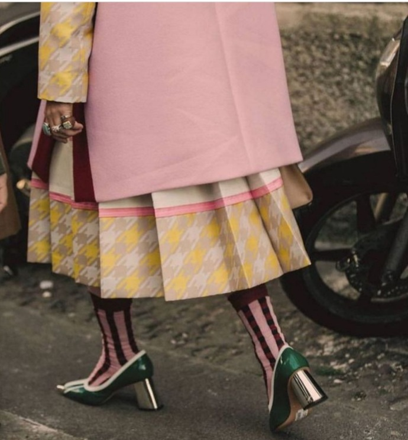

+++
date = 2022-12-25
title = "Ziua 348"
description = "Cel mai mare verb care există în lumea asta materială se ascunde în spatele literelor ce formează A PERMITE. Practic, atunci când nu permit, îmi restricționez viața, din toate punctele de vedere. Când pâlnia prin care curge viața în și prin mine se îngustează, tot ce nu reușește să se strecoare, se învolburează, se adună și, la un moment dat, dă pe dinafară și mă îneacă."
authors = ["Biannca Locatelli"]
[taxonomies]
tags = []
[extra]
math = false
diagram = false
image = "images/ziua-348.png"
+++
---

Trompetei care s-a adăpostit în interiorul domnului meu, în ceasuri de noapte, nu i-a suflat nimeni că azi e Crăciunul și că, ar fi frumos, să ia o pauză și ea, așa, a sărbătoare. Nope. Goarna asta mi-a prigonit și visele și somnul, întrerupându-mi-le cu cruzime și punându-mi toată ființa la cheremul ei în niște ore de smoală care au trecut parcă cu încetinitorul. Primele mijiri ale prea dimineții, în minute, nu în lumină, m-au ridicat resemnată la o verticală pe care azi aș fi amânat-o cu cea mai mare plăcere. Asta e, nu e să fie. Mai bag o fisă, poate oi avea noroc de revelion.

Corpul m-a dus pe pilot automat în bucătăria unde mi-am sorbit apa cu multă lămâie de m-am strepezit până-n străfundul ochilor, dar mi-am dat și o trezire rapidă, că aveam nevoie. Ca să nu mai repet ping-pong-ul dimineții de ieri, azi decid să-mi mișc fizicul în mișcări de qigong și-mi setez timer-ul la 10 minute. Am început abrupt ziua, dar stă în puterea și voința mea să-mi dau cu lin pe ici, pe colea.

***

Dacă mai aveam vreun strop de lene prin vene, aerul rece d-afară, unde am ieșit să-i dau de mâncare lui Hitlerică, m-a trezit maxim. Gata, mi-am făcut ilic din ziua de azi și mi-am pus-o pe piept, întru defilare. Cât mănâncă băietul ăsta blănos pe terasă, o scot pe Chichirica mea scumpă afară, pe geamul de la living, că-i e frică să treacă pe lângă el. O știi ea ceva și, cum ea nici n-are glas și nici eu nu știu limba pisicească, am încredere în instinctul ei. Îmi desfăt și eu papilele gustative cu fructe și-mi simt căptușeala sufletului cu aroma de bun și bine. Sunt amuzată de pisici, de tevatura asta cu ieșit de geam sau pe ușă și am și uitat că m-au trezit niște sforăituri aprige.

***

Aseară inima mea a pus la copt o idee, peste noapte, printre solfegii, s-a gogoșit, și-n prea dimineața asta fac repede un nou aluat de ștrudel, pentru o surpriză. Numa' bine, cât pregătesc masa pentru micul dejun de Crăciun în trei, stă la rece, în frigider.

Mai am un picuț de timp doar al meu și astă dimineață nu vreau să-l umplu cu ceva din afară, ci vreau să fiu eu doar cu mine și cu înăuntrul meu, să mă ascult, să mă simt, să mă privesc și să fac o mică introspecție.

Habar n-am unde a fugit un an. Parcă ieri eram liberă și, dintr-odată, mi s-a așezat, nesimțit, necerut și nepermis, norul demenței pe viață. A zburat timpul ca nebunul. Pardon, ca dementul, ca să fiu în ton cu situația. Mi-a luat multe clipe faine pe care nu le-am trăit și mi-a dat multe clipe nașpa pe care le-am trăit până la sânge. Dar dintr-o altă perspectivă, mai de pahar plin, mi-a dat lecții cu nestemate la care altfel nu aș fi ajuns ever, decât așa, târându-mă și zdrelindu-mă prin momente tăioase. De inimă, de minte, de ego, de libertate.

Cea mai mare lecție pe care de fiecare dată cred că gata, am învățat-o, până data viitoare când mă prind c-am ratat bingo-ul data trecută și viața mă duce, consistent, de mânuță, fix în același punct ca să mai dau examenul o dată, este că atunci când nu respingi o emoție, ci o primești în tine, o lași să-ți ungă sau să-ți doară interioarele, o faci într-un final A TA. Iar abia atunci când devine a ta, ai marea libertate să faci ce vrei tu cu ea. S-o dai, s-o ții, s-o lași să se scurgă lin.

Cel mai mare verb care există în lumea asta materială se ascunde în spatele literelor ce formează A PERMITE.

În aceste clipe de introspecție mică, simplă, curioasă, a mea de către mine, mi-am văzut mecanismul automat al minții care s-a făcut filtru potrivnic pentru ce nu-mi face plăcere, ce mă doare și portar binevoitor doar pentru ce mă mângâie. Practic, atunci când nu permit, îmi restricționez viața, din toate punctele de vedere. Când pâlnia prin care curge viața în și prin mine se îngustează, tot ce nu reușește să se strecoare, se învolburează, se adună și, la un moment dat, dă pe dinafară și mă îneacă. Imaginea asta mi-a apărut atât de vivid în cap încât mi s-au aprins toate alarmele din corp și respirația mi s-a accelerat. Fiecare celulă de-a mea a reacționat la gândul că-mi amputez posibilitățile vieții, indiferent care ar fi ele. Aceste strigăte mici sunt exprimarea, în carnea mea, a sloganului pe care-l aud din toate colțurile: nu există eșecuri, doar lecții. Mulțam claritate mentală, pentru darul acestei dimineți!

***

Cu lejeritate în suflet și disponibilitate amplă în inimă, mă apuc să aranjez ceremonios masa pentru micul dejun.

În niciuna din viețile mele din viața asta nu m-am aplecat cu atenție asupra detaliilor care compun o masă, fie ea de sărbătoare sau nu. Nu mai zic că pregătirea de mâncăruri era pentru mine un mare stres, nu-mi plăcea să gătesc și, drept urmare, nici nu-mi ieșea. Habar n-am ce s-a întâmplat în mine de s-a făcut spațiu pentru toate astea, probabil când am scos afară frica de a greși, de a nu fi perfectă după standarde ipocrit ridicate, s-a crăcănat în mine o curiozitate și o plăcere care au crescut cu timpul. Mereu experimentez în bucătărie, mereu caut chestii noi și nu pentru că mă plictisesc, ci pentru că e atâta diversitate, încât e păcat să nu încerci.

Iar în ceea ce privește arta împodobirii unei mese, e o chestie pe care acum încep s-o gust dar care-mi place maxim. Dacă la început, vina că alții n-au ce pune pe masă iar eu mă strofoc s-o dichisesc, îmi dădea constant peste simțul estetic, acum, când știu că fac tot ce pot să fac pentru alții, dar fac cât mai mult și pentru mine, pentru bucuria sufletului și ochilor mei, e o desfătare întreg procesul.

Am cumpărat, treptat, veselă veche, superbă pe care o combin coloristic, fără să țin cont de seturi. De altfel, în afara unui set cumpărat în vremurile mele fițoase de la Zara, nu am niciun set întreg, ci farfurii disparate, dar atât de mișto, că zău dacă mai percep că-s mix&match. Povestea care e impregnată în carnea porțelanului fiecărei farfurii reușește să mă ducă și pe mine pe aripile ei în timpuri vechi, când comunitatea avea putere, când fiecare om din comunitate avea un rol și era văzut, auzit, ascultat și ajutat. Am farfurii cu oameni care fac căpițe de fân la legendarele hanuri englezești, am lanuri de maci sau de grâu, am fazani care zburdă, superb colorați, am cai care aleargă liberi, e o nebunie care-mi infuzează cu frumos celulele. Nu cred că aș putea să mă mai întorc la o farfurie sterilă, simplă, fără povești.

***

Din miezul ăsta de basm, cu o scrâșnitură ca de pick-up deraiat, m-am trezit într-un mic dejun bogat în bucate și frumos, dar lipsit de căldura și drag uman. Deși mă bucur că suntem toți trei la masă, că suntem în viață, e ceva în aer care nu-mi place. Când o stânjeneală a mamei, când o absență acaparatoare, tot a ei, când o stângăcie a lui Mr. H și, peste toate, eu care dau din mâini și din gură să astup o ceva ce nu-mi face bine. Energia mea bună și dragul cu care am pregătit și masa și bucatele de pe ea nu se lipește deloc de momentul micului dejun sau nu are putere să alunge energia asa mâzgoasă, întinsă-n eter de o demență din ce în ce mai densă.

Închid momentul micului dejun cu cadoul de la "Moș", de la mine pentru ea și îmi întoarce necadoul de la ea pentru mine: nicio reacție, nicio bucurie, nicio vorbă, niciun mulțumesc. Hai lasă, e de la boală, deși, la drept vorbind, eu nu-mi aduc aminte să fi primit vreodată vreun cadou de la ea. Nu zic că n-or fi fost, dar atât de răruțe că s-au pierdut printre neamintiri. N-am înțeles niciodată de ce mama a fost mereu atentă să ducă bomboane sau cafea sau ceva oamenilor la care se ducea în vizită, dar nu i-a trecut niciodată prin minte să mă cadorisească și pe mine cu un fursec, o măslină, o scobitoare străină. Mereu am privit cu jind din spatele gardului la gesturile ei de atenție către alții și mi-a "mâncat" aproape toată viața acest jind inutil.

***

Ca să-mi abat unda de tristețe ce mă străbate pe la poale de suflet, mă apuc de ștrudelul surpriză.

Am eu niște oameni dragi, părinți tineri și disperați din lipsa timpului, cărora vreau să le bucur masa cu ceva bun și cald. Numa' că surpriza a fost a mea, ei pleacă din sat spre părinții mamei și îmi refuză darul. Pentru o clipă, m-am simțit aiurea, ca și cum cineva îmi retează intenționat craca pe care mă cățărasem și unde-mi era bine, uguindu-mă pe suflet că fac un bine. Apoi m-am scuturat de egoul ce se lipise libidinos de gândurile de victimă și m-a locuit gândul că dacă ștrudelul nu e pentru ei, poate fi pentru altcineva în nevoie. Nu am nicio problemă să ies cu tava prin sat și să găsesc pe cineva căruia să-i fac clipe dulci. Abia când am lăsat încrâncenarea, când liniștea că un bine rămâne bine indiferent care e destinatarul, s-au despletit și căile prezentului și, cei pentru care-l coceam, l-au luat să-l mănânce pe lungul drum către destinația din capătul țării.

***

Mi-am luat liniștea în gânduri și inspirația în degete și-n timpul liber pe care-l am până la mesele de prânz, vreau să mă aliniez pe lungimea de undă a fiecărui om drag care-mi formează cercul mic de suflete apropiate și să-i trimit căldura care mă cuprinde când mă gândesc la el, intenția mea de bine ce o simt pentru fiecare în parte. O fi vârsta, o fi spălatul de ochi, dar prefer calitatea și o mână de oameni decât cantitatea și mesajele de "Fie ca" trimise la lista de contacte din telefon. Îmi fac timp și-mi iau disponibilitate sufletească nu doar să aștern niște cuvinte care să sune bine, eu mă conectez, atât cât pot eu, la ființă și îi trimit subtil bunătățile eterice de care dispun și eu.

***

Nu mai vreau să reiterez strania senzație pe care am trăit-o la micul dejun așa că avem două prânzuri: unul eu cu domnul meu și unul eu cu mama. Din primul mă hrănesc eu, și la propriu și la figurat, din al doilea doar ea, tot așa, și la propriu, și la figurat. Mama se golește încet încet de uman și absoarbe, inconștient evident, energie de la mine, care să-i încălzească partea umană a ființei ce încă se mai perindă pe aici. Aproape că simt fizic filoanele prin care-mi pleacă energie către ea și, deși știu că mă văduvește de ea, nu am puterea să întrerup această (s)curgere. Din multe puncte de vedere, esențiale mai toate, eu o țin pe mama în viață.

***

Restul zilei mi-l aloc lălăielii, citesc, mă uit la filme, în compania plăcută a omului care a decis să-și petreacă zilele cu mine. E drept că nicio carte, niciun film nu pot concura cu priveliștea omului pe care-l iubesc și pe care-l consider frumos. Tot în ultima mea bucată de viață, m-am prins eu, destul de visceral zic, cum e cu frumusețea.

Frumusețea trebe cuprinsă. Deși-mi place să privesc un chip perfect, după normele aproape universal acceptate, șabloane standard, am început să mă pricep și să văd că pe mine întotdeauna m-a atras provocarea descoperirii, frumusețea aia care se ascunde în spatele unui ridicat de sprânceană, în dosul unui tic verbal sau de mișcare, a unei neregularități, a unei "virgule" ce n-are ce căuta, dar care atrage privirea fix acolo, pe care trebe s-o accepți, s-o integrezi, s-o iubești. Pe un chip perfect, privirea alunecă, ia notă, se îmbibă brusc de tot frumosul care se dezvăluie dintr-odată și apoi pleacă. Pe un chip frumos, după conceptul meu de frumos, privirea rămâne. O clipă, un an, o viață.

***

O zi de investigații interioare, de tihnă, de petrecut cu oameni, fizic sau în gând, așa mi-a fost ziua asta de Crăciun, pe care o închid cu o pătură mare de recunoștință în care mă îmbrac, pentru:
1. Mine. Îmi sunt recunoscătoare până la lacrimi pentru efortul și voința și dorința pe care le fac în drumul ăsta anevoios de autocunoaștere.
2. Mâna de oameni care mi-e în suflet. Și lor le sunt la fel de înlăcrimat-bucuroasă-recunoscătoare că-mi sunt.
3. Locul ăsta de joacă care e viața în care fie că mă dau în leagăn, fie cad dintr-un tobogan, trăiesc. Și vorba clasică, asta-mi ocupă tot timpul.

Clipa de frumos:

  

 

 

  

    <a href="/blog/ziua-347/">Postarea anterioară</a>
  

  

    <a href="/blog/ziua-349/">Postarea următoare</a>
  

