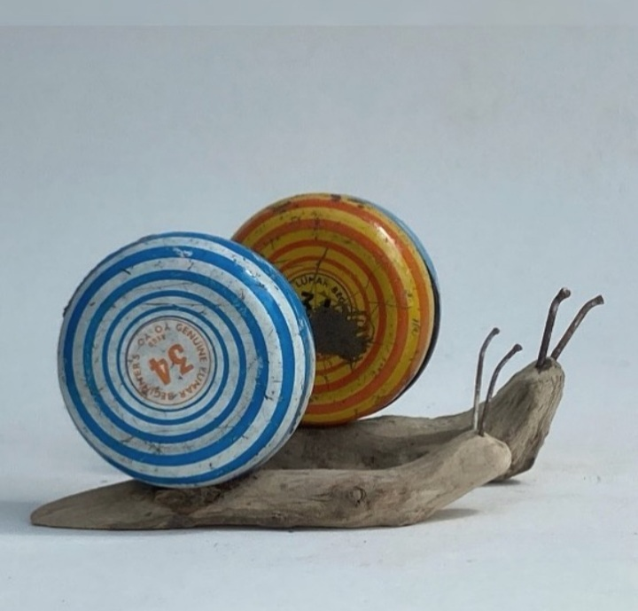

+++
date = 2022-12-26
title = "Ziua 349"
description = "Cred că cea mai frumoasă declarație de dragoste care există în realitatea asta ireală este să-ți dăruiești timpul și să-l apreciezi atunci când îl primești. Uităm (prea) mult și (prea) repede și (prea) ușor că totul e trecător, ne aruncăm în scopuri și țeluri viitoare în loc să crăcănăm clipa aia în care ne e omul iubit alături, să tragem cu nesaț din ea totul și, culmea, s-o lăsăm în spatele nostru ca o clipă trecută, dar plină."
authors = ["Biannca Locatelli"]
[taxonomies]
tags = []
[extra]
math = false
diagram = false
image = "images/Untitled.png"
+++
---

Scamele care m-au jenat în ziua Crăciunului, mai mici sau mai mari, și-au avut climaxul în dedesubtul nopții, sub formă de coșmaruri. Deși cu mintea pătrund niște înțelesuri, prind sensul că mama a făcut în viața ei, relaționată la a mea, cât a putut, din considerente poate mai presus de mintea noastră umană, durerea aia care se împletește cu abandonul și întrebările nu se conjugă tot cu mintea. Dar pentru că și ele au nevoie de o supapă, se scurg ne-simțite și nesimțite în singurul timp în care aș putea să mă adap de liniște, de ostoire, de gol de de toate. Noroc că blănoasa mea mică, Spikylina mea dragă, îmi simte fie adâncimile, fie respirația ce probabil mi-e sacadată și-mi dă cu trezirea pe la ochi și suflet. Asta mică cred că începe să cotrobăie și prin visele mele, pare că și-a luat abonament la toată viața mea, cu zile și cu nopți, și când simte ea că se îngroașă gluma, mă ajută. E felul ei monedă prin care-mi întoarce, înmiit, gestul de a o culege din câmpuri stresante.

***

Dacă aș putea să-mi dau delete la culorile care mă conțin în aceste momente de trist, dacă aș putea să mă îmbrac în rozul piersică al unei copilării fericite cu iubire utopică, oare aș fi mai bine acum? Sau trebuia să trec prin astea ca să mă scutur puțin (mai mult) de impresia stupidă că realitatea asta e totul, că am controlul, că, de acum, totul iese și va ieși cum vreau eu, că pot îndoi forțele magnifice care guvernează viața asta fabuloasă în întregimea ei, cu tot ce e al ei, în interesul meu mic și meschin? Și nu, nu sunt doar eu cu gumă-n păr, toți suntem atinși în aripi de traume, tocmai ca să ni le curățăm și să zburăm. Da' frate, ce muncă titanică și sisifică e curățarea…

Cu impresia asta de greutate pe care parcă o resimt cum îmi apasă umerii-n jos, îmi mișc fizicul, cu tot cu o Chichirică atârgățată de mine, spre parter. Azi n-am chef, asta strigă din toată starea mea moale a dimineții și eu încă-s buimacă să mă prind în care parte să-mi așez pornirile de nouă zi.

***

Îmi beau apa, simplă, nu vreau nimic în ea și, pentru prima oară în peste un an, n-am chef nici de fructe. De niciun fruct. Din aroganță și rebeliune, aproape că înfulec două bucăți de ștrudel de mere de-al meu și-mi fac o cană mare de cafea. O țâră de vină vine degrabă să mi se așeze în poală, dar zău dacă-mi pasă vreun pic, m-am înfășurat în mantia lui "fac ce vreau" și m-am blindat acolo, nicio părere d-asta de-a mea care mă faultează tot pe mine nu mă poate atinge. Ce stare inedită…

Cu fiecare sorbitură de cafea amară care, culmea, nici măcar nu-mi place, dar mi-ajută tensiunea și-mi ține durerea de cap departe, în genere, bag în mine și imagini superbe dintr-un tur de castel cu o istorie impresionantă - castel Brensac.

Oricât aș blama eu social media pentru partea întunecată cu care ne atrage mieros, dar irezistibil, în mrejele ei, recunosc că internetul ăsta mare mă îmbogățește imens, mă plimbă prin locuri pe unde probabil n-o să umblu niciodată, mi-aduce în inimă și-n trăiri locuri și oameni și lucruri pe care fizic nu aș putea să le cuprind pe toate într-o viață mică și scurtă.

Cu tot necheful meu, mă îmblânzește o recunoștință caldă-n corp și-o simt cum îmi urcă sclipici prin vene până în inimă: doamne, e atâta abundență-n lumea asta. Și noi, atât de orbi, cu tot cu ochii largi deschiși, dar inima cu obloanele trase.

***

În bucătărie se perindă întâi domnul meu, pentru micul dejun, apoi o aduc pe mama pentru micul ei dejun și încununez apoteotic perindarea cu Sassy, care e bucuroasă nevoie-mare că se preumblă pe la parter, unde-s mirosuri și cotloane noi de explorat. Băbuța asta felină și-a împletit clar trăsăturile cu cele ale mamei, lângă care a crescut: de abia merge, crăcănată de greutatea fizică dar și a anilor din oasele ei, dar e curioasă, avidă de cunoaștere, bucuroasă de viață. O urmăresc cu privirea și recunosc că-s un strop invidioasă pe cheful ei de ființare. La mine cheful ăsta n-a binevoit să se arate azi.

Mama mănâncă binișor și observ, a câta oară, că atunci când e doar cu mine, are mai multă poftă și mai mult spor la masă.

Mi-a mai trecut prin cap pornirea asta a mea de a mă smulge de la firul ierbii și al evenimentelor și de a mă ridica mult deasupra tuturor, în înalt de cer, să văd în ansamblu totul, să mă prind de sensul ăla ascuns prin care destinul mamei s-a întrepătruns cu al meu atât de adânc și atât de mai tot timpul, încât și în vremuri de negură nu-și lasă degetele ființei umane să se descleșteze de pe a mea ființă umană. Și de ce eu, în loc să pricep, înțeleg și accept, percep totul ca pe o sugativare de energie, viață, chef.

Am mâncat și eu un mic dejun doar așa, de bifă, că nici de mâncare nu-mi prea arde.

***

Mi se scurge timpul printre podcasturi la care mă uit cu Mr. H, doar cu câte-o geană, că cealaltă e semideschisă, a lălăială profundă. Afară-i un soare orbitor, nici nu zici că taman ce-a trecut Crăciunul, e o atmosferă o țâră ciudată și cred că de la ea am împrumutat și eu starea asta molcuță.

După două podcasturi, mă forțez să mă avânt spre bucătărie la un grătar de soia și-un piure cremos, că asta am poftă.

În timp ce forfotesc prin bucătărie, îmi prind o tensiune cum mi se cațără pe gleznele inimii și mă întărâtă: ce mult mi-ar plăcea să fiu și eu servită! Ce mi-ar fi plăcut și mie să fi fost și eu drăgălită la viața mea de pui!

Mi se pare incredibil cum, din toată starea mea de somnolență și de nechef, sunt capabilă să nasc nervi, pe care-i cresc într-un ritm exponențial în mine și care mă sug și de puțina vlagă pe care o circul prin vene azi. Așa cum m-am prins acum ceva timp, tot în timpul ăsta în care demența mamei mă învață lucruri despre mine, în decursul existenței mele eu am fost o suită de milioane de Biennci. Azi, în loc să mă locuiască una blândă și bună cu starea mea de spirit cuminte, mă hingherește una care vrea să mă scoată din sărite, să mă ațâțe cu andreaua prin gard, să mă irite. Habar n-am de ce întrețin acest mecanism, dar daca am habar de ceva este că totul izvorăște numa' și numa' din mine. Da, există butoane din exterior, e de ajuns un mic stimul din afară să agațe vreun gând din mine și se duce naibii totul la vale, dacă nu sunt atentă. Dacă nu aleg să mă smulg. Dar într-o zi ca asta molcomă, cu somnolență în toată casa, cu momente de reflecție interioară, cu analize postfactum și coacere de scopuri pentru an nou, îmi trebe ceva efort să mă scutur.

***

Chichița prin care mă dezlipesc de varianta asta de Biannca este scrisul. Mai am o bucățică de timp până la prânzul mamei și al nostru și-o folosesc să aștern tăvălugul ăsta numit viața mea din ultimele zile.

Am învățat, în timpul ăsta de când blogul suportă tot amalgamul ce sunt sau devin sau, cel mai mult, am fost cândva, că un gând așternut în litere îmbracă haină fizică. Un cuvânt descarcă în el toată puterea care uneori mă încarcă, alteori mă apasă, din gândurile care-mi trec necontenit prin câmpul conștiinței. Nu știu dacă această putere e resimțită și de cineva care citește dar știu că, pentru mine, în acest moment de cotitură a vieții mele, scrisul e terapie, pentru că am eu dosită-n în mine pe dup-o perdea, credința limitativă care-mi susură cretin că vorbitul nu are aceeași forță. Poate d-aia nici nu cred în psihologi sau psihoterapeuți, poate d-aia nici nu-mi vine, atunci când mi-e greu, tare greu, să vorbesc cu nimeni. Mă strâng, mă chircesc, mă fac mică și tac. Dar acum am găsit scrisul. Sau, mai bine zis și la drept vorbind, m-a găsit el pe mine. Iar pentru asta, a doua oară pe ziua de azi, mă umplu de caldul atât de dulce al recunoștinței.

***

După ce am făcut download la emoții și trăiri și stări, sunt mai lină și în mine și în afara mea. Și cred că am făcut loc în mine pentru prânzul mamei, cu mama. Apăs până la fund pedala pe amintirile din vremea când ea lucra la poștă iar mama se leagă de ele și începe să țeasă povești, care mai adevărate, care mai puțin adevărate. Linul ăsta din mine nu mai sortează, nu mai etichetează, lasă să curgă tot ce vine în ea și doar o observ. Îi văd bucuria din spatele cuvintelor, ochii ei parcă devin ecrane de cinema unde se derulează imaginile despre care povestește cu atâta drag și dor, mă încearcă câte-o lacrimă prin colț de ochi să-i ud melancolia și neputința asta de a se transporta cu totul într-un trecut care i-a plăcut, mă culcușesc și eu în amintirile ei și parcă-mi face plăcere să stau în ele acum. After all, e doar un gest de bunăvoință din partea mea, să fiu atentă și disponibilă pentru ea și pentru vorbele, amintirile, trăirile ei.

***

Fușteresc restul zilei nici eu nu știu pe unde, dar n-am nicio umbră de părere de rău. Sunt obosită și am nevoie de relașul ăsta, și fizic, și psihic. Ș-apoi cine, în afară de mine, decide care timp e pierdut cu adevărat?!

Cred că mi-am perfuzat în viață obsesia asta de a face tot timpul câte ceva, ca să validez pentru alții că merit să fiu, să primesc, ca să-mi validez mie existența, că am uitat cât de esențial este să petreci timp cu un om. Să-i dai atenția ta nedivizată. Timpul tău total. Cred că cea mai frumoasă declarație de dragoste care există în realitatea asta ireală este să-ți dăruiești timpul și să-l apreciezi atunci când îl primești. Uităm (prea) mult și (prea) repede și (prea) ușor că totul e trecător, ne aruncăm în scopuri și țeluri viitoare în loc să crăcănăm clipa aia în care ne e omul iubit alături, să tragem cu nesaț din ea totul și, culmea, s-o lăsăm în spatele nostru ca o clipă trecută, dar plină.

La ceas de seară decid calmă că fuștereala a fost o impresie pripită. Între timp, de la ea și până la pregătirea de plecare spre tărâmuri cu visuri, m-am îmbogățit de timp cu omul drag vieții mele. Și-am născut și a treia recunoștință caldă a zilei.

Frumosul din zi:

  

Kirsty Elson
