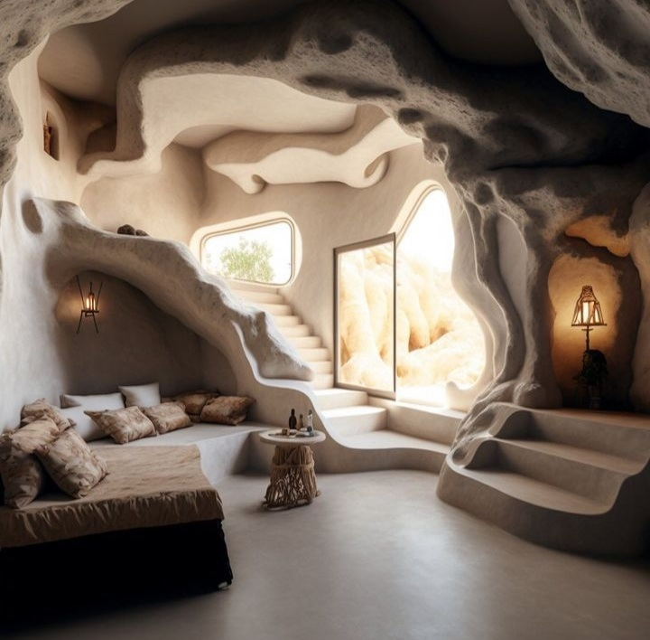

+++
date = 2022-12-29
title = "Ziua 352"
description = "Am văzut resorturile prin care una din femei are grile precise prin care departajează umanii cu care 'intră în horă', dar și larghețea și modul solar cum cealaltă împarte gesturi, bucurie, vorbă bună sau banane."
authors = ["Biannca Locatelli"]
[taxonomies]
tags = []
[extra]
math = false
diagram = false
image = "images/ziua-352.png"
+++
---

Trezirea-mi dintr-o bucată, directă, fără tentative eșuate de aliniere la prezentul calm din dormitor, mă acordează lin la o setare de intenție pentru ziua asta nouă care mă așteaptă cu brațele deschise, ca un copil încrezător într-o zi însorită, simplă, naturală, blândă. Am sărit direct cu mintea-n papucii intenției pentru că azi mă duc să-l caut pe Ursuleț, alături de mama lui și vreau să mai vorbesc cu Universul ăsta plin de vibrații, să ne așeze el fix pe aia necesară să ne îndrume pașii către locul unde se află puiul ăsta blănos și năstrușnic.

Acum că am încălzit locul dinăuntrul meu și l-am deschis către posibilități, hai să strecor acolo, și de acolo afară, și recunoștințele mele, începând cu primordiala de a fi în viață. Am devenit acut conștientă că, deși nu fac nimic voluntar în direcția asta, uzina asta superfascinantă care e corpul uman funcționează după ceasul elvețian, nu mă greșește cu nicio secundă și mă aduce la realitatea asta în fiecare dimineață sau prea dimineață, după caz. Și am mai înțeles ceva o dată cu conștientizarea asta: că planurile sunt doar așa, niște plăsmuiri ale minții, o nevoie a noastră de a ne preocupa de orice altceva decât de clipa asta de aici, de acumul nostru, pentru că presupun un viitor, iar viitorul e o aroganță tipică și specifică umanului. Sunt încă în contradicție cu mintea mea obsedată de control, care-mi susură diabolic că trebe să ai planuri, trebe să te asiguri în toate sau cât mai multe feluri posibile, că nu întinerești, că nu poți fi greiere toată viața, dar pe undeva, într-un adânc care din când în când mai aduce ape limpezi la suprafață, știu că și dacă mă las dusă de curgerea vieții, nu greșesc. Voi vedea. Poate toată viața asta va fi un balans și un balet între cele două perspective, fără câștig clar și delimitat al uneia. Culmea, nu simt c-ar fi ceva rău în asta, atât timp căt nu mă înțepenesc și rigidizez doar într-una.

***

Beau dintr-o gură juma' de halbă de apă simplă, fără nicio adiție, și-i simt traseul pe care-l încălzește în năvălnicia ei. Dacă la începutul ritualului meu cu apa pe stomacul gol mi se părea mult o juma' de litru, acum mi se pare puțin, nu mă mai umflă, ba din contră, îmi dă o stare de agilitate în carne. Spiky e deja afară, în friguț, eu îmi pregătesc platoul de fructe pentru micul dejun de peste o juma' de oră și am poftă să mă uit la antichități. Cu un ochi am validat că mama e trează și e bine, așa că am potolit și demonul ăla din mine care-și scoate capul aproape în fiecare prea dimineață.

Îmi plac fructele întregi, dar recunosc ca nu la fel de mult cum îmi savuram smoothieul. Nu mă omor după avocado, dar combin fiecare feliuță de-a lui cu câte-o prună uscată și-mi place gustul nou creat. Kiwi-ul îl împerechez cu banana iar para vine la final, să încununeze plin gustul și să-mi gâdile zemos papilele.

***

Pentru că pe la 10 voi pleca în căutări de Ursuleț, o aduc pe mama la micul dejun în timp util, nu doar pentru mestecatul îndelung al dumicaților, ci și pentru deșirarea poveștilor mele deja consacrate cu pisici. Poate mă apuc de scris cărți pentru copii, cu istorioare haioase despre pisici, că se pare că fie am talent, fie am prins unda unde se conectează și mama și primește cu zâmbete sau chiar cu râsete trăznăile lui Spiky sau ale lui Hitlerică.

Mă bucur că mănâncă binișor, spre bine, vrea și o cafeluță pe care i-o fac, fie și numai de amorul artei, am eu impresia că bifează cafeaua asta o urmă mare de plăcere în mama. Deși mama nu a socializat la cafele, nu prea a socializat în general, i-a plăcut mereu să-și bea dimineața cafeaua, la rebus. Cum rebusul zace nefolosit de luni bune, măcar bucata de cafea să-i rămână. Nu-i spun că voi pleca, rămâne cu Mr. H în casă și oricum plănuiesc să mă întorc până la prânzul ei.

***

Gata, m-am îmbarcat în aventura căutării lui Ursuleț, alături de mama lui, o tipă faină la 50 și ceva de ani și alături de mama lui Yshiro, un ciobănesc german negru cu păr lung, cu veleilăți de a descoperi vietăți în suferință.

Aceste două doamne mi-au contribuit imens atât zilei, cât și vieții mele. Fiecare pas făcut în compania lor a fost aducător de informații noi despre câini, despre viață, despre oameni, despre perspective.

Am văzut cât de mult înseamnă auto-controlul stăpânului și cum se reflectă el în comportamentul câinelui, am văzut că mama lui Yshiro nu se stresa nici cât firul de nisip de mulții câini maidanezi întâlniți pe traseu, iar Yshiro nici atât, nu părea să fie afectat nici de colții arătați a impresionare, nici de apropierile razante ale acestora, am primit în mine și am făcut spațiu perspectivelor de viață privită prin ochi de maratonistă și maxim iubitoare de trai de munte, izolat de oameni, ale mamei lui Yshiro sau prin ochi de femeie singură, fost jurnalist vreo 20 de ani, majoritar sportiv, al mamei lui Ursuleț, mi-a plăcut mult fermitatea și disciplina uneia dar și blândețea și înțelepciunea alteia. Am văzut resorturile prin care una din femei are grile precise prin care departajează umanii cu care "intră în horă" dar și larghețea și modul solar cum cealaltă împarte gesturi, bucurie, vorbă bună sau banane.

Am cotrobăit prin păduri și pe dealuri, dar nici urmă de evadat. Am întâlnit oameni dispuși să se uite la afișele cu detaliile dispariției dar și oameni morocănoși, grăbiți să ne alunge. Am fost parte dintr-un film mișto care a durat câteva ore în ziua de azi, dar care m-a impactat pe viață, sunt sigură. Simt că o dată cu înaintarea în vârstă, lucrurile care mi se petrec se impregnează adânc în memorie, fie pentru că sunt mai puține, fie pentru că le gogoșesc eu de atenție, și știu că iau cu mine această zi frumoasă, într-un locșor din mine, pentru tot restul vieții. Deși căutarea de azi nu s-a soldat cu găsirea iubitului Ursuleț, am trăit momente și clipe de-o frumusețe aparte, cu aromă de beatitudine.

***

Am ajuns "la bază" la fix cât să-i dau prânzul mamei. M-am stăpânit cu greu să nu-i ciripesc plină de recunoștință, prima parte a zilei mele și m-am reîntors la poveștile cu pisici, ajutată și de îndesatul meu Hitlerică, noua senzație a casei și punct de interes al mamei. Nu am depistat încă ce anume desenează apăsat în memoria ei azi ca să-l revadă mâine, dar pe Hitlerică l-a reținut, chiar dacă mai încurcă și mă întreabă "unde e cățelușul ăla nou?"

***

Sunt încă fremătândă de Ursuleț în mine, mă strânge cumplit când văd filmulețele cu el rănit și schiopătând și, spre deosebire de mama lui, care are o capacitate lărgită de a accepta că oamenii fac cât pot să facă, mă doare tare că aceiași oameni nu sunt dispuși să facă mai mult. Nu pot cuprinde cu inima cum poți filma un câine rănit și apoi să pleci mai departe, cum te lasă conștiința, care clar ți-a dat un ghiont din moment ce totuși te-ai oprit să filmezi, cum poți să pui capul pe pernă ca și cum nimic nu s-a întâmplat. Chiar dacă eu am deschis ochii la viața nouă de doar câțiva ani, din punctul ăsta de vedere încă-s bebeluș, toată viața mea am avut grijă la vieți, de oricare fel ar fi ele.

***

Las să treacă prin mine judecata asta, care-mi trece cu furca prin suflet și încerc să mă conectez la o liniște și o pace și bucurie a regăsirii stăpânei cu câinele, ca și cum tocmai ce-am aflat că așa s-a întâmplat. Știu că sunt influențată puternic de dorința ca asta să se petreacă, simt și teama-sfredeluș că el e rănit acolo, undeva, pe teritorii străine, unde alți câini sunt stăpâni și atacă, că e frig tare peste noapte afară, dar încerc să nu mă încarc atât de mult negativ încât să-mi înfluențeze aiurea mie traiul, că doar nu pot să duc toate nenorocirile lumii ăsteia pe umeri și pe suflet.

În toată zbaterea asta a mea între adicția către drama și suferință, de data asta pe bună seamă alimentate de o situație reală și scuturarea de o suferință care nu e a mea până la urmă, iese câștigătoare cea din urmă dar e impactată ușor și de prima: Universule, îți las ție toată situația în "mâini", lasă tu să curgă lucrurile cum trebe, că noi oricum n-avem niciun control.

***

Îmi sumarizez lecțiile și darurile cu care m-a făcut mai mare și mai bogată ziua de azi și sunt recunoscătoare pentru:
1. Stare de bine a mamei!
2. Starea mea de bine!
3. Ziua de azi, cu toate ale ei!

Clipa faină:

  

 

 

  

    <a href="/blog/ziua-351/">Postarea anterioară</a>
  

  

    <a href="/blog/ziua-353/">Postarea următoare</a>
  

