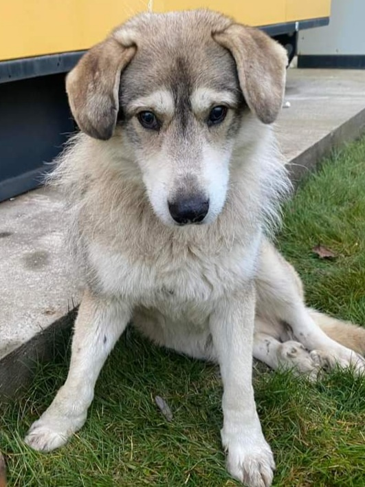

+++
date = 2022-12-30
title = "Ziua 353"
description = "În căușul ăsta superb în care m-a așezat viața în astă zi, nu pot să nu observ cât de frumos e afară, cât de faină-i pădurea chiar și așa, cu copacii goi, cât de bine miros frunzele umede și cât de familiară îmi e mie aroma de pământ reavăn."
authors = ["Biannca Locatelli"]
[taxonomies]
tags = []
[extra]
math = false
diagram = false
image = "images/ziua-353.png"
+++
---

Mini-combustiile de peste noapte sunt vinovatele care mi-au franjurat noaptea trecută, aș putea să zic, fără să greșesc, că unei femei la (pre)menopauză nu-i mai trebe căldură iarna, are soba la purtător. Frate, mă apucă niște călduri de am impresia că ard în flăcări. Poate m-or fi ajuns vorbele unora care mi-au dorit să ajung în iad, nope, n-am ajuns încă, dar a ajuns iadul la mine, mai ales în timpul nopților. Pentru că încerc să mă apropii cât mai mult de natural, nu sunt adepta medicației pe durata acestei perioade așa că mă "delectez" cu sauna uscată, care mă usucă la propriu câteodată.

Episoadele astea vin brusc, mă ard intens și se termină subit, iar după aia mă apucă câte-un frison, de nu mai nimeresc mai repede pilota și, în toată foiala asta, mă trezesc. Nu de tot, dar suficient ca mintea mea să se lase purtată de-un gând până la o scenarită, apoi de altul spre altă poveste și uite așa, dintr-o combustie care durează vreo 2 minute, să ajung să pierd jumătăți de oră până să mă reîntorc în lumea viselor.

Ultima repriză de smoală a fost spre dimineață, așa că m-am lăsat păgubașă, am trăit-o până la ultima picătură și apoi m-am ridicat la verticală. Nu mi-a "ars" de ritualul meu de mulțumiri, că-s oleacă țâfnoasă, pe situație așa, că nu mi se pare corect. Și cum întotdeauna trebe să găsesc un țap ispășitor în afara mea, acu' îs supărată pe Universul ăsta, care cam chinuie femeile, pe parcursul vieții lor. Mă fac că nu văd că același Univers a dat însă și extraordinară șansă de a simți fiorii unei noi vieți ce crește și se mișcă în pântecul lor fix acelorași femei.

***

S-a dus apa sfârâind pe gâtlej, Spiky cred că mi-a simțit starea de spirit, că freacă timid, parcă chiar cu jenă, pe la uși și ferestre să-i dau drumul afară, dar încetișor, să nu-mi năpustesc stihiile trăirii actuale asupra ei, și aproape că mă bușește râsul când o văd: freacă cu lăbuța o tură, se uită la mine 2 ture, așteaptă 3 ture, și apoi de la capăt. O iau în brațe, a dezinflamat momentul, și o duc la geamul de la living, de unde îi dau drumul de când a apărut Hitlerică în viața și pe terasa noastră. Fericită că i-am înțeles rugămintea sau că scapă de starea mea plină de scame, o taie afară în semiîntuneric și în răcorică. Nu e frig afară deși suntem în iarnă, cică.

***

Îmi mănânc fructele în liniște la început și apoi în muzică de iarnă, cu ochii la castelanii mei preferați. Deși până acum am crezut că mă pasionează doar modul cum restaurează fiecare dintre ei castelele și ce metode, unelte, tehnici folosesc, uite că pe nesimțitelea, am prins drag de ei și acum, în perioada sărbătorilor, le urmăresc și odihna bine meritată. Rămân la părerea mea că oamenii ăștia sunt o specie deosebită, dintr-un aluat de soi, înarmați cu tenacitate și perseverență, dar înnobilați de suflete calde. În dimineața asta am simțit că am făcut Crăciunul cu fiecare dintre ei și m-am simțit "ca-n familie". Ce aromă faină are asta!

***

Chiar de ar fi să pun aceeași placă în fiecare dimineață și prânz ale mamei, dacă asta ajută la apetitul ei, o fac fără să clipesc. A mâncat întregul ou fiert cu cașcaval, ardei gras roșu și juma' de cană de lapte bătut, iar eu mă bucur peste margini de reușita asta. Se și mișcă mai cu încredere, deși încă o sprijin, poate merge și singură, e clar că e pe drumul cel bun.

Ne-am întors la un normal, dacă normal pot să numesc situația de dinainte de a i se face rău de tot. Cu aceleași sincope în memorie, cu clasicele ei repetiții, dar zău dacă mă mai stânjenesc acum. Pare că recunoștința aia pe care o rostuiesc în sinea mea și-n pântecul Universului, în aproape fiecare dimineață, prin care mulțumesc fiiri în viață a celor dragi mie, și-o numesc și pe mama la catalog, chiar dacă poate n-are întotdeauna putere, are consecvență și cred că e o calitate pe placul Vieții ăsteia inteligente care ne bate inimile tuturor.

***

Îmi încropesc salata mea de crudități, cu de toate bunătățile în ea: brocolli, conopidă, spanac, ceapă roșie, tijă apio, măsline negre, roșii, ardei gras roșu, mazăre, semințe de dovleac și de susan negru, tofu afumat și ulei de măsline. E o nebunie cu multe, dar îmi place maxim. Nu am însă timp azi să aștept 40 de minute să se activeze sulforafanul pentru că plec din nou după Ursuleț așa că ronțăi deja la salată imediat cum am făcut-o, dar nu mă grăbesc ca să nu uit s-o gust cu maximă plăcere.

Din păcate nu reușesc să termin decât jumate din ea, pentru că mama lui Ursuleț a ajuns în zonă și ne mobilizăm cu toții la plecare: o anunț pe mama că plec cu domnul meu undeva și-mi zâmbește complice, semn c-ar înțelege că avem și noi nevoie de un timp al nostru, urcăm bicla lui în mașină și ne pornim către Snagov, zona cu păduri, s-o luăm la pas, noi fetele, și la biclă, Mr. H.

***

Ce escapadă!

Plină de noroi până la glezne, dar și suflet curat până în prăsele, de povești și narative povestite între mine și mama lui Ursuleț, dar și conștientizări că suntem mai mult decât poveștile astea, de strigăte pentru sufletul ce s-a pierdut, mânat de un instinct animalic, dar și de liniști adânci, parcă croite să ne conectăm la o poveste mai mare, care ne cuprinde și ne întinde și ne încearcă pe toti, să captăm de acolo imagini sau sunete sau speranțe în căutările noastre. Ursuleț este mâna Universului prin care eu cunosc o altă ființă minunată, de la care învăț cu nesaț și de la care sorb cu plăcere cuvintele. Nu degeaba a fost jurnalist 20 de ani, are o curbură faină și plăcută în modul cum deapănă amintiri, are o notă de fermitate dar și de îngăduință în felul cum îmi așterne gradual viața ei, care mă captivează total.

În căușul ăsta superb în care m-a așezat viața în astă zi, nu pot să nu observ cât de frumos e afară, cât de faină-i pădurea chiar și așa, cu copacii goi, cât de bine miros frunzele umede și cât de familiară îmi e mie aroma de pământ reavăn. Chiar și cu grija căutării lui Ursuleț în suflet, mi-am surprins bucuria de a trăi aceste momente, mi-am surprins setea cu care le doresc a fi trăite fix atunci când mi se întâmplă, m-a invadat cald pe dinăuntru o recunoștință masivă pentru clipă.

***

Cu excepția a câțiva biscuiți mâncați, nici nu știu când s-a făcut după-amiază, tot umblând prin păduri sau imașuri.

Cu un ochi constant pe camera de supraveghere a mamei, trag tare să ieșim la un liman din întinderile astea necutreierate de alte ființe umane, înainte să se însereze, dar mai ales să ajung să-i dau mamei să mănânce de prânz. E deja 15.30 și am ajuns în sfârșit la un drum. Mă simt ca pe un Camino mai mic, mă dor tare picioarele, tălpile, degetele și, pentru că am în picioare ghete de-ale fiică-mii, care-mi sunt mari, în bălăngăneală, îmi rănesc carnea degetelor mici de la picioare. Simt cum se lasă răcoarea înserării, mă iau ceva fiori că sunt transpirată toată și răceala se infiltrează perfid pe sub blugi.

Ursuleț e de negăsit și nu suntem singurele care n-am avut noroc: bicla lui Mr. H a cedat nervos pe coclaurile noroioase și dintr-un partener de încredere, a devenit o sarcină odioasă de cărat și de împins, adunând straturi peste straturi de lut clisos. Planul meu este să ajungem noi două acasă, să iau mașina lui, că a mea e la punctul de pornire din Snagov, și să-l aduc și pe el acasă, așa că mă forțez să găsesc puteri în tălpi și picioare și să ajung la mașină înainte de a intra soarele în nori.

***

Când e să se alinieze planetele, toate curg așa cum trebe: parcă am avut roți la picioare, așa de repejor am ajuns, am urcat într-un suflet la mama, să văd cum e și dacă mai are răbdare un strop cu prânzul, m-a refuzat categoric de-am înțeles rapid că nu trebe să insist, am luat mașina și mi-am cules domnul de pe traseu.

Suntem cu toții obosiți, avem noroi și-n păr, dar ne-am adunat în casa noastră blândă fix înainte de a se întuneca și ne putem trage un strop sufletul și concluziile zilei. Trebe să mergem cu a treia mașină, a lui Mr. H, să ne recuperăm și noi, fetele, mașinile lăsate la marginea pădurii azi dimineață.

Nici urmă de Ursuleț și am colindat o grămadă, zici că l-a înghițit pământul.

***

Fac un duș scurt și rece spre final, să mă revigoreze că, deși e 18 seara și-s frântă, mai am și d-ale mele treburi casnice de făcut. Trebe să fac tortul Napoleon, tura doi, de astăzi, ca să fie numa' bun de mâncat mâine, trebe să bag la spălat rufe că e plin coșul mare și mai are și mama în coșul ei de sus.

La 10 seara am terminat, scursă de toată energia, ba cred că am luat o țâră și pe datorie din contul zilei de mâine, dar sunt extrem de liniștită în interior. Și nu e liniște că nu mai e energie de zbatere, e o liniște bună, a înțelegere, a asumare, a drag.

Dau de mâncare la toate pisicile, și din casă și de afară, le dezmierd pe toate, îi dau pastilele mamei și I'm out for today.

***

Apuc totuși să realizez, scurt și cuprinzător, că sunt recunoscătoare:
1. Lui Ursuleț, care a făcut, fără să știe, toate trăirile mele de azi posibile și frumoase!
2. Mamei lui Ursuleț, pentru bogația cu care m-a inundat azi!
3. Omeniei din oameni!

Frumosul zilei mele:

  

Ursuleț

 

 

  

    <a href="/blog/ziua-352/">Postarea anterioară</a>
  

  

    <a href="/blog/ziua-354/">Postarea următoare</a>
  

