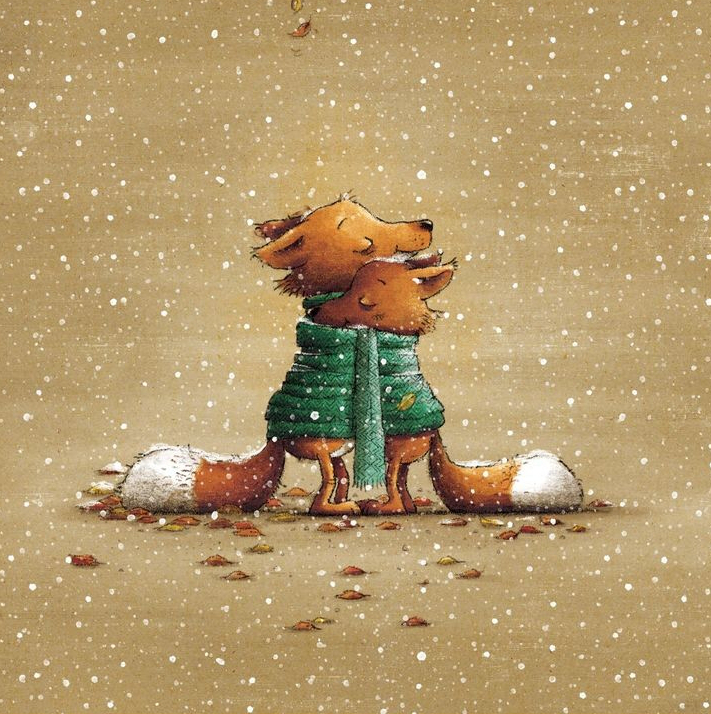

+++
date = 2022-12-31
title = "Ziua 354"
description = "Închei un an dur, dar bogat, un an cu josuri dar, doamne și cu ce susuri!, un an în care mi se pare că m-am întors la mine de unde am plecat acum o mie de vieți, cruduță fiind, un an în care am ales să vindec și să spăl și să primenesc camera mamei dar și camere dinăuntrul meu unde mama a lăsat suflet sângerând, ea fără să vrea și eu fără să știu."
authors = ["Biannca Locatelli"]
[taxonomies]
tags = []
[extra]
math = false
diagram = false
image = "images/ziua-354.png"
+++
---

Cu doar câteva minute alocate mie și interiorului meu, să-l căptușesc, un strop, de urzeală caldă de bine și de curaj fain de pornit în viață cu o nouă zi, și azi mă așteaptă, la ușa dintre somn și realitatea asta molcomă a dormitorului nostru, în care domnul meu frumos toarce încetișor în locul blănoasei care deja hălăduiește pe la parter, o mulțime de treburi puse pe lista de to do-uri de o minte coțofană, ce nu reușește cu succes să se sustragă în totalitate obiceiului ce mi s-a băgat sub piele: trebe să fie curat în casă, mâncare bună pe masă și toate la locul lor, mai ales că trecem într-un nou an. Pe de o parte, când mă extrag eu pe mine de-o aripă din contextul ăsta conjunctural și privesc viața în vastitatea ei, îmi dau seama ce fărâmițe inutile sunt toate agitațiile și bifele astea strâmbe dar, aceeași eu, mă dedulcesc cu voluptate la momentele astea care au așa o încărcătură de de toate, la nivel planetar. Și, că doar mă știu, vreau să gust câte puțin, mai mult, din ambele lumi. Iar azi sunt în aia priponită bine cu picioarele în a face.

***

Alunec duală, și cu chef dar și fără chef, de sub pilotă și las locul ăla călduț și moale pentru fermitatea parchetului pe care-l simt sub tălpi. Prezența mea la momentele prin care-mi (pe)trec viața devine din ce în ce mai mișto, îmi simt simțurile ca niște tentacule de caracațită cum pipăie și miros și aud și văd și gustă și totul e plin și rotund. Hai că-i bine, nu mă înțeapă nicio părere sau percepție de-a mea, niciun gând nu mă ia prin învăluire și văluire de ochi, m-am trezit neutră, cu tentă spre plus chiar, la o zi nouă de luat la trăit. Mulțam!

***

O aud pe Spiky cum aleargă pe scări să vină spre mine, habar n-am unde a montat ea senzorul ăla ce-o alertează că-s trează, prin ce căuș de-al pielii mele l-o fi lăsat, că aproape întotdeauna știe când îmi vin în simțuri și simțiri, uneori chiar înaintea mea. Ne întâlnim la prima treaptă de sus a scărilor și-o iau în brațe pe fata asta de 2 kile și-o țâră și cobor cu inima ei bătând în palma mea dreaptă. Ce senzație frumoasă m-a cutreierat în timpul coborârii! O altă viață, în afara celei care mă animă, a avut atât de multă încredere în mine încât mi s-a încredințat total, iar bătăile unei alte inimi au venit natural să se alinieze cu bătăile pulsului din palma mea. O recunoștință pură, dublată de o bucurie intensă, mă locuiesc în timp ce-mi pun apa la încălzit. Clișeic, clipele mici construiesc zilnic fericirea, iar eu am "pierdut" atâta amar de vreme așteptând fericirea momentelor mari. Există și alea, inevitabil, dar ele sunt borne majore în timp și memorie, utile poate să delimitez calupuri de viață unele de altele, însă nu mi-am imaginat vreodată că beatitudinea poate să-și găsească locul în clipe banale, clipe, pe care dacă nu pun ochiul vigilent, nici nu le observ.

***

Nu vrea afară, e prea frig, așa că pregătesc micul dejun pentru amândouă: ei îi spăl bolul și îi pun pliculețul, mie îmi spăl fructele și mi le pregătesc pe farfurie: o banană, 2 kiwi, o pară, un avocado și 7 prune uscate. E gata și infuzia de măceșe și ceai verde iar în bucătărie miroase a crud și a reavăn.

Pun la fiert cartofii, morcovii și păstârnacul pentru salata "be off" și, până sunt gata, mă strecor, în liniște, în living, să mă mufez la niște zori timizi, o împletire diafană de roz și bleu. E o alegere conștientă, un fel de frână matinală pe care o acționez, să pot să-mi pun în desaga de energie ce-o primesc pentru ziua de azi, ceva zeamă bună, de liniște, de bine pentru inimă și suflet, de drag de viață și de oamenii care-mi sunt în ea, indiferent cum îmi sunt în ea.

Deși știu sigur că n-am adormit, extrem de rar am adormit în viața mea stând în șezut, am avut minute bune în care am fost sau m-am transportat undeva, departe, probabil în zorii pe care-i privesc cu atenție, și n-am fost decât pace. Nu m-au bâzâit gândurile, nu mi-am sortat cronologic to do-urile, nu m-am afundat în sfârșituri de ani trecuți, cu dramele sau bucuriile lor, nu m-am imaginat nici într-un viitor, pur și simplu m-am decuplat total de la mine, costumul de carne care mă plimbă de la o trăire la alta, de la o experiență la alta. Și mi-a fost odihnă momentul.

***

Îi pregătesc omleta cerută cu claritate și nu pot să nu mă gândesc la cât de puternică e de fapt femeia asta ce și-a asumat rolul de mamă: acum trei săptămâni mă interesam de loc de veci și uită-ne, pe amândouă, în viață, în vervă, în dimineața zilei dintre ani, în bucătărie. Ea mănâncă, eu povestesc cu poftă și umor despre pisici, aceleași povești, poate cu nuanțe pe ici pe colo, pe care i le spun în fiecare dimineață din ultimele 2 săptămâni, ca să-i dau un boost de stare de bine, de voință, de suflu de viață. Iar ea îmi întinde o mână, vine după cuvintele mele, mă privește din când în când, printre dumicații ei, râde, înțelege, cuprinde clipe de existență nouă în ea. Nici nu am pretenția să le cuprindă și-n memorie, sunt recunoscătoare că, a nu știu câta oară, mama s-a ridicat din nou. De data asta, doar fizic, cu sclipiri de conștiență pe alocuri, dar nu s-a dat bătută. E incredibilă. Jos pălăria!

***

Termin salata "be off" și salata orientală și mă apuc de curățenie. Cu simț de răspundere, cu poftă, am un elan mental care-mi transmite impulsuri în mâini și picioare și deretic și spăl și scutur și ducă-se poate cel mai greu an din viața mea de adult. Împing afară din casă și afară din mintea-mi coțofană toate energiile alea dense și stătute care-mi băltesc și nu-mi contribuie, cu intenție, cu atenție și cu direcție. Dacă în mine stau toate și dacă totul și orice e posibil, atunci de ce nu m-aș juca cu posibilitățile?! De ce nu mi-aș imagina și de ce nu aș îndoi realitatea asta să urmeze modelul imaginat? Cine mă oprește?!

Și-n tot timpul ăsta în care fizic sunt angajată în munci deloc intelectuale, simt în mine o mare libertate emoțională. Simt cum mă descătușez, e drept că-s ajutată puternic de soarele superb de afară, simt cum se topesc pereții coliviei în care m-a înțârcat mintea asta apocaliptică a mea, care în loc să se avânte spre nelimitatul cer, se dă cu fundul de pământ sau, de cele mai multe ori, se duce până pe fundul mării, croșetând scenarite care nu se produc mai deloc. Simpla intenție pe care-am pus mâna azi conștient, să mă curăț, a început purgația și eu nici măcar nu m-am prins. Atâta putere a avut în ea intenția că uite-mă cum aspir și scutur și mă albesc și eu pe interior mai abitir la Alba ca Zăpada. Is that simple…

Nu înseamnă că nu mai văd repetițiile obsesive ale mamei, nu înseamnă că am devenit oarbă la modul cum boala se încăpățânează în ea, doar că am spălat, cel puțin acum, modul în care le văd, am reușit, și doamne, ce bine-ar fi să fie forever, să dezlipesc acțiunea ei de butonul meu emoțional. Sper să nu fie respirația aia atât de aproape a morții pe care am simțit-o acum câteva săptămâni în carnea mamei și care m-a adus mai aproape de ființa asta formidabil de rezilientă ce-mi stă sub acoperiș. Voi vedea.

***

Sunt un melanj de oboseală fizic și un fresh emoțional cum n-am mai avut de ceva timp. Chiar dacă mă dor picioarele, am niște răni pe tălpi și pe la degetele de la picioare de la căutările lui Ursuleț din ultimele zile, am un zvâc în stare ce nu-mi temperează acțiunile: mă apuc să fac salatini vegan și cât stă la cuptor, să-i dau mamei prânzul. Îmi place sau nu, a zburat timpul și deja am ajuns la amiază. Măcar a fugit cu folos, am încărcat intens cât mai multe clipe din el cu intenții și cu prezență.

Mi-am pus gureșeala în gât, am brodat meșteșugit poveștile despre Spiky și Hitlerică, iar mama a mâncat tot și a fost cu mine, în bucătărie. Zâmbetul ei mic are frate un zâmbet mare în mine și mi-am luat răsplata cu vârf și îndesat din spusele ei, reîntoarsă în cameră: "săru'mâna pentru masă, Bi! Mi-e bine!" Iar fața ei e în acord total cu vorba.

***

Sunt absolut sigură că nu voi rezista trează până la 12 noaptea, când am terminat treaba de abia la 7 seara, dar sunt împăcată cu mine, cu împrejurările mele, cu deciziiile mele, cu cei din jurul meu, cu cei din mine. Îmi iau un timp de pace, ca aia de azi dimineață și-mi sun oamenii dragi, să le aud vocea și să le arăt că-i iubesc. Că-mi sunt în gând, că le gogoșesc pușculița cu intenție curată și cu drag, vreau să le dau fiecăruia câte o bucățică din mine, pentru că eu așa simt că se face împărțirea, cu bucăți de suflet. Oricum, tot de la ei sau prin ei îmi cresc suflet nou de cele mai multe ori, că e regenerabil și reînnoibil și, ce e cel mai fain, este capabil să se umple cu mai mult bun și bine.

***

Fiecare cu paharul lui de vin sau de ceai, seara mi-am petrecut-o cu omul iubit, în schimburi de planuri și de vise, de pași pe care ni propunem în an nou sau poteci pe care vrem să le continuăm. Și cum dondănim noi, într-o atmosferă blândă și caldă, am un moment de maximă recunoștință pentru extraordinarul noroc pe care-l trăiesc de a-l avea pe acest om în viața mea. Îl privesc cum răspunde la un mesaj pe telefon și ochii mi se umplu de lacrimi: e frumos, și p-afară, dar mai ales pe dinăuntru, iar clipa asta cu el în fața mea, în viața mea, e completă și totală și nu cred că poate strânge mai multă frumusețe în ea decât deja o are. În această clipă am tot ce-mi trebe. Am chiar și pe lângă.

***

Închei un an dur, dar bogat, un an cu josuri dar, doamne și cu ce susuri!, un an în care mi se pare că m-am întors la mine de unde am plecat acum o mie de vieți, cruduță fiind, un an în care am ales să vindec și să spăl și să primenesc camera mamei dar și camere dinăuntrul meu unde mama a lăsat suflet sângerând, ea fără să vrea și eu fără să știu, un an de tutoriale la tot pasul, unele repetate până mi-au intrat în măduvă, care m-au durut atât încât mi-au frânt, nu inima, ci îndârjirea aia cu care mi-am împânzit intimitățile de suflet rănit, și am început să aduc balsam de iertare și vindecare, un an de însingurare și singurătate dar și de profunzimi în relații la care n-ajungi decât după ce te zdrelești și te prinzi cât de mult contează să permiți și să-ti permiți, un an cu fugă de mine și apoi dorință de fugă în mine, un an în care m-am prins, acut, ce înseamnă să-ți pese cu adevărat și că păsatul ăsta e uleios, toate scuzele pentru care ai face, dar n-ai prea ieși din confortul propriu pentru asta, nu se lipesc și se separă și te separă.

Nu am planuri mari pentru un an nou, am câteva obiceiuri noi și bune pe care vreau să le aciuiez în mine, dar vreau să-mi practic viața, să trec clasa și să mă calific la o practicare constantă, consistentă, palpabilă, care să nu mă mai sperie și tăvălească atât de abrupt, dar nici să nu-mi dea o băltire d-aia idiot de confortabilă.

Anul care vine vreau să trăiesc. Și să plec de la asta în fiecare dimineață.

  

