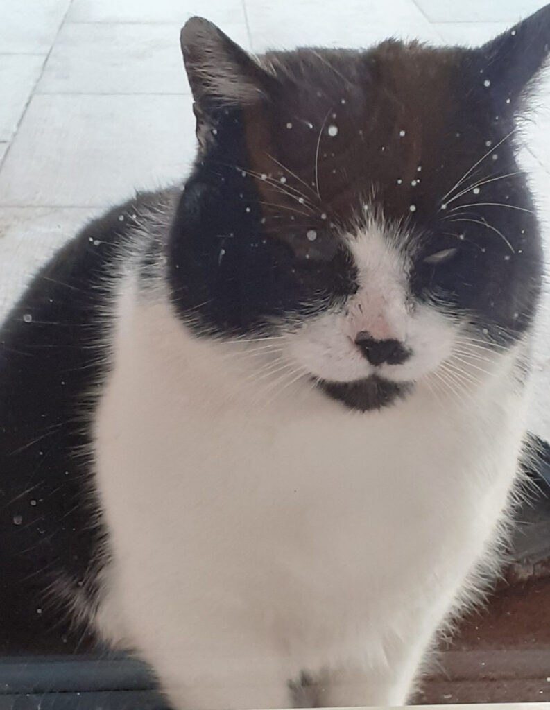

+++
date = 2023-01-01
title = "Ziua 355"
description = "Nu-mi trebe călugărie sau pustnicie ci, din contră, oameni și o țâră de voință să-mi întorc arsenalul de unelte și de arme, cu care am plecat din mine să-mi cuceresc exteriorul, în interior. Nu pot să spun că iubesc cu frenezie oamenii, dar pot să spun că am făcut clar primul mic pas să nu-i mai toc prin judecată."
authors = ["Biannca Locatelli"]
[taxonomies]
tags = []
[extra]
math = false
diagram = false
image = "images/ziua-355.jpg"
+++
---

Evident că aseară am adormit brusc și dintr-odată, la adăpostul brațului lui Mr. H, liniștită de siguranța pe care o emană apropierea mea de omul iubit. Cu numa' un sfert de oră înaintea miezului de noapte, m-am trezit parcă impinsă de-un imbold nevăzut, cât s-apuc să mă pregătesc de-o ciocnire de pahar și să nu mă ia cu leșin din cauza jihadului care s-a pornit afară. Am o groază în suflet când mă gândesc că Hitlerică e pe afară, pe undeva, că nu-i în cuscuța lui de pe terasă, că Ursuleț e și el pe coclauri, dar am și o teribilă compasiune pentru sufletele de căprioare, vulpițe, mistreți, câini maidanezi și pisici ale nimănui care sunt sub asediul petardaților și habar n-au ce sunt bubuielile astea cumplite abătute din senin peste liniștea și noaptea lor.

Deși îi judec pe petardați acum, și eu am fost cândva în rândul lor, și eu mă bucuram la priveliștea exploziilor de artificii, și eu trăiam într-o ignoranță totală, pentru că nu m-a învățat nimeni nimic despre compasiune, despre grijă pentru ce e în afara propriei persoane, despre consecințele faptelor mele asupra altor vieți. Eu am învățat cum să mă prefac ca să fiu iubită, cum să mă dau peste cap și să fac chiar și când nu mai pot să fac, pentru alții, ca să mă accepte, am învățat teoreme și reacții chimice și politologie și cum să tocesc rezumate la română. În orarul nostru de școală n-am avut și viața ca materie de studiat. Deh, mai ca la țară așa, în orășelul nostru mic, dar bag seama că nici în capitală nu s-a infiltrat în programa școlară șturlubatica viață.

***

Deși am încercat să plec în lumea viselor, după domnul meu, nu mi-a ieșit schema de nicio culoare până pe la 3 dimineața. Afară jihadul s-a potolit, răzleț se mai aude câte-o bușitură de pe la vreun adormit ce n-a detonat-o la timp, e în aer un miros pătrunzător de ars, iar eu sunt doar cu mine, la crăpătura dintre 2022 și 2023. Mă las să-mi curgă în liniște gândurile, mă văd cum trec prin momentele dure și grele și simt aroma fiecăruia așa cum s-a marcat ea în interiorul meu, mi-adun și toate clipele de bucurie, beatitudine, de recunoștință caldă, de fericire nesofisticată și mă umplu și de ele, tot acolo, în vastitatea mea interioară.

***

Primul a venit pe nepusă masă, când rumegam la ultimul an de trecut al meu, când înșiram pe ața lui atât evenimentele în sine, cât și percepția și reacțiile mele la ele: am simțit o imensitate neagră, deși aici neagră n-are nicio legătură nici cu culoarea la propriu și nici cu conotația figurată, o infinitate ce s-a strâns iluzoriu într-un costum de carne cât să defileze printr-o lume materială, o infinitate care sunt EU, dincolo de orice și de tot și de toate, un știut maxim că nimic nu se sfârsește de fapt. În știutul ăsta am avut o respirația atât de adâncă și atât de cuprinzătoare, că parcă am împrăștiat în tot corpul o siguranță a nemuririi. Această trăire fabuloasă a fost scurtă, dar suficientă, cât să marcheze o bornă greu de uitat a acestei nopți.

Al doilea a venit când am priceput, empiric e drept, că tocmai am fost martora și actorul principal al unui moment de conștiință pură, am gustat o țâră de eternitate condensată într-o mini clipă: o recunoștință ca o lavă s-a revărsat din mine dar și în mine, recunoștință universală, necentrată pe ceva anume, o stare de plenitudine superbă.

Sunt absolut convinsă că noaptea ce-a trecut a avut și o încărcătură emoțională, nu doar de petarde arse, iar eu, mai mult sau mai puțin conștientă, m-am racordat la stratul ăsta vibrațional intens, de unde am aspirat cele 2 momente de neuitat.

***

La 6 sunt deja în picioare, cu chic-chi-urile lui Spiky care-mi cere iubire, înainte de orice, apoi mâncare și apoi libertate. Îmi sorb apa, nostalgică, cu gândul la ce am experimentat în astă prea dimineață. Încă am senzația fizică atât a întunericului infinit, cât și a recunoștinței calde.

Sunt full, de la mâncarea de ieri, așa că îmi iau doar o banană pentru mai târziu. Și sigur o cafea.

În prag de an nou, aseară am primit și vești îmbucurătoare despre Ursuleț: a fost văzut și recunoscut, este teafăr, dar nu a putut fi luat și adăpostit astfel încât să poată fi recuperat. Așa cum m-a învățat deja în puținul timp de când o știu, mama lui Ursuleț e bucuroasă că el e bine și nu-și consumă energia cu judecata omului ce nu l-a luat să-l țină un strop până îi vine stăpâna. Eu una știu că asta aș fi făcut prima dată… Vocea ei mi-a construit instant aripi pe toartele inimii dar m-a și dezumflat când am aflat că a oprit căutările pe ziua de ieri fără rezultate, că s-a înserat și a fost avertizată că noaptea sunt mistreți în câmpul unde a fost văzut Ursuleț. Și eu și Mr. H ne-am fi dus cu ea și pe întuneric, dar nu poți intra cu bocanci peste dorința și voința unui om, mai mult ca sigur deja epuizată și obosită atât trupește, cât și sufletește.

La ceasul ăsta nou de dimineață începătoare de an, mă întorc la bucuria din vocea "mamei" care-și știe animăluțul în viață și aleg să rămân și eu de partea plină a paharului.

***

Sunt hotărâtă să-mi lărgesc spectrul de ritualuri de bine și-mi trec în agendă oil pulling-ul dimineața, mișcare, meditație. Sunt încă la o fază incipientă, după cum mă știu, trebe să se coacă bine ideile înainte să le pun în practică, cred că am o respingere cronică pentru orice încearcă să se impună sau să-mi impun și dacă nu s-a copt în mine, cel mai probabil că fac cât fac și apoi o las baltă. La mine mecanismul se mișcă greoi, și cred că așa și este natural, cazurile în care cineva decide brusc ceva, fără nicio pregătire interioară prealabilă și decizia durează în timp, sunt excepții de la regulă. Eu trebe să mă conving, să picur zi de zi informația în mine, până face cărare, pe care apoi să pornesc nestânjenită, fără să mai am emoția eșecului. Așa a fost cu renunțarea la carne, așa a fost cu veganismul, la fel și cu apa și cu fructele pe stomacul gol al dimineții. Mă încânt repede, nu-mi lipsește voința dar ca să-mi iasă bine, trebe să-mi construiesc consecvența.

***

Mama mănâncă bine și se simte bine. O drăgălesc și îi vorbesc cu spor, iar asta o scoate din amorțeala pe care, indubitabil, acum știu că i-o dau pastilele. De când a fost la un pas de colaps acum 3 săptămâni, n-a mai pus mâna pe tabletă, rebusurile s-au umplut de praf, dar ea nu se dă bătută. E cu mine în bucătărie și eu sunt cu ea în bucătărie. Iar asta e o reușită care merită să fie articulată.

***

Mr. H pleacă la "țară", unde se reunesc toți ai lui, în fiecare an, pe 1 ianuarie. Mă bucur pentru el, mă bucur pentru ai lui, mi-e dor de toți, dar la timpul potrivit și în contextul potrivit, o să fiu și eu cu ei.

Îmi folosesc timpul, dintr-odată liber, până la prânzul mamei, să încep o provocare la care am fost invitată de o doamnă dragă inimii mele: Building healthy habits challenge 2023, pe Insight timer.

Azi e prima zi și s-a lăsat cu setare de intenție faină, cu gust de verde, de pace, de liniște, de prezență pe-un fundal de pădure. E mișto ziua asta, e plină de începuturi și de prime dăți.

Ca să nu-mi zdruncine starea interioară, frumos tihnită după meditația de intenție de mai devreme, dau drumul la jazz în surdină și-mi cuprind toată ființa și toată casa și toată viața într-o îmbrățișare curată și sinceră de pretenții. Pentru prima oară în viața mea, m-am alocat doar mie și a fost sublim.

***

Mustățile lui Hitlerică simt starea mea deosebită și decide să mă recompenseze cu prezența și un strop de apropiere fizică: stau în pragul ușii de la bucătărie, spre terasă, pe vine și-l las să mă miroasă cât vrea el, fără să fac vreo mișcare, aproape că nici nu respir. Doar ochii mei îi urmăresc mișcările și-l văd cum se apropie circumspect, cum s-ar atinge de mine dar nu îndrăznește, cum trece de mine și intră în casă!, cum la ieșirea abruptă și rapidă din casă se freacă a alint de piciorul meu iar eu habar n-am când am coborât mâna și l-am mângâiat. Uimit de atingere, s-a lăsat brusc la pământ și a început o miorlăială, o jale, de mi-a topit inima. Era parcă un plâns și-un dor în jelania asta, din care nu s-a oprit cât timp l-am mângâiat. Apoi, nu știu de ce, s-a speriat brusc și a sărit departe de mine, privindu-mă fix. E traumatizat grasul ăsta frumos, dar are o prietenă în mine care nu se dă bătută și nici nu renunță. Într-un final, îmi va sta în poală și eu îl voi răsfăța. Love takes time.

***

Habar n-are el că mi-a dat "muniție" pentru poveștile de prânz pentru mama, care se cuplează și ea la încântarea mea de a fi reușit să-l mângâi o țâră mai mult. Mă întrerupe din când în când cu aceeași întrebare: dar unde e? și îi răspund mereu la fel, acum știu că dacă uită întrebarea, în mod sigur uită și răspunsul meu, nu mă mai strofoc să găsesc mereu și mereu altul. Încă o dovadă că omul se adaptează la orice, indiferent cât de dement ar fi orice-ul ăsta.

***

Cea mai tare conștientizare a zilei a fost să înțeleg că DOAR prin interacțiunile mele cu ceilalți, din afara mea, DOAR cu ajutorul relațiilor umane pe care le am, pot ajunge la miezul meu, mă pot vedea eu pe mine, evident dacă sunt deschisă și-mi permit și vreau să mă văd. Nu-mi trebe călugărie sau pustnicie ci, din contră, oameni și o țâră de voință să-mi întorc arsenalul de unelte și de arme, cu care am plecat din mine să-mi cuceresc exteriorul, în interior. Nu pot să spun că iubesc cu frenezie oamenii, dar pot să spun că am făcut clar primul mic pas să nu-i mai toc prin judecată și să-i privesc prin lentila toleranței câteodată, a înțelegerii alteori, a dragului de multe ori.

***

O zi albă. Prima zi albă din 2023. Cu recunoștință pentru:
1. Momente de mare trăire și claritate și conștiință!
2. Femeia asta solară și frumoasă care m-a cooptat în construirea de noi obiceiuri!
3. Hitlerică în viața mea!

Tot el este și frumosul zilei:

  

Hitlerică

 

 

  

    <a href="/blog/ziua-354/">Postarea anterioară</a>
  

  

    <a href="/blog/ziua-356/">Postarea următoare</a>
  

