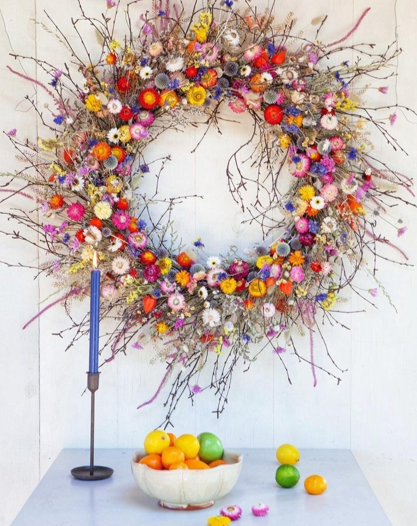

+++
date = 2023-01-04
title = "Ziua 358"
description = "Mi se deschide o nouă perspectivă, imensă cât o ușă de rai: m-am rafinat în ceea ce o privește pe mama, am crescut, nu mai joc în Liga piticilor. Rafinamentul în demența mamei mi se desfășoară acum atât de clar în fața ochilor încât mă surprind singură că n-am putut să-l văd așa și până acum: întâi a fost șocul și eu nu cred că există cineva atât de neutru pe lumea asta care să nu-l ia direct în plex. După șoc, vine etapa de făcut față. După făcutul față, te ridici o țâră și vezi cum poți să te mai simți și bine cât faci față. Adicătelea mai tragi o țâră de aer, să-ți umpli plămânii, să ai un respiro și-o îngăduință. Aici cred că sunt eu acum. "
authors = ["Biannca Locatelli"]
[taxonomies]
tags = []
[extra]
math = false
diagram = false
image = "images/ziua-358.jpeg"
+++
---

Noaptea asta se înscrie cu succes la categoria de duală, dar nu în sensul ăla libidinos, de cu două fețe, ci în sensul că n-a avut decât două nuanțe: ba cu fierberi în suc propriu, ba cu răcoare pe la extremități. M-am învârtit de pe o parte pe alta, că e cearșaful îngrămădit tot sub mine, semn de mare foială. Cum probabil că o să-mi fie partenere de carne mult timp de acum înainte mini-combustiile astea, tot ce pot să fac este să mă obișnuiesc cu ele, să le fac și lor spațiu într-o mine oricum aglomerată, să mă întind elastic să le cuprind atât de bine încât, ideal, să nu le mai iau în seamă și să-mi nasc un somn odihnitor, atât de dorit și de necesar.

Spikylina nu s-a dezmințit și a venit să mă racoleze în ceas tihnit și întunecat de prea dimineață. O amân un strop, cât să mă adun, să mă pornesc, întâi înăuntrul meu, ș-apoi și-n afara mea.

N-am prea mult succes că se apucă alarma lui Hr. H să sune ca nebuna, de m-a scos turbulent și speriată din mica mea ceremonie a aproape fiecărei dimineți. Ok, nu e loc azi de ale mele, hai să mă ridic.

***

Mă întorc, nu spășită, ci cu drag și parcă dor, la apa mea caldă cu lămâie și la platoul de fructe. Nu mai am ceai verde, așa că mă mulțumesc cu aromă de măceșe și salcâm, culese cu lăbuță proprie.

Domnul meu pleacă la birou azi și mă lasă cu durerea asta de cap, nuanță nouă, ultimul răcnet cum ar veni, nu mai scormone răscolitor în arcada ochiului stâng, acum e ca un drug de fier încins în miez de cap, o țâră cu vârful spre dreapta sus. În dimineața asta doar aș sta, doar aș asculta, doar aș medita, că ieri am dat skip la ziua trei din provocarea de obiceiuri sănătoase, doar aș studia, parcă am nevoie profund de-o orizontală blândă și de-o atmosferă bună cu mine.

Dar mama trebe să mănânce, așa că m-apuc să-i fierb un ou și să-i aranjez toate pentru micul dejun. Nu mai coboară și nici nu mai urcă decât sprijinită de mine, și acest mic traseu, parcurs de amândouă, este un instrument util mie să-i iau pulsul, și la propriu și la figurat.

Mare noroc am cu Hitlerică, care e la cușcuța de pe terasă și care umple el, doar cu prezența, spațiul ăla de depănat povești în care era, alături de Chichirica din casă, protagonist central. Mulțam, gogoșar mic, pentru ajutor!

***

Acum c-am bifat micul dejun al ei, îmi ascult corpul care-mi cere pauză și căldură, fac focul în șemineu, îmi fac cuib în colțarul din living, și mă așez întru liniștirea nebunei ăsteia de durere de cap.

Primul sosit în feed-ul meu de youtube, a fost podcastul lui Tom Bilyeu cu dr. Bredesen despre ce altceva decât declinul cognitiv. Bun tare de urmărit, are informații calde, proaspete și super utile, nu numai pentru cei afectați de Alzheimer și-ai lor, ci pentru toată umanitatea, că intră pe zonă de prevenție.

<a href="https://www.youtube.com/watch?v=eAbdQnCb9cc" target="_blank">https://www.youtube.com/watch?v=eAbdQnCb9cc</a>

Din video-ul ăsta am sărit într-altul, care m-a amprentat puternic la momentul când l-am văzut:

<a href="https://trezireainteligentei.ro/dr-veronique-desaulniers-7-pasi-esentiali-pentru-a-invinge-cancerul-de-san/" target="_blank">https://trezireainteligentei.ro/dr-veronique-desaulniers-7-pasi-esentiali-pentru-a-invinge-cancerul-de-san/</a>

Impulsionată de toate astea, dar mai ales împunsă constant de andreaua durerii de cap, ca să-mi mut focusul, decid să-mi marchez ziua de azi pentru trecerea în revistă a lucrurilor pe care le vreau schimbate sau actualizate în viața mea.

**Ce mănânc**

Deși am restrâns o țâră spectrul factorilor inflamatori prin veganism, trebe să tai rația celor 3 otrăvuri albe, zahărul, sarea și făina, să trec pe raw vegan cât mai mult, să păstrez apa caldă, fructele dimineața, să folosesc aplicația dr. Greger Daily Dozen, să țin post intermitent, adică pauză de mâncare de 16 sau 18 ore, măcar de 3 ori pe săptămână, să țin post negru o dată pe săptămână, să nu mănânc cu cel puțin 3 ore înainte de somn, să am răbdare 40 de minute pentru activarea sulforafanului din crucifere, să am grijă la B12, vitamina D3, fier, iod, să-mi aloc timp tihnit pentru masă.

**Ce beau**

Rămân la apa mea remineralizată de după osmoză, dar o să studiez și alte variante pentru apă pură, ceai verde, ceai din plante culese de mine, poate reușesc să renunț la cafea sau să cumpăr doar cafea bio organică și să beau ocazional.

**Ce respir**

Să caut variante de purificator, mai ales că, deși mutată în afara Bucureștiului, sunt zile când indicatorii de poluare sunt mov de nervi. Sau să ne mutăm în munți.

**Ce pun pe piele**

Dacă era în care nu ieșeam nici să duc gunoiul fără ochi machiați și tonă de gel în păr, de ani buni singura aroganță din zona asta este un rimel, așa, la zi de sărbătoare. Dar compensez din plin cu toate produsele de igienă personală și cu cele folosite în gospodărie. Dacă mă storc ăștia de la fabrica de detergent lichid de vase, cred că s-adună de vreo tonă, la câte vase am spălat la viața mea, fără mănuși. Sau Domestos, sau lichid de spălat geamuri, sau săpun de mâini. Așa că mi-am propus să înlocuiesc toate produsele astea cu chestii naturale și primul apărut pe firmament este Castile. Nu e brand, e numit așa după zona din Spania de unde provine. Până la sfârșitul anului, nu vreau să mai am picătură de chimicală în produsele de igienă, de orice fel ar fi ea.

**Să fac mișcare**

Aș vrea să fac yoga sau qi-gong sau pilates sau măcar un set de exerciții în fiecare zi. Cine știe, poate chiar să atentez la eliptica lui Mr. H.

**Să-mi tratez dentiția**

Oil pulling în fiecare dimineață, cu ulei de susan, 10-15 minute, pastă de dinți home made din bicarbonat de sodiu, ulei de cocos și câțiva stropi fie de ulei de mentă, fie ulei de cuișoare și să găsesc un dentist biolog, îndreptat spre alternativă naturală.

**Să-mi îmbunătățesc somnul**

Poate că mișcarea va contribui și ea la asta, dar sigur o să renunț la telefon/tv cu 2 ore înainte de somn.

**Să meditez**

Zilnic, fără scuză, măcar 15 minute, să fac exerciții de respirație, la fel de zilnice.

Să mă iubesc, să iubesc și să mă las iubită. Să mă iert, să iert și să fiu iertată. Să comunic curat, fără zdrăngănele și așteptări doar în mintea mea, să trag aer în piept când vine judecata în mine, să mă bucur de viață, cât de mult pot.

Nu-s imposibile. Primul pas tocmai ce l-am făcut acum, așternându-le și punând lămpașul pe ele, să le văd. Ș-apoi, cu perseverență, să le fac. Nu știu eu multe despre viitor, dar un lucru știu SIGUR: nu vreau să fiu o povară pentru nimeni, la anii senectuții. Dar în primul rând, nu vreau să-mi fiu eu povară mie.

***

Nici nu știu nici unde s-a mai dus din intensitatea durerii de cap, nici unde s-au ascuns orele, că m-am trezit că e ora pentru prânzul mamei. Mi-era rotund în starea asta de coacere de viitor proaspăt, cu aromă de verde, de suflu nou și recunosc că n-am nicio poveste în mânecă pentru pofta mamei de mâncare.

Dar o aduc, stau cu ea la masă și arunc, în liniștea bucătăriei, vorbe despre mine și dorințele mele de a-mi fi bine, că doar tocmai ce asta am făcut și-s plină de ele. Cu toată exuberanța mea, n-am reușit să mă strecor pe canalul ăla lăsat liber de mama în relația cu mine, că p-acolo nu circulă decât pisici sau fostul ei loc de muncă sau frate-su. Văd că nu e interesată, n-are nicio curiozitate, deși știu că folosesc cuvinte și denumiri pe care nu le știe, așa că renunț la mine și mă umplu de ea. Încropesc la nimereală situații cu pisicile casei și reușesc s-o aduc pe mama, cu zâmbet blajin, din nou în corpul ăsta care stă la masă. Termină încântată prânzul, însoțesc trupul ăsta mic în camera ei și mă las într-o rână pe-un gând-întrebare: ce e înțelegerea asta din mine?

***

Revenită în living, se deșiră gândul de pe scări și mi se deschide o nouă perspectivă, imensă cât o ușă de rai: m-am rafinat în ceea ce o privește pe mama, am crescut, nu mai joc în Liga piticilor. Rafinatul ăsta e ca ăla de la țigări sau de la cafea sau de la orice altceva: la început toate-s la fel, pe parcurs începi să deosebești arome, ca la final să știi clar ce-ți place și ce nu.

Rafinamentul în demența mamei mi se desfășoară acum atât de clar în fața ochilor încât mă surprind singură că n-am putut să-l văd așa și până acum: întâi a fost șocul și eu nu cred că există cineva atât de neutru pe lumea asta care să nu-l ia direct în plex. Chiar și Gregg Braden, într-unul din video-urile lui, are lacrimi în voce când vorbește despre mama lui, pe care o pierde treptat din dreptul vieții în favoarea demenței. Deci, nu contează pe unde ești, șocul e șoc pentru toată lumea.

După șoc, vine etapa de făcut față. E ca atunci când te aruncă cineva în apă, tu nu știi să înoți, dar ești acolo, ce mama naibii poți să faci, decât să te duci la fund, să înghiți 2 găleți de apă, dar să ieși și dai din mâini și din tot ce poți.

După făcutul față, te ridici o țâră și vezi cum poți să te mai simți și bine cât faci față. Adicătelea mai tragi o țâră de aer, să-ți umpli plămânii, să ai un respiro și-o îngăduință. Aici cred că sunt eu acum.

Iar după asta, vine și iubitul a ceea ce faci, cu subcapitol de viață demența, printre alte subcapitole, niciunul mai sus sau mai jos. Crystal clear!

***

Seara mi se înșurubează frumos în jurul conversației cu domnul meu, pe marginea zilei lui, zilei mele, noutăți, chestii faine de împărtășit de la unul la altul, vestea anului, la propriu, că mi s-a aprobat dosarul de fotovoltaice de către Administrația Fondului de Mediu.

Nu m-a iertat durerea de cap nicio clipă toată ziua, a mai redus piciorul de pe pedală, dar a fost cu mine și încă este. Chiar și așa, în căuș dureros, am plămădit azi o zi pentru sănătate. Și ziua asta o să nască alte zile-pui în care sănătatea o să mă însoțească mai toate clipele.

***

Sunt recunoscătoare pentru:
1. Fructe!
2. Internet și libertatea de mișcare a informațiilor!
3. Observatorul din mine!

Frumosul din zi:

  

Layla Robinson Design

 

 

  

    <a href="/blog/ziua-357/">Postarea anterioară</a>
  

  

    <a href="/blog/ziua-359/">Postarea următoare</a>
  

