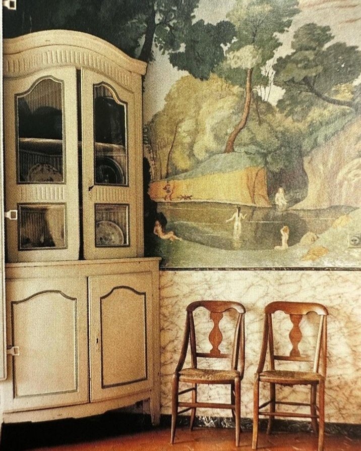

+++
date = 2023-01-06
title = "Ziua 360"
description = "Doamne, în timpul mesei ei, am fost încarnarea fără nicio rezervă a faptului că, dacă nu ești suverană în tine, ești ca lumina unei lumânări între două uși între care se face curent. Mi se unduiește starea interioară după cum suflă demența mamei din exterior de mă apucă și disperarea, dar și nervii. Cum fac să deschid, cu levierul voinței, bucata aia din mine unde am ferecat înțelegerea în toate straturile mele, că dacă nu mă adun și continui să mă impactez cu tot ce-mi servește, din plin, afara mea, o să dansez pe cărbuni încinși toată viața?"
authors = ["Biannca Locatelli"]
[taxonomies]
tags = []
[extra]
math = false
diagram = false
image = "images/ziua-360.jpg"
+++
---

Sunt pe țeava vieții mele niște zile și niște nopți o țâră mai obositoare și nu știu dacă fac eu ceva, la nivelul ăla inconștient la care sunt mufată mult timp din timpul meu sau plutește în aer, universal împrăștiată, la fel de inconștient, de omenire, o stare generală de oboseală, iar eu mă îmbib, candid și natural cum mi-e felul, din pătura asta colectivă nonșalant hrănită. Asta pentru că eu mi-am construit în timp, rețele neuronale și autostrăzi emoționale care mă duc invariabil să mă adap din pături d-astea mai joase, mai de nivel începător, nu m-am calificat, evident prin practica mea, să ridic capul mai sus și să mă înfig într-un nivel mai spumant, mai cu bunăstare și bună dispoziție.

Iar în nivelul de joc la care m-am trezit în astă dimineață, trezirea mi-e tot greoaie, atârnătoare de gene și fără niciun chef să îmbrățișez o nouă zi, nici pe departe să-i aloc măcar prezumpția de obișnuită, dacă nu aventuroasă. În schimb, mă vizitează scurt gândul care lasă loc unui pui mic de panică: cică ziua bună se cunoaște de dimineață sau, varianta mai spirituală, mai new age a ei, cum îți setezi dimineața, așa se așează întreaga zi. Nașpa, ce să zic. Că eu nu prea am chef de ziua de azi, dar asta nu înseamnă c-aș da delete la viață. Poate îs doar tare obosită.

***

Mă trage din somn aceeași blănoasă dragă cu ochii verzi, care clar vrea să mă ducă la un alt nivel de joc, învățătoarea mea fără glas care-mi arată, neobosit(ă), în fiecare dimineață, ce înseamnă să ai chef și curiozitate de viață.

Parcă și zorii sunt într-o zi proastă, sunt spălăciți, nehotărâți, nici colorați, nici necolorați, ci mai degrabă decolorați. Îmi iau privirea de la ei și încerc să mă înțânez mai zdravăn în corp, că-mi sunt și mișcările dezarticulate și parcă nu corelez fapta cu intenția ce pleacă de la panoul de comandă, creierul. Dar, deși pare că nu-s trezită, o parte din mine, aia care nu doarme niciodată, observatorul, îmi trimite un gând împăciutor: hai, mă, lasă-te să fii mai moale, hai dă-ți voie să fii obosită, să fii înceată, să nu vrei sau să nu poți. Toate acompaniate și de-un surâs. Da, ce-ar fi să "hai, mă, că-mi dau!"?!

Surâsul se scurge în interior cu apa fierbinte, și apoi infuzează de zâmbet și fructele pe care le mănânc. Hai că nu-i dracul chiar atât de drac…

Mi-am încheiat apoteotic bucata asta de timp al meu, calm, în care mi-am și m-am permis, în toate valurile mele, cu un video super fain, un fel de Oscar pentru întreaga carieră a unui designer de interioare în vârstă de 90 de ani. Superb! Așa m-a inspirat și așa m-a încântat, că am dat peste margini de bucurie, mi-am adus aminte că fiecare vine aici cu un scop și că atât timp cât îți trăiești viața în interiorul acelui scop, n-are cum să nu iasă bine. Mai rămâne să mă prind care mi-e acel scop…

***

Trebe să fug să-mi fac B12 injectabil, așa că o aduc pe mama la micul dejun mai devreme.

Doamne, în timpul mesei ei, am fost încarnarea fără nicio rezervă a faptului că dacă nu ești suverană în tine, pe emoțiile tale, pe gândurile și trăirile tale, ești ca lumina unei lumânări între două uși între care se face curent. Mi se unduiește starea interioară după cum suflă demența mamei din exterior de mă apucă și disperarea, dar și nervii. Ce naiba îmi mai trebe să aplic în practică teoria? Cum fac să deschid, cu levierul voinței, bucata aia din mine unde am ferecat înțelegerea în toate straturile mele, nu doar alea mentale, că dacă nu mă adun și continui să mă impactez cu tot ce-mi servește, din plin, afara mea, o să dansez pe cărbuni încinși toată viața?

Mă enervează și afectează boala ei. Mă enervează și impactează impasibilitatea ei, care nu știu dacă-i rezultat direct al bolii sau al violului sau al modului cum ea și-a croit interiorul. Mă enervează că nu (mai) am răbdare și mă înfierează asta prin vină. Mă uit la ea, văd cum mă suge de energie și de atenție și mă enervează și asta.

E clar, sunt labilă emoțional.

***

Mă apuc de construcția salatei și primesc un telefon: Ursuleț e într-un sat la vreo 12 km de al meu. În două secunde sar în blugi și-n câteva minute sunt în mașină. Mă opresc să iau conserve cu mâncare umedă pentru câini, un săcotei de bobițe și mân către digul din Ciolpani, unde s-ar fi aciuat năzdrăvanul.

La fața locului mă întâmpină un el și o ea, oameni simpli, cu colțuri de buze arcuite spre în sus, în zâmbet familiar. Ridurile de expresie de pe fețele lor muncite arată că zâmbetul stă lejer și e nelipsit acolo, cel puțin pe chipul femeii se vede asta limpede, deși la fel de limpede se vede și cât e de cocoșată de atâta muncă fizică grea. La el observ, din zbor, egoul ăla, pregnant mai vizibil la bărbați, când începe să-mi spună că pe el îl sună ministrul mediului direct și îi spune ce are de făcut la ferma pe care o păstoresc cu drag, grijă și atenție doar ei doi. Aceeași nevoie ne-bună de validare prin asociere, fără sămânță de analiză proprie: ce contează titulatura? Știe el ce om e, sub folia denumirii și poziția socială, ministrul? Nope, nici nu contează, contează ca el să fie asociat cu un om potent, în opinia lui. Care e ocaua potenței, nu prea are importanță.

După rapida analiză pe care le-am făcut-o aproape fără să respir, nu pot să nu-mi observ totuși dragul pe care-l simt în mine lângă acești oameni, pentru acești oameni. Așa cum pot ei, în câmpurile ce cred eu că-s tare aprige iernile, au grijă de o fermă de legume dar cresc, din puținul lor, și toate animalele ce s-au adăpostit în timp acolo. Și, se vede din cum vorbesc, că chiar le poartă de grijă.

Pornesc cu minunea de femeie, bună ca pâinea caldă, să-l găsim pe Ursuleț și în câteva minute ajungem la o margine de dig, unde e haita ce pare că l-a adoptat pe fugar. Haita fuge speriată, noi după ea și în scurt timp îmi dau seama că cel pe care-l credeau ei că ar fi Ursuleț, nu este Ursuleț.

M-am dezumflat brusc, mi-a venit în minte din nou imaginea pâlpâietoare a lumânării, le-am lăsat lor toată mâncarea de câini, am îmbrățișat-o pe ea și am plecat.

***

Deși venisem cu zâmbet și în suflet și pe față, nereușita asta, nouă și totuși atât de cunoscută în ultima perioadă, m-a intristat. O sun pe "mama" lui Ursuleț și știu că de câte ori o sun pe femeia asta faină, îi simt speranța în alo-ul de început și mă fac mică-mică când, din nou, nu pot să i-o împlinesc.

Dar îmi iau bunele din experiența asta a zilei și înțeleg că, pusă în situație, nu mă mai taie apropierea de oameni, indiferent de calibrul lor sau de modul în care aleg ei să-și întoarcă înăuntrul spre exterior, spre alții. Mă prind, greu dar sigur, că interiorul nostru nu e diferit, ci doar modul cum îl vărsăm în lume ne particularizează.

Îmi mănânc salata cu gândul departe, la o fermă, îi dau și mamei să mănânce, ajutată de Hitlerică, care activează pe post de mascotă și îi captează atenția, deturnând-o de la mâncare la cât de frumos e păcătosul ăsta miorlăitor. Chiar că e frumos tare. Ușor, ușor, ne învățăm unul cu altul și poate voi reuși să și pun mâna pe el fără să mă taie cu ghearele-i ascuțite.

***

Pe fundalul mișto de jazz, mă afund în îndeletnicirea care mi-a produs cea mai mare uimire a vieții mele conștiente: scrisul. Am un gap de o lună în postări dar nu mă las. Mi-am promis 365 de zile de scris, vor fi 365 de zile urcate pe blog. Chiar dacă despletirea lor se va face în mai multe, chiar dacă drumul de la agendă unde-mi aștern zilele până la tastatura unde se deschid și le zugrăvesc pe-un blog durează mai mult decât mă așteptam.

Îmi închei ziua cu tema la provocarea pe care mi-am agățat-o în calendar, de a implementa noi obiceiuri, sănătoase dar, pentru prima oară, nu rezonez cu mai nimic.

Tema zilei este despre afirmații și despre cum îți pot ele influența, ba chiar schimba, viața și, chiar dacă procesez mental și intuiesc puterea ce stă în găoacea cuvintelor pozitive, nu s-a legat nimic de mine, nicio tresărire în mine n-a oprit vreo afirmație pe care s-o iau cu mine mai departe. Încă. Nu sunt eu coaptă îndeajuns încât să primesc înțelepciunea asta, probabil. Sau am atâtea programe downloadate că nu mai e spațiu unde să se vâre și ele. Pesemne e vreun semn care mă trage de mânecă și mă face atentă că trebe să mă apuc de delete pe ici, pe colo.

***

Sunt recunoscătoare unei zile care, deși pornită placid, a conținut momente frumoase:
1. Vizualul cu mine sub formă de lumină de lumânare, care mă centrează mereu și mă aduce în prezent și încearcă măcar să nu se mai lase bătută de toate vânturile, din toate părțile;
2. Căldura unor oameni cu părți atât de frumoase că contrabalansează distanțat egoul ăla disperat să se hrănească cu părerile de bine ale altora despre persoana proprie;
3. Jazz!

O clipă de frumos (din 90 de ani de frumos):

  

