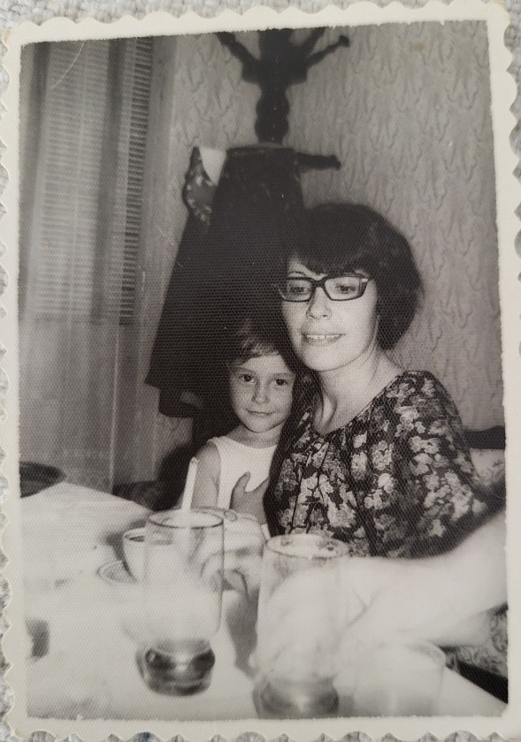

+++
date = 2023-01-11
title = "Ziua 365"
description = "Când mă las furată de mirajul victimizării, mă doare ca dracu', exact la fel ca atunci când, puiuc fiind, mi-am dezgolit pieptul naiv în asteptarea iubirii și-am primit o nepăsare cruntă. Și cum mă prind că doar așa, doar rupându-mă în bucăți, am fost capabilă să mă reașez așa cum trebuia, să mă fac plină si completă și să prind sensul ăsta cu tot ceea ce sunt. Nu-mi lipsește nimic, nu mi-a lipsit niciodată, mama a fost doar cea care mi-a dat un brânci vârtos să mă sparg si să mă desfac si să las să moară părerile înguste cu care am crescut, crezând ca n-aș fi, că d-aia n-am primit. Nope, SUNT, acolo dedesubt, sub răni și coji și scoarță, mereu am fost completă."
authors = ["Biannca Locatelli"]
[taxonomies]
tags = []
[extra]
math = false
diagram = false
image = "images/ziua-365.jpg"
+++
---

Ca o încununarea a unui an parcă, ziua de azi s-a vrut cumincioară, liniștită, plină de pace și de căldură și de muzică blândă.

Mi-am făcut focul în șemineu, am ascultat muzică de meditație, mi-am făcut un climat care să invite tot binele posibil, pe un fundal de ploaie și vijelie și întuneric afară și m-am așternut pe un bilanț.

Azi se împlinește un an de când articulez experiența mea de fiică trecută prin demența mamei.

Dar anul ăsta care s-a scurs, habar n-am când, a fost, cred, cel mai valoros an din întreaga mea existență. Și cel mai oribil, în același timp.

Deși s-a dorit o descriere mai mult a bolii și a ravagiilor făcute de ea într-un corp de mamă, s-a dovedit a fi o incursiune la sânge în fiică. Deși s-a vrut despre ea, a devenit despre mine. Deși era vorba despre o mamă cu demență, a ajuns despre o copilă traumatizată. Am scos la iveală în anul ăsta o mie de demoni din mine și am ucis o mie de dragoni din ea. 

Am înțeles că mama m-a învățat cel mai mult și cel mai multe, fix atunci când mintea nu i-a mai fost clară și că eu am putut să mă las învățată, fix atunci când mi-am spălat ochii. Acum a fost cel mai potrivit timp, din existența mea, din existența ei.

Am văzut cum, când mă las furată de mirajul victimizării, mă doare ca dracu', exact la fel ca atunci când, puiuc fiind, mi-am dezgolit pieptul naiv în asteptarea iubirii și-am primit o nepăsare cruntă. Și cum mă prind că doar așa, doar rupându-mă în bucăți, am fost capabilă să mă reașez așa cum trebuia, să mă fac plină si completă și să prind sensul ăsta cu tot ceea ce sunt. Nu-mi lipsește nimic, nu mi-a lipsit niciodată, mama a fost doar cea care mi-a dat un brânci vârtos să mă sparg si să mă desfac si să las să moară părerile înguste cu care am crescut, crezând ca n-aș fi, că d-aia n-am primit. Nope, SUNT, acolo dedesubt, sub răni și coji și scoarță, mereu am fost completă. 

Am înțeles că eu când o să mă fac mare vreau să mă fac copil. Să-mi aduc aminte de toată paleta de naivitate, de tot borcanul de încredere în tot, toți și toate, să-mi fac jocuri din relațiile interumane, să-mi privesc semenii cu ochi candizi și simpli și curați, spălați de așteptări și proiecții, să râd cu sufletul și-n interior dar și cu toață fața, să nu știu ce e timpul, dar să-i sug toată seva din toate picăturile.

Am înțeles că nu pot să-mi lipesc toate calitățile din lume, pentru că nu e spațiu suficient în mine să le conțin, dar și că nici n-am toate defectele din lume încălecate unele peste altele, tot în mine. Că în loc să dezlipesc ceva din mine care se simte natural acolo ca să pun ceva ce mi-a plăcut la altcineva sau mi s-a părut că dă bine, mai bine mă las cum sunt,  să mă învăț așa, cu bune si rele, cu toate ale mele, și să mă duc mândră-n lume să mă trăiesc fix așa cum numai eu pot să mă traiesc.

Am înțeles că orice pe lumea asta are o singură monedă de schimb: timpul. Orice alți galbeni amețitori și apetisanți nu sunt decât Iude plasate strategic de marele șahist al vieții, să ne testeze anduranța, limpezimea ochilor și ascuțimea inimii. Ce aroganță tâmpită pe mine să cred că am timp să-l risipesc ca să fiu pe placul altora. A multora. Utopic de al tuturor. Și ce aroganță nesimțită și pe alții să mă decidă, voalat sau manipulativ sau direct, să-mi risipesc viața pentru a le fi bine lor sau ușor sau pe plac.

Am înțeles că atunci când tragi maximul din clipe mici, nici nu mai e nevoie, dar nici nu le mai cauți cu disperare, pe alea mari. Te umpli și ți-e suficient, că se duc si netezesc cutele până-n cele mai îndepărtate colțuri ale ființei tale. Iar când vin alea mari, că vin sigur, sunt curcubee pe cerul sufletului.

Am înțeles ce ironie a fost să mă zbat atâția amar de ani să fiu plăcută, împăindu-mă și sluțindu-mi unicitatea. Când am început să mă dezbrac de falsa mine, am început să mă conectez la un nivel atât de mișto cu oamenii. Nu cu toți. I found my people. Se pare că și ei mă găsesc pe mine, oamenii ăia care stau pe aceeași cracă cu mine, m-au găsit. Și mă țin. Și ne creștem împreună.

Am înțeles că sunt o barcă pe-un râu dar sunt și râul. Că mă fură peisajul și viața și părerile, dar mă pot opri oricând vreau eu din învălmășire. Iar dacă n-o fac, apare câte-un rest de buturuga, câte-un colț de pământ, câte-o piedică, care-mi forțează starea și statul și liniștitul.

Am înțeles că contribui cu viața mea, cu experiențele mele, cu gândurile  mele, la oceanul imens de vieți, sursa asta incomensurabilă și creatoare. Iar asta mă face al naibii de responsabilă asupra tuturor acțiunilor și gândurilor mele, pentru că ele pot tulbura și strica și împuți apa, dacă nu-s atentă. Nu a fost, nu este și nu va fi niciodată vorba DOAR despre mine. Nu exist doar EU. Cea mai mișto exprimare, am văzut-o și simțit-o în engleză: ME răsturnat este WE. 

Am înțeles că mama mă conține pe mine înșurubată-n interiorul ei și eu o conțin pe mama înșurubată-n interiorul meu și că niciuna nu am fost pe deplin conștiente de minunea asta. Dar că nu avem nicio vină, poate așa a trebuit să fie, poate trebuia întuneric între noi ca să ne strălucească diamantul indestructibil mamă-fiică. Viața ei a conținut viața mea, așa cum timpul meu i-a conținut ultimul ei timp.

Am înțeles inițial că moartea are milioane de nuanțe de la negru până la alb, că mi se plimbă prin ființă cu bagheta ei și orice fascie și orice gând atinge, tremură colorat, mai intens, mai viu, mai pătrunzător și mai înfipt în viscere sau mai ușor, mai de suprafață, mai a zbatere lină. De fapt, la o trăire prezentă, e fix invers: acolo unde nu mă doare, e o înțelegere mult mai profundă, mai din ființă, iar acolo unde-mi dă cu fiori reci, e mai din uman.

Am înțeles că demența și iminența morții mamei au fost ca un wake up call pentru mine. După un somn care mi-a împânzit ochii 40 și de ani, demența asta mi-a dezvăluit crud cât de greu te poate lovi peste corp nepăsarea pe care i-ai azvârlit-o ostentativ în celule, am priceput că trebe să am grijă de mine, sub toate aspectele mele triviale și lumești. Dar mai mult decât atât, mi-a imprimat o prezență în cât mai multe din clipele date spre viață: când vorbesc cu cineva, vorbesc cu cineva; când îmi sărut de bună dimineață sau de noapte bună sau de "mi s-a făcut chef să te pup" iubitul, apăi sunt acolo, simt cu totul sărutul; când îmbrățișez, simt absolut îmbrățișarea și omul, când privesc cerul, privesc cerul, iar când calc pe verde, simt milioane de filoane pulsatile care-mi străpung tălpile și mă traversează a existență și energie. Clipele astea se lipesc mai ca picătura pe retina memoriei, am mai multe amintiri în ultimii ani decât în toți 40 de ani la un loc.

Am făcut ocolul ființei mele cu julituri, cu căzături, cu abisuri, cu aoleli dar și cu bine, cu extaz, cu wow, cu beatitudine, ca să ajung în același loc de unde am plecat: viața trebe trăită. Asta o știam și când am plecat la drumul asta forțată de împrejurări, dar acum sunt schimbată cu 360 de grade, cu noi puncte de vedere și înțeleg cum s-o fac: cu prezență. Nu cu fuga de rău și dorința doar de bine. Că dacă stau drept și gândesc la fel, demența mamei, răul asta rău mi-a făcut un imens bine.

Nu știu dacă o traumă ca asta te face mai bun sau te sluțește. Știu sigur că te schimbă. Că e ca un val, când sus pe culmi de abundență și disponibilitate sufletească, când jos pe la funduri abisale de deznădejde, furie, frustrare, cu spume de vină pe ici, pe colo. Și că și una și alta sunt ok. Că trebe să le permit pe amândouă.

Am înțeles cât de ciclică e viața și că suntem de două ori copii: o dată când ne ține mama să facem primii pași și a doua când ne țin copiii de mâini să ni-i facem pe ultimii.

  

 

 

  

    <a href="/blog/ziua-364/">Postarea anterioară</a>
  

  

    <a href="/blog/FINAL/">Postarea următoare</a>
  

