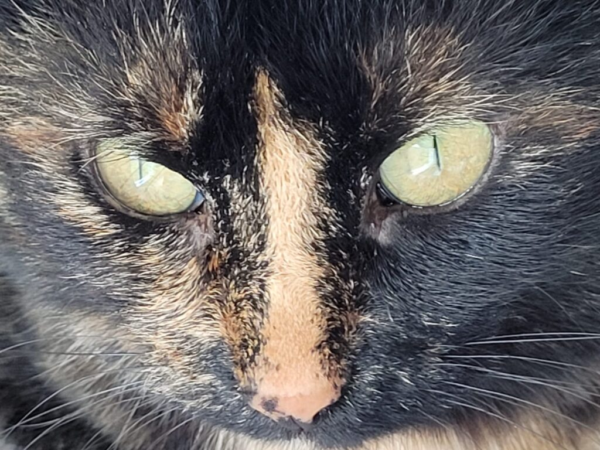

+++
date = 2022-02-19
title = "Ziua 39"
description = "Am avut bilet azi în primul rând la acest spectacol grotesc al halucinațiilor. Privirea ei m-a cutremurat! Niște ochi ca niște văgăuni spre nicăieri, tulburi, ca și cum nici nu-i folosea pentru a vedea ceva, ochi dintr-o altă lume sau ochi într-o altă lume."
authors = ["Biannca Locatelli"]
[taxonomies]
tags = []
[extra]
math = false
diagram = false
image = "images/ziua-39-final.jpg"
+++
---

Tare grea trezirea de azi. Cu chiu, cu vai, m-am pus în mișcare pe la 6 și câteva minute. Aproape că nici nu am deschis ochii până la ușă. La mama e deja lumină, fir-ar să fie, deși aseară s-a culcat după 22:00 și speranța mică din sufletul meu se ruga să se trezească mai târziu.

***

În bucătărie, fix pentru că mă grăbeam, toate îmi scăpau din mâini. Parcă n-aveam mâini, ci furci, îmi alunecau lucrurile și asta mă întârzia și mai mult.

Aseară, o durere difuză de cap mi-a tot dat târcoale dar am sperat că se rezolvă prin somn. Nope, m-am înșelat, e tot acolo, pulsează în arcada ochiului stâng. Nu-i dau atenție, că nu am timp de asta.

Spikylina are energie că ea e odihnită și aleargă ca o nebună când sus pe scări, când pe canapea, când printre picioarele mele. Mă împiedic în fâțâitul ei și mă gândesc că ar fi tare să mă întind acum pe jos cât sunt de lungă. Nu apuc să termin gândul că nebuna s-a hotărât să se avânte pe fotoliu printre picioarele mele, nepregătite pentru mișcarea asta și oricum destul de instabile la ora asta. M-am prins de un colț de canapea suficient de disperată cât să strâng cu putere orice prind, inclusiv un ghiveci care nu a înțeles că trebe să rămână ferm pe poziție ci s-a împrăștiat cu tot cu pământ pe jos, în living. Perfect! Acum m-am trezit!

  

***

Le-am lăsat împrăștiate și am urcat la mama, să nu cumva să o apuce vreo idee de coborât că la prima oră nu le pot duce pe toate.

Termin cât pot eu de repede la ele, le dau să pape, mamei îi dau și pastilele uzuale și antibioticul, timp în care nu mă gândeam decât cum Spiky împrăștie peste tot pământul căzut în living, pe canapele, pe scaune, ca să am ce face și când cobor.

Am greșit judecând-o pentru că, draga de ea, de fapt mă aștepta în fața ușii camerei mamei. Pisica asta are clar sânge de cățeluș, că mă urmează peste tot.

***

Timpul meu doar al meu a fost mai scurt azi că a trebuit să strâng și rearanjez ce am "defrișat" mai devreme dar am urmărit un documentar tare fain despre "Destinația finala: fericirea".

E o tipă în acest documentar, psiholog, care parcă-mi vorbește direct mie. Îmi spune că o abordare sănătoasă a vieții este una de tip pas cu pas, în care să savurezi cu plinătate micro-momentele bune, faine, în care să nu-ți setezi idealuri nerealiste ci mai important să-ți pui scopuri zilnice, mici, a căror îndeplinire să-ți dea aripi pentru următoarele, să ai co-experiențe (vai, ce mi-a plăcut termenul ăsta!!) adică experiențe pe care să le trăiești și împărtășești cu cel puțin încă o persoană, să fii co-creator de momente și să nu uiți niciodată cât de mult îți poți sculpta emoțiile, reacțiile, că întotdeauna alegerea e în mâna ta.

Nu știu dacă nivelul meu vibrațional de acum atrage ce văd sau aud în jurul meu, cert este că am vibrat cu fiecare celulă la tot ce a spus doamna asta faină. Îmi dau seama că adevărul meu este ascuns în carnea mea, în corpul meu, că atunci când aud unele lucruri știu instinctual că așa este.

Timpul meu curat de azi nu a fost despre frumos ci despre trăit, simțit, înțeles. Nu sunt neapărat mai bogată în perspective pentru că toate-mi sună atât de familiar și de corect, dar mai încrezătoare în capacitatea mea de a vedea lucrurile clar, în claritatea mea mentală.

Să văd limpede în aceste vremuri tulburi pe care le trăiesc este important pentru mine.

***

Deși mama a coborât fără tragere de inimă și fără poftă de mâncare, a mâncat tot la micul dejun. A refuzat ceaiul verde dar l-a acceptat pe cel de tei. Nici nu contează, important este să bea cât mai multe lichide. Este destul de lucidă astăzi, mai pune întrebări deraiate de pe șină, dar în linii mari mintea e unde trebe.

***

Azi am simțit că e weekend! Mi-a pregătit domnul meu un mic dejun DELICIOS și am stat la vorbă aproape o oră! Așa cum făceam noi în viața noastră anterioară… tare bine mi-a făcut întâi gândul lui de a-mi pregăti ceva, apoi grija cu care mi-a pregătit și apoi timpul ăsta mișto doar al nostru, doar pentru noi. Hai că se poate!

După micul dejun minunat, mi-am mai permis o aroganță: am ieșit în curte, să ud din nou. Nu m-a răbdat inima și mi-am băgat lăbuțele în pământ, am scos vreo câteva buruieni, am curățat trandafirii mei care sunt la început de drum, doamne m-aș fi întins efectiv pe pământul reavăn să stau cu ochii în cerul de-un albastru senin, presărat ici-colo cu nori pufoși! Alt moment delicios!

***

Sunt fericită!

***

Nicio minune nu durează, așa că tableta mamei iar nu mai încarcă. Iar ea nu e întreagă fără tableta ei.

În momentele în care nu joacă Mahjong, pare tare pierdută. Nici nu mai încearcă să desfacă rebus deși mie îmi spune că face. Se uită la televizor, vrea să schimbe programul, nu știe să folosească telecomanda, se prinde că nu știe, se agită și e un cerc vicios. Așa că trebe să găseasc neapărat o soluție viabilă. Domnul meu sapă după variante și sperăm să reușim într-un fel. Până atunci, am descoperit că tableta se încarcă într-o anumită poziție și mă folosesc de asta.

***

Pentru că are o stare proastă, nici nu vrea să mănânce. Trag de ea și pe la 15:30 coboară, mai mult de gura mea decât de foame. Intru din nou în starea de vorbăreață și-mi turuie gura vrute și nevrute dar reușesc să o fac să mănânce tot și să râdă, să-și ridice puțin starea de spirit. Îi promit că vin la 17:00 la table și se duce sus mult mai bine decât a coborât.

***

Nu vreau să pierd starea faină pe care am primit-o azi. Vreau să o fac elastic, să-mi ajungă cât mai mult, să lase cât mai puțin spațiu pentru stările-lipitori.

***

M-am obișnuit cu taskul "table". Încerc să văd partea plină, să văd că încă poate juca, că e un moment doar al nostru, că eu pot să o privesc pe furiș, că pot să îi mai zic, delicat, că mi-e dragă, că văd cum e.

Nu știu în ce pliu al creierului meu am încă ascunsă credința aia limitativă care-mi susură că nu poate să-ți fie numai bine, că trebe să se întâmple cevă rău dacă ți-a fost ceva atât de bine. Altfel nu-mi explic cum, taman azi din toate zilele, azi, când am fost și eu răsfățată și mi-am umplut cămăruța inimii de bine, au apărut și halucinațiile.

Jucam table cu ea și la început, am observat că repeta ce zar a dat dar muta piesele total diferit. Dădea cu zarul 6 și 4, repeta 6 și 4 și muta piesele făcând 4 și 2. O corectam la început, după care am lăsat-o să joace cum poate ea. Dar când a început să vrea să mute piese pe care numai ea le vedea din zone unde nu erau piese, mi-am dat seama că a început să halucineze.

Când joci table, ești la o distanță relativ mică de partenerul de joc, de jumătate de metru cel mult.

Am avut bilet azi în primul rând la acest spectacol grotesc al halucinațiilor.

Mă uitam la ea cum dă cu mâna să ia o piesă de unde nu era, o dată, de două ori, de trei ori, se enerva, se încrunta și când îi ziceam că piesa e mai încolo, mă privea, surprinsă că sunt acolo. Dar privirea ei m-a cutremurat! Niște ochi ca niște văgăuni spre nicăieri, tulburi, ca și cum nici nu-i folosea pentru a vedea ceva, ochi dintr-o altă lume sau ochi într-o altă lume.

Oribil! Nu am cuvinte să cuprind și nici nu vreau să găsesc cuvinte să cuprind. "Oribil" sintetizează tot momentul.

Îmi doresc din toată inima să nu mai trăiesc acest moment vreodată în viața mea. Ceea ce este foarte posibil pentru că "o dată e prima dată", după care viața mă va face să mă adaptez.

Am făcut o pauză să îi aduc antibioticul, timp în care i-am vorbit non stop. Nu știu care a fost butonul care a oprit halucinația dar a dispărut așa cum a apărut.

Am terminat jocul de table, i-am făcut baie, am bibilit-o, i-am dat tableta încărcată și am coborât așteptând să treacă 2 ore să pot să-i dau probioticul.

***

Orice fac, sunt aproape constant cu un ochi pe cameră. Așa am văzut-o că lasă tableta brusc și se apucă să caute ceva în portofel. Și caută, scoate tot ce are în portofel, se uită în carnețelul ei, ia tableta din nou, se uită la ea dar nu face nicio mișcare și-mi dau seama că are o dilemă așa că urc.

Da, are 2 dileme: vrea să schimbe televizorul pe muzică și nu știe cum și nu mai găsește pe tabletă "jocul ăla pe care îl joc". A apăsat din greșeală aiurea și a intrat pe google maps.

Îi rezolv ambele situații, se bucură că are pe cineva care să o bibilească așa tocmai când are nevoie și eu îi mulțumesc în gând domnului meu care mi-a montat camera de supraveghere.

***

Chiar dacă sunt tare obosită azi, iar spre seară mi s-a zbuciumat și sufletul, sunt recunoscătoare din toată inima:
1. Domnului meu care a făcut ziua asta să-mi fie de weekend!
2. Pământului!
3. Tehnologiei!

 

 

  

    <a href="/blog/ziua-38/">Postarea anterioară</a>
  

  

    <a href="/blog/ziua-40/">Postarea următoare</a>
  

