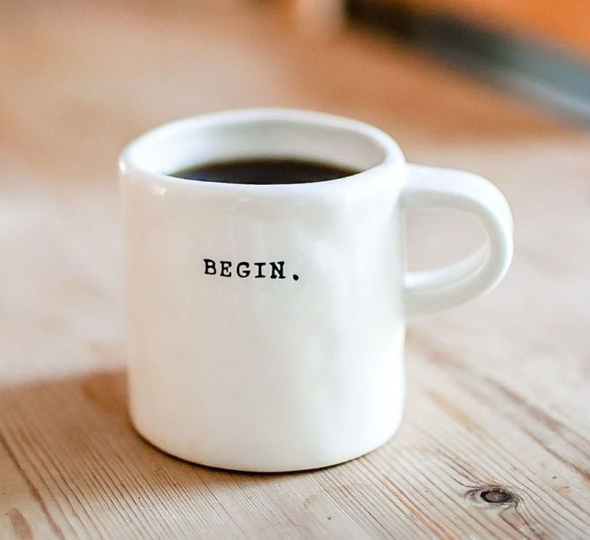

  date = 2022-01-15
    title = "Ziua 4"
    description = "Caut în sertarul cu motivație ceva care să mă țină pe linia de plutire: azi n-am plâns deloc. Și n-aș vrea să o fac. **Fericirea e o deprindere** și încerc să găsesc conotații mari pentru lucrurile mici din fiecare zi a mea din noua viață, ca să mă ridic. "
    authors = ["Biannca Locatelli"]
    [taxonomies]
    tags = []
    [extra]
    math = false
    diagram = false
    image = "images/Ziua-4-final.jpg"
    +++
---

Ieri mă plângeam că sunt obosită? Au lătrat cățelele vecinului aproape toată noaptea astfel că de dimineață eram franjuri. Plus că toată noaptea m-am conversat cu vecinul, în gând, numai de bine...

***

Ritualul obișnuit, chiar monoton cu excepția că astăzi a trebuit să mă mișc cu sonorul la minim pentru că a mea copilă dormea în living. Am auzit o dată un banc care se potrivește mănușă situației mele de acum: Ițic se plângea rabinului că nu are o casă încăpătoare, că de abia se descurcă el și cu nevasta și cu cei doi copii. Rabinul îl sfătuiește să îi cheme și pe părinții lui să locuiască cu el. După o săptămână, se întâlnesc și Ițic se plânge și mai tare de înghesuială. Rabinul îl sfătuiește să îi cheme și pe părinții nevestei să locuiască cu ei. După vreo 2 săptămâni, se întâlnesc iar Ițic era de-a dreptul disperat. Rabinul îi zice: acum du-te acasă și trimite-i și pe ai tăi și pe ai ei la ei acasă și vino să-mi spui cum e. Și vine Ițic fericit că “Rabine, cât spațiu s-a făcut în casa mea!!”.

Așa și eu, după ce că de abia respir prin câte sunt de făcut, mai trebe să le fac și în liniște ca să nu deranjez. Dar și când or pleca “și ai ei și ai tăi” cât spațiu se va face!!! Să mă țină puterile până atunci...

***

Micul dejun nu în bucătărie, ci i l-am dus mamei în cameră, ca să nu-mi trezesc copila și bulldoaga care dormea cu ea. Plus că și domnul meu dormea, așa că cel mai simplu era să îi duc eu la pat. Am surprins-o cu o cafeluță mică și diluată și s-a bucurat sincer, ca un copil.

***

Apoi am așteptat să se trezească lumea de prin casă, ca să mă pot apuca de aspirat. Și cât am așteptat, m-am refugiat în plăcerea mea vinovată design interior + diy pe instagram și pinterest. Că e sâmbătă și merit și eu un mic răsfăț. Ei bine, în acest răsfăț, mi-au căzut ochii pe o cană cu un mesaj sublim “begin”. Mi-a plăcut la nebunie. Începe. Orice. Cât de mic. Orice călătorie în orice direcție începe cu primul pas. Dacă atunci, când suntem nervoși sau triști sau supărați, primul pas pornește din impulsivitate, nu mai bine tragi aer în piept, te uiți nițel în jur și faci primul pas conștient? Începe cu mintea limpede. Și dacă pornești la drum din energie curată, de început primenit, Universul ți se alătură și el cu același tip de energie pentru parcurs. Hahaha, ce bine stau la teorie! Practica însă mă doboară!

  

***

Zi cu soare, zi cu dor de ducă. Trebe să recunosc că lipsa mișcării mă irită și mă întristează. În afară de fuga la Lidl și la farmacie, nu mă pot duce nicăieri. Îmi lipsesc plimbările lungi cu domnul meu. Tare mult.

Așa că azi am îmbrăcat-o bine pe coana mare și am ieșit la plimbare. Cu pampersul pus. Pentru că de 2 zile a reînceput să bea apă. De când o știu, mama bea cel puțin 2 litri de apă zilnic. De când am adus-o la mine, de abia dacă bea 500 ml pe zi, așa că am combinat tablele cu apa: după fiecare linie jucată, trebe să bea apă ca să jucăm mai departe. Cum spuneam, mama mi-a devenit copil. Dar pare că am aprins un beculeț în mintea ei, a reînceput să bea apă și rinichii ei dau semne de revigorare.

Plimbarea a obosit-o, dar a fost tare fericită că am ieșit. That makes 2 of us. Deși nu ne-am plimbat mult, mișcarea i-a făcut foarte bine. Și i-a făcut și poftă de mâncare așa că la prânz a păpat tot. Plus că mi-a “furat” într-o clipă de neatenție ditamai bucata de bougatsa. Lipsurile din viața ei au amprentat-o iremediabil. Indiferent cât îi spun că avem, că nu e stres și panică, copila din ea și, mai apoi, adulta, nu mă crede și strânge ca hârciogul. Când urcă la ea, după prânz, întotdeauna vrea să ia cu ea sus ceva: fie un fruct, fie ceva dulce, orice, numai să fie ceva...

***

Domnul meu a plecat la cealaltă casă, după copilă, să ajute la instalarea ei și a iubitului ei acolo. M-am uitat cu jind după fiecare din ei cum pleacă și tare mi-aș fi dorit să merg și eu. Dar acum nu se poate așa că mi-am luat aroganța de a sta în pat, să-mi odihnesc și ochii și corpul. Degeaba, nu pot. Hai să bag un documentar, poate mă îmbie la o visare. Nu pot nici asta, că trebe să fiu atentă totuși și la camera de supraveghere. În principiu, mama e cuminte dar, cum a tot căzut în cameră sau în baie, nu vreau să am surprize. Caut în sertarul cu motivație ceva care să mă țină pe linia de plutire: azi n-am plâns deloc. Și n-aș vrea să o fac. **Fericirea e o deprindere** și încerc să găsesc conotații mari pentru lucrurile mici din fiecare zi a mea din noua viață, ca să mă ridic. Nu vreau să forțez nimic, nu vreau să mă prefac că, vai, ce bine e, dacă nu mi-e, dar nici nu vreau nici să zic că e rău, dacă găsesc o nuanță pozitivă pe vreundeva.

***

După amiaza e rândul tablelor. Sper să nu mă înghită monotonia asta de tot! Avem un ritual întreg: așez masa, aduc veioza, pun sticlele de apă (a ei și a mea), scot carnețelul de notat și pun TV pe un canal de muzică.

Azi mă uitam la ea din nou cum se mișcă pe ritmul muzicii și mi-a zburat mintea în trecut.

În 2015, de ziua mea, am primit rezultatul biopsiei mamei: neoplasm stânga sau, pe românește, cancer la sânul stâng. După încă 2 săptămâni a venit și a doua lovitură, că poate nu ne-a pus în genunchi prima: avea și cancer la plămânul stâng. Din fericire, dacă pot să spun așa, ambele cancere au fost primare, deci nu unul metastaza celuilalt, astfel că mama a avut o șansă. A început chimioterapia, 8 ședințe, și radioterapia, 25 ședințe. Din femeia care era, nu mai rămăseseră decât aproape 40 de kg… evident că în toată perioada asta a stat la mine și evident că am dus-o peste tot unde puteam să o duc. Însă sufletește nu am fost aproape de ea. Nu am știut să mă port altfel cu ea, de parcă era ea vinovată că avea cancer. Orele târzii la care mergeam la radioterapie (uneori și la 11 noaptea), faptul că asistam la ororile cancerului pe holurile spitalelor, m-au întors împotriva ei.

Îmi aduc aminte că am vrut să îi fac baie în cadă și nu mai avea putere să ridice picioarele ca să se bage în cadă. A trebuit să o iau în brațe ca să o pun în cadă și atunci mi-am dat seama cât de slabă era, ca un fulg. A fost un moment pe care nu o să îl uit toată viața mea pentru că mama, deși trecea prin ce trecea cu chimio și radioterapia, deși nu o sprijineam emoțional, mama își dorea să trăiască și ca să facă asta, a folosit tactica pe care o aplicase și violului: se făcea că nu vede. Ea își croia scenariul care o ajuta pe ea să meargă mai departe, chiar dacă scenariul ăsta nu avea corespondent în realitate. În realitatea mea, cel puțin. Ei bine, mama, în timp ce o puneam cu mare grijă în apa caldă din cadă, draga de ea îmi spunea bancuri!!! Ea, care nu cântărea mai mult decât un sac de cartofi, care trecea prin dureri mari, care nu mai avea nici păr și nici unghii și nici dinți, îmi spunea bancuri stând în cadă. Acum știu, și poate că atunci am întrezărit, de ce am ales această femeie, puternică, să-mi fie mamă: avea să mă învețe, într-un fel aparte, unic, ce înseamnă să vrei să trăiești! Iar azi mă uit la ea și mă învață exact același lucru: nu contează că e ceață în mintea ta, că te dor oasele și tot corpul de bătrânețe, viața merită trăită all the way!

***

Și eu mă plâng atâta că una, că alta… oare cam câte exemple d-astea mai am nevoie ca să înțeleg o dată?! Oare dacă aș înțelege lecția pe care mi-o predă de atâta vreme, mama ar considera că și-a terminat rolul și ar pleca? Perspectiva asta nu-mi surâde. Că parcă n-aș vrea să plece, dar parcă aș vrea să înțeleg…

S-a făcut noapte și eu nu m-am conversat pe bune cu vecinul.

***

Dar azi am fost recunoscătoare pentru:
1. Smothieul de dimineață!
2. Răsăritul de soare!
3. Bucuria mamei că e răsfățată!
