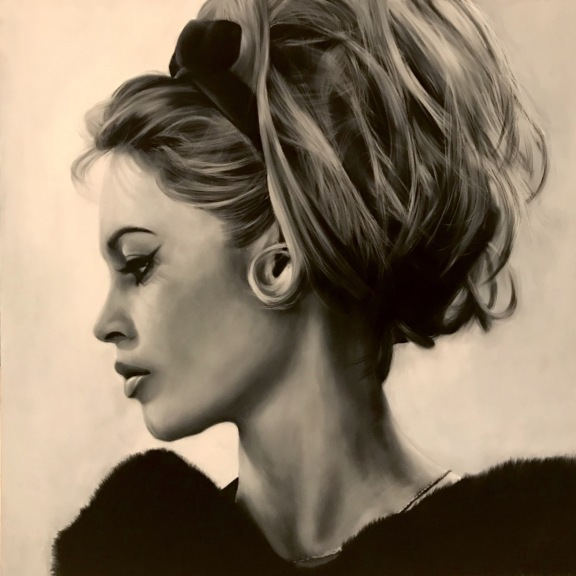
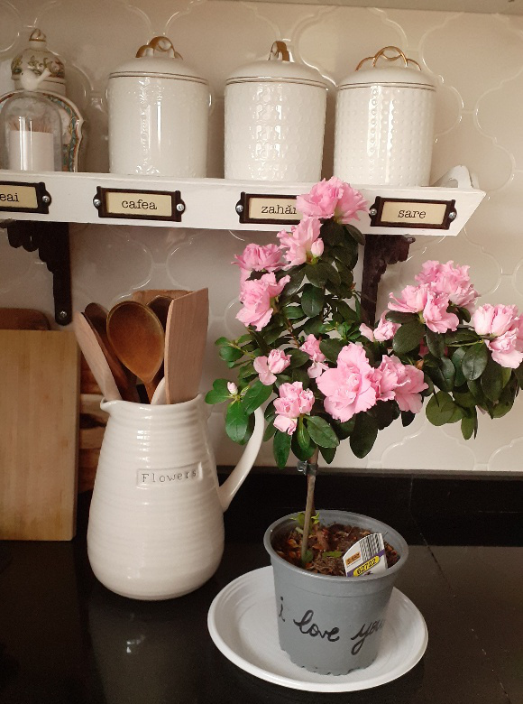

+++
date = 2022-02-20
title = "Ziua 40"
description = "Cât de paradoxală sunt! Păi mă plâng că nu-mi multumește și când o face, eu nu sunt în stare să primesc: Dar nu ai pentru ce!, Pentru nimic! Îmi neg orice primire. Iar Universul ăsta ce să mai înțeleagă?! Păi dacă nu vrei, nu-ți mai dăm! Până ajung la parter, îmi promit solemn că o să fiu atentă și la pornirea de a zice și la vocabular. Dacă nu reușesc s-o stăvilesc pe prima, măcar s-o corectez pe-a doua."
authors = ["Biannca Locatelli"]
[taxonomies]
tags = []
[extra]
math = false
diagram = false
image = "images/ziua-40-final.jpg"
+++
---

Alarma mea interioară se pare că s-a setat singură la 5:36. Ora asta e din ce în ce mai des în trezirile mele. Nici azi nu scap de alb-negrul din ochi dar mi-am pus intenția să am o zi colorată. Pornesc în zi cu o liniște nouă în suflet.

Am un gând șugubăț când mi-aduc aminte că azi e zi de weekend: că ar fi mișto să-mi croiesc fiecare zi ca una de weekend. De fapt, să vreau să fac asta. Să aleg asta zi de zi.

***

Robotesc și pregătesc smoothieurile, ceaiul, îmi drăgălesc șturlubatica de pisică, îi dau să pape și pornesc către mama echipată cu tot ce trebuie. Dar mai ales, cu prietena mea nouă, liniștea asta blândă. Parcă nu mă mai duc resemnată.

***

Ritualul de la mama îl fac pe repede înainte dar cu vorba bună pe buze, atât pentru ea cât și pentru sora mea îmblănită, Sassy.

***

Nu a ieșit soarele așa că degeaba mi-am tot agățat ochii de orizonturi. Nu-i bai. O să-mi aduc soarele în casă prin focul de la șemineu. Să privești flăcările e atât de curățător de suflet și de gânduri. Parcă mistuie ele tot zumzetul ăla din mansarda ta, parcă transformă printr-o ardere tot zbuciumul interior și nu rămâne decât un strop de cenușă ușoară ca fulgul.

Afară a început să și plouă, îmi place tare mult atmosfera din aer, de afară, din casă, din mine. Parcă încep să mă primenesc și eu.

***

Astăzi am călătorit în Japonia. Îmi plac tare mult jurnalele de călătorie filmate și documentate de diverși iar azi m-am îmbarcat spre Japonia.

Eu nu am mare chimie cu asiaticii, sunt extrem de atrasă, într-o proporție aproape egală, de Italia, Franța și Anglia.

Dar de ceva timp observ cum inima începe să bată mai repede dacă aude o muzică indiană de meditație (asta mi se trage de la profa diafană de la primul meu curs de spiritualitate, o ființă minunată), cum mă opresc din ce fac și absorb cu aviditate informații despre Tibet, despre Vietnam, despre chinezi, japonezi.

Încep să mă multiculturalizez și mă bucură nespus pentru că e atât de mult de învățat și absorbit din toată planeta asta imensă într-o viață atât de scurtă încât regret că mi s-au deschis ochii atât de târziu. Am trăit mai mult de jumătate din viață cu ochii doar în pătrățelul meu, doar la mine și ai mei, doar în ograda mea. Și e atât de mult și sunt atâtea de văzut și de făcut!

Mi-a mers la casa sufletului documentarul. Am văzut că japonezii sunt foarte frumoși fizic, că au o tinerețe și o prospețime care nu ține de vârstă, am văzut creativitate la superlativ, m-au uimit convingerile lor despre viață atât de diferite de ale noastre, efectiv m-am lăsat cuprinsă și am cuprins cât de mult am putut.

  

Kinosho Kikaku - desen în cretă!

  

Hirotoshi Ito - sculptură în piatră!

***

Mic dejun bun, cu multă vorbă, cu multe povestiri, mamei îi place că are cu cine conversa deși sunt multe dăți în care nu găsește cuvântul sau cuvintele dar ne înțelegem.

Aseară i-am făcut baie și pe păr iar azi i s-a așezat așa de frumos. Îi spun asta, nu mă crede, o fac să se uite în oglindă, îi repet că e frumușică foc, o văd cât de mult îi place să audă complimentul și până la urmă concluzionează și ea că da, parcă îi stă bine.

Doamne, cât de mult contează pentru noi carcasa asta de carne!

***

A urcat mama, a venit domnul meu la mic dejun, pentru că el, din delicatețe, a înțeles că ea se simte mai în largul ei doar cu mine la masă.

Surprinzător, pentru că domnul meu în genere nu este foarte volubil la prima oră, azi am sporovăit din nou. Timpul meu cu domnul meu are încărcat în el un cod de mare taină, pe care sufletul meu îl descifrează și eliberează și-mi umple mereu inima de bun. Probabil d-aia mi-a fost atât de greu la început, când pe lângă noutatea demenței, mi-a fugit brusc din prezent timpul cu omul iubit.

Mă gândeam ieri că începem ne regăsim drumul unul către altul dar de fapt nu e așa: ne creștem un drum nou, are încă aripi mici dar ne-am pus amândoi voința și dorința să-l facem mare, să ne ducă până la sfârșit, așa cum ne-am promis cândva.

***

La prânz, suprapusă cu masa mamei, a fost o vizită a copiilor. Scurtă, cu măști, dar ce mă bucur când îi văd! Când puiuca mea e la mine, mă întregesc. Mi se gogoșește sufletul. Și ca să-l dea pe dinafară, azi mi-a adus o floare în ghiveci, că știe că nu-mi plac florile tăiate. Demență beat this!

  

***

Intervalul meu zilnic în care nu pot fi deranjată mai deloc este cel al tablelor. Între 17:00 și 19:00-19:30 eu sunt stoică cu tablele, indiferent de furtună sau soare de plajă, vorba vine. Azi totul a fost ok, semn că halucinațiile astea poate nu ne-or vizita zilnic. Un lucru însă e neschimbat: dacă nu câștigă, mama e capabilă să joace o noapte întreagă până reușește. M-am prins de asta așa că trișez: îi trec linii chiar dacă nu le-a câștigat, câteodată îi trec o partidă întreagă, numai să vadă ea acolo, în dreptul lui “Lia”, partida.

***

De ieri am început să îi tratez unghiile de la picioare cu ulei de arbore de ceai. Am reluat procedeul și-mi spune că azi nu a durut-o deloc degetul de care se plângea. Bun!

Terminăm treaba, îi aduc tableta încărcată și o anunț că revin la ea la 21:00 să îi dau probioticul. Moment în care îmi spune “nu știu ce m-aș fi făcut fără tine!”. Wow! De când aștept eu aprecierea asta! Categoric, azi e ziua în care mi se umflă inima! Dar mă surprind că deschid gura și zic “ei, hai, te-ai fi descurcat, normal!”

În timp ce coboram pe scări, mi-am dat seama ce am zis.

Cât de paradoxală sunt! Păi mă plâng că nu-mi multumește și când o face, eu nu sunt în stare să primesc! Și doar și capitolul ăsta l-am avut la cursul ce mi-a schimbat traiectoria. Uite că mai scoate balaurul capul și mă prind că atât de mult am în vocabular “Dar nu ai pentru ce!”, “Pentru nimic!”, “Chiar nu te-am ajutat cu mare lucru!”, “Lasă că nu e cine știe ce!” încât prin articularea lor, îmi neg orice primire. Iar Universul ăsta ce să mai înțeleagă?! Păi dacă nu vrei, nu-ți mai dăm! Până ajung la parter, îmi promit solemn că o să fiu atentă și la pornirea de a zice și la vocabular. Dacă nu reușesc s-o stăvilesc pe prima, măcar s-o corectez pe-a doua.

***

Mai răspund la câteva mesaje, la 2 telefoane, gata și cu probioticul, aproape că se termină ziua și pentru mine dar mi-e inimă plină de recunoștință pentru:
1. Călătoriile virtuale!
2. Iubirea pentru domnul meu și iubirea domnului meu!
3. Ființa asta faină care a devenit puiul meu!
