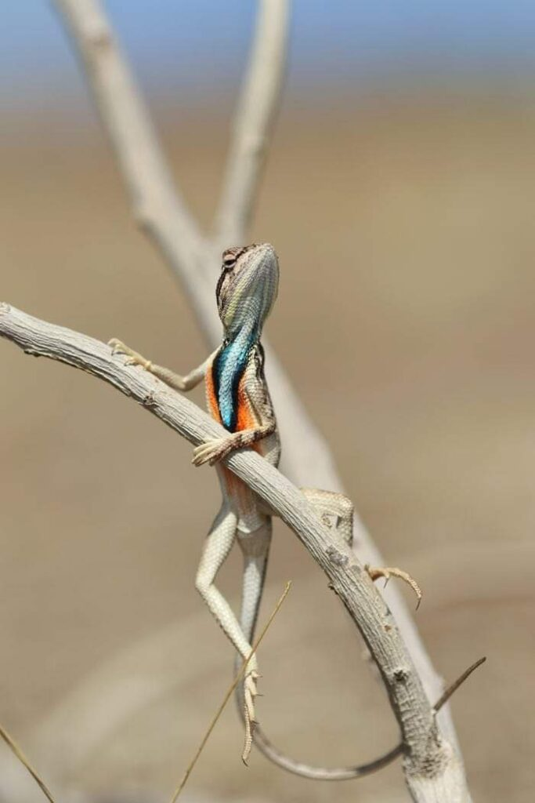

+++
date = 2022-02-22
title = "Ziua 42"
description = "Cu fiecare nouă zi, descopăr noi valențe la lumea din jur, sunt mai incluzivă, parcă pică precum foile de ceapă lentilele alea întinate de limitare prin care nu vedeam decât frânturi din acest mare recital și tablou care e planeta asta, cu lumea care o populează. O mai mare claritate, mai cuprinzătoare, mă animă cu fiecare zi pe care o trăiesc prezentă."
authors = ["Biannca Locatelli"]
[taxonomies]
tags = []
[extra]
math = false
diagram = false
image = "images/ziua-42-final.jpg"
+++
---

Cred că aseară am adormit în timp ce încă vorbeam cu domnul meu. A fost o noapte “one shot” cum o numesc eu, una în care nu am vise sau nu-mi amintesc visele pentru că e extrem de condensată, pare că am închis o clipă ochii să mi-i odihnesc și aia a fost!

M-am trezit cu aceeași durere de cap, deja sunt în a patra zi, ceea ce-mi spune clar că am intrat în criza biliară. Probabil pe fondul oboselii dar știu că am “ajutat” și eu când am băgat sub mustăți niște foietaj făcut în casă acum 2 zile. Pofta, bat-o vina!

Mă doare din umăr și mâna dreaptă și încep să simt zilnic durerea asta. E ca și cum aș sta cu mâna în sus tot timpul. Îmi promit că o să încep mișcările recomandate de iubitul copilei mele.

Toate astea la un loc, nu mi-au dat un start strălucit azi. M-am adunat totuși și am pus în mișcare imensul angrenaj care e corpul, puțin trecut peste ora 5. Dimineața.

***

Mi se termină rezervele de fructe din congelator.

Ca o furnică, am congelat cantități serioase de fructe, anul trecut.

Am cumpărat lădițe de afine de la o cultură din Dâmbovița, am avut mure din producție proprie și am mai cumpărat și de la o fermă de mure din Afumați, am avut zmeură de la țară, vișine din singurul meu vișin care a crescut de capul lui și a fost plin anul trecut, am descoperit în zonă niște oameni faini care produc căpșuni bio imenși și suculenți și aromați, o minune!

Dar, deși am un congelator cu 7 sertare, nu l-am umplut pentru că mi-am calculat matematic să îmi ajungă până când ar fi momentul apariției din nou a fructelor pe piață. Nu m-am gândit că vom fi două care ne înfruptăm din minunile naturii, în fiecare dimineață. Anul ăsta o să pun îndeajuns. Iar afine voi lua de pădure de data asta, nu de cultură.

Poate îl cooptăm și pe domnul meu în treaba asta cu smoothieul.

Mi-am agățat în lista mea de to do-uri azi, să calculez câte kg am nevoie de fiecare în parte, că zboară timpul ăsta ca nebunul și e bine să am informația la îndemână. Plus să caut o variantă plastic free pentru congelare. Să pun câte 100 de grame din fiecare în punguță de plastic sigilabilă de la Ikea mi se pare o mare de plastic. Să vedem ce alternative oferă internetul ăsta mare.

***

Deși mintea e deja hiperactivă, fuge gândul ăsta când în trecut, în amintiri, când în viitor, în listă de to do-uri, sunt destul de netrezită. Atât de buimacă încât la mama calc într-o mizerie și o întind peste tot… câteodată, deși mă lovesc zilnic, mi-e greu să duc. Mi se întoarce și mie stomacul. Dar n-am ce face, azi am greșit și eu, mă apuc să strâng, să pun la spălat, să aerisesc, spăl, curăț și las totul regulamentar.

În timpul meu magic, aflu că azi e o zi magică! 22.02.2022. Nu a început promițător dar ține de mine să-mi aliniez alegerile cu magia pe care Universul mi-o împrăștie prin văzduh.

Și încep.

***

Prima alegere a fost un documentar despre Austria habsburgilor, cu palate, cu istorie, cu sculpturi baroce și rococo, cu picturi cât peretele și tapiserii imense. Până acum, nu am acordat atenție tablourilor sau tapiseriilor. Azi, văzându-le, am simțit că, cu fiecare nouă zi, descopăr noi valențe la lumea din jur, sunt mai incluzivă, parcă pică precum foile de ceapă lentilele alea întinate de limitare prin care nu vedeam decât frânturi din acest mare recital și tablou care e planeta asta, cu lumea care o populează. O mai mare claritate, mai cuprinzătoare, mă animă cu fiecare zi pe care o trăiesc prezentă.

Apoi, în timpul micului dejun cu mama, am făcut a doua alegere conștientă.

M-am lăsat purtată pe brațele cuvintelor mamei care depăna amintiri din viața ei trăită la țară și am fost o adiere de vânt în pădurile pe care le evoca ea, am fost firicel de țărână din curtea bunicilor ei, am fost umbra sub care stătea să se odihnească atunci când era prea muncită, azi nu am dat acces, în visarea mea, decât senzațiilor de fulg, de ușor, de bun.

Și pentru prima dată de când îmi tot povestește aceleași lucruri, m-am simțit bine! Am intrat cu ea în timpul ei și a fost tare plăcut. Ce mi s-a părut interesant este că toată visarea asta a mea a avut o perspectivă vizuală de jos în sus. Adică tot ce am simțit a fost ca și cum eram un copiluț care privește în sus, de la înălțimea unui copiluț. Mie mi-a plăcut întotdeauna perspectiva asta de a privi. Probabil de aceea îmi și plac camerele cu tavane înalte. Poate așa se și explică, într-un mod subtil, cum de fiecare dată i-am plasat pe ceilalți mai presus de mine. Domnul meu e fix opusul: lui îi place să privească de sus în jos. Câteodată, așa face și în atitudine dar e parte din șarmul lui.

  

***

Trebe să mă apuc de gătit pentru prânz. O duc pe mama sus, după micul dejun, mă schimb și eu de pijamale și apuc să mă spăl pe față. Am pus un strop de magie în apa caldă strânsă în căușul palmelor și am spălat capul dureros. N-a putut durerea de cap să înăbușe senzația de catifea a apei călduțe! Altă alegere conștientă.

***

Ori mi-am pierdut eu dexteritatea, ori sunt tare obosită dar parcă nu se mai termina gătitul azi. Durerea asta îmi strânge capul ca într-o menghină, îmi vine și să vomit. E criza biliară și știu cum trece: prin mult somn și odihnă în pat. O să experimentez, pentru prima oară în viața mea, o criză biliară dusă pe picioare.

Pentru că ciorba de ieri era acră, azi i-am făcut mamei o supă de pui cu găluște, grătar din piept de pui și cartofi, morcov și păstârnac la aburi, cu un strop de lămâie și ulei de măsline deasupra. Am tras și o mâncărică de mazăre și o salată vegană cu năut.

***

Socoteala de acasă nu se potrivește cu cea din târg. Speranța mea era ca mama să mănânce de prânz și apoi să mă întind puțin în pat pentru că mi-e rău tare. Uite că fix azi nu îi e foame, tableta i-a dus-o Mr. H la reparat, n-are ce face, când doarme, când caută prin sertare, când prin geantă cât să nu pot să stau liniștită, să-mi potolesc senzația asta de vomă și durerea de cap.

Cum stăteam eu răbunită pe-o parte pe colțarul din living, cu un prosopel udat în apă fierbinte pus pe frunte și cu un ochi pe cameră și unul la tv, m-a cuprins, la propriu, o recunoștință ca o căldură care s-a răspândit prin toate cotloanele mele și mi s-au umplut ochii de lacrimi. Lacrimi bune, de bine, de bucuria vieții ăsteia plină de lucruri super interesante. Nu e meritul meu, pur și simplu m-a invadat de nicăieri această stare minunată dar pentru câteva clipe, am fost deasupra acestei crize biliare.

***

Pentru că azi am sărit tablele, a înțeles și ea că nu pot sta decât în poziție orizontală momentan, am picotit în living. Deși corpul mi-era dureros, starea mea de spirit era sus. Pesemne că magia zilei mi s-a infiltrat totuși în interior.

Am ales conștient să-mi suspend lista de to do-uri că mai sunt zile în calendar. Am savurat și absorbit tot ce am văzut la tv, am făcut introspecții de care nu am mai avut timp să fac, am văzut la mine că practic din ce în ce mai des perspectiva “fiecare e unic”.

Înainte, când bubele de “nu sunt suficientă”, “nu sunt destul de bună”, “nu mă încadrez”, “sunt vai de capul meu!” supurau în mine dar mențineam mediul toxic care le hrănea necontenit, de câte ori vedeam pe cineva bun sau foarte bun la ce face, primul gând era unul de invidie, urmat aproape întotdeauna de unul de critică și finalizat înăuntrul meu cu “eu nu sunt în stare”. Nu puteam doar să accept că dacă persoana respectivă e bună la ceva nu trebe ca și eu să fiu bună sau foarte bună fix la acel ceva. Pentru că nu acceptam asta, îi căutam bube ca să-l cobor de pe piedestalul unde tot eu îl urcasem. Și după aia, mai tot timpul, invariabil, mă întristam că nu sunt și eu ca acea persoană.

În ultima vreme exersez, și-mi iese dar nu mereu, să accept că fiecare are harul lui, drumul lui, experiențele lui care-l sculptează diferit, mediul în care se dezvoltă, într-un cuvânt viața lui și că nu trebe să mă compar cu nimeni. Nu trebe să fiu bună la toate. Nici nu aș putea fi vreodată. Nimeni nu ar putea. La ce bun să-mi pun un post-it pe frunte cu “nu sunt în stare” când am multe altele lipite peste tot cu “sunt bună” la asta, sau la asta sau la asta. Nici măcar nu trebe să fie ceva supermegacalifragilistic. Pot să fiu bună la a asculta. Doamne, cât de important e să știi să asculți, fără să întrerupi, fără să știi tu mai bine, fără să dai sfaturi, doar să asculți, să lași experiența celui care o povestește să te trăiască și pe tine o dată cu el!

Mi-a făcut bine acest stat în mine cu mine. Chiar dacă nu a fost mult, chiar dacă senzația aia de mentol s-a întors și mi s-a înfipt în capul pieptului, ziua asta magică de azi nu s-a dezis.

***

“Happiness is so amazing. It doesn’t matters if it’s yours or not. A society grows great when old men plant trees the shade of which they know they’ll never sit in!”

Mai avem de curățat ceva generații până vom ajunge la acest altruism ingenuu. Dar trebe să începem de undeva, să facem cât putem în pătrățelul nostru pentru că dacă așteptăm să facă alții, guess what? poate și alții așteaptă la fel.

***

Fără tabletă, fără table, mama a picotit toată ziua. I-am dat totuși sucul și pastilele și am stat puțin cu ea. În timpul ăla puțin a reușit să strecoare în 2 minute aceeași frază de 4 ori. Draga mea dragă!

***

Cu tot răul care m-a răscolit astăzi, ziua chiar a fost magică și mi-a plăcut mult. Și m-a învățat ceva interesant: că pot să fiu recunoscătoare chiar și în cele mai negre momente iar clipa aia e atât de plină de divin că nu mai e loc în ea pentru durerea asta fizică, trivială!

Sunt recunoscătoare pentru:
1. recunoștința caldă care mă vizitează impinsă de niște resorturi pe care numai ea le știe!
2. magie!
3. faptul că suntem cu toți în viață! Mi-am privit iubitul pe ascuns și doamne, cât mă bucur că există, că e în viață, că e în viața mea și că ne e un bine nou!
