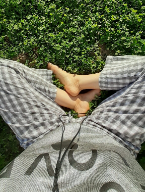

C-am visat urât, e tot ce mi-amintesc dar știu că m-am trezit într-o mare albă și ninsă. Nopțile în care ninge sunt atât de liniștite de parcă nicio vietate nu se încumetă să deranjeze pătura asta faină care se așterne peste mama pământ.

Robotic, am făcut ce era de făcut nerăbdătoare să stau cu ochii afară, să absorb cu nesaț albul și frigul, să văd cum pâlpâie zorii și iese mărețul galben.

***

Am primenit-o pe mama și pe miorlăitele dimineții, Sassy și Spiky, și mi-am oprit acțiunile în living, lipită de geam. Și-n liniștea asta a zăpezii, s-a deschis un sertar din mine care mi-a scos la vedere sinteticul fabricat de minte versus realitatea colapsată în fizic. Mintea mea deja adunase nori grei asupra dimineții dar realitatea era imaculată. Nicicând nu am văzut mai clar diferența enormă între ceea ce gândești și ceea ce este. Nicicând nu am simțit mai acut cum te poate îngreuna un gând imaginar deși viața ta se întinde cu ușurință înainte. Aici și Acum.

Aseară, înainte să apuc să ies pe ușă de la mama, începuseră știrile cu războiul în prim plan. Cu morți, cu răniți, cu disperare.

Chiar dacă nu vreau să mă adun și eu lângă milioanele de oameni îngreunați de acest război, și pe mine mă atinge, că-s și eu om. Acum câteva zile, am făcut alegerea să nu mă mai tulbure războiul. Azi dimineață, uitându-mă pe geam, mi-a fugit mintea la știrea care mă impresionase aseară, în care o mamă ce își pierduse puiul, întreba retoric, de ce?

Nu întotdeauna mentalul dă egal cu emoționalul. Nimic nu e întâmplător, în mine știu că fiecare are fitilul lui pe această planetă dar azi mi-a fost clar că suferind, îngrijorându-mă, plângând, blestemând, urând, nu schimb cu nimic situația faptică a războiului ci doar îmi stric mie prezentul. Oricât de cinic ar suna, războiul nu e la mine în curte, la propriu, (încă) pot face ce îmi doresc să fac, în limitele impuse de demența mamei bineînțeles, sunt cu gândul bun și cu energia sus pentru toți oamenii în suferință, încerc să țin un spațiu calm și cald pentru tot ce se întâmplă în zonele de război, nu unul de răzbunare și nu mă simt vinovată pentru asta.

Am simțit la propriu cum, doar gândul la mama care-și plângea copiluțul mă apăsa pe umeri și apoi reversul, când m-am eliberat de strânsoarea emoției, cum parcă m-am înălțat, ca roțile unei mașini din care se scoate o mare greutate. Nu ajut pe nimeni dacă îmi stric momentul de calm și de alb. Nu ajut pe nimeni dacă trăiesc drama mamei respective. Dar mă pot ajuta pe mine, să nu mă scald în suferință care nu e a mea și pot ajuta colectiv dacă aleg să am o stare de iubire universală.

Mă rog să ne fie bine tuturor dar aleg să nu mă tulbur.

***

Mama aștepta să mă duc să o iau la masă, ceea ce-mi confirmă că la ea nu mai funcționează butonul de foame. Vrea omletă, deși e prăjeală, nu o refuz pentru că e rar când vrea ea ceva anume și articulează asta și apoi, cred că în 3 luni, e a doua omletă. De abia ung tigaia cu ulei așa că what the heck, viața e scurtă! E bine, îi spun că trebe să mă duc la cumpărături la Lidl, la ea în minte se aprinde beculețul foietajelor, eu am o stare bună, sunt o țâră înaripată azi.

***

Pe drum, mi-am adus aminte de o meditație pe care am făcut-o anul trecut în curte, direct pe pământ și trifoi.

  

Am trăit toamna trecută o nebunie de viață. Mișto tare! Aveam niște intensități în suflet încât credeam că o să explodez în toate colțurile și o să împrăștii în toate zările sclipiciul care mă umpluse. Acum știu că a fost momentul pregătitor pentru ce urma să vină. Nu mă gândeam atunci că o să mă duc atât de antitetic în intensități adânci dar acum știu că în mine este și “binele” și “răul”, și alegerea și plângerea, și susul și josul. Și mai știu acum, până la sânge, că viața asta nu îți e dată să o suferi ci să o expandezi, nu să te faci mică și să stai să treacă ci să te faci mare, să o trăiești intens cu tot ce vine, nu să o plângi sau să te plângi ci să râzi și să împarți bucurie. Așa am azi o pornire de bine în toate fibrele mele încât am cântat și la dus și la întors, în mașină, fără radio, just me, myself and I!

***

Mama o iubește pe Sassy. E foarte posibil ca pe mine să mă uite înainte de a o uita pe ea. Și totuși azi, verificând pe cameră, am văzut-o cum i-a tras atât de rapid pilota de sus burtică că s-a rostogolit biata pisica brutal și a căzut buimacă din pat. Habar n-avea ce a lovit-o…

Acum câteva zile am schimbat lenjeria de pe patul mamei. Ieri am observat că era pătată cu stropi mari de nu știu ce (cafea sau ceai). I-am arătat și a zis că nu știe, că așa i-am pus lenjeria. M-am iritat pe moment pentru că aici intră în ciocnire obsesia mea cu curățenia și faptul că ea nu mai e capabilă să mențină curățenia. Dar am trecut peste, am zis că se curăță la spălat. Acum s-a apucat să curețe petele, pisica a urcat să miroasă iar mama s-a răzbunat pe ea, strigând la ea că numai mizerie face pe unde trece…

Dacă e ceva ce-mi displace profund, mă îngrijorează, sperie sau provoacă repulsie, este răutatea ei crescândă. Când jucăm table, din ce în ce mai des vorbește urât sau trântește pucurile când nu dă ce vrea ea să dea la zar, e hidoasă tare fața asta a demenței. Sper să nu-i facă vreodată rău lui Sassy…

***

Azi am reimaginat un perete decorativ din baia noastră mică, de oaspeți și am căutat pe net, tablouri mici, vechi, de diverse forme dar neapărat cu imagini cu natură sau imagini care să mă atingă în interior. Am găsit câteva, sunt la prețuri de nimic așa că ușor ușor o să pun în practică ce azi doar îmi imaginez.

Tare bine mi-a făcut ieșirea asta din automatismele zilei! Îmi place la nebunie să scotocesc prin lucrurile vechi ce le au alții la vânzare, chiar dacă acum o fac doar virtual.

***

Am avut și o surpriză minunată. Una din colegele mele de cursul dătător de ochi curați m-a sunat. Pur și simplu. Am sporovăit o grămadă, mi-a dat idei despre cum a făcut ea față unui tată cu demență, ce a ajutat-o mental, emoțional, sfaturi despre cum să gestionez partea fizică aia cea mai grea, când va veni. I-am mulțumit cu toată puterea gândului meu bun și m-a emoționat profund acest telefon.

Are Universul ăsta un mod de a te uimi cum nu o poate face nimeni! Când deschizi gura și sufletul și zici "Alo, sunt singură p-aci, is anybody out there?" apar de unde nici nu-ți imaginai vreodată oameni care strigă prezent. Încă o dată, mă înfășor cu totul în umanitatea asta care-mi vine și trimit, din toată inima mea, raze de bine în primul rând pentru oamenii ăștia faini.

***

S-a făcut de prânz, am adus-o din nou la masă pe mama și în timp ce mânca, îmi răsuna în cap discursul tipei din filmul de ieri, Still Alice. E bine că l-am văzut pentru că m-a mai căptușit cu niscaiva răbdare. Mama, când mănâncă, nu mai are nici precizia gesturilor și nici nu mai e atentă la cum mănâncă, așa că mai mereu pe masă, sub masă, pe scaun sunt firimituri sau resturi de mâncare.

Azi, spre deosebire de alte asemenea dăți, am simțit o mare compasiune pentru femeiușca asta absentă. Exact cum spunea și Alice, ea nu mai e ea și nu merită nicio clipă să mă supăr pe ea. E greu, nu-mi iese mereu dar azi mi-a fost tare drag de ea, așa cum e ea. Pentru că mama mea a fost o femeie curată, cochetă și gospodină. Chiar și așa bolnavă, mama și-a ținut casa mult mai curată decât am văzut la femei mult mai în putere decât ea. O dezbracă demența asta de toate calitățile ei și îi pune pe umeri niște zdrențe. Deși mi-e tare dragă, uite că nu-mi înving impulsul ăla care mă oprește să o îmbrățișez. Mă uit la ea, mă umplu de duioșie dar stau mută și stâncă și atât. Nu știu dacă ar conta pentru ea oricum…

***

Spăl vasele și las să se ducă cu zoaiele pe scurgere și vina pe care o simt că mi se prelinge spre suflet. Nu am fost niciodată o ființă foarte apropiată fizic de alte persoane, o lipicioasă, mie mi se pare că astea sunt gesturi de mare intimitate, am fost zgârcită cu ele pentru că, evident, nu am lăsat foarte multă lume să se apropie de mine. Cu timpul, zgârcenia asta s-a transformat în obișnuiță și abia acum, în ultima perioadă, învăț timid să-mi deschid brațele spre alte brațe.

Iar cu mama, care nici ea nu a fost foarte afectivă cu mine, mi se pare chiar ciudat. Nu-mi aduc aminte de nicio dată din viața mea în care ea să mă fi mângâiat sau alinat. Dar mi-aduc aminte, într-una din zilele în care a trebuit să fac curat în dormitorul lor, cum am găsit, în lada în care stătea plapuma, coji de portocală! Iar pe vremea aia, portocalele erau atât de rare… Nu am uitat niciodată cum le-am luat, șocată că sunt acolo, le-am mirosit, le-am strâns în mâini și mințișoara mea nu putea cuprinde cum de eu nu am mâncat din ele. Probabil că toate astea, care s-au lipit prin impact de creierul meu, m-au distanțat enorm de ea. Iar acum, când vreau să mă apropii, sunt stângace. Nu pentru că aș mai judeca-o vreo clipă ci pentru că nu-s obișnuită.

***

Știu că mă așteaptă la table dar azi parcă aș trage chiulul. M-aș băga într-o baie cu lavandă. Dar de câte ori mă uit pe cameră și o văd cum stă ea, cuminte, cu tableta în brațe, nu pot să nu mă duc la ea. Eu nu vreau să joc table dar vreau ca ea să joace. Și, ca de obicei, o pun înaintea mea.

***

Am mutat difuzorul de uleiuri esențiale și la noi în dormitor așa că sper că la noapte să dorm beton, fără vise și cu cât mai multă odihnă.

Zi faină per total, cu stări faine, cu recunoștință pură pentru:
1. Starea mea de spirit limpede!
2. Gândurile bune dintr-un "banal" telefon!
3. Mici picturi!
