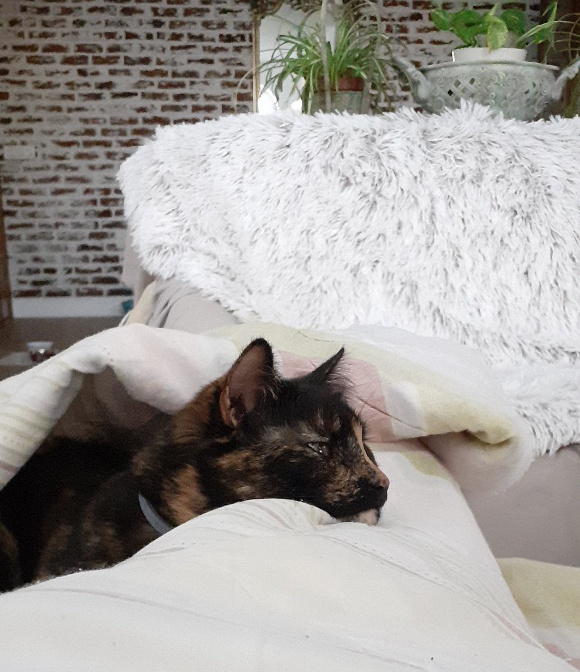
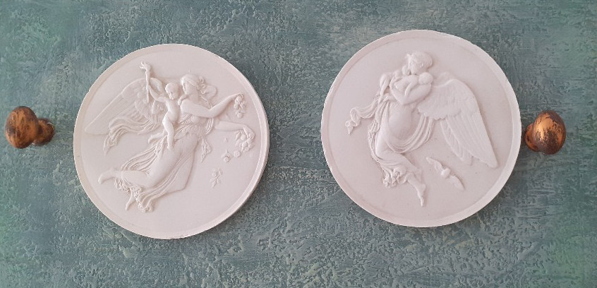
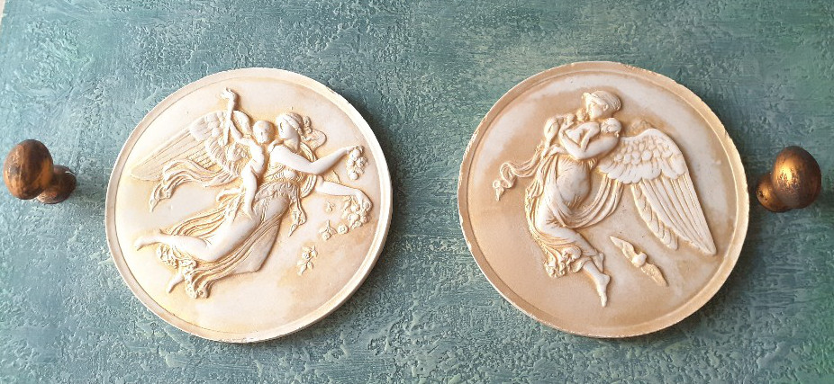

+++
date = 2022-03-15
title = "Ziua 63"
description = "Din cauză că nu eram sigură de mine, din cauză că mereu credeam că sunt mai puțin decât ceilalți, mi-am pus măști peste măști de falsă încredere în sine, am părut cool, dar în secret am căutat continuu validare externă. Și acum mai desfac la măștile alea care s-au lipit bine de mine, dar mă bucur că am început traseul ăsta înapoi, de undo, să mă întorc la mine. Sper să vindec asta pentru toate femeile care m-au precedat și care nu au știut sau nu au avut acces sau nu li s-a dat voie să vadă că pot."
authors = ["Biannca Locatelli"]
[taxonomies]
tags = []
[extra]
math = false
diagram = false
image = "images/ziua-63-final.jpg"
+++
---

Record de trezire până acum, în această dimineață: 4:14 minute. Pentru că nu-mi venea să-mi cred ochilor și nici ei nu voiau să se deschidă, am intrat într-o fază repetitivă de "5 minute". Evident că nu-mi ieșeau fix 5 minute pe ceas dar am țopăit din minute în minute până la 6 fără 20. Am avut timp să mă trezesc de-a binelea așa că am reușit să-mi fac și ritualul mental și să mă pregătesc pentru o nouă zi.

***

La mama deja e lumină dar, atât timp când stă la ea, nu mă deranjează. Văd pe cameră că stă în pat, cu tableta în brațe, așa că nici nu mă impacientez, nici nu mă agit.

Mă las să curg până la bucătărie, am mișcări calme și line și rog Universul să-mi fie la fel și ziua asta care se deschide în viața mea. Am nevoie de liniște, multă liniște, și în jur și în cap și în inimă și de multă simplitate. Am obosit mental de la atâtea și atâtea analize și disecări și observații și emoții. Vreau liniște pe toate planurile.

***

Socoteala de acasă nu se potrivește cu cea din târg, adică speranțele mele să găsesc curat la mama s-au spulberat și azi, dar, deși nu-mi pică bine, nu disper. Mâine poate nu va mai fi ca azi.

E veselă, eu nu sunt exuberantă pentru că am decis eu să păstrez o notă mediană, o notă mai spre calm dar ea simte că-s ok și suntem bine cu toatele. O drăgălesc un pic și pe Sassy, care mă privește cu ochii ei mari și albaștri și adânci. Mi-e drag tare de pisicuța asta, care păstrează încă o distanță față de mine dar pare că mă chestionează, din ochi, în fiecare zi să simtă și să vadă dacă am gânduri bune cu stăpâna ei, mama.

***

Aș vrea să mai adorm puțin, stau cuminte, la căldurică, să repet miracolul de acum câteva zile dar nu mai iese. Diavolița asta mică de Spiky, a făcut ea ce-a făcut că mi s-a culcușit în inimă. În ultima perioadă, dimineața, vine și se așează lângă mine îndeajuns de aproape cât să mă atingă. Azi a făcut un pas mai departe: s-a așezat lângă mine dar a pus căpșorul pe piciorul meu. Să știu că e acolo și să știe că sunt lângă ea.

  

***

În dimineața asta m-am zgâit pe geam, privind în curte, o grămadă.

Diminețile crude îmi plac cel mai mult. De abia iese mărețul galben, natura încă se șterge la ochi de picoteală, e o lumină nouă și tare faină, vin coțofene, porumbei sau fazani la noi și mie-mi place maxim să le urmăresc. Nebunele de coțofene s-au obișnuit că le dau semințe sau firimituri și sunt mereu prin zonă. De la ele, or fi auzit și fazanii și porumbeii că zilnic îi văd cum ciugulesc ei prin trifoi, cum se zburătăcesc unii pe alții, mai apare și câte-o vrăbiuță grăsunică, în fiecare zi e un alt tablou.

Mi-aduc aminte, după burnoutul de la job, cât de fascinată am fost eu de primăvară, de flori, de păsări, de mirosuri. Până atunci nu acordasem atenție vieții din jurul meu ci mă focusasem pe, ceea ce credeam eu că e la momentul ăla, viața mea. Fix viața lipsea vieții mele. Acum, mai ales după ce am devenit vegană și respect orice formă de viață, mi se pare că nu poți cuprinde măreția și diversitatea și palpitantul vieții în întregimea ei. E atâta culoare și plinătate în jur cât să te umple și să mai dai și pe afară, doar dacă îți dai voie și timp să le vezi.

***

S-a așezat tabloul dimineții în calmul pe care mi l-am promis ca o mănușă. Tare aș vrea să nu mai aleg să mă zgâlțâie ceva și azi. Să rămân așa, pe o linie de plutire.

Îmi dezlipesc privirea de la curte, acum o să coboare și domnul meu la micul dejun, deja casa începe să se anime, clepsidra timpului meu magic s-a scurs pentru azi. Dar mi-a fost bine, ancorată în prezent, printre vietățile din curtea noastră.

***

Mama a mâncat tot la micul dejun și, parcă a știut ea că eu vreau să rămân calmă azi, că a început să scoată balaurii pe gură. Cum a făcut ea curat la ea și la Sassy de dimineață și i-a dat să mănânce, cum a închis ea toate contractele de utilitați de la Moreni când s-a pregătit să vină la mine să stea, cum a renovat ea apartamentul ei anul trecut ca să scape de igrasie și multe alte credite, pe care și le arogă, chiar dacă nu le-a făcut. La început, mi s-a strâns un pic sufletul pentru că, normal, nu-mi place când o aud cum aberează, dar apoi au trecut pe lângă urechile și inima mea toți balaurii pe care i-a croșetat azi.

Eu cred, dar este o mare presupunere, că mama a avut trauma propriei insuficiențe cât casa în viața ei, probabil de mică, dar în mod clar adultă fiind.

Mi-aduc aminte că îmi spunea odată cum o jignea tata, că o făcea incapabilă și probabil că ea a internalizat mult din exterior și nu s-a simțit niciodată stăpână pe ea. Iar acum, mintea ei șterge totul cu buretele și se pune pe ea figura centrală în tot. Nu mă deranjează, n-are decât să spună că a construit cu mâinile goale Casa poporului, dacă asta o face să se simtă puternică, sunt ok. Păcat însă că nu a făcut ceva cât încă era în putere, cât încă putea să mai schimbe.

Știu asta pentru că și eu am repetat fix același tipar al ei, probabil că l-am moștenit. Pentru că nu eram sigură de mine, pentru că mereu credeam că sunt mai puțin decât ceilalți, mi-am pus măști peste măști de falsă încredere în sine, am părut cool dar în secret am căutat continuu validare externă. Și acum mai desfac la măștile-alea care s-au lipit bine de mine dar mă bucur că am început traseul ăsta înapoi, de undo, să mă întorc la mine. Sper să vindec asta pentru toate femeile care m-au precedat și care nu au știut sau nu au avut acces sau nu li s-a dat voie să vadă că pot.

***

Vreau să dau o fugă la Carrefour, să iau la blănoase de mâncare și să mă mai inspir. Nu mai știu ce să gătesc iar cu mama e chiar problematic. Pentru că ea vrea cu carne, noi nu. Ea mănâncă puțin dar o mâncare să iasă gustoasă nu o poți face de două porții. Asta cu gătitul, aproape zilnic, îmi ocupă mult timp și, de cele mai multe ori, e risipă.

Cumpăr, la pachet, pentru ea, 2 porții de mâncare gata făcută dintr-un loc de încredere. Cred că e varianta cea mai bună, nu cea mai ieftină, dar rapidă și bună.

Mă opresc la Lidl pentru faimoasele foietaje și …. am scăpat în flori! Doamne, au la Lidl bulbi de dalii, au clematite, lalele, bujori, gladiole, e nebunie! Nu am putut să mă abțin și mi-am luat 4 clematite superbe și vreo 15 bulbi de dalii. Sunt în delir de fericire și am ajuns acasă cu un zâmbet de la o ureche la alta. Dragile mele dragi!

Și ca să fie treaba treabă, mi-am făcut cadou, 2 mini tablouașe de ipsos, vechi, pentru colecția pe care o pregătesc în baia de serviciu. Au un nivel de detaliu extraordinar și efectiv mi-au bucurat ochii pentru doar 25 lei.

  

***

S-a făcut aproape 1, dezinfectez toate cumpărăturile, mă apuc să fac sucul pentru diseară, să pun în punguțe de 100 grame afinele și vișinele congelate că nu mai am pentru smoothieurile de dimineața, să îi pun pastilele mamei pe căprării în organizator (când a trecut deja săptămâna?!), numa' bine am terminat că e prânzul mamei și ei îi e foame. Într-adevăr a păpat tot, nu e foarte volubilă, nu mă mai îngrijorez de ce nu e, calmul și binele încă sunt în buzunarul inimii.

***

Pentru că I love gold, nu m-am putut abține și am subliniat detaliile din tablouașele din ipsos cu ceară aurie. Sunt one of a kind!

  

***

Nu știu ce-am mai făcut și ce-am mai învârtit că s-a făcut de table. Am început să simt că la mine ziua se termină când încep tablele. Orice vine după acest moment vine ca un tăvălug în rostogolire și ies destul de ciufulită și obosită din tăvăleala asta.

Sper ca, odată cu creșterea zilei și cu venirea căldurii, să întind cât mai multă energie și spre seară, să mă mai bucur de timp și pentru mine seara, să mai citesc sau să stau la un pahar de vin pe terasă cu domnul meu fără să-mi pice ochii în pahar. Am credința asta în suflet că o să fac elastic ziua și o țin bine acolo, să se coacă până se pune-n fapt.

***

Poate or fi fost florile cumpărate, poate tablouașele, poate dragul față de omul iubit pe care îl am lângă mine, poate dragul de viața asta faină care este în jurul meu, poate intenția și vrerea mea ca viața să-mi fie frumoasă, poate câte puțin din fiecare sau toate la un loc, dar azi am avut o zi tare senină și calmă. Comparativ cu ieri. Și da, pare-se că nu minte cine spune că trebe să te miști din loc ca să prinzi de poale o nouă energie, nu aia stagnantă în care băltești când nu ai chef de nimic.

***

Sunt plină, plină peste poate de recunoștintă pentru:
1. FLORI!
2. Viața care mă înconjoară!
3. Auriul opulent!
