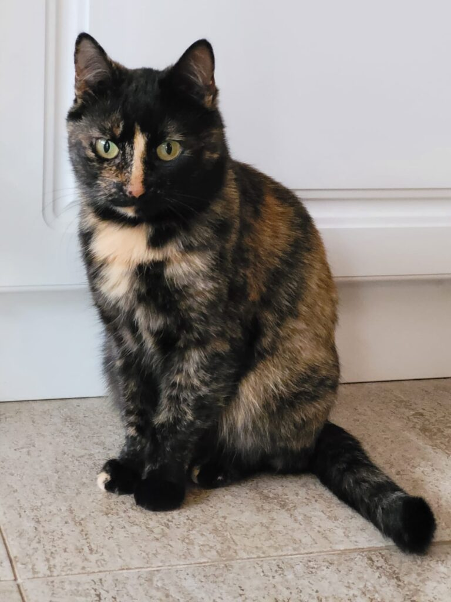

+++
    date = 2022-01-18
    title = "Ziua 7"
    description = "Parcă bate vântul a Crivăț în suflet… scriu și plâng și încerc să respir. Când zic că nu mai pot, vine Universul și mai îndeasă pe gât ceva. "
    authors = ["Biannca Locatelli"]
    [taxonomies]
    tags = []
    [extra]
    math = false
    diagram = false
    image = "images/ziua-7-final.jpg"
    +++
---

Azi a fost o dimineață cu muuult somn! Al mamei, nu al meu. A dormit până la 8! Ciudat este însă că era îmbrăcată doar cu un capoțel și nimic altceva. Am dormit profund azi-noapte și chiar nu știu ce s-a întâmplat. Povestea ei este că a transpirat fleașcă (ceea ce e bine, semn că lucrează rinichii), ce nu-mi place însă este că a stat atâta timp dezbrăcată... asta e, trebe să mă obișnuiesc și cu astea, nu pot fi trează 24/24.

***

Mâine copila mea se va muta definitiv de la noi și o va lua și pe Maya, bulldogița noastră. De câte ori mi-aduc aminte de asta, mă străpunge în inimă. Nu vreau să mă lamentez (și) pe tema asta, dar momentul plecării puiului tău din cuib e un moment tare. De inimă. Știi că vine și timpul ăsta, dar niciodată nu ești pregătit. Pleacă și cu al doilea pui al tău și frate, parcă bate vântul a Crivăț în suflet… scriu și plâng și încerc să respir. Când zic că nu mai pot, vine Universul și mai îndeasă pe gât ceva.

***

La prânz m-am dus la mama, între reprize de spălat, întins rufe, făcut curat, să văd dacă îi e foame. Nu-i, dar se plictisește așa că vrea să joace table.

Nu am învățat până la vârsta de 47 de ani să zic NU. Și, deși aveam treabă, am zis “hai”. Dar în timpul jocului simțeam cum crește iritarea în mine. Mă irita că nu știu să refuz, mă irita că face orice ca să câștige, că nu știu când naiba trece ziua și viața mea, că nu mai am nicio bucurie de a fi pe pământ. Cert este că, probabil la nivel subtil, a captat energia mea iar după joc, la masă, din ciorbă a luat 2 guri și a împins-o la o parte cu dezgust, din tocăniță de-abia a gustat, îndeajuns cât să alimenteze și mai mult starea mea de rahat. S-a dus imediat sus, iar eu am rămas să strâng, să spăl, să plâng și să-mi vină să urlu de neputință.

***

Am ieșit cu Maya în curte și mi-am ridicat privirea spre cer. Se rostogoleau lacrimile pline de nervi, de tristețe, de limitare peste chipul meu și vântul parcă mi le biciuia. Și vântul ăsta mi-a adus aminte de experimentul Biosphere 2, făcut de un grup de cercetători prin anii 80, cu creșterea unor copaci într-un mediu controlat cu apă, căldură și îngrășământ la discreție. Surpriza totală a fost când copacii s-au uscat, iar cauza, la care nu s-a gândit nimeni, a fost lipsa vântului, care ar fi contribuit la întărirea rădăcinuțelor. D-aia e bună adversitatea în viață, d-aia e bine “să te bată vântul”. Dar, frate, pe mine m-a luat pe sus furtuna și nu mai apuc să-mi pun naibii undeva rădăcinile, să mă prind și eu de ceva, să respir un pic!!

***

Fix azi s-a împlinit o lună. Giiiz, ca greutate s-a simțit luna asta ca 18 vieți dar ca timp, nu știu când e dimineată și când se face noapte.

***

După 4 ani, astăzi am simțit chef să mănânc carne. Evident că m-a oprit blocajul emoțional însă pornirea a fost puternică. Ceea ce-mi întărește convingerea că tot ce se manifestă la nivel fizic pornește de la emoțional.

***

A fost o zi ratată. Singuratică. Apropo de asta, această perioadă mi-a arătat ce hram poartă oamenii de “lângă” mine. Și nu că m-ar supăra, cum zice fiică-mea. Nu, nu sunt supărată pe nimeni. Sunt însă tristă. Mental știu că nimeni nu ți-e dator cu nimic, cu a fi lângă tine cu o vorbă bună sau doar cu o tăcere bună. Emoțional însă, în această perioadă, am resimțit cumplit lipsa unei comunități în jurul meu, a unei familii, a unei călduri umane.

Noi, ca ființe umane în secolul 21, am pierdut simțul comunitații, al întrajutorării la nevoie, al petrecerii timpului împreună și la bine și la rău. Am devenit individualiști, puternici, ne descurcăm singuri, funcționăm cu toții, femei sau bărbați din energie pur masculină. Și femei și bărbați, am ascuns adânc în fundul sufletul feminitatea aia bună, creatoare, mângâietoare, vindecătoare. Nu mai avem timp și nu vrem să fim vulnerabili. Ne descurcăm singuri… Fiică-mea îmi zice că nu cer ajutorul, că d-aia oamenii nu sunt acolo unde eu sper să fie. Poate așa o fi. Dar eu știu că atunci când unui om drag mie nu îi e bine, sunt acolo, pur și simplu. Fără să ceară. Eu nu funcționez după principiul “dacă ai nevoie de ceva, spune-mi”. Sufletul meu răspunde la o inimioară trimisă pe whatsapp. La un telefon scurt în care să-mi vărs amarul și doar să fiu ascultată, fără sfaturi, fără cum ar trebui să fac aia și ailaltă. Dacă am nevoie de păreri, le cer.

***

Mâine e o nouă zi. Dar până atunci a trebuit să scotocesc adânc să găsesc 3 lucruri pentru care să fiu recunoscătoare:

1. Pentru tomberoneza mea roială Spiky, care mi-a stat azi în brațe cuminte și a tors, ca un bebeluș și m-a umplut de iubire pură!
2. Pentru respirație!
3. Pentru pinterest, care îmi dă aripi să visez la proiecte creative pentru cândva...

  

