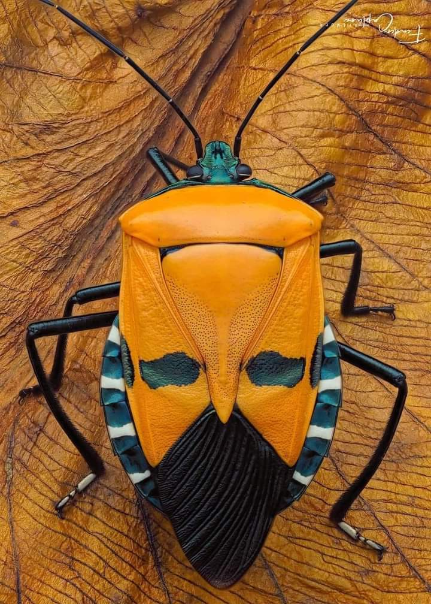

+++
date = 2022-03-24
title = "Ziua 72"
description = "Am strâns în cămăruțele inimii niște doruri, le-am îndesat acolo cum m-am priceput și am forțat închiderea ușilor. Numa’ că azi s-a făcut curent și m-au năvălit toate. Doruri de oameni pierduți prin viață și prin timpuri, doruri de locuri atât de vii în mine că, dacă închid ochii, sunt acolo, doruri de vremuri al căror miros parcă-mi ațâță nările. Chiar dacă simt că nu mai vorbesc aceeași limbă de suflet cu unii dintre ei, chiar dacă știu că nu mi-ar mai înțelege noncuvintele alții, toți cei care mi-au locuit în viață și în suflet oricât de puțin timp, au revendicat locul ăla pe veci. Sunt plină de ei, de locuri, de trăiri, de emoții și de … doruri. Iar azi, în ziua asta primăvăratică, mi-au alergat ca fluturii prin gânduri. Dar pentru că-s o țâră amorțită, nu știu dacă zborul lor a fost cu greutate sau cu bucurie."
authors = ["Biannca Locatelli"]
[taxonomies]
tags = []
[extra]
math = false
diagram = false
image = "images/ziua-72-final.jpg"
+++
---

Spikylina începe să suplinească cu succes orice ceas sau alarmă. Dacă în primele nopți în care a avut întreaga casă la dispoziție, apărea la noi în dormitor de abia dimineața, uite că începe să vrea să doarmă cât mai mult la noi. De fapt, dacă se poate, cât mai lipită de domnul meu. Iar de pe la 5 și ceva începe frichineala. Are ea ceva cu dulapul de lenjerii de pat, s-ar plia și ea acolo dar eu nici nu vreau să văd una ca asta. Ca să nu degenerăm în ceartă și să trezim toată casa, trebe să mă dezlipesc de confortul atât de mișto al somnului și patului și să purcedem împreună spre parter.

***

Nu știu dacă am fost atât de fermă ieri când am cerut o pauză de durere sau mi-a pus cineva o vorbă bună pe vreundeva, că în pașii mici către bucătărie am realizat că mi-e capul limpede și ușor. Și fără durere și fără multe gânduri. Mulțam tare, tare, tare, din tot sufletul meu!

***

Deși nu-mi place expresia "se crapă de ziuă" - mi se pare atât de nepotrivit și organic violent verbul folosit - uite că în ultima perioadă, Spiky a mea mă aduce jos chiar când vin zorii peste noi. Cred că nu o să mă satur niciodată de momentul ăsta atât de plin din zi: din negrul nopții, apar întâi fâșiuțe mici de alb, apoi din ce în ce mai mari și apoi o explozie de culoare. Fiecare zi e o nouă naștere. La propriu.

Cu ochii și afară, azi nu vreau să aprind lumina în bucătărie, las lumina asta rozalie care cuprinde curtea să-mi intre și-n casă. E frumos. Simplu, curat și frumos.

***

De-ar fi așa și la mama. Dar nu e. Bag și la ea în cameră un răsărit și-un aer curat, fac ordine, sunt calmă și-n cuget și-n mișcări, vreau să rămân liniștită cât se poate de mult.

***

Mi-am luat revanșa cu timpul magic de ieri neconsumat și azi am stat pe îndelete cu mine. Deși mă salut sporadic în oglindă dimineața, de câte ori o fac, invariabil zâmbesc. E ceva haios în gest dar e ceva jucăuș și-n ochii mei, acolo unde mi se vede spiritul. Sau de unde mă privește spiritul.

Probabil că ce trăiesc acum e liniștea de după furtună, probabil că sunt obosită fizic după toată suferința prin care am trecut, dar un lucru mi-e clar în această dimineață: din ce în ce mai des, simt că mă am cea mai bună companie. Poate și pentru că sunt destul de mult singură, pentru că vorbesc mult cu mine, pentru prima oară în viața mea încep să mă văd. Și să mă accept. Chiar și așa plângăcioasă. Că sunt multe pe care trebe să le duc acum. Și, în genere, am dus mereu destule. Așa că sunt ȘI așa. Dar sunt și puternică. Și chiar dacă nu mă plac când mă pun la pământ și plâng, e doar o impresie strecurată în mine de pe vremea când trebuia să dau bine în fața tuturor, mai puțin a mea, că eu nu contam. De fapt, eu nu existam pentru mine. Doamne, și n-am existat vreo 40 și de ani…

***

Today is the day! Azi o băgăm pe Sassy la spălat și la tuns. Pentru că e o flocoasă și o grasă, nu mai reușește să-și facă singură toaletarea și se-mpute treaba. Eu înarmată cu foarfecă, domnul meu cu mănuși groase de grădină, ea înarmată cu o jelanie de zile mari! Eu m-am ales cu niște zgârieturi adânci dar și ea s-a ales cu un fund toaletat plus, bonus, o spălare peste tot că dacă tot plângea de ne știau vecinii, măcar să știm de ce.

***

Am adus-o jos pe mama la micul dejun, destul de absentă și azi, mai ales în condițiile în care Sassy a ei făcea așa un tărăboi. Este destul de liniară, parcă nu are nicio bucurie și nicio tristețe, nu mai zăresc niciun strop de exaltare în ea. Poate mă înșel eu, poate am eu așteptări prea mari.

***

Dacă tot am spălat-o pe Sassy și dacă tot sunt în putere, hai să schimb și lenjeria la mama și să dau puțin cu aspiratorul. Și să dezinfectez baia. Și hai și la noi în dormitor. Uite așa, am făcut și curat azi, am pregătit și prânzul mamei și am și spălat rufe până mi s-a umplut uscătorul de rufe.

***

Cred că pisica mea rulează de fapt un soft de câine. Ea nu folosește litiera din casă ci se cere efectiv afară. E surprinzătoare micuța asta, având în vedere că a vagabondat cât a fost puiuță. Are un bun simț și e de o bunătate cum rar am văzut la pisici.

***

Am terminat toate treburile, i-am dat și mamei de prânz și simt nevoia să mă așez. Îmi tremură puțin picioarele și difuză se simte și durerea de cap. Gata, am terminat, o să mă liniștesc.

Am ascultat o melodie și habar n-am cum de a reușit să mă transporte taman în butoiul cu melancolie. Poate pentru că azi sunt molcomă, am putut să simt cu ușurință ce se zbate înăuntrul meu.

Am strâns în cămăruțele inimii niște doruri, le-am îndesat acolo cum m-am priceput și am forțat închiderea ușilor. Numa' că azi s-a făcut curent și m-au năvălit toate. Doruri de oameni pierduți prin viață și prin timpuri, doruri de locuri atât de vii în mine că, dacă închid ochii, sunt acolo, doruri de vremuri al căror miros parcă-mi ațâță nările.

Nu pierdem nimic cu adevărat din tot ce am fost și suntem, din tot ce am trăit sau trăim. Uite că ele se așează unele peste altele și așteaptă cuminți momentul în care să vină neinvitate la o discuție cu tine. Iar dacă mai au și câte-o tinichea atârnată, e clar momentul de bulbi de lacrimi în ochi. Chiar dacă simt că nu mai vorbesc aceeași limbă de suflet cu unii dintre ei, chiar dacă știu că nu mi-ar mai înțelege noncuvintele alții, toți cei care mi-au locuit în viață și în suflet oricât de puțin timp, au revendicat locul ăla pe veci. Sunt plină de ei, de locuri, de trăiri, de emoții și de … doruri. Iar azi, în ziua asta primăvăratică, mi-au alergat ca fluturii prin gânduri. Dar pentru că-s o țâră amorțită, nu știu dacă zborul lor a fost cu greutate sau cu bucurie.

***

Azi e probabil ultima zi fără table, zi de semi libertate. Așa de bine mi-au făcut după amiezile astea cu mine. Bine de tot.

Îi duc sucul mamei și medicamentele, o văd că îi e bine, Sassy m-a iertat și mă lasă să o drăgălesc, eu sunt împăcată cu ziua care tocmai se preschimbă în noapte. A zburat și azi timpul ca o iluzie ce e…

***

Dar am recunoștință-n inimă pentru:
1. Că, la un nivel pe care nu pot să-l cuprind în simțuri pe de-a-ntregul, darămite în cuvinte, m-am înființat în viața mea și m-am ales pe mine!
2. Bucuria pe care o trăiesc adânc când bucur!
3. Toată frumusețea asta nemărginită și nelimitată și la tot pasul care există!

Iar clipa de frumos a zilei este:

  

Ploșnița față-de-om! Că tot vorbeam de frumusețe la tot pasul.

 

 

  

    <a href="/blog/ziua-71/">Postarea anterioară</a>
  

  

    <a href="/blog/ziua-73/">Postarea următoare</a>
  

