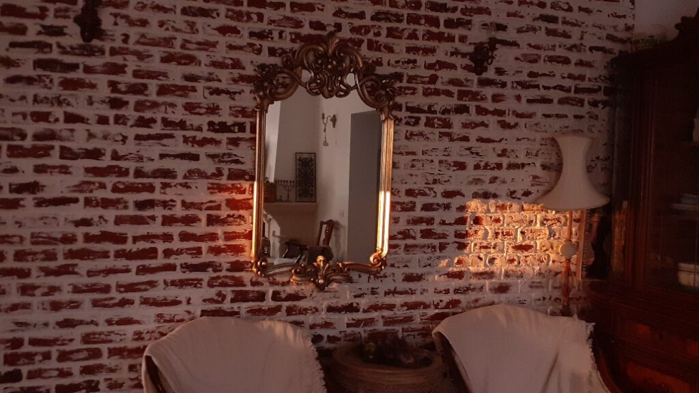

+++
date = 2022-03-27
title = "Ziua 75"
description = "După 75 de zile, pot să spun că scrisul zilnic mă ajută enorm să fiu articulată. Nici înainte nu aveam fracturi de logică dar, pentru că mi se buluceau informațiile și ideile în cap, nu reușeam întotdeauna să emit structurat și să comunic. Mă surprind plăcut chiar și pe mine cât de concisă în exprimare am devenit. Cumpănesc bine înainte de a scoate vorbele pe gură, sunt mai zgârcită și nu le mai prăvălesc afară din mine, ci am grijă să dau fiecăreia maxima greutate posibilă ca să umple țintit scopul caruia îi servește. E o experiență minunată și nu m-aș fi gândit că poate avea așa o profunzime."
authors = ["Biannca Locatelli"]
[taxonomies]
tags = []
[extra]
math = false
diagram = false
image = "images/ziua-75-final.jpg"
+++
---

Ce bine că a venit și a și trecut noaptea asta cea mai scurtă! Am bifat-o și m-am liniștit. Că aveam o grijă, hahaha! Deși, la mine, noaptea ce tocmai a trecut a avut și titlul de cea mai scurtă noapte scurtă din cauza lătratului cățelelor vecinului, aproape non-stop, de la 1 la 3 fără vreo 20 de minute.

La început le-am auzit, am luat notă de ele și am așteptat cuminte să se liniștească. După vreo 20 minute de disperare lătrândă, mă duc la geam să verific că poate au venit unii să ne fure cu casă cu tot. În bezna nopții, n-am sesizat nicio mișcare. Dar fetele nu se opreau sub nicio formă. Partea proastă este că dacă ies să le zic să se liniștească, mai rău fac și scol toată zona nu doar casa mea. Pesemne o fi vreo vulpiță sau căprioare sau arici sau cine știe ce vietate că n-or lătra nici lupițele degeaba.

Așa că am mai băgat o fisă de somn de la 3 la 5 și un strop, pe ora nouă.

***

Cu tot simulacrul ăsta de somn, sunt ok. Și fizic și psihic. Îmi dezlipesc prietena blănoasă de un picior de-al domnului meu, îi mulțumesc că a fost o cuminte, probabil s-o fi prins că show-ul e furat de lupițe și nu mai e loc și pentru reprezentațiile ei și coborâm la bucătărie, în această dimineață molcomă de duminică. Tare faină-i liniștea asta diminețile. Mie oricum îmi place la nebunia liniștea iar asta de dimineața în genere e liniștea începutului.

Parcă cu cântec în mine, am alunecat prin bucătărie manevrând robot, ceainice și căni într-o maniera tare relaxată. M-am salutat și azi și mi-am observat ridurile pe care mi le arcuiesc ochii când zâmbesc. N-am nicio părere despre ele, nici nu le iubesc dar nici nu-mi dau vibe-ul ăla de "șoc și groază, citiți aici!", pentru că oricum spiritul mi-e tânăr și șugubăț, încă.

***

Ajung la mama probabil în același timp în care soarele se strecoară printre draperiile pe care le trage obsesiv în nasul luminii și ne dăm mâna unul cu altul să facem ordine și bine și în cămăruța lor.

Nu știu dacă este de la faptul că îi dau de mâncare și o drăgălesc de câte ori pot, dar Sassy se apropie din ce în ce mai mult de mine. Nu vreau să cred că și ea simte că e ceva în neregulă cu umana din stăpâna ei deși eu cred că animalele citesc energiile mult mai bine decât noi, oamenii. Astăzi, după ce i-am dat să pape și i-am spălat litierele, am zmotocit-o nițel. Mă privea în ochi cu biluțele ei mari și albastre și nu se mai dezlipea de mine. De câte ori mă opream, mă împingea cu boticul să continui. Asta chiar că surpriză, pentru că ei nu-i stă în fire, e mai simandicoasă așa. Pentru că și Spiky a mea mă aștepta de partea cealaltă a ușii, i-am urcat-o pe Sassy în pat mamei, i-am dat ei peria de mângâiat și am plecat. Am văzut pe cameră cum s-a dat jos și s-a așezat lângă ușa pe care mă văzuse că ies. Draga mea dragă, am cucerit-o! Asta e o victorie!

***

În timpul meu magic de azi vreau puțină istorie așa că aleg un documentar cu Egiptul antic.

De câte ori văd documentare despre antichitate, am un prim gând, parcă așa cu uimire, că au trăit oameni și atunci. Prima mea reacție vine dintr-un ego încarnat în mine care crede el că lumea a început și se termină cu mine. Mi-am mai simțit și în alte dăți pornirea asta în gândire care e ceva brut, vine din primitiv, instinctual. Știu mental că sunt o infinitezime de infinitezime de mică și măruntă în imensitatea asta și totuși egoul care mă acompaniază viața asta îmi suflă vânt în coaste și-mi azvârle osul mândririi.

Habar n-am de ce am senzația asta dar știu că mi-a trebuit ceva timp să mă prind de dualitatea mea și încă ceva și mai mult să mă accept așa. Eram când pe culmile "nu e nimeni ca mine", ceea ce e și adevărat de altfel dar ca unicitate nu din înfoiala îngâmfării, când m-aș fi ascuns să nu se prindă nimeni cât de praf sunt. Mișcarea asta sinusoidală mi-a dat mult timp la gleznele inimii dar a dat și roade într-un final. Când nu ești pe drumul tău, ăla care ți se potrivește mănușă, care-ți face sufletul să cânte, de-ți pune roz în ochi și pace-n inimă, te lovești și te învinețește oricine și orice. Nu cu intenție dar sigur cu direcție imprimată.

Știu dăți din viața mea când am trăit situații, pe care de câte ori mi le aminteam ulterior, gemeam de rușine. Când eu voiam să par Albă ca zăpada și cineva din jur mă micea, voit sau nu, iar eu mă strângeam în mine, plină de suferință. N-are sens să spun că n-am uitat niciodată cum m-au făcut oamenii să mă simt. Acum mi se pare o mare prostie. Ce dacă nu știu un lucru? Nu cred că există cineva care să le știe pe toate. Ce dacă nu arăt ca scoasă din cutie mereu? Care e scopul să fii împăiată dacă nu te simți bine? Ce dacă uit ceva sau pe cineva? Dacă n-am uita, am înnebuni, la propriu. Așa că acum, încerc pe cât posibil să nu mai încasez nimic din exterior, pentru că nimeni nu e perfect, iar eu sunt bine în pielea mea. În sfârșit!

***

Am citit și un articol despre energia verde care mustea de informații faine. Dar mi-a plăcut, și am rezonat cu o perspectivă faină, care tare mi-aș dori să devină realitate: dacă războiul lui Putin va întoarce puțin fața către energia verde? Dacă poate fi și ăsta un side effect al războiului, unul care nu e ușor de văzut din cauza impactului emoțional generat de un război? Eu știu că sunt naivă, știu că-s interese imense și bani cu nemiluita dar, fix ca la începutul pandemiei, eu tot mai sper ca omenirea să se mai trezească din interesele astea financiare și de putere.

După un timp atât de bunuț, urmează un mic dejun la fel. Fără fantasmagorii, un mic dejun normal, ca la oamenii normali.

***

Mi-am propus să-mi pun irișii bărboși, ranunculus, crinii, gladiolele și anemonele în curtea de flori.

Pentru că eu am sânge de țăran în mine și am și copilărit la țară, îmi place maxim să stau cu lăbuțele în țărână așa că de abia aștept p-afară, mai ales că e o zi numa' bună de grădinărit. Înainte însă, hai să-mi fac salata de crudități, să fie gata când termin. Nu apuc să desfac punga de spanac că-mi sună telefonul. Copila mea. După voce, simt instinctiv că ceva nu e ok. Am dreptate. Maya a căzut pe o parte, în convulsii și a făcut piș necontrolat. Mi s-au tăiat picioarele și respirația. Mintea scotocește rapid în baza ei de date și prima informație livrată: epilepsie. De altfel asta spune și copila mea. Dar ea mai enumeră și alte enormități gen accident vascular și deja nu mai aud ce spune. La propriu, mi s-a pus o furtună pe suflet. O iubesc pe Maya, am crescut-o de la două luni, e al doilea copil al meu. Face parte din familia mea mică și vreau să mai facă mult timp de acum înainte. Copila mea bănuiește că s-a înecat, eu nu sunt așa de sigură dar în afară de a o monitoriza, acum nu e nimic de făcut. Închid telefonul, bag spanacul la loc, nu-mi mai arde de nicio salată. Ies totuși afară, nu înainte de a face greșeala să-i spun și domnului meu vestea, lucru care l-a tulburat și pe el și-mi dau seama că trebuia să tac. Nu a adus nicio valoare adăugată faptul că i-am spus. Lesson learned!

***

Mă apuc de grădinărit și mă analizez. Mi-e sufletul greu și deși mental știu că nu ajută pe nimeni starea mea, Maya nu se va face mai bine dacă eu sufăr pentru ea, emoționalul mă ține jos. Am din nou aceeași senzație de pâclă, cred că încep să simt fizic ori de câte ori am o energie joasă. Am și bâzâit puțin aducându-mi aminte de Măyuca mea, de câte și câte prostii a făcut dar și cât de mult ne iubeam noi două și câte vorbeam eu doar cu ea, confidenta mea de primă mână.

Dar pentru că pământul și soarele și aerul și ciripitul au energie curată, m-am molipsit de la ele și încet-încet, m-am ridicat. Am acceptat în mine că poate fi și dramatic dar am acceptat în primul rând că poate nu va fi dramatic.

De la plantat, m-am mutat la smuls buruiana de prin toată curtea, la curățat terasa și intrările în casă și nici nu am simțit cum au trecut prin mine și pe lângă mine trei ore. Începute prost dar terminate cu liniște în simțiri.

***

Numa' bine că s-a făcut de prânz, eu am reușit să am distanță între mese de opt ore dar acum mi-e o foame de lup. Cum mama încă nu vrea, mă bucur de o masă doar cu domnul meu. Mă bucur de fiecare moment petrecut cu el, mă simt cel mai bine doar cu omul meu.

Fac repede și sucul pentru diseară, ordine prin bucătărie și mă trezesc cu coana mare peste mine. Foarte bine, înseamnă că s-a declanșat butonul ăla care-i spune că-i e foame.

Îi pregătesc masa și o văd confuză. Nu înțelege de ce ceasul din bucătărie arată 4 iar al ei arată 3. Îi spun că s-a dat ora înainte, să-și potrivească și ea ceasul de mână. Nu o face chiar atunci, se apucă de mâncat și în câteva minute o luăm de la capăt. Ca să previn a treia iterație pe aceeași temă, îi cer ceasul să îl fixez eu. Nu vrea, să mănânce întâi, nu insist.

În total s-a repetat scena ceasului de șase ori până am reușit să fixez ceasul ăla amărât.

***

Mai am o oră până la table, încep să resimt oboseala fizic, parcă m-aș întinde puțin. Scrollez pe social media și îmi tot apar în feed diverse cursuri, workshopuri gratuite. Știu acum că ele sunt momeala cu care vor să-ți vândă ceva după aceea. Un curs de comunicare îmi apare obsesiv, pe toate canalele.

După 75 de zile, pot să spun că scrisul zilnic mă ajută enorm să fiu articulată. Nici înainte nu aveam fracturi de logică dar, pentru că mi se buluceau informațiile și ideile în cap, nu reușeam întotdeauna să emit structurat și să comunic. Și când zic comunic, nu mă refer la vorbire, că e diferită. Implică o țâră mai multă implicare și atenție la cum împachetezi mesajul astfel încât să fie perceput și înțeles corect de celălalt în același timp în care rămâne și autentic. Mă surprind plăcut chiar și pe mine cât de concisă în exprimare am devenit. Cumpănesc bine înainte de a scoate vorbele pe gură, sunt mai zgârcită și nu le mai prăvălesc afară din mine ci am grijă să dau fiecăreia maxima greutate posibilă ca să umple țintit scopul caruia îi servește. E o experiență minunată și nu m-aș fi gândit că poate avea așa o profunzime. Așa că fără cursul de comunicare, eu îmi mulțumesc pentru alegerea făcută dar mai ales pentru consistența și perseverența mea. Nici nu contează dacă citește cineva sau nu. Mi-am plătit eu însămi cu vârf și îndesat.

***

Intru în cele 2 ore și ceva de timp plat. Observ din nou la mama că singurul ei focus este să câștige. Dar e atât de focusată că nu mai vede nimic altceva, iar de auzit și pe mine mă aude cu sincope. O senzație stranie că vorbesc singură mă cuprinde din ce în ce mai des. Cel puțin, în timpul tablelor, e certă treaba. Nu mă mai grăbește cum făcea înainte dar asta pentru că nu mă mai percepe, cred eu.

***

Lasă că am coborât taman la minutul de aur, când soarele și-a luat la revedere de la mine și și-a trimis ultimele lui raze prin livingul meu. M-a picurat aurul ăsta până în suflet. Ne vedem mâine dimineață!

  

Sunt recunoscătoare pentru:
1. Starea mea neașteptat de bună!
2. Iubirea pe care mi-o dăruiește Sassy!
3. Ameliorarea rapidă a Mayei!

Iar medalia de aur pentru frumos dar mai ales pentru gingășie merge la iubirică ăsta mic:

<a href="https://www.facebook.com/watch/?v=1082843388949496" target="_blank">https://www.facebook.com/watch/?v=1082843388949496</a>

 

 

  

    <a href="/blog/ziua-74/">Postarea anterioară</a>
  

  

    <a href="/blog/ziua-76/">Postarea următoare</a>
  

