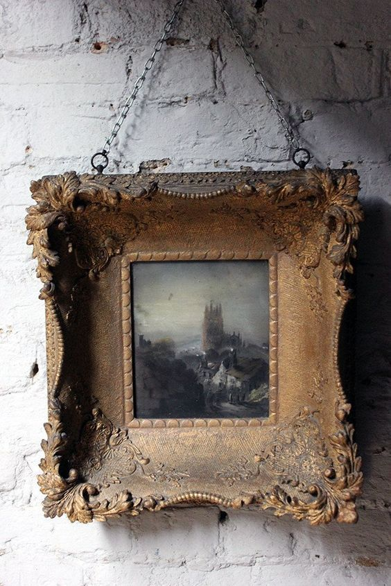

+++
date = 2022-03-28
title = "Ziua 76"
description = "I-am făcut baie și în timp ce o uscam pe părul puțin care i-a mai rămas, mi-am surprins mișcările pline de delicatețe. Corpul meu nu minte, el e capabil de multă grijă și tandrețe, dar intra matracuca asta de minte în scenă și începe să împartă roluri de instigator, de revoltă, de intrigă, ce strică toată poezia. Am terminat seara cu mama mea într-o pace interioară. Pentru că, la un nivel atât de fin și de subtil, nu pot spune unde mă termin eu și unde începe ea. Suntem o curgere amândouă și încep să mă prind că dacă mă pun stavilă împotriva linului, mă ia pe sus învolburarea."
authors = ["Biannca Locatelli"]
[taxonomies]
tags = []
[extra]
math = false
diagram = false
image = "images/ziua-76-final.jpg"
+++
---

Așa da! Am căzut aseară lată și lungă și am avut o noapte dintr-o bucată. Nu m-a trezit nimic și nimeni și pot să spun că e una din puținele nopți în care m-am odihnit. Dacă m-aș prinde ce am făcut sau ce n-am făcut ca să mai repet, ar fi minunat. Până atunci însă, clasez noaptea asta în albumul de "best of" (că tot a fost și noaptea Oscarurilor).

***

M-am trezit singură, devreme, atât de devreme că soarele încă mai dormea. M-am strecurat lin prin dormitor, am cules-o și pe Spiky de pe traseu (era în drumul meu, că ea nu este o traseistă, să nu se înțeleagă greșit) și am coborât prietenește și cuminți la parter. Mă obișnuisem să fie lumină dimineața dar azi parcă m-am întors în timp, în iarnă.

Nu-i bai, mi-e bine oricum și tot ce vine și mai bun azi va fi bonus. Deși mama aseară la 8 și un pic deja dormea, uite că nu s-a trezit. Văd pe cameră că se mișcă dar nu se îndură să ia ziua în piept. Numa' bine, le fac în ritmul meu pe toate și de abia după ce văd că e echipată deja, mă duc la ele sus.

***

Sassy mă ia la rost de la ușă, iar mama mă întâmpină cu aceeași frază pe care mi-o zice zilnic de vreo lună: "nu știu cum Dumnezeului te simte asta când vii!". Eu credeam că lui Sassy îi e foame, ei de fapt îi e drag că nu vrea papa ci drăgăleală. Incredibil, ce schimbare de atitudine la sora mea blănoasă!

***

Azi e zi de studiu Noua medicină germanică. Ca orice lucru nou, mă uit ca mâța-n calendar încă în toate informațiile astea. O doamnă faină mi-a dat o sursă valoroasă de studiu, structurată, organizată, care se mulează fix pe mintea mea dar totuși încă nu le înțeleg pe toate. Nu mă descurajez, așa e primul impact. Rumeg azi o țâră, mai încerc și-n altă zi și sunt convinsă că se va face lumină. Pe mine mă interesează să înțeleg baza că nu mă apuc acum de medicină. Voi avea tot timpul la îndemână această sursă dar vreau să asimilez principiile de bază.

A zburat timpul meu magic în trei mișcări. Absorbită de ce citeam, nici n-am realizat că s-a făcut lumină în jurul meu și că e aproape 9. Hai că ușor ușor se face lumină și la mine în creieraș. Dar e de studiat.

***

Acum câteva zile ziceam că micul dejun e masa la care am succes garantat. M-am grăbit. Azi mama nu vrea mic dejun, sare peste el și o să coboare la prânz. E bine doar că nu îi este foame…

De ceva timp, plănuiesc să atac garajul, aka atelierul meu, pentru că e haos acolo. Dacă tot am timp, parcă l-aș începe azi.

Ori credința mea limitativă e atât de puternică încât îmi creează realitatea, ori e cineva la butoane care se distrează cu mine. Nu apuc decât să scot masa și scaunele pe terasă că mă trezesc cu mama în bucătărie. Îi e foame și vrea să mănânce de prânz. E 10.

***

Gata "prânzul" cu mama, mă reîntorc în garaj.

Curgeau mesajele pe telefon de ziceai că cineva s-a priponit cu degetul pe butonul de send. Veterinarul Mayei a răspuns și vrea să o vadă, ca să se asigure că e în afara oricărui pericol iar copila mea nu are variante de transport până acolo. Eu, legată de mama, domnul meu, de birou. Și cam astea suntem variantele ei de transport și de ajutor. Dar if there is a will, there is a way, m-am suit în mașină via casa copilei mele. Domnul meu, minunea asta de om tare bun, mă secondează pe același drum ca să mă poată aduce înapoi rapid. Eu trebe să îi las mașina copilei și, ca să mă întorc, ar fi trebuit să iau fie un Uber, fie mijloc de transport în comun. Sincer, eu aș fi preferat varianta a doua dar uite că domnul meu vine cu varianta trei, cea mai mișto. Deși e nebunească plecarea amândurora din casă, am rugat-o mult pe mama să stea cuminte și tot drumul am avut pe bord telefonul logat la camera de supraveghere.

***

La 13 eram înapoi acasă și toate erau bune.

De când am renunțat la job și apoi ne-am mutat în afara orașului, am lăsat în spatele meu și în altă viață toată agitația și stresul și viermuiala care-mi mișunau în sânge. Pe drumul de întoarcere, am resimțit din plin, în stomac, aceeași nebunie: șoferii care mai de care să depășească, să se bage în față, aglomerație pe ambele sensuri, frâne, accelerație, iar frâne, aproape că mă apuca isteria. Ajunsă acasă, în liniștea asta bună a căsuței noastre, am avut senzația carnală că am dat ceva greu jos de pe umeri. Am inspirat adânc și am răspândit recunoștință prin toți porii mei pentru mine, că am luat cele mai bune decizii la cele mai potrivite momente, pentru omul meu drag, care mă ajută enorm cu tot ce poate, pentru Universul ăsta care a așezat totul mișto într-un final deși am avut momente când nu deslușeam puzzleul. Încă o dată, îmi validez concluzia de acum ceva ani că agitația este vătămătoare de viață.

***

Dubla trei. Mă reîntorc în garaj, cu un zâmbet pe buze și așteptând să văd ce mă mai oprește de data asta. Dar în așteptarea asta, mă apuc să dau din mâini. Și din minte.

Ca să atragi în viața asta lucrurile pe care ți le dorești, trebe să devii persoana potrivită să le primești și să le duci în viața ta. Dacă din locul și stadiul la care ești acum, începi și urli la Univers ca vreau aia sau ailaltă pentru că nu le ai, Universul va începe să te pregătească pentru aia sau ailaltă. Dacă ai fi fost pregătit, le-ai fi avut, cred că e clară partea asta. Și încep teste, încercări, obstacole care să te transforme și să **devii,** prin asemănare vibrațională, persoana capabilă să aibă ce i-ai spus că vrei. Însă noi, oamenii, văzând că sunt atâtea piedici pe drum, începem să ne îndoim, să ne descurajăm, să gândim că suntem pe drumul greșit. Și ne oprim. Dacă ce i-ai suflat Universului că vrei este aliniat cu adevărul tău, va găsi un mod să se manifeste în viața ta. Însă ești singurul care face asta posibil. Sau imposibil. Nu vine și nu face nimeni altcineva în locul tău. Nota bene!

***

Trei ore jumate și o conștientizare mai târziu, atelierul meu e bec, eu prăfuită și acolo unde nu bate soarele dar îs bine cu mine și mulțumită de rezultat. Nu mai am timp decât de un duș înainte de ritualul serii ce include table, duș, masaj și tratamente.

***

Am hotărât ca de mâine să reîncep să pun muzică în timpul tablelor. Jocul ăsta tăcut, cu dialoguri scurte, mai mult monologuri, nu-mi place. Dacă tot trebe să stau două pironită în scaun, măcar să mă bucur de ceva. Am mai observat ceva ciudat: cât timp joc, nu mai reușesc să mă decuplez de la joc și să-mi las mintea să zburde în locuri mai mișto. Zici că non-gândirea asta a mamei se ia, e contagioasă. Brrrr!

I-am făcut baie și în timp ce o uscam pe părul puțin care i-a mai rămas, mi-am surprins mișcările pline de delicatețe. Corpul meu nu minte, el e capabil de multă grijă și tandrețe dar intra matracuca asta de minte în scenă și începe să împartă roluri de instigator, de revoltă, de intrigă ce strică toată poezia.

Am terminat seara cu mama **mea** într-o pace interioară. Pentru că, la un nivel atât de fin și de subtil, nu pot spune unde mă termin eu și unde începe ea. Suntem o curgere amândouă și încep să mă prind că dacă mă pun stavilă împotriva linului, mă ia pe sus învolburarea.

Cu inima ușoară, nu mi-e greu să-mi văd recunoștința ci doar să o limitez, în scris, la trei:

1. Prima noapte de odihnă plină după tare mult timp!
2. Viața mea nouă și tihnită!
3. Personalitățile super mișto care s-au adunat în mica mea familie!

Frumosul zilei mele (un strop de mister, de vechi, de boem, de lemn, de necizelat):

  

 

 

  

    <a href="/blog/ziua-75/">Postarea anterioară</a>
  

  

    <a href="/blog/ziua-77/">Postarea următoare</a>
  

