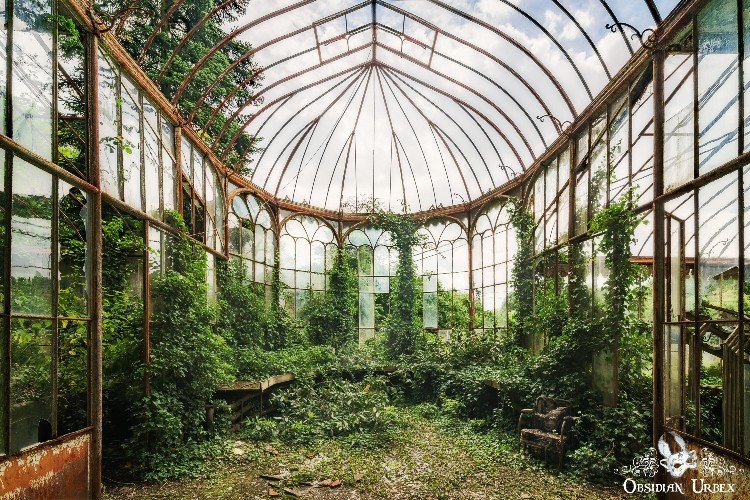

+++
date = 2022-03-29
title = "Ziua 77"
description = "Am greșit când am presupus că am împregnat bucătăria cu senzația aia de respingere. De fapt, nu știu pe ce am apăsat, dar m-am umplut pe mine cu ea. Nu-mi face nicio plăcere azi să petrec timpul cu mama. Nu mai vorbim deloc, am pus muzică să mai învioreze atmosfera, dar nu am reușit mare lucru. E ca atunci când într-o cameră pute și vii și dai cu parfum. Iese o putoare amplificată. Cam așa simt eu: aud vocea din mine care strigă că nu vrea să stea cu ea, nu acum, dar eu dau sonorul mai tare la TV să răsune muzica și să anesteziez trăirea. Astea sunt clipe din alea pe care nu știu cum să le diger."
authors = ["Biannca Locatelli"]
[taxonomies]
tags = []
[extra]
math = false
diagram = false
image = "images/Ziua-77-final.jpg"
+++
---

Mulțam, mulțam, mulțam și pentru noaptea ce-a trecut! Scurtă dar refreshing! N-am auzit nicio cățea, Spiky nu ne-a vizitat nici măcar o dată sau n-am fost eu pe fază, nicio durere nu mi-a împuns corpul, a fost o magie, neagră ca noaptea.

***

La mine, plictiseala a plecat definitiv din viață, și a luat-o și pe soră-sa, obișnuința, cu ea. Azi dimineață, domnul meu s-a trezit în timp ce eu, pe marginea patului, îmi alergam papucii să-i iau pe picioare. Și câteodată, când se trezește bine, știe el o glumă care îi place la nebunie. Buimăciți amândoi de somn, el cică "hai să stăm de vorbă!". Ne bușește invariabil pe amândoi râsul. Are omul ăsta în el ingrediente minunate că nu-mi ajunge o viață să mă bucur de tot ce e el. Azi s-a dat și el jos din pat odată cu mine, că "are niște idei" și nu mai poate sta locului. Ce ți-e și cu IT-iștii ăștia pasionați!

***

Uite așa, s-a fracturat și rutina dimineții și i-a făcut loc domnului meu în ea. Contrar așteptărilor, nu m-a deranjat ruperea asta de ritm. Ritualul pe care îl fac cu sorbirea apei calde și dialogul intim pe care îl am eu cu ea, îl am deja în sânge așa că prezența omului iubit lângă mine nu m-a tulburat. Oricum, dacă eu m-am dezbrăcat de toate faldurile inutile îndeajuns de mult încât să scriu un blog, acasă la noi, lângă băietul ăsta fain, nu am nicio reținere. Deși părerea lui și a copilei mele, contează cel mai mult pentru mine, DUPĂ părerea mea despre mine, nu mă mai spoiesc de ceva timp și mi-am permis, dar mai ales el m-a ajutat să-mi permit, să fiu eu. Si viceversa.

***

Pe cât de mișto mi-era la parter, pe atât de antimișto e la mama. Deschid repede geamul, numa' la țanc să văd un răsărit rozaliu care mă umple de bine și de spor la treabă. Fac ce e de făcut dar cu viteză, că vreau să mă zgâiesc puțin pe geam, să mă așez puțin în rozul ăsta ce se face din ce în ce mai intens și la mama nu cadrează camera cu minunăția de pe cer.

***

Cobor și-n efervescența mea, îl antrenez și pe al meu să privească cerul. E adevărat că de la parter nu se vede la fel de fain ca de la etaj, dar oricum ar fi, e o imagine care-ți primenește sufletul.

El își vede de ideile lui, eu de smoothieul meu, Spiky e împărțită că nu înțelege de ce suntem doi în dimineața asta și nu știe cu cine să stea. Câștig eu runda asta, nu înainte de a sta puțin și cu el la geam, să privească amândoi afară.

***

Azi mă fascinează civilizația Maya și încep să-mi dau seama că în fiecare zi, chiar și așa consemnată la domiciliu, viața mi se umple destul de mult. Nu neapărat experiențial dar orice vine către mine vine să mă îmbogățească.

La un moment dat, privirea mi-e atrasă de camera de supraveghere pentru că era multă mișcare acolo. Mama, în pielea goală, își făcea patul. Draga de ea, poate că a uitat să se îmbrace dar nu se oprește până nu termină curățenia. Privind-o, am înțeles că datorită și din cauza ei am și eu sindromul ăsta al curățeniei. Multumiță ei, că ne punea, pe rând, să facem curat în toată casa (și n-aveam aspirator, ci mătură de paie) și soră-mii, care mă bătea sănătos și cu simț de răspundere să nu se vadă, să fac tot eu și rândul ei. Deși nu cred că s-a downloadat complet sau successfully pentru că, de multe ori, eu sunt cea care face cea mai mare dezordine.

***

Am convins-o să coboare la micul dejun, pe care îl mănâncă integral. Eu, ca de obicei, dublez radioul care a rămas pe Romantic, și fac conversație ca să treacă timpul.

Îi arăt două coțofene care-și fac cuib într-un copăcel de lângă curtea noastră și care cară ele, cu ciocul și pe rând, crenguțe mici și paie. Le privesc și mă bucură din plin cum alte suflete, în alte corpuri, cu alte perspective au același îndemn instinctual de a-și face un locșor al lor. Mama mănâncă în continuare și am impresia că nici nu mă aude. Chiar o întreb ca să știu dacă mai consum energie cu ea sau plec și eu din discuție. Da, mă aude. Ok, atunci e doar liniară, nu are nicio reacție și nicio contribuție. E ca și cum îi cade brusc câteodată curentul, nu mai există acolo nicio energie, niciun impuls. M-a trecut un fior rece în tot corpul. Nu știu de ce dar acum o resping organic.

***

S-a dus la ea, eu am ieșit afară, pe terasă, să mă scutur de sentimentul ăsta de pustiu și să urmăresc în continuare construcția Casei Coțofana. Coțofănelul, bănui eu că e mascul fiindcă e mai măricel, ori vrea să-și arate puterea, ori e grăbit să termine cuibul, că a luat în cioc o crenguță prea mare pentru el și aproape că l-a destabilizat. Coțofănica a venit repede în preajmă. Uite măi, că și la ăștia-i ca la oameni, când bărbatului îi e greu, vine repede femeia să-l ajute. Sau, mai simandicos spus, în spatele fiecărui bărbat puternic e o femeie (mișto). Apare și o a treia coțofană, habar n-am ce sex are, de-i mătușa sau vreun pretendent, cert este că se iscă o ambuscadă ce se lasă cu pene sărite. Intrusul a fost îndepărtat, au revenit la construcție.

Tare bine mi-a făcut pauza asta pe terasă. Mi-a abătut gândul de la momentul micului dejun și mi-a împrospătat un strop energia.

***

Cu suflu nou, încep bucătăreala. Mama nu mai mănâncă două zile la rând aceeași mâncare așa că trebe să gătesc aproape zilnic. Puțin, dar zilnic. Chiar și așa puțin, nu am nicio garanție că va mânca.

Din nou, reticența mea la schimbare, nevoia mea de control iese la suprafață. Aș vrea să pot previziona, aș vrea să am un parcurs cât de cât previzibil dar în demență singurul lucru previzibil este că nu e nimic previzibil. De fapt, există un lucru pe care nu-l uită: tablele. Fix ăla pe care mi-aș dori să-l uite.

***

Am mai ascultat un podcast, am terminat mâncarea și am ieșit din nou în curte.

Sunt ca un copil neastâmpărat: de când a venit vremea faină, aș sta toată ziulica afară. Mi-am udat bujoreii, mi-am vizitat toți pomii fructiferi din curte, 22 la număr, ca să-i verific de mugurași. Toți au, caișii mei încep să înflorească roz! I-am drăgălit pe toți, e o trăire aproape maternă când știu că i-am pus când erau doar niște bețe. Nici acum nu sunt tare mari dar faptul că an de an înmuguresc și nu se pierd, pentru mine e o reușită. Sunt și ei puii mei. Inclusiv arțarul norvegian pe care l-am ochit într-o pădure în timp ce mă plimbam cu domnul meu, în vremurile libere, și l-am adus acasă. Liliacul luat de la Dedeman anul trecut are și el bobocei, semn că a trecut iarna pentru că fratele lui geamăn a sucombat brusc și s-a uscat.

Pe garduri, am pus pe toate laturile curții, caprifoi primit de la o doamnă care-și curăța curtea și voia să arunce. Mi s-a prins tot, a început să se întindă iar anul ăsta sigur va face și flori. Mie-mi plac florile mirositoare, bujorii, glicina, liliacul caprifoiul, crinii și mi-am umplut curtea de ele. În curând sper să ne luăm și glicina și când or fi toate în deplinătatea lor, o să fie o feerie. Avem și doi trandafiri premianți, cățărători, cărora le-am construit o arcadă metalică de peste doi metri, avem și yucca, avem și hortensii. Câteodată nu mai am răbdare și le-aș vrea pe toate mari dar apoi îmi dau seama că totul este un proces, că fiecare etapă are farmecul ei și trebe să mă bucur de fiecare pas. Graba asta!

***

Când sunt afară, uit de timp, uit de mine, uit de toate, mai puțin de camera de supraveghere…

Spiky e cu mine, lângă mine și ne-am așezat amândouă pe terasă, în soare.

Mi-e bine așa. Atât de bine încât închid telefonul să nu mai văd camera și închid și ochii. Mă las așa, cu toată încrederea, în căldura soarelui și îmi întorc atenția în mine. În loc să aud zgomotele din jur, vreau să-mi aud inima.

Eu cred că momentele în care ești conștient doar de tine, întâi de corp și apoi de acel ceva ce te ține în viață, sunt cele mai pline momente care pot exista în această viață pe pământ. În acele momente, dacă reușești să anulezi tot exteriorul, nu ai nevoie de nimic. Mie mi-a luat mult timp să înțeleg ce e meditația. Pentru că mintea mea e programată să gândească liniar: "din pasul a ajungi în pasul b și apoi în pasul c" și nu înțelegeam ce trebe să fac. Mulți spun că meditația e o stare fără gânduri. Ei, pe mine asta mă exaspera. Cum frate fără gânduri, că mie îmi trec o sută de gânduri prin minte numa' în timp ce scot un singur cuvânt pe gură, mintea mea râșnește deși nici nu butez bine dimineața, Dispenza zice că ne trec 60.000 de gânduri prin minte every fucking day! Cum fac eu să stau fără gânduri?! În capcana asta am stat ceva ani până când o bucățică de informație de la o ființă diafană a făcut lumină: trebe să te relaxezi. Atât. În momentul în care am înțeles asta, **am simțit** ce e meditația. Pentru că eu încercam să pătrund cu mintea conceptul de meditație. Mintea nu are nicio treabă sau rost aici. În momentul în care mi-am propus să mă relaxez și atât, totul a fost așa cum trebuia să fie. Nu mai eram încordată că iar mi-a zburat mintea la x sau y, că parcă mi-e foame, că mă mănâncă pielea, nu mai pândeam ca un gardian gândurile să le dau în cap. Eu personal nu cred că poți opri gândurile, așa că de ce te-ai mai chinui?

Timpul și spațiul ăla în care ești maxim de relaxată și ești tu cu tine, nelimitată de un corp pe care l-ai împrumutat să experimentezi, sunt cele mai mișto din toată experiența asta umană. Niciun extaz nu poate cuprinde pe de-a-ntregul ASTA. Nu știu cum să o numesc, pentru că trăire, senzație, plutire, sunt toate prea mici și nedrepte și necuprinzătoare.

***

Cu imensul ăsta buzunar de bine, am intrat în casă, gata să o aduc pe mama la prânz. Vine să mănânce dar "vii și tu la table?". De parcă suntem la negociere: vin dacă vii.

Cred că am lăsat în aer sau materia bucătăriei senzația care m-a trecut de dimineață că simt nevoia să las o distanță între mine și ea. Îi pun să mănânce dar nu stau cu ea la masă ci las un pic de spațiu. Habar n-am de ce dar azi nu reușesc să o disociez de corpul ăsta care mănâncă fără nicio reacție, care privește parcă fără să vadă, care mi-e străin deși din el m-am născut.

***

Am greșit când am presupus că am împregnat bucătăria cu senzația aia de respingere. De fapt, nu știu pe ce am apăsat, dar m-am umplut pe mine cu ea. Nu-mi face nicio plăcere, cel puțin azi și cel mai acut în timpul orelor de jucat table, să petrec timpul cu mama. Nu mai vorbim deloc, am pus muzică să mai învioreze atmosfera dar nu am reușit mare lucru. E ca atunci când într-o cameră pute și vii și dai cu parfum. Iese o putoare amplificată. Cam așa simt eu: aud vocea din mine care strigă că nu vrea să stea cu ea, nu acum, dar eu dau sonorul mai tare la TV să răsune muzica și să anesteziez trăirea. Astea sunt clipe din alea pe care nu știu cum să le diger. Nu vreau să mă simt vinovată dar mă simt. Nu vreau să mai tac si să mai rabd, dar tac și rabd. Nu vreau să mai trec peste mine, dar trec cu buldozerul. Nu știu cum să fac…

***

Azi, au trăit două Bienci: una care s-a bucurat de viață și alta care a respins-o. Prima a fost capabilă să vadă că e recunoscătoare pentru:

1. Faptul că nu e singură când nu-și dorește să fie!
2. Faptul că poate fi singură când își dorește să fie!
3. Mama Pământ!

Iar clipa de frumos e minunăția asta abandonată:

  

