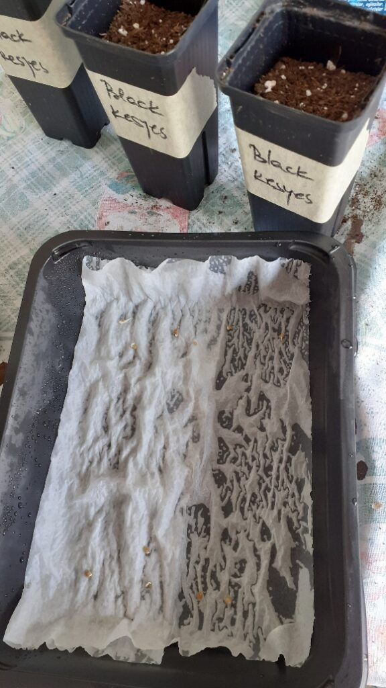
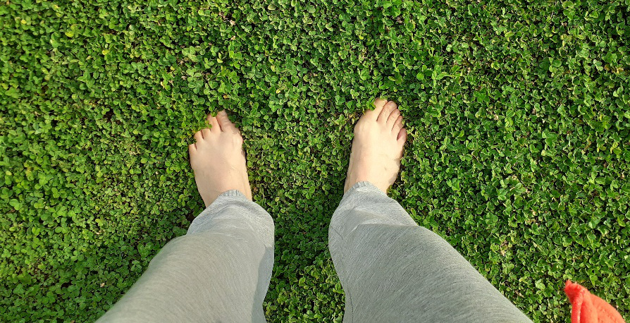

+++
date = 2022-03-30
title = "Ziua 78"
description = "În secunda doi, mi s-a prăbușit starea. Are you fucking kidding me, Univers?! Taman ce bifasem toate căsuțele de dimineață, taman ce-mi ținusem o prelegere de cât de mișto e să te ancorezi în viață și ia d-aci! Evident, realizez că fix d-aia și vin testele astea, să vadă cât de practică sunt, că la teorie nu mă bate nimeni. Hai să te vedem! Am organizat rapid lucrurile, am obținut programare rapidă pentru Maya, am făcut ce trebuia făcut conjunctural și aș fi făcut și mai multe numa’ să nu tratez cu furtuna dinăuntru. Îmi stăteau lacrimile în buza pleoapei. Stomacul mi se strânsese ca în urma unei lovituri dure. Îmi simțeam colțurile buzelor cum s-au arcuit în jos și pe umeri parcă țineam cerul. Nu știu dacă voi putea, în viața asta, să mă detașez emoțional de ființele dragi mie."
authors = ["Biannca Locatelli"]
[taxonomies]
tags = []
[extra]
math = false
diagram = false
image = "images/ziua-78-final.jpg"
+++
---

Încă o noapte trecută pe răbojul de "best of". Ori oi fi obosită, ori sistemul meu neurovegetativ n-a mai răbdat și a luat el problema în mâini, că am dormit aproape neîntoarsă. M-a trezit mademoiselle Spiky cu mersu-i felin când afară se îngâna noaptea cu ziua.

Nu mă las dată jos din pat până nu am discuția aia intimă cu Universul, până nu-i spun cam ce vreau eu să limpezească ziua asta care se așterne, până nu mă cuprind cu totul într-o acceptare și drag.

Abia apoi pornim amândouă pe scări, una mai duduită decât cealaltă pentru că îi e foame. Spiky a noastră nu miaună dar scoate niște sunete când nu o mai rabdă și pe ea sufletul. Se aude un "chi-chi", de altfel acesta fiind și numele ei de alint: Chichirica. Zici că n-a văzut mâncare de o lună, așa de scandalagioaică este, că nu mă apuc de nimic altceva până nu hrănesc prințesa.

***

În timpul ăsta se trezește și coana mare, așa că mă organizez să livrez în condiții optime smoothieul. Nu o fi mâncând ea mereu la mic dejun sau prânz dar am introdus în sistemul ei smoothieul și sucul de seara. Smoothieul cel puțin nu l-a refuzat niciodată. Asta și pentru că ea crede, și așa o fi, că astea au adus-o înapoi, pe picioare.

La ele este curat, miroase a mentă încă, de la masajul de aseară. Pentru că avea un junghi, i-am introdus între uleiurile de la masaj și menta, ca relaxant muscular.

Să nu le fie de deochi dar așa dimineți și nopți să tot am, că nu mă supăr deloc. Deschid să intre și puțin aer curat, răsăritul e mai diluat decât cel de ieri, le dau să pape la fete și cobor liniștită.

***

Cum stăteam eu în timpul magic, scrollând social media, am agățat ceva scame de pe vreundeva sau de peste tot și s-au lipit de starea mea de spirit. Ba că război, ba că arme nucleare și iod, ba că una sau alta, aproape că simțeam în corp cum mi se întunecă lumina. Noroc că pe lângă starea de spirit, mai am și o stare de prezență, care s-a activat, a aspirat mizeria ce se adunase amenințător să astupe bucuria de viață și a aruncat-o în mașina de spălat a Universului. În acest moment, fix în acest moment, nu am nicio grijă. Absolut niciuna!

Ăsta e primul nivel. Peste el, e mișto să pun următorul strat, ăla de bucurie. Gradual. Fără forțare. Nu poți sări rachetă de la a fi prăbușit sau trist la exuberant. Sau poți dar corpul nu are aceeași viteză ca spiritul și nu-l va urma în timp real, așa că mișcările bruște s-ar putea să se lase cu fracturi. Deci, gradual.

Sunt bine în corpul meu? Sunt. Checked!

Sunt în siguranță în locul în care sunt? Sunt. Checked!

Am ce pune pe masă? Am. Checked!

Sunt ai mei în viață? Sunt. Checked!

Not a care in the world!

Nivelul următor presupune să-mi folosesc la maximum dotările, adică să fac uz de simțuri pentru a testa materialitatea. Uităm că unul din superbele avantaje ale experienței într-un corp pe pământ e dat de simțuri. Vreau să mă umplu de senzații, de tot felul. Nu toate o dată, că nu le pot procesa pe toate corect și e păcat. Mă uit în jur. Oriunde aș privi, mi-e imposibil să nu găsesc cel puțin un frumos. Trag aer în piept și simt în nări mirosul familiar al căsuței noastre. Gust. Ascult. Pipăi. E o explozie de mici minuni în mine și în jurul meu.

Mi-aduc aminte, anul trecut când mă plimbam cu domnul meu prin pădurile din jur, cum am văzut, în fața mea, pe potecă, un mic păianjen roșu. Și când zic mic, e mic, adică avea corpușorul cât o gămălie de bold. Habar n-am cum l-am văzut în condițiile în care eu sunt cam mioapă dar știu că acea priveliște mi-a dat o bucurie în toate celulele corpului. Atâta m-a impresionat că mi-a rămas pe retina sufletului. Un simplu păienjenel roșu! Cine ar fi crezut…

Păcat că uit să mă deschid cu toate sertarele să las realitatea care mi se desfășoară să mă umble prin toate cotloanele și să mă umple.

***

Am oprit social media. Poate o să o opresc de tot într-o zi. Are multe chestii mișto dar și multă mizerie și manipulare. Când te detașezi nițel, le vezi pe amândouă cu mare ușurință. Nu e nimic greșit cu niciuna doar că eu nu vreau să le poftesc, zilnic, în viața mea. Le găsesc destul în afara social media ca să mai am nevoie de refill și de acolo.

***

Tatăl vecinului meu a fost inginer agronom. Om la 80 și de ani, ieri se cățăra sprinten și curajos pe o scară să toaleteze un gutui și o viță. Pfiu! Cum de nu m-am gândit eu, până acum, să-l invit în curte să mă învețe cum să-mi toaletez copăceii?! Nu mi-a trecut prin minte. Asta e din ciclul "cum să trăiești cu un empatic". Cică empaticii nu cer ajutorul pentru că ei SUNT ajutorul.

Domnul meu îmi spune că vecinul a aruncat peste gard la noi niște araci. Ca să înțeleg de ce, mă duc la gard și am noroc că omul e în curte deja, trebăluiește. Îl invit la mine, verifică pomișorii, din păcate e prea târziu pentru toaletare DAR aproape toți pomișorii mei vor avea rod! O, ce veste minunată! Tot povestindu-i eu ce am prin curte și cum am făcut, mă trezesc cu coana mare pe terasă. Ea, care nu ieșea că e frig, că piciorul, că x sau y, când a văzut că avem musafiri de teapa ei, n-a mai avut nimic. Când nimic altceva nu mai funcționează, când corpul ți-e gărbovit și istovit și bolnav, când mintea e pe arătură, fratele ego nu dă semne de oboseală. Mama voia să se facă remarcată. Numai că omului îi sunase telefonul și era prins într-o convorbire, la noi în curtea de flori. Ca-n filmele cu proști, stăteam între ei doi ca distanță și nu știam ce să fac: să o bag pe mama în casă, că ieșise dezbrăcată și afară bătea un vânticel rece sau să-l petrec pe om afară din curte. Partea proastă este că niciunul nu este tocmai întreg la mansardă iar vecinul nici nu aude prea bine, are aparat la o ureche dar acolo ținea telefonul. Până la urmă, ne-am înțeles din semne, a plecat, a intrat și mama în casă că nu mai avea spectator și am așezat-o la micul dejun.

Am avut și azi clipe în care am simțit că vorbesc degeaba dar nu știu de ce, nu pot să tac. Liniștea asta lângă mama are ceva nefiresc în ea care mă face să mă simt inconfortabil. Oamenii pot transmite prin vorbe sau prin vibrație, fiind atât receptori cât și transmițători. Mama își închide treptat toate frecvențele și vreau ca măcar prin vorbe să ajung la ea. S-ar putea ca degeaba să vreau eu.

***

Mi-au germinat aproape toate semințele puse acum câteva zile. Ce bucurie! Sunt atâtea și atâtea activități de făcut în lumea asta, că eu nu pot să-mi imaginez cum ai putea să te plictisești. Dacă mi-ar fi spus cineva acum ceva ani nu că voi face răsaduri cândva ci că mă voi bucura ca un copil mic de asta, m-aș fi uitat într-o dungă, cu singura mea sprânceană care se ridică, în dispreț. Hahaha! Life is funny!

Nu mai pot lăsa semincioarele încolțite în cutiile în care au dat codițe și trebe să le pun în alveole. Ca să învăț cât mai multe, eu sunt băgată în cât mai multe grupuri specifice pe facebook. Unul dintre ele este local și am descoperit o așa mică mână faină de oameni gospodari și destoinici și darnici. Aseară am primit, cu împrumut, alveole zdravene în care să-mi fac răsadurile așa că azi, n-am nicio scuză.

  

***

Cel puțin, așa am crezut. Sună telefonul, copila mea. Din nou, am simțit. E despre Maya. La cinci zile distanță, a făcut din nou o criză. Oricât am vrea noi să stăm liniștite, asta nu e de bine.

În secunda doi, mi s-a prăbușit starea. Are you fucking kidding me, Univers?! Taman ce bifasem toate căsuțele de dimineață, taman ce-mi ținusem o prelegere de cât de mișto e să te ancorezi în viață și ia de aici! Evident, realizez că fix d-aia și vin testele astea, să vadă cât de practică sunt, că la teorie nu mă bate nimeni. Hai să te vedem!

Am organizat lucrurile, am obținut programare rapidă pentru Maya, am făcut ce trebuia făcut conjunctural și aș fi făcut și mai multe numa' să nu tratez cu furtuna dinăuntru. Îmi stăteau lacrimile în buza pleoapei. Stomacul mi se strânsese ca în urma unei lovituri dure. Îmi simțeam colțurile buzelor cum s-au arcuit în jos și pe umeri parcă țineam cerul. Nu știu dacă voi putea, în viața asta, să mă detașez emoțional de ființele dragi mie. Nici nu știu dacă ăsta e targetul. Știu însă că trebe fie să minimizez impactul asupra stării mele, fie durata în care sunt țăndări pe jos.

***

Cu asta-n minte, m-am dus în garaj, să pun răsaduri. Iar asta m-a transportat într-o altă stare, într-una în care am mulțumit și vorbit cu fiecare semincioară în parte, în care mi-am pus tot gândul bun în picușorul ăla de viață nouă, dorindu-i vigoare și creștere. Din nou, mi s-a validat, a câta oară, că primul pas pe care ar fi fain să-l faci când te dărâmi este să faci ceva, să te angajezi cu tot ce ești într-o altă acțiune, care-ți va muta focusul.

Nu înseamnă că am uitat, nu înseamnă că nu am tresărit la fiecare mesaj pe care mi l-a dat copila mea de la doctor, înseamnă doar că am minimizat impactul cât am putut. Iar asta e o victorie pe care nu vreau să o ignor.

Simptomele Mayei pot fi asociate mai multor cauze așa că doctora ei a decis să le luăm prin eliminare. Am toată încrederea în cabinetul ăsta la care mergem așa că asta vom face. Vom vedea. La o testare empirică, ceva din mine îmi spune că va fi bine.

Am terminat răsadurile, sunt creații care deja mă conțin, că am pus în fiecare alveolă și strop din sufletul meu, alături de semincioară, așa că o să cresc și eu cu ele.

***

O aduc pe mama la prânz, îi arăt micile mele creații dar dacă așteptam un pic de excitement din partea ei, m-am înșelat. Trebe să-mi intre o dată în cap că nu pot împărtăși cu ea bucuriile mele și să aștept ceva bucurie înapoi. Trenul ăla a plecat definitiv din gara mamei. Măcar îmi iau bucurie că a mâncat, în ritm de radio că azi nu mi-am irosit energia în discuții sterile. Doar i-am spus de Maya dar era ca și când nu i-aș fi spus. Zero. Îmi aruncă de pe la jumătatea drumului spre apartamentul ei că mă așteaptă la 17:30.

***

Ies cu Spiky pe terasă, să ne încărcăm de la mărețul galben. E un vânticel tupeist dar e atât de bine în natură. M-am descălțat și am pornit desculță prin trifoi. Probabil că împământarea asta a declanșat puhoiul de lacrimi pe care îl impinsesem mai devreme înapoi în matca lui dar el nu s-a retras ci doar a acumulat în subsidiar. Au curs și m-am spălat de toate: de grijile cu Maya, de pustiul cu mama, de ororile unui război, de dorurile mele, de dureri.

  

Sunt fresh. S-au scurs toate prin tălpi către mama pământ, care le-a primit îngăduitoare și mi-a dat înapoi pace. Bine ai venit primăvară!!

***

Le-am dus pe toate mai ușor. De fapt, le-am bifat, că se pare că și eu, pe lângă mama, am scos toată viața din orele astea în care joc table, îi fac duș și masaj. Sunt treburi pe care le fac mecanic. Nu știu dacă-i bine dar nu mai reușesc să pun viața înapoi în ele.

***

Tare repede a trecut ziua de azi. Ca o părere. Dar părerea asta are în ea recunoștința mea pentru:

1. Viața mea, pe care o colorez sau o văd în alb și negru dar ESTE și încep să mă determin să fac the best of it!
2. Liniștea din mine în condiții de furtună!
3. Corpul meu care comunică cu mama pământ într-o limbă pe care nu o înțeleg mental dar căreia mă supun prin simțire!

Frumosul ce mi-a umplut ființa (castel+natură+minutul de aur al soarelui = my dream)

  

 

 

  

    <a href="/blog/ziua-77/">Postarea anterioară</a>
  

  

    <a href="/blog/ziua-79/">Postarea următoare</a>
  

