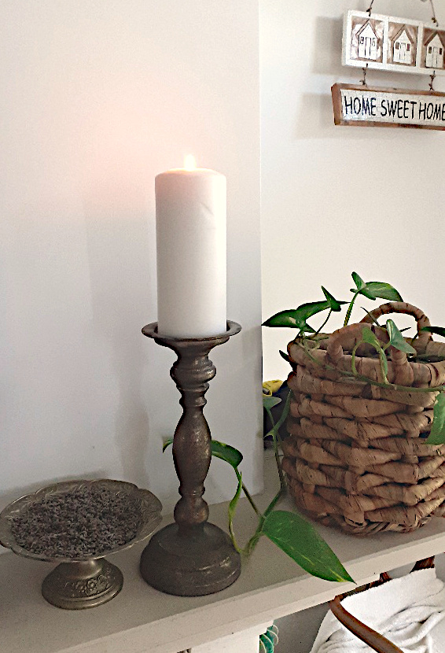

+++
date = 2022-04-02
title = "Ziua 81"
description = "O laud plină de entuziasm iar pe ea o încântă asta de fiecare dată. Cred și știu și eu cum este când te simți util și, mai ales, ești văzut că ești util. Nu am realizat până azi, dar prin faptul că le fac eu pe toate, o văduvesc pe mama de multe activități pe care le făcea singură dar, cel mai important, o lipsesc de sensul ăsta de utilitate. Nasol este că ea nu mai poate să facă tot ce făcea, iar eu nu știu când ceața din mintea ei se ridică și vrea să se simtă utilă și când nu. O să încep să iau ca barometru pentru asta, ordinea sau mizeria de la ea din cameră."
authors = ["Biannca Locatelli"]
[taxonomies]
tags = []
[extra]
math = false
diagram = false
image = "images/ziua-81-final.jpg"
+++
---

M-am trezit brusc dintr-un vis extrem de vivid: eram cu copila mea într-un restaurant și o doamnă ne arăta cum să desghiocăm piersici. Cam așa de interesante sunt visele mele! Tare a fost că trezirea bruscă, generată de Spiky pe care o apucase scârmatul la o ușă de dulap, nu a terminat și firul visului și, deși trează, o vedeam în continuare pe doamna respectivă. Probabil că, în viteza trezirii, corpul astral nu a apucat să se muleze pe corpul fizic și eram "între lumi".

Am strigat încetișor la mândră să se oprească dar era hotărâtă, se pare că a împrumutat ceva din personalitatea stăpânilor ei. Vreau, nu vreau, mai mult nu vreau, mă scurg din pat și o iau după mine, măcar domnul meu să doarmă în această dimineață de sâmbătă. Nu că ar fi diferită de celelalte zile.

***

Azi noapte a fost furtună pe la noi, acum plouă în două intensități: când tăricel, când molcom și liniștitor, numa' bun de dormit. Deși îmi place ploaia, nu-mi place furtuna, nu-mi place când natura să dezlănțuie, nu-mi place pentru că mi-e frică. La un nivel primitiv dar visceral, exagerările prin care mama Pământ ne arată că enough is enough, mereu m-au neliniștit profund. E clasica frică de moarte, frica primordială, mama tuturor fricilor existente în ființa umană, care-și uită infinitatea.

***

Cu ochii pe geam și cu gândul în negura vremurilor, dau drumul la smoothieuri și la ceai și-mi sorb apa caldă.

Dacă stau strâmb dar gândesc drept, am făcut schimbări esențiale în viața mea, într-un timp relativ scurt. Totul a pornit cu renunțarea la fumat, la acel un pachet și jumate de țigări zilnice care-mi înnegreau plămânii. Apoi am renunțat la carne, apoi la orice de origine animală, am început să mănânc fructe dimineața, sub formă de smoothie, să beau apă caldă pe stomacul gol și încă mai am pe listă. Cel mai important e pentru mine nu ce am reușit să fac ci că am reușit să mă țin de ce mi-am propus. Pentru că e nevoie de voință. La fumat de exemplu am decis brusc și aia a fost. Dar mai decisesem și în trecut și mă ținea o lună, două, un an și apoi cădeam din nou în păcat. La carne, la fel, idem și la lactate. Nu am negat niciodată că nu poftesc când îmi vine câte-un miros sau când văd deserturi delicioase și pline de creme și nebunii, dar la mine blocajul este mental și chiar dacă "fratele porc", cum mai glumesc cu domnul meu referitor la corpurile noastre, de oameni, râvnește, mai există în costumul ăsta de carne și un spirit, viu, ce nu mă lasă.

***

Urc la coana mare, se îngână de ziuă, e o atmosferă britanică afară, îmi place. La mama din nou totul e bine, e curat, a curățat ea și litiera lui Sassy așa că o laud plină de entuziasm iar pe ea o încântă asta de fiecare dată. Cred și știu și eu cum este când te simți util și, mai ales, ești văzut că ești util. Nu am realizat până azi dar prin faptul că le fac eu pe toate, o văduvesc pe mama de multe activități pe care le făcea singură dar, cel mai important, o lipsesc de sensul ăsta de utilitate. Nasol este că ea nu mai poate să facă tot ce făcea iar eu nu știu când ceața din mintea ei se ridică și vrea să se simtă utilă și când nu. O să încep să iau ca barometru pentru asta, ordinea sau mizeria de la ea din cameră.

Deschid totuși să aerisesc și-mi arunc ochii pe cer. Se luminează, în spatele norilor pufoși dar gri-șobolan stă un cer azuriu atât de plin că efectiv am simțit o odihnă oculară privindu-l. Mama nu a văzut decât că e înnorat și că e frig. Asta e un program pe care îl am și eu în mine, tendința asta de a vedea "răul", înnoratul, în loc să văd "binele", azuriul. Dar, ca orice program, se poate șterge și downloada altul, cu practică zilnică, ca un mușchi pe care îl antrenezi.

***

În timpul meu magic de azi, am avut experiență interesantă.

Mi-am pus un tutorial despre stiluri de design interior și, în programul artistic de azi, e stilul scandinav. Foarte înrudit, pe alocuri, cu stilul meu preferat, french country. În acest stil, apare deseori clasicul lor ceas impozant de podea, Moira. Azi, în timpul tutorialului, m-a furat drăgălășenia lui Spiky și pentru câteva secunde, m-am jucat cu zgubilitica mică. Nu-mi luam ochii de la tutorial însă atenția mi-era în altă parte. A apărut pe ecran ceasul Moira iar în mintea mea a răsunat clar "Moira clock". Am rămas uimită să văd că mi-a venit această denumire deși habar n-am când și unde am reținut-o iar în tutorial nu se specifica numele ceasului. Am dat înapoi să fiu sigură că nu am auzit acolo. Nu, nu zice. Mi s-a părut tare! Reținem tot, fie că suntem sau nu conștienți de asta. Dar și mai tare mi se pare că, nefiind prezentă în momentul ăla la tutorial ci la pisică, mintea mea automat a văzut, a căutat în baza de date și a făcut împerecherea cu ce a găsit acolo. Toate fără ca eu să fac vreun efort conștient.  Deci mi-a intrat atât de adânc în fire să etichetez încât o fac natural, fără să gândesc. Acum am etichetat Moira dar data viitoare sau mii de alte dăți trecute, o să etichetez oameni, stări, emoții. Nimic rău în asta doar că a cataloga înseamnă a polariza. Iar asta mă duce în iluzia că suntem separați. Încă mai rumeg la conceptul de iubire de sine și la cel legat de faptul că nu suntem separați decât în corpuri. Dar un lucru e rumegat și asimilat: pe toți ne leagă același liant, ne animă aceeași sursă, suntem picături din același ocean.

***

Tot în timpul meu magic, mi-am invitat neamul în gânduri.

Foarte vie în memoria mea, ca fiind omul cu singura iubire și grijă pentru mine când eram pui, măița mea, cea mai bună femeie din lume. Din păcate, a plecat și cel mai repede din viața mea. Apoi tatăl meu, mare absență din viața mea, omul care a fost un mister și a rămas așa. Și el plecat din viața mea dar e impropriu spus asta, pentru că nici nu prea a fost în ea. Mi-a trecut gândul și pe la bunicul meu, inginerul italian care a venit în România să proiecteze poduri și a sfârșit prin a întemeia un neam aici. Am poposit cu un dor și la sora mea, de care chiar dacă nu mă leagă sângele decât parțial, mă simt legată cu fire greu de înțeles de cei din jur și, câteodată, chiar și de mine. De verii mei, rătăciți prin toată lumea. Pentru tot neamul meu, aici sau plecat, am aprins azi o lumânare, cu sufletul plin de liniște și de cuprindere.

  

  

***

I-am pregătit mamei micul dejun și, surpriză, i-am făcut și o cafeluță. Mică și mai diluată dar vreau să simtă că e weekend. Ce s-a bucurat! Și eu, pe lângă ea. Nu am stat prea mult la vorbă pentru că vine copila mea cu mașina să mergem la cumpărături. Mă bucur tare mult că petrecem timp împreună, chiar dacă e la cumpărături de mâncare.

***

Am luat trei hypermarketuri la rând, s-au dus banii fluierând că s-au scumpit al naibii toate dar am câștigat timp cu puiul meu. A crescut, îi e greu la casa ei, sau cum zice ea "e greu să fii adult" așa că vreau să o drăgălesc și răsfăț ori de câte ori am ocazia. Știu cât de bine mi-ar fi făcut mie să am un sprijin atunci când am plecat de acasă așa că am un mai mare elan în a o ajuta. Am și mâncat împreună, mi-a mai spus cum e viața ei dar mai puținel așa că ea este o fire discretă iar mie nu-mi place să intru cu bocancii în viața ei dacă ea nu povestește. Sper să nu perceapă ea delicatețea mea cum am perceput eu indiferența mamei, că sunt nuanțe la poluri opuse. O să am grijă să vadă diferența.

***

Până am dezinfectat și aranjat toate, s-a făcut de prânz unde i-am avut ca protagoniști pe domnul meu și coana mare, eu tocmai ce mâncasem cu puiul meu în oraș. Toată lumea e bine, nu am dat din gură prea mult că-mi bubuia capul dar a suplinit Mr. H partea asta, cu succes. Observ și la el o stângăcie când e mama în zonă, că nu știe ce și cât să spună sau dacă să spună ceva. Aș vrea să îl ghidez dar habar n-am nici eu. Cu demența e ca la zaruri. Niciodată nu știi ce pică.

***

Nu apuc să mai fac mare lucru că trebe să merg la table. E o senzație aiurea, mai ales acum, de când s-a lungit ziua, să simți că ziua ta se termină pe la 5 după-amiaza. Că ai vrea să înghesuiești mai multe într-o zi și ea se termină brusc.

E clar, tablele încep să activeze butoane în mine. Nu jocul în sine ci timpul petrecut cu mama. Din ce plăcere era la început, devine chinuitor. Pentru că se enervează, înjură, trântește, e o energie nașpa și nu-mi mai face nicio plăcere. Trebe să mă gândesc la variante de a schimba puțin atmosfera pentru că este momentul pe care ea îl așteaptă cel mai mult din zi. Nu vreau să-i iau această bucurie, dacă nu singura, din fiecare zi a ei.

***

Și azi sunt frântă, de abia aștept să mă strecor în pat. Premiantele la recunoștință sunt:

1. Ploaia asta care spală tot dar, mai ales, hrănește mama pământ care ne gratulează cu o verdeață superbă!
2. Tot neamul meu, știut și neștiut, care a contribuit fiecare la cine sunt eu acum, parte din ei!
3. Bonding time, neprețuit, petrecut cu copila mea!

Pentru clipa de frumos, intră în scenă:

  

