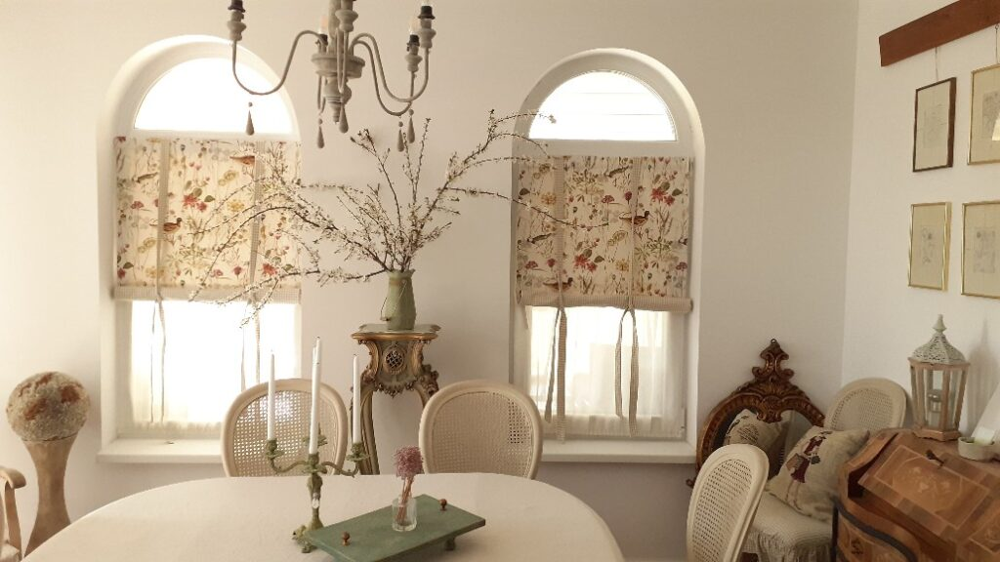
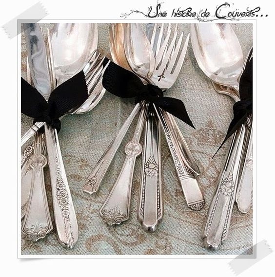

+++
date = 2022-04-05
title = "Ziua 84"
description = "Am ajuns să înțeleg, tot scriind, cât de nestatornică e viața, cât de schimbătoare. Să simt acut asta, nu doar să defilez cu clișeicul “singura constantă e schimbarea”. Nu doar demența e. Viața cu tot ce e ea, e așa. Am zile bune și mai puțin bune, zile pline de mine și zile goale de prezența mea, zile mișto și zile pe care nu aș vrea să le mai întâlnesc vreodată. Dar nu pot să nu văd că toate zilele sunt de fapt trepte, care mă duc, mereu și mereu, indiferent cum calc pe ele, în prezent. Așa că buimacă și un strop mai mult frustrată, m-a luminat gândul că m-am trezit în viață. Să începem de aici, zic."
authors = ["Biannca Locatelli"]
[taxonomies]
tags = []
[extra]
math = false
diagram = false
image = "images/Ziua-84-final.jpg"
+++
---

M-am gândit să fac o petiție cât mai convingătoare către forurile alea cele mai înalte care aranjează ele ordinea pe pământ. Și să le dau și opțiuni: fie să facă elastic noaptea ca să-mi bag și eu în desaga somnului cât trebe să simt că-s odihnită, fie să-mi picure odihnă, la pas mare, în perfuzia nopții ca să mă trezesc și eu aptă de viață. Azi dimineață, după o noapte de lătrături și sforăituri, efectiv îmi auzeam ochii cum pocnesc când clipeam. Sub nicio formă nu m-aș fi dat jos din pat dar viața bate filmul și a trebuit să-mi bag picioarele… în papuci.

Am ajuns să înțeleg, tot scriind, cât de nestatornică e viața, cât de schimbătoare. Să simt acut asta, nu doar să defilez cu clișeicul "singura constantă e schimbarea". Nu doar demența e. Viața cu tot ce e ea, e așa. Am zile bune și mai puțin bune, zile pline de mine și zile goale de prezența mea, zile mișto și zile pe care nu aș vrea să le mai întâlnesc vreodată. Dar nu pot să nu văd că toate zilele sunt de fapt trepte, care mă duc, mereu și mereu, indiferent cum calc pe ele, în prezent.

Așa că buimacă și un strop mai mult frustrată, m-a luminat gândul că m-am trezit în viață. Să începem de aici, zic.

***

Beznă peste tot, Spiky mă așteaptă la ușă să coborâm împreună, liniștea asta crudă mereu mă încântă. Doar câte-un avion mai brăzdează pacea din căsuța noastră. E cald și e bine. Bun așa. Hai la pasul următor, că și treapta asta fu faină.

Clasicul ritual la care am adăugat noutatea zilei de ieri cu ieșitul pe terasă. Wow, cât e de bine! E gheață pe frunzișoarele trifoiului, un aer rece de te ustură pe la nări o țâră, totul e de o frumusețe scăldată-n început de soare și zi. Nicio păsărică nu s-a trezit îndeajuns să facă vocalize, nu e niciun tril, totul e înghețat în timp și spațiu, eu sunt singura animată din zonă. Țuști înapoi la căldurică, gata de acțiune, cu sângele pus în mișcare.

***

La mama nu e o zi curată dar sunt ok cu asta. E drept că atunci când deschid ușa, am întotdeauna speranța că e, dar uite că nu mă doboară dacă nu e. La capitolul ăsta mic din ziua mea, viața m-a adaptat.

***

Vreau să-mi simt timpul magic de azi așa că încerc să fiu mai atentă. O parte din el mi l-am petrecut cu Spiky. Cu ea în brațe, ceea ce e rarisim, îmi urmăresc mișcarea stomacului de la respirație și cum o salt și pe mica răsfățată o dată cu el. Chestii mici, dar pline. Stă relaxată, cu capul spre mine și mă privește cu ochi mici. Toarce și ea, torc și eu. E un moment de toropeală care ne-a cuprins ca într-o bulă pe amândouă și niciuna nu se mișcă să nu stricăm magia.

Soarele inundă pe rând camerele casei, se trezește viața la viață, aud fazanii, păsărelele și ghețisoara de pe jos se topește rapid.

În spatele sufletului, unde am tras aseară cortina să nu se mai vadă, stau grijile de ieri. Simt cum sunt gata să iasă în față dar, cum noaptea, chiar și aia nedormită, e un sfetnic bun, îmi propun să iau câte o grijă o dată, să o aduc la lumină și cunoaștere, să văd ce pot face cu ea și să nu mă mai apese. Asta e teoria, o să văd derularea în practica de azi. Nu-s eu chiar convinsă, e plăpândă hotărârea dar știu din proprie experiență cât de importantă e intenția.

***

La micul dejun de azi, după ce a terminat mâncarea, mama a început brusc să povestească de Cimpa, locul copilăriei ei. Nu mai povestise de mult iar azi e dusă toată acolo. Mă umple duioșia, cu toții avem momente și locuri din viață în care ne întoarcem de fiecare dată cu plăcere, așa că o ascult ca și cum nu am mai auzit. Astăzi, spre surprinderea mea, mi-a spus că nu poate uita vremurile astea. Chiar dacă uită restul, astea i-au rămas în suflet. Am simțit că parcă se scuză, că vorbisem și despre tata și iar nu-i mai știa numele, am vorbit despre vecini dar nu-i mai știa. Eu cred că ea știe, simte și vede că uită.

Din nou, a ieșit la suprafață dorul de fratele ei. Și, cu o voce stinsă, vrea "să-mi spună ceva ce nu a mai spus la nimeni". Știam ce vrea să-mi spună și, sperând că se oprește, i-am zis că știu de violul ei din copilărie. Nu, nu vrea să se oprească, deși mie îmi strepezește sufletul, și azi aflu și cum a fost prins violatorul, unchiul ei. Și și azi, ca mai mereu, ea crede că labilitatea mentală a fratelui ei provine tot de acolo, pentru că el stătea de șase. O rog să se oprească, eu nu pot să duc informațiile astea, de fapt nu vreau să le aud pentru că știu că mă impresionează și-mi răsună în creier mult timp după aia. Dar ea, fie din efuziune, fie din egoismul ei caracteristic, "vrea să scoată de pe suflet asta!". Nu contează că aruncă la altul….

Mi-aduc aminte că eram însărcinată în luna a șaptea și ei, care era la mine, i s-a făcut rău. Avea migrene puternice și am mers la urgențe. Deși i-am spus că eu nu vreau să intru acolo, că sunt gravidă și poate culeg vreo prostie dinăuntru, că-s tot felul de oameni veniți cu tot felul de boli, a zis că fără mine ea nu intră. Așa se face că am și acum vie imaginea unui adolescent care era în sevraj, din cauza drogurilor, se dădea cu capul de orice prindea și era sânge peste tot.

Am stat la micul dejun mult, i-am spus că e posibil să plec după-amiază la copilă, că are nevoie de cineva să stea cu Maya, să nu cumva să mai facă vreo criză. După ce a scos de pe suflet tot ce avea, a plecat la ea încheind că mă așteaptă la 17, la table. Nu a reținut nimic din ce am zis eu.

***

Au venit rezultatele Mayei și se pare că are ceva la ficat. Din cele două dozări de acizi biliari, înainte și după masă, cea de după masă e dusă rău în bălării față de parametrii normali așa că pasul următor, pe lista de investigații, este eco abdominală. Mă apuc să dau telefoane, să fac programare, să organizez acțiunea. Copila mea muncește și măcar atât să fac să o ajut.

***

Afară e frumos, soare, călduț și plutesc peste tot floricele albe de zarzăr. Și în aer e un miros crud de zarzăre, de verde așa că, deși nu-mi plac florile tăiate, iau câteva crenguțe de la un copăcel să ne bucure și în casă. Mi-am adus primăvara înăuntru!

  

***

Eu sunt adepta faptului că poți orice. Că nu vrei orice, e altă poveste dar, la modul general, dacă îți dorești ceva, se poate să ai.

Well, e o singură chestie, știută, care mă pune cu botul pe labe.

Mașina pe care o conduceam eu este la copila mea iar noi am rămas cu mașina domnului meu. Mașină nouă, faină, cu cutie automată. Și aici se rupe filmul.

Nu caut o scuză și în niciun caz nu aduc acuză cuiva însă, când exersam condusul pentru carnetul de șofer, fostul meu soț nu avea deloc diplomația și răbdarea la el. Cred că atunci am decis eu, inconștient, că nu sunt capabilă să conduc o mașină. Evident că mi-am luat carnetul, evident că au trecut 20 și de ani și de atunci am condus mereu însă decizia asta a rămas în mine la fel de vie ca atunci când a apărut. Se mai domolește când e vorba de mașina mea, dar îmi dă cu virgulă când trebe să conduc altă mașină. Mi se duce un fior tâmpit prin tot corpul, respirația mi se accelerează, mi-e o frică de fac pe mine.

Mai mult decât atât, mașina mea are cutia de viteze normală, a lui Mr. H e automată. Aici îmi dă și mai mult cu virgulă. Iar eu nu reușesc să mă hotărăsc o dată că vreau să scap de frica asta teribilă. Pentru că tot ce trebe să fac e să mă urc la volan, să mă ghideze domnul meu, care e bun de pus la rană la capitolul ăsta, și să merg naibii o dată. Prefer să merg pe jos la Lidl, să mă ascund în spatele unor scuze care mai de care mai elaborate când adevărul e că mi-e frică și nu fac nimic să scap.

**Așa că poți orice dar trebe să te și decizi că vrei orice.** Nu am creat spațiu în mine la dorința aia care să anihileze o decizie idioată luată într-un moment cu mare impact emoțional.

***

S-a făcut de prânz, mamei nu îi e foame iar mie mi se închid ochii de oboseală. Stau puțin întinsă în living, mă distrez copios auzind-o pe Spiky cum sforăie mic și absorb starea bună care e la noi.

Tocmai când eram într-o dulce reverie, fix înaintea alunecării într-un somn delicios, am auzit ușa de la mama și aia a fost. S-a speriat și mama somnului iar eu, resemnată, m-am apucat de pus masa. Azi nu vrea tocăniță, strâmbă din nas scârbită însă parcă ar mânca niște supă. De fapt, cred că nu ar fi mâncat niciuna dacă nu eram eu, balaurul, care-i păzește foietajele. Atât ar fi mâncat, un foietaj.

Urcă la ea și, din nou, nu știu dacă subliminal sau chiar a uitat, mai încearcă o dată: ne vedem la table, da? Din nou, îi spun că nu știu, dacă sunt acasă, o să vin.

***

Copila mea a decis să o ia pe Maya cu ea în vizita pe care o face, ca să o poată supraveghea. Știu că îi e greu, pentru că bulldogița noastră nu e un câine tocmai sociabil, dar asta e o ocazie să o mai obișnuiască cu alți oameni și este un timp de bonding între ele. Dacă tot nu mă mai duc la ele, mă duc cu Spiky la vaccinul anual și la deparazitări. Dar nu singură, pentru că frica aia de cutia automată din mașina domnului meu, balaurul cu o mie de capete, mă roade în stomac și mă taie la picioare. Incredibil! Și mie mi-e greu de crezut d-apăi celor din jur! Am sărit eu cu parașuta, am făcut bungee jumping și nu-s în stare să domolesc o frică penibilă. În fine, it is what it is, merge domnul meu cu noi și mai am timp și de table.

***

Un timp liniar, fără prea multă activitate mentală, nici emoțională, fiecare își vede de treaba ei, eu absentă, mama, să câștige. Fac tot ce pot să o ajut să câștige dar cu zarurile niciodată nu știi.

Au început știrile, noi nu am terminat, iar eu îmi bag degetele în urechi să nu mai aud atrocitățile și plânsetele din Ucraina. De aici, dintr-o casă unde e cald și bine, mă gândesc că viața nu se termină prin moarte, că știu că-i doar o trecere din material în imaterial dar m-am prins în ultima vreme că teoria asta de la distanță e al dracu de diferită de practica de pe teren. Că o fi mare groază și durere și disperare în sufletele lor și tot ce vreau să fac este să încerc să le trimit, colectiv, gânduri de liniște și de împăcare. Aș vrea să îi iau pe toți în brațe și să le alung durerea… doamne, din atâtea moduri de a experimenta frumos o viață fizică, de ce și-or fi ales unii oroarea?!

Mă strâng mai bine în mine, mi-i strâng mai aproape de mine în mine pe cei dragi și mă rog că urgia să se termine cât mai repede.

***

Parcă mai cu ardoare sunt recunoscătoare:

1. Vieții mele care mă cuibărește în ea zilnic, chiar și când strâmb din nas că-s nedormită!
2. Vieții mele care îmi aduce zilnic mici minuni în fața ochilor și eu le trec cu vederea în graba spre marile minuni!
3. Vieții mele care nu se supără și nu mă aruncă afară din ea când eu mă supăr pe ea și zic că m-am săturat!

Iar clipa mea de frumos este azi:

  

