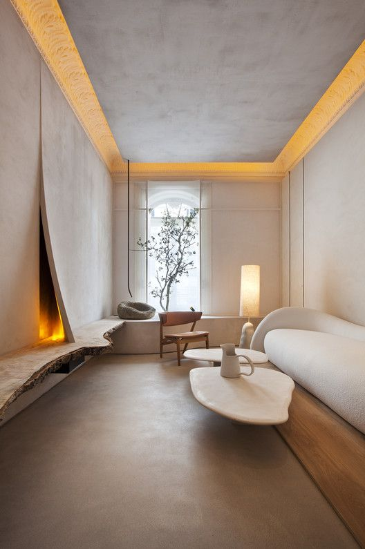

+++
date = 2022-04-06
title = "Ziua 85"
description = "Am ieșit pe terasă, de unde soarele mă salută de 'pe mâine' și m-a bușit plânsul. Plâng și pentru mine, plâng și pentru mama, mă simt și îndreptățită, mă simt și vinovată, e un talmeș-balmeș în sufletul meu și tot ce pot să fac e să plâng. Chiar azi dimineață întrebam o ființă dragă mie cum îi e sufletul și ea mi-a spus “Plin, plin, dă pe dinafară. Au început să curgă lacrimi”. Ia uite cum s-a lipit de mine și cum fac exact cum i-am răspuns “Foarte bine. Lasă-le să spele!"
authors = ["Biannca Locatelli"]
[taxonomies]
tags = []
[extra]
math = false
diagram = false
image = "images/ziua-85-final.jpg"
+++
---

M-am trezit brusc, nu știu de ce, dar părea că am un gând vigilent undeva care-mi sună o alarmă în creier. Din nou, am aceeași senzație de așteptare dar zău dacă știu ce aștept. Probabil a intrat în miezul meu suspendarea pe care mi-am pus-o pe viață și, din când în când, îmi dă câte-un ghes să știu că e prin mine, pe vreundeva.

***

Spiky nu e la noi, nici nu știu dacă a fost așa că pornesc spre parter să o descopăr. Încă e beznă, e momentul ăla în care se ridică perdeaua neagră și apar primii zori. Mândra noastră stă la geam, o fi ochit ea ceva în curte și cum mă simte, cum vine să se lamenteze pe la picioarele mele.

Mergem amândouă la bucătărie dar don'șoara vrea afară. E foarte devreme, e recișor, ea e hotărâtă și nu se lasă până nu ieșim. Odată ajunse pe terasă, am înțeles și de ce.

De anul trecut, este un pisoi care trece în mod regulat pe la noi prin curte. Pentru că seamănă, l-am numit Hitlerică. Vine pe la noi, marchează teritoriul, se aolește nițel și apoi își vede de drum. Spiky a noastră îl scuipă dacă se apropie prea mult dar altfel, e fix ca o adolescentă îndrăgostită, deși e sterilizată. În această dimineață, Hitlerică era în curte iar pe ea nu o răbda sufletul să nu iasă, să nu se vadă. Așa că m-am așezat pe terasă, în lumina difuză, pe răcoare, să observ baletul pe care-l fac ăștia mici. Ea se duce într-o parte a curții de flori și se tăvălește, în timp ce el o urmărește doar cu privirea. Pleacă ea de acolo, se duce el și se tăvălește peste, dar, ca să și parafeze, trage și un piș mic, așa, de marcare. Apoi, se retrage. Se duce Spiky. E o vânzoleală de te amețește. Vorba aia: mai bine și-ar lua o cameră. Într-un final, realizez că eu am alte treburi de făcut, o iau pe Spikylina în brațe să intrăm în casă și i-am simțit efectiv trupușorul cum vibrează în mâinile mele. Ce creaturi mișto! Ce ritualuri au și ele, așa primitive cum le considerăm noi. Mi-a făcut bine ieșirea afară și mutarea focusului pe love storyul lor.

***

Pe cameră văd că mama a deschis larg geamul și își aranjează patul. Bravo ei, hai că se pornește fain ziua asta! Pregătesc și eu smoothieurile și mă duc la ele sus. Totul e bine, e curat așa că popasul meu la ele se scurtează. Coana marea a obosit, acum s-a băgat din nou în pat de unde savurează smoothieul. Plec liniștită.

***

Îmi propun de ceva timp să fac ceva cu partea de abonare. Pentru că nu mi s-a părut important, nu am alocat timp pentru asta însă sunt persoane care-mi scriu că vor să primească pe email noile postări. Chiar nu mă așteptam la asta dar, dacă a venit, trebe să găsesc o modalitate să rezolv. Însă azi, în timpul meu magic, aș face altceva. O să rezolv și abonarea dar azi vreau să-mi hrănesc sufletul cu o meditație. Nu prea mai apuc să fac asta și sufletul meu are mare nevoie de conectarea la esențial. Una dintre cele mai vindecătoare stări care există pentru ființa umană este starea de permitere. Când permiți, devii fluid, ești o curgere prin lucruri și prin tine curg lucrurile. Nu mai este nicio piedică între tine și rest, care e tot parte din tine sau tu parte din rest. E totuna. Meditația este o stare de permitere și de încredere, când te lași să fii și atât.

Așa că las pluginul abonării pentru altă dată pentru că astăzi mi-am crescut mult suflet bun.

***

După mic dejunul mamei, care se petrece normal și natural, mă avânt să vântur materialul care s-a adunat în cutia de comportare de peste un an. Am mai luat o cutie așa că primul pas a fost să o asamblez. Apoi, a început cazna.

Anul trecut, după ce a început să crească trifoiașul, a trebuit să începem să-l tundem. Iar noi avem o curte mare așa că s-a strâns ceva. Domnul meu a îndesat în cutia de compostare cât a intrat iar restul l-a pus lângă. Well, în timp, s-a tasat și pentru că nu a fost aerat și nici udat, nu s-a descompus ci s-a făcut ca o clisă. Asta nu ar fi o problemă, frate, dar mirosul a fost într-un mare fel! Pestilențial e mic pe lângă ce am îndurat! M-am apucat să încarc în roabă și să-l împrăștii pe câmpul de lângă noi, să se usuce și să îngrașe pământul. O feerie! Nu mai zic că acolo își făcuseră casă șoriceii de câmp. La prima furcă băgată, au început să alerge în toate părțile iar eu să chiui de spaimă și să mă urc pe gard! De câte ori băgam furca să scot, mi se strângea stomacul la propriu dar ... și asta face parte din statul la casă. Nu mi-a făcut plăcere acțiunea în sine însă am luat notițe pentru cum să fac anul ăsta și am observat și ce nu s-a compostat. Din orice, înveți. Chiar și când îți pică părul din nas de mirosuri.

***

Am muncit vreo patru ore până m-am trezit cu mama pe terasă. Neobișnuit pentru ea atât de repede, i s-a făcut foame așa că intru să-i pun masa. Ocazie cu care descopăr că ea nu mai vrea să mănânce carne. Că nu mai poate. Iupppiii! Minunat! Sper ca mâine să nu zică altceva dar azi mă bucur ca un copil mic.

La masă, îi povestesc ce fac eu în grădină dar e absentă din nou așa că îmi las energia în rezervă, că mai am nevoie de ea azi. Îi dau temă pentru acasă să se gândească ce mâncare vrea să-i fac și-mi promite că-mi spune la table. Când aud răspunsuri de genul ăsta, îmi dau seama că face totuși conexiuni și din nou intru în ceața aia în care nu mai înțeleg nimic.

***

Termin cât pot afară, dar nu știu cum am reușit, și de ce, să am o starea nașpa. Nu am mai avut enervarea de mult în farfurie și azi s-a hotărât să mi se bage pe sub piele. Mă irită că afară e frumos și eu trebe să mă duc să joc table. Iar mama nu suportă lumina, stă cu jaluzelele, care sunt blackout, trase și e o beznă oribilă în cameră față de lumina superbă de afară. Mă irită, DIN NOU, că nu sunt stăpână pe timpul meu. Mă irită că în fiecare zi, cel puțin două ore plec din viața mea iar ea îmi urlă în urechi că e scurtă.

***

Deja cu capsa pusă, mă duc la tablele vieții. Dacă m-aș fi dus să o aduc afară pe terasă, o dureau toate cele. Dacă mă duc la table, sare sprintenă din pat și nu o doare nimic. Iar azi, până și asta mă irită.

În timp ce jucăm, o întreb ce să gătesc mâine și pare că nici nu mă aude. Repet întrebarea și, cu privirea în jos, îmi zice că nu știe ce vrea. La cât sunt de butoi de pulbere, e fix ce trebuia. Cred că simte iritarea mea din voce, o văd cum i se încrețesc buzele, deci are o reacție în ea dar nu zice nimic.

De unde naiba oi fi agățat starea asta tâmpită? Oi fi obosită. Cert este că în timp ce jucam table parcă m-a plesnit peste minte o conștientizare: eu sunt acum responsabilă pentru viața mamei! Nu mi-am dat seama de asta! La vârsta asta, când unii călătoresc în toată lumea sau au nepoți, eu am al doilea copil de care trebe să am grijă: mama.

Am terminat de jucat table în liniște, deși eu cred că scoteam fum pe urechi de nervi și pentru că nu a vrut duș, am zis mulțumesc în sinea mea și m-am tirat de acolo. Nu mai suportam să stau o secundă în plus.

***

Îmi vine să ies afară și să urlu, să zvârl cu toată forța mea din mine nervii ăștia și să mă descarc. Pe mine nu m-a întrebat nimeni dacă vreau să am un nou "copil". Într-un mod brutal, nu mi se pare deloc corect. N-am înțeles nimic din viața mea până acum câțiva ani și acum am luat-o de la început. Da, știu, sunt mai înțeleaptă dar uite că azi n-am chef să fiu. Azi sunt, DIN NOU, revoltată pe situația pe care trebe să o accept. Nu pot, frate, să fac pace cu ea și basta. Azi am impresia că mă păcălesc cu frânturi de momente de bine dar mă fac că nu văd ditamai elefantul din cameră care mă calcă pe fiecare nerv. Și de dimineață am meditat…s-a spart balonul în care băgasem toată starea aia de bine și s-a dezumflat în doi timpi și trei mișcări.

Am ieșit pe terasă, de unde soarele mă salută de "pe mâine" și m-a bușit plânsul. Plâng și pentru mine, plâng și pentru mama, mă simt și îndreptățită, mă simt și vinovată, e un talmeș-balmeș în sufletul meu și tot ce pot să fac e să plâng. Chiar azi dimineață întrebam o ființă dragă mie cum îi e sufletul și ea mi-a spus "Plin, plin, dă pe dinafară. Au început să curgă lacrimi". Ia uite cum s-a lipit de mine și cum fac exact cum i-am răspuns "Foarte bine. Lasă-le să spele!"

Știu că este doar o stare trecătoare. Mă arunc în ea cu totul, să simt tot ce e de simțit și să se consume ca un chibrit aprins. Doar că aș vrea să nu se mai aprindă din nou peste o săptămănă, o lună sau două. Ca nici nu îndrăznesc să scriu un an, nu pot să gândesc un an, nu vreau să aud un an.

***

Așa amărâtă cum sunt acum, sunt recunoscătoare:

1. Oamenilor dragi din viața mea, ăia puțini dar buni!
2. Soarelui care-mi privește cald lacrimile și deznădejdea!
3. Domnului meu, lângă care pot să duc mai ușor ce e de dus!

Și clipa mea de frumos este:

  

Lorna de Santos design

 

 

  

    <a href="/blog/ziua-84/">Postarea anterioară</a>
  

  

    <a href="/blog/ziua-86/">Postarea următoare</a>
  

