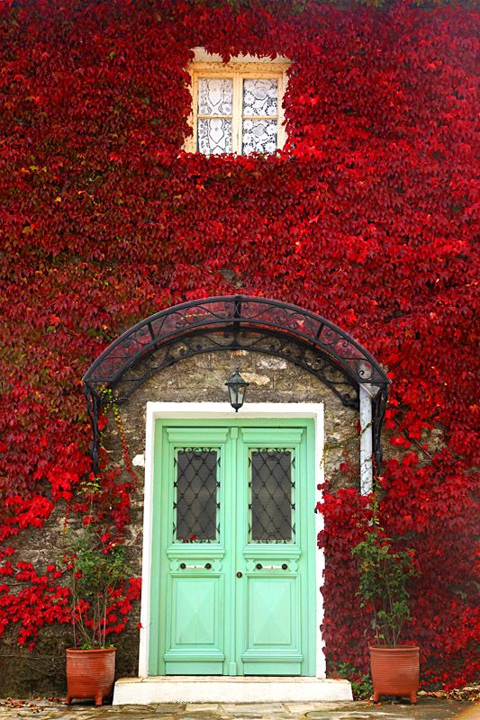

+++
date = 2022-04-08
title = "Ziua 87"
description = "Nu poate susține mult timp atenția, așa că simt mai mult decât văd, cum mama închide frecvența. Se ridică în timp ce eu încă vorbesc și pornește spre camera ei. Până acum, nu am reușit niciodată să nu rămân perplexă la acțiunile astea fără niciun sens pentru mine: cum poți să decizi să pleci când cel cu care ești încă îți vorbește? Sau cine decide să plece? Ce parte din mintea ei preia controlul și trimite comanda către corp să se miște și să ignore partea aia care încă ar asculta? Probabil că, în viața asta, nu voi ști. Aș vrea să nu știu și aș vrea să nu aflu pe pielea mea."
authors = ["Biannca Locatelli"]
[taxonomies]
tags = []
[extra]
math = false
diagram = false
image = "images/Ziua-87-final.jpg"
+++
---

În casa noastră, fiecare are câte o obsesie. Noi începem să ne prindem că obsesia Chichiricăi, aka Spiky, este să râcâie în noapte, cât mai în noapte, la ușile dulapurilor de la noi din dormitor. Cu cât îi ceri să se oprească, cu atât face mai rău. O mică personalitate diabolică.

Așa se face că mă dau jos din pat mai devreme decât preconizam sau speram, să opresc micul monstruleț. O iau după mine, mai mult o simt cum mi se strecoară printre picioare că de văzut, în bezna asta și cu blana ei de catifea neagră, n-am nicio șansă.

***

Dacă la ușile dulapurilor n-a avut succes, îmi încearcă nervii și rezistența la ușa din bucătărie ce dă spre terasă. Afară, beznă totală. Dar ce contează, hai să ieșim.

Am înregistrat sublimul să nu cumva să cred că am visat.

Triluri care îți picură balsam pe urechi și suflet, se aude și un fazan, e o magie de care nu m-aș dezlipi deloc. Spiky s-a dus la treaba ei iar eu am rămas pironită ascultând viața deși am văzut că mama e trează. Pur și simplu, mi s-a oprit timpul în loc. Și-n clipa asta mică dar atât de mare, îmi promit mie că în viitorul apropiat, o să ies la prima oră pe terasă și o să stau pe salteluță, să meditez. Să mă pierd în tot și toate și să mă adun din tot și toate.

***

Mă întorc la lucrurile triviale din bucătăria mea și dau din mâini ca să recuperez din activități și să mă duc la fetele de la etaj. Pe Spiky o las p-afară că oricum plănuiesc să termin sus și să revin pe terasă.

Deschid ușa încet și primul care aspiră este nasul. Dacă nasul nu detectează durități, corpul alunecă ușor pe ușă. Totul în fracțiuni de secundă dar azi am fost capabilă să văd astea ca și cum eram în slow motion. Azi e curat, a făcut și la Sassy curat, cât mă bucură așa dimineți. Deschid doar să aerisesc un pic, îi dau ei smoothieul și lui Sassy păpica, testez apele și toate-ș liniștite, fără valuri așa că parcă mă gogoșesc o țâră de bine și de aici. Suntem amândouă zâmbitoare, ies și îi spun că ne vedem la mic dejun.

***

Îmi iau smoothieul și țuști pe terasă. Deja se luminează, micuța coconet explorează curtea sau caută loc pentru nevoi, e tare mișto afară. În fața porții apare un fazan, ce ciugulește timid semințele aruncate de mine ieri. Nebuna de Spiky ia poziția de vânător deși, ochiometric, fazanul o depășește în dimensiuni. Observarea naturii și a ființelor din ea a început să mă bucure nesperat de mult. Am strigat încetișor la mândră să-l lase în pace pe domnul fazan, să mă bucur și eu de coloritul cu care s-a costumat dar pesemne că l-am speriat că a luat-o la fugă în câmp, prin pârloaga care este dincolo de gardul meu. Spiky mă privește ca și cum m-ar certa că i-am alungat prada. Neînfricată, asta mică!

***

Simt o ușoară apăsare, o umbră de durere s-a așezat pe cap. Îmi fac o cafea și rămân în casă, pentru că vreau să dau niște emailuri administrative. Prinsă în structurarea lor, nici nu-mi dau seama când zboară timpul și mi s-a terminat bucata de vreme cea mai faină din zi. Iar, un gând mic, de promisiune, zboară razant prin minte și-mi strigă din mers că o să am grijă să măresc timpul magic puțin câte puțin în fiecare zi. Să scap de eticheta aia pe care am pus-o cândva, când am decis că dimineața mea își închide programul de lucru doar cu persoana mea la maxim 9:00.

***

Întâi îl acompaniez domnul meu la mic dejun, apoi pe coana mare, pentru că primul nu e încă refăcut complet după răceală. Încărcată cu bine de la Mr. H, sunt hotărâtă să-i dau înapoi și mamei din ce am primit eu azi dimineață. Și sporovăiesc o grămadă, deși mă împunge prietena mea, durerea de cap.

Ieri, vecinul meu, din nou, mi-a adus diverse chestii de mâncare, sub pretextul că împarte de pomană pentru răposata lui soție. A reținut el că mănânc doar vegetale așa că a strecurat și d-astea. Azi i le arăt mamei și o pun să aleagă ce vrea din ele în timp ce eu îi povestesc despre viața bătrânului, așa cum am reținut-o de la el. Mama mă ascultă cu atenție, ceea ce e rar, mă privește și îmi dau seama că pe noi, oamenii, în genere, ne fascinează poveștile de viață. Si că toți oamenii, fără excepție, au o poveste de viață fascinantă. Cum e și normal să fie, pentru că fiecare experimentează și simte diferit.

Nu poate susține mult timp atenția, așa că simt mai mult decât văd, cum mama închide frecvența. Se ridică în timp ce eu încă vorbesc și pornește spre camera ei. Până acum, nu am reușit niciodată să nu rămân perplexă la acțiunile astea fără niciun sens pentru mine: cum poți să decizi să pleci când cel cu care ești încă îți vorbește? Sau cine decide să plece? Ce parte din mintea ei preia controlul și trimite comanda către corp să se miște și să ignore partea aia care încă ar asculta? Probabil că, în viața asta, nu voi ști. Aș vrea să nu știu și aș vrea să nu aflu pe pielea mea.

***

Astăzi Maya face ecografia abdominală, să vedem de la ce ar putea să o ia razna acizii biliari. Deși nu vreau, am ceva emoții prin stomac și ceva gânduri care mă tranzitează. Le las să treacă, nu vreau să mă împrietenesc cu niciunul și nici să-l aprofundez prea mult, să nu-l măresc în energie. Vrea să fac puțină liniște în mine ca să mă ascult.

Acum câteva zile, domnul meu îmi zicea că a văzut un video din care a desprins ideea că corpul nu minte. Ideea asta s-a prins și de mine acum doi ani și am simțit-o din prima ca fiind adevărată, pentru mine. Există diverse forme de a-ți interoga corpul dar mie mi-a plăcut testarea kinesiologică a lui David Hawkins. O aplic când am dileme mari dar, în ultima vreme, practic o formă simplistă: fac liniște în mine și îmi simt corpul în timp ce mă gândesc la ce vreau să aflu. Dacă corpul mi se crispează când gândul defilează prin spațiul meu, mi-e clar că nu e de bine.

Asta mi-aduce aminte de o întâmplare care mi-a validat acest mic proces pe care îl fac eu cu mine. Eram cu o prietenă dragă la Brașov, să se ocupe de înmormântarea unei rude, ea fiind singura capabilă să facă asta. Am plecat dimineața foarte devreme cu trenul și nu am apucat să vorbesc cu mama, cum o făceam de obicei. Am sunat mai târziu la ea dar nu a răspuns. Ne-am văzut de alergăturile care însoțesc astfel de evenimente, și, din când în când, mai sunam. De pe la 10 dimineața până pe la 15:00 cred am sunat la intervale de jumătate de oră. La biserică eu am așteptat afară, pe o băncuță. O zi frumoasă, cu un soare blând. Mi-am închis ochii și mi-am întrebat corpul dacă mama e bine. Liniște și niciun mușchi încordat. Așa am știut că totul e bine. La nici o jumătate de oră după această scanare, m-a sunat mama care-și dăduse sonorul telefonului la minim și evident că nu auzea când suna. Din acel moment, am preluat acest instrument atât de simplu și de la îndemână și-l aplic ori de câte ori e posibil. Pentru că cheia succesului este să fii capabil să te liniștești. Dacă urlă frica în tine, deja corpul ți-e în modul de fight or flight și nu e un indicator bun.

Așa că azi m-am scanat și am fost calmă. Lucru confirmat și de rezultatul ecografiei. Toate sunt bune ecografic...

***

Nu scap de durerea de cap care începe să se adâncească. Ies pe terasă și mă scald puțin în soare și în vânticelul ăsta mic care se agită. Nu știu cât am stat așa pe scaun dar cert este că mi-a făcut tare bine. Mi-a atenuat durerea și cred că am și ațipit oleacă, sprijinită într-un cot. Am avut o stare portocalie, dacă pot să o numesc așa. Plină de mișto.

***

Nu pot să finalizez căratul clisei din lada de compost pentru că a plouat cu găleata ieri și e o mocirleală și un miros de nici nu mă pot apropia. Plus că trec țepii furcii prin clisă ca prin brânză. Numa' bine că și-așa mă doare capul. Cum le aranjează Universul ăsta pe toate: vede el că eu sunt Batman, nu mă las împiedicată de o durere să fac treabă cât cuprinde și creează el contextul care să mă înfrâneze. Că poate așa înțeleg.

***

Dacă tot mai am puțin timp liber, mi-l petrec făcând puțină căutare de piață pentru o țesătură cu care vreau să retapițez niște fotolii vechi. Am descoperit acum doi ani un site în UK cu super produse la super prețuri și vreau să caut acolo. Sunt doar vreo 13.000 de materiale…nu-mi ajunge timpul dar încep. Întotdeauna mi-a făcut plăcere să sap după ceva ce caut, fie că e țesătură, tapet, obiecte de decor, veselă sau mobilă. Așa că a zburat timpul ca nebunul și m-am trezit cu Mr. H la prânz și apoi, imediat după, cu coana mare.

În timp ce ea mănâncă, ca de obicei fără reacții, îi fac ceai domnului meu, să forțăm cu lichide să-l părăsească viroza asta de s-a lipit de el. Mama mă întreabă ce fac, îi spun, îi dau să miroasă ceaiul care e o nebunie de portocală și vanilie și închid subiectul. Apa fierbe în câteva minute, timp destul pentru ca mintea ei să ia buretele, să șteargă și să mă întrebe din nou ce fac. Nu mai reiau tot procesul de mai devreme ci doar răspund simplu că ceai. Pentru cine? Pentru domnul meu. Și chiar plec să i-l duc pentru că dacă mai stau câteva minute, mă va întreba din nou. Azi e o zi din aia, în care memoria de scurtă durată s-a comprimat la foarte scurtă durată. La întoarcere, mă întâlnesc cu ea care terminase și cu dumicatul în gură, pleacă spre cameră. Un "ne vedem la 17" lansat în aer la care nici nu așteaptă răspuns. Nu știu cine o aleargă așa.

***

Mai un strop pe terasă, mai cu copila la discuții, mai cu căutatul, timpul ăsta de după prânz trece mai mereu fără ceva palpabil. De multe ori, în el mă simt o țâră pierdută, cam fără sens așa pentru că orice aș vrea să apuc, nu prea am timp să și termin. Așa că stau într-o atârnare d-asta în care vreau să le fac pe toate și nu fac nimic cap coadă. E bine să te simți pierdută că măcar știi că trebe să te cauți. Am trăit prea mult timp într-o îngâmfare și o emfază pline de gol, în care credeam că știu cine sunt și de ce sunt unde sunt. Acum am scăpat, cu bine, de certitudinea asta și măcar știu că sunt pierdută și că încep să mă găsesc, bucățică cu bucățică. Mișto e că găsesc cu totul altceva decât gândeam și credeam eu că sunt. Dar e un deliciu traseul ăsta.

***

În timpul tablelor, mi-a dat copila un zoom cu Maya noastră, că ea a trebuit să fugă de acasă și așa o monitorizează de la distanță. Mi s-au umplut ochii instantaneu de lacrimi privind cum suflețelul ăsta, de care mi-e un dor teribil, doarme pe o parte, pe canapea. E și rașchetată pe pielicică că au ras-o azi la ecografie și e o scumpă. Mâine voi sta cu ea puțin și număr orele până atunci.

I-am arătat-o și mamei, i-am spus că mi-e dor de ea dar nu pare să fi ajuns la inimă informația asta. Că nu a emis nicio energie de empatie sau simpatie.

Pentru că nu dădea cu zarul ce voia, se enerva și vorbea urât. I-am atras atenția și am întrebat-o de ce vorbește așa. A răspuns senin că așa vrea. Corect, cine sunt eu să vreau altceva?!

***

Se apropie de închidere și ziua de azi, dar sufletul meu i-a șoptit Universului un mulțumesc plin de recunoștință pentru:

1. Diminețile superbe la care am acces!
2. Privilegiul de a sta unde stau!
3. Lupa asta pe care mi-am pus-o pe viață și care mă încântă zilnic, chiar dacă nu mereu îmi place ce văd!

Și frumosul meu este

  

 

 

  

    <a href="/blog/ziua-86/">Postarea anterioară</a>
  

  

    <a href="/blog/ziua-88/">Postarea următoare</a>
  

