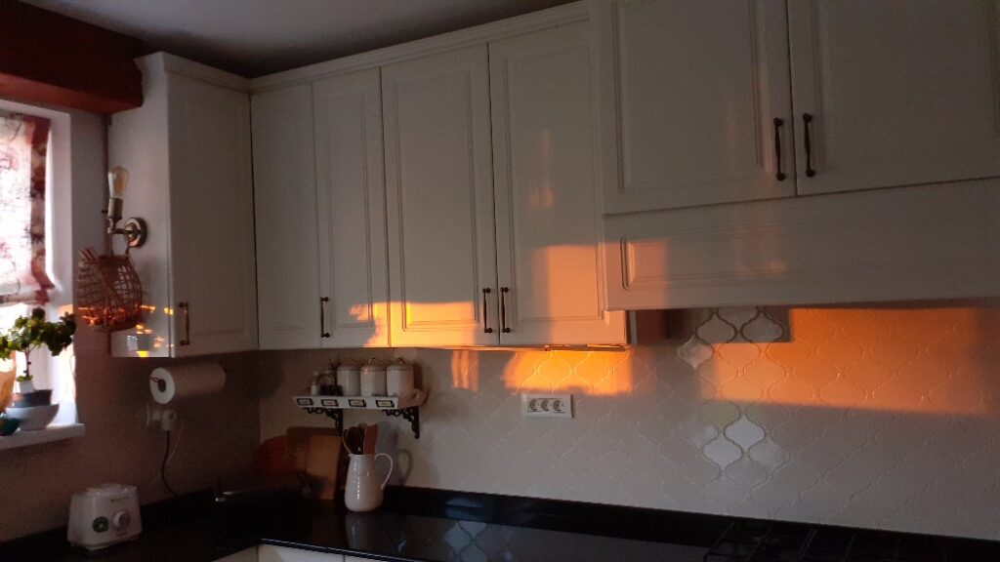
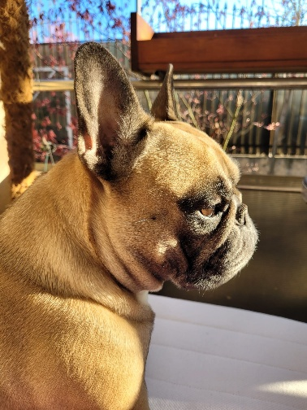

+++
date = 2022-04-09
title = "Ziua 88"
description = "Ok, mă observ din ce în ce mai mult, dar care e next level? Că mă tot observ de ceva timp și parcă sunt ready pentru mai mult. Aici m-a pălit lumina adevărului: de ce trebe să fie un next level?! De ce trebe să facem ceva ca să ajungem undeva?! Ptii, da’ ce subtilă e asta. Atât de adânc s-a dus în mine că m-a trecut cu fiori prin tot corpul. Păi stau așa toată viața și mă observ? Răspunsul mi-a venit clar și răspicat, din mine: DA, fix așa! Pentru că schimbarea se întâmplă fără să o conduci tu. E ca la scrisul ăsta al meu zilnic. Eu doar am scris. Dar s-a așezat în mine un strat de profunzime, de articulare, de trăire, de observare pe care nu l-am urmărit eu. A venit ca o consecință. Cum ar fi dacă, observându-mi viața, ajung să nu mai judec? Cum ar fi dacă, cu lupa asta pe mine, ajung să mă bucur de viață (mai) mereu? Cum ar fi dacă, cuprinzându-mă cu drag și în susurile dar și în josurile ființei mele, ajung să-i cuprind pe toți la fel?"
authors = ["Biannca Locatelli"]
[taxonomies]
tags = []
[extra]
math = false
diagram = false
image = "images/ziua-88-final.jpg"
+++
---

La 03:22, micul coconet al casei a început clasica-i operațiune, râcâirea insistentă. E prea devreme totuși și înfrântă-n hotărâre, deschid toate ușile dulapurilor, să se bage unde vrea. Dar nu vrea, perversa! Doar le vrea deschise, să știe ea că are acces. Cu o dojana pe limbă dar și cu un zâmbet mic pe buze, alunec rapid înapoi în pat. Mai am puținel și trebe să mă trezesc de-a binelea.

Episodul doi al serialului în care joacă coconetul nostru, Spiky, care acum are ușile larg deschise, se petrece la 5 și ceva, când vrea să vadă lumea de la fereastra noastră. Dar sunt perdelele trase și nu știe pe unde să se strecoare. Face calcule, se perindă de colo, colo dar cred că greșește la cotangentă că nu-i iese din prima și cade pe parchet. Normal că m-am trezit. Domnul meu are căștile în urechi și nici n-a tresărit dar la mine aplecat de tot fratele somn.

***

Coborâm și ne oprim direct pe terasă. E un strop mare de magie dimineața acolo. Nu mai e frig, e atât de plăcut că mi-ar plăcea să opresc timpul, să-l îngheț pe cadrul ăsta o bună bucată din viața mea. Aș putea sta pe repeatul ăsta o grămadă, fără să mă plictisesc sau satur.

Cu smoothieul la purtător, medicamentele și mâncarea lui Sassy, mă prezint la datorie. La mama e bine, curat așa și așa, mă avânt voinicește să termin ce e de făcut ca să mă bucur puținel de timpul meu.

O anunț pe coana mare că azi voi pleca la copila mea câteva ore, că are nevoie să stea cineva cu Maya, să o supravegheze. Îmi dă semne că înțelege că plec dar în curând îmi dau seama că doar fracționar. A înțeles că plec dar nu a reținut  când. Nu mi-e clar cum percepe ea timpul, mi-am dat seama mai demult că țopăie pe axa timpului haotic, că mintea ei nu mai are liniaritatea unei minți "normale" așa că nu știu cum să pun în cuvinte informația să ajungă la ea. De fapt, nici nu știu dacă trebe să ajungă la ea.

***

Cobor în timpul meu pe care mi-l împart cu Spikylina, ce mă așteaptă cuminte la ușa bucătăriei, pe dinafară. Și-a terminat nevoile și așteaptă să-i validez permisul de ședere în casă. Îmi place personalitatea ăsteia mici și o descopăr cu bucurie, pic cu pic. La fel o și accept.

Soarele-mi intră în casă și desenează umbre portocalii pe pereți.

  

Nu ai cum să fii insensibil la frumusețea vieții. Și totuși, am fost atâta amar de vreme, că eu nu aveam timp de văzut, eu întotdeauna am avut multe de făcut, eram victima mea și a timpului meu și a vieții mele. Observ, pe zi ce trece, o mai mare ușurință de a vedea lucrurile și o mai mare claritate. Pesemne că vine cu vârsta sau cu faptul că am lăsat hățurile alea din mână cu care mă biciuiam și alergam prin viață ca vântul. Simt că și micul fapt mare de a sta să privesc ce e în jurul meu echivalează cu o spălare zdravănă de ochi.

***

Voi avea o zi plină, trebe să-mi pun în minte o înșiruire de activități așa că jumate din timpul dimineții se duce în calcule, analize și to do list. Cică e weekend.

O aduc pe mama la micul dejun și mă mișc cu talent pentru că va trebui să plec pentru câteva ore bune. Recunosc că îmi saltă sufletul în mine și am sclipici în vene de bucurie. În primul rând, azi voi sta cu Maya pe îndelete, doar noi două, ca-n vremurile bune. Mi-e atât de dor de ea că doare. În al doilea rând, mai ies și eu din mediul ăsta în care mă mișc de mai bine de trei luni iar asta îmi pune foc sub tălpi. Me happy!

Pentru că am o stare de zbor și pentru că e weekend, o recompensez pe mama cu o cafeluță mică. Așa că acum suntem două fete cucuiete happy! Termină micul dejun, strâng, spăl și sunt liberă pentru câteva ore!!

***

Nu mi-am imaginat vreodată că poți aduna în inimă așa sentimente față de o ființă non-umană. Cum nu mi-am imaginat că Maya a strâns ea în pieptișorul ei atâta iubire pentru mine. De când am intrat pe ușă, a început să scâncească, a sărit și m-a pupat vreo 10 minute, era o efuziune și efervescență între noi că mi-au curs lacrimile fără niciun zăvor. Doamne, mi-a fost dor până și de mirosul ăsta al ei, de câine. De năsucul ei care e doar o părere de năsuc, de ochișorii ca două mărgele ale Universului, de boticul ăla care îi transformă chipul de zici că-i un omuleț veșnic supărat sau îngrijorat. Ne-am jucat, alergat, jughinit, iar jucat, iar alergat, până când a căzut lată. Dar nu oricum, ci pe mine, cu capul pe umărul meu, cu ochii aproape de ochii mei, de m-a umplut momentul ăla de toată iubirea din lume. Aproape că nu mai respiram, sorbind cu nesaț cu ochii fățuca ei iubită, cu nasul mirosul ei specific, cu mâinile mângâind-o atât de tandru cum parcă n-am făcut-o niciodată. O iubesc cu toată ființa mea!

Am stat și afară, pe terasă, la soare. Am mângâiat-o aproape non stop iar când mă opream, se întorcea brusc să se asigure că sunt lângă ea. I-am povestit ce-am mai făcut, i-am șoptit că o iubesc, mereu și mereu, cred că dorul ăsta al meu a căptușit în el toată nevoia mea de libertate pentru că am simțit azi aproape fizic, în el, greutatea lipsei puiului meu blănos.

Au trecut orele ca o clipă. Nu-mi venea să cred că se întorc copii acasă… mi-am înghițit părerea adâncă de rău cu gândul că mâine voi veni din nou câteva ore la ea.

***

Orice îmi spun, în mașină spre casă, plâng cu sughițuri. Știu că este un atașament puternic, știu că nimeni nu e veșnic, știu toată teoria dar mama ei de treabă, îmi vine să întorc mașina și să-mi aduc bubuța înapoi acasă. Să stăm noi, cum o făceam odinioară, dimineața la șuetă, să se încordeze ea la oricine vine mai aproape de mine dintr-o gelozie pură și nevinovată, să facă scandal la orice, din senin, că așa e ea, efervescentă, să moțăim amândouă, să fie cu noi. Dar nu mai este posibil și nu va mai fi de acum înainte. Așa că merg mai departe, spre casa noastră dar departe de Măyuca.

***

În mașină, e moment de introspecție.

Ok, mă observ din ce în ce mai mult, dar care e next level? Că mă tot observ de ceva timp și parcă sunt ready pentru mai mult. Aici m-a pălit lumina adevărului: de ce trebe să fie un next level?! De ce trebe să facem ceva ca să ajungem undeva?! Ptii, da' ce subtilă e asta. Atât de adânc s-a dus în mine că m-a trecut cu fiori prin tot corpul. Păi stau așa toată viața și mă observ? Răspunsul mi-a venit clar și răspicat, din mine: DA, fix așa! Pentru că schimbarea se întâmplă fără să o conduci tu. E ca la scrisul ăsta al meu zilnic. Eu doar am scris. Dar s-a așezat în mine un strat de profunzime, de articulare, de trăire, de observare pe care nu l-am urmărit eu. A venit ca o consecință. Cum ar fi dacă, observându-mi viața, ajung să nu mai judec? Cum ar fi dacă, cu lupa asta pe mine, ajung să mă bucur de viață (mai) mereu? Cum ar fi dacă, cuprinzându-mă cu drag și în susurile dar și în josurile ființei mele, ajung să-i cuprind pe toți la fel? Cum ar fi? Hai să vedem!

***

O țâră mai sus cu spiritul, am ajuns acasă fix la timpul tablelor. E drept, că oricât de liberă m-am vrut eu azi, am stat cu un ochi pe cameră mai tot timpul. L-am anunțat mereu pe domnul meu dacă vedeam inițiative de coborâre dar, în linii mari, mama a fost cuminte.

Se bucură când mă vede, nu știu dacă pentru mine sau pentru table. Are o stare mișto și vreau să o întrețin, chiar dacă vin puțin tăvălită și epuizată emoțional după monologurile și plânsul din mașină.

Reușesc chiar să mă simt bine cu ea și la nivel energetic. Simt că are o vibrație ok, nu e îmbibată cu nicio aberație, e calmă și, pe alocuri, caldă. Nu m-a întrebat nimic nici de copilă, nici de Maya și nici eu nu am povestit nimic pentru că lacrimile erau pregătite să se pornească și n-aș fi vrut să stric momentele faine.

A fost ok cu baia, doar că m-a rugat să o las să se spele singură, să se descurce singură. De la momentul ăsta până la intratul sub duș, a uitat, așa că mi-am suflecat mânecile și am tăcut mâlc, să nu o fac să se simtă prost.

E primenită și drăgălită, în pat și-mi aruncă așa, timid, că ar vrea și ea un telefon. Avem discuția asta aproape zilnic și tot zilnic îi arăt telefonul ei și cum să-l folosească. Are scriși și pașii. Îi spun astea și îi spun, delicat, că am încercat dar că memoria ei de scurtă durată nu mai reține. A lăsat ochii în jos și a zis mic: "mai încearcă, nu renunța..."

Aproape că am fugit din cameră. Oricum aveam lacrimile în gât dar durerea pe care i-am simțit-o în ce a zis, m-a străfulgerat. Își dă seama, cel puțin în seara asta a știut, că uită. A pus în acel "mai încearcă, nu renunța" și jenă, și tristețe, și frustrare, și frică și eu le-am simțit pe toate.

Da, mamă, mâine, exersăm din nou. S-a liniștit.

***

O zi plină, cu de toate, dar și cu recunoștință pentru:

1. Copila mea care mă copleșește!
2. Existența Mayei în viața mea!
3. Apropierea asta faină pe care am avut-o din nou cu mama mea!

Frumosul meu azi nu poate fi decât Maya:

  

 

 

  

    <a href="/blog/ziua-87/">Postarea anterioară</a>
  

  

    <a href="/blog/ziua-89/">Postarea următoare</a>
  

