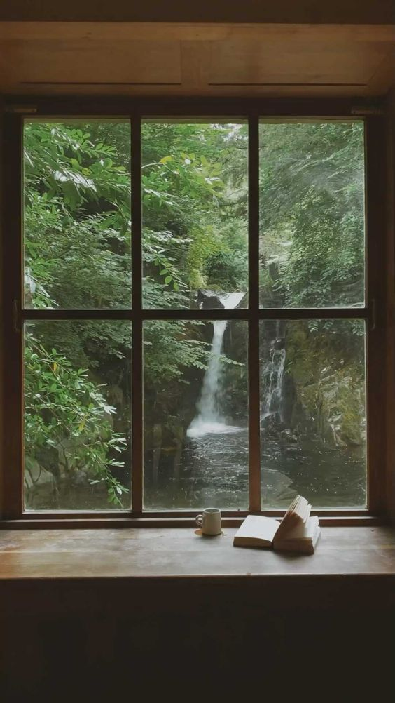

+++
date = 2022-04-10
title = "Ziua 89"
description = "M-am prins că trebe să ies din zona lui 'habar n-am de ce mi s-a întâmplat aia sau ailaltă' și să pun lanterna pe momente, să văd ce adună ele în matca lor de-mi aduc de prin eter sora frustrare sau prietena deznădejde. Life is a making, they say. Păi dacă tot ne-o facem, să fim atenți la cum, zic. Că e imposibil să ai numai greutăți în viață, în fiecare zi. Umplută până la refuz de situație, dacă mă uit atent la ce am făcut, îmi dau seama că, inconștient, mi-am creat mici momente de respiro, de unde-mi trăgeam nițică sevă să merg mai departe. Și, cu timpul, am lărgit gurile alea de aer și le-am făcut pâlnie să-mi toarne Universul și mai multă sevă."
authors = ["Biannca Locatelli"]
[taxonomies]
tags = []
[extra]
math = false
diagram = false
image = "images/ziua-88-final-1.jpg"
+++
---

M-am trezit la 5:23, cu câteva clipe înainte de a auzi lipăitul lăbuțelor de Spikylină pe parchetul din dormitor. Era ca și cum își trimisese spiritul înainte să mă anunțe, vezi că vin.

Animăluțele astea, de prea mult bine, inventează tot felul de situații. Ca să preîntâmpinăm trezirile precoce, seara, eu și domnul meu avem o listă de verificări: ai deschis ușa la șifonier? Checked! Ai deschis ușa la dulapul de lenjerii? Checked. Ai tras perdelele în laterale? Checked! Abia după ce bifăm toate căsuțele de verificare, ne putem pune și noi liniștiți la somn, că, omul când nu are probleme, și le face. Well, deși am acoperit toate spețele, nu ne-am gândit că gâgâlicea o să aibă chef să ronțăie, în miez de noapte, lanțul de la storurile geamurilor. Așa că p-asta n-am înclus-o în clauzele de avarie și ne-a dat trezirea. După trei ridicări din pat, dat jos pisica de la geam, ușuit pisica să iasă din cameră, revenit, dat jos, ușuit, m-am prins că nu are sens. Hai să mergem, bestie mică!

***

Devine obicei să ieșim pe terasă, imediat ce coborâm. Și dacă n-aș vrea eu, coconet zgârie la ușă până mă lasă răbdarea, care nu e nici ea prea multă sau prea trezită la orele astea matinale. Dar, ce e drept e drept, e o bucurie plină să fii în palma naturii la ceas mic, să simți efectiv cum te străbate și faci parte din pulsul vieții care vrea o nouă zi, parcă-ți simți contribuția la bătăile inimii planetei. Mă simt atât de mică în vastitatea Universului dar mă simt și atât de integrată în el ca o rotiță care, doar prin simplul fapt că există, asigură mersul armonios al întregului angrenaj. Respir adânc, mă umplu de toate aromele din jur și-mi urez o zi faină.

***

Intru în casă alt om. Cu mintea clară, creierul oxigenat, respirațiile astea adânci sunt extrem de reconfortante. Am observat în ultima perioadă că simt nevoia din ce în ce mai mult să inspir adânc și la expirare parcă să expulzez tot ce nu-mi folosește. Ca să nu mai zic, că la nivel fizic, o respirație adâncă aduce o anumită ușurare. E un instrument incredibil respirația noastră. Păcat că nu îl folosim.

M-am lălăit în dolce far niente pentru că m-a trezit Chichirica prea devreme dar văd pe cameră că s-a aprins lumina și la mama, așa că mă apuc de foarte micul dejun, smoothieurile.

***

Când ajung la mama, deja e deschis geamul iar ea își face patul. Draga de ea, asta e mama mea, toată viața ei știută de mine a fost ordonată și curată. Nu o întrerup, o încurajez să termine de aranjat patul, eu mă duc să curăț litiera lui Sassy, așa că e activitate în toi și la ele, la prima oră. Mă ung pe suflet momentele astea "normale" între noi două.

***

Am coborât cu o super stare de bine.

Îmi dau seama că totul este o potrivire vibrațională. Orice atrag, atrag pentru că în mine există un magnet care absoarbe cu putere perechea "dinafară". Atunci când vine în viața mea ceva ce nu vreau sau nu-mi place, vine pentru că are invitație specială de la ceva din mine care are nevoie să iasă la suprafață. Și să fie vindecat. Nu e o atragere de poli opuși, eu am cu minus, Universul vine cu plus sau invers. E cui pe cui. Sunt tristă, Universul vine și-mi așează în poală toată pătura aia de tristețe pe care o alimentează o planetă întreagă. Nici nu-i de mirare că mă simt copleșită câteodată.

Uite așa, scriind, m-am prins că trebe să ies din zona lui "habar n-am de ce mi s-a întâmplat aia sau ailaltă" și să pun lanterna pe momente, să văd ce adună ele în matca lor de-mi aduc de prin eter sora frustrare sau prietena deznădejde. Life is a making, they say. Păi dacă tot ne-o facem, să fim atenți la cum, zic. Că e imposibil să ai numai greutăți în viață, în fiecare zi. Umplută până la refuz de situație, dacă mă uit atent la ce am făcut, îmi dau seama că, inconștient, mi-am creat mici momente de respiro, de unde-mi trăgeam nițică sevă să merg mai departe. Și, cu timpul, am lărgit gurile alea de aer și le-am făcut pâlnie să-mi toarne Universul și mai multă sevă.

***

Din nou, mi-am bucurat sufletul cu design interior. Sunt o consumatoare avidă de design și mi-a dezvoltat și rafinat stilul propriu nesperat de mult. Pentru mine, designul interior este o stare. Trebe să-ți dea o trăire mișto. Un mood. Altfel, e doar o aglomerare de lucruri, ca să bifezi și să umpli un spațiu, o conviețuire sterilă. Faptul că nu am avut bani să și mobilăm casa când a fost gata, a fost o binecuvântare. În multe sensuri. Evident că atunci eram frustrată și nu vedeam decât partea goală a paharului dar acum pot să văd cât de fain au făcut toate click în puzzle. Fiecare lucrușor din casa noastră a fost ales cu drag și a generat un zvâc în sufletul meu. Și-l generează constant.

Așa că designul interior e ca viața. Ar fi fain să nu înghiți pe nemestecate experiențe și evenimente doar ca să umpli timpul, că-ți furi singur căciula. Să le savurezi încetișor, să le adulmeci, să vezi diamantul din mocirla aia care te împroașcă la prima vedere.

De abia aștept să-mi fac din peretele din baia mică o stare. Caut și cumpăr tablouașe chilipir care să alcătuiască ele împreună un tablou mai mare de stare de bine, de frumos, de liniște.

***

Cam gata cu timpul meu pe ziua de azi.

Urmează micul dejun al mamei, și, deși afară e înnorat și stă să plouă, avem soarele în bucătărie. Mă bucură tare mult vivacitatea ei de azi așa că mi-am deschis toată starea într-o îmbrățișare incluzivă pentru mama. E ușa dată de perete la sufletul meu și nicio judecată nu ne stă în cale. Stăm și la o șuetă, îmi spune, din nou, că-i e tare dor de casa ei, o asigur că mergem după Paști și mă bucur că înțelege și reține. Nu-mi repetă din 5 în 5 minute. Aș vrea să fac copy la dimineața asta și să dau paste peste oricare altă dimineață-n care nu e ea.

***

Începe să mă cuprindă oboseala, deja, așa că, la al doilea mic dejun pe ziua de azi, cel cu domnul meu, îmi fac a doua cafea. M-am relaxat cu totul, pentru prima oară în trei luni. Pesemne că și asta contribuie la starea asta de picoteală.

***

De vreo trei zile caut calendar pentru mama. M-a rugat să îi dau unul, să îl pună pe perete, și să încercuiască zilele pe el. Să aibă și ea o noimă a timpului. Pe aici prin zonă n-am găsit nicăieri.

Dacă tot plec spre copilă, mă opresc în mallul din Băneasa, la Diverta.

Doamne, se vede că am ieșit din pandemie! O aglomerație maximă în mall, omul e un animal social, clar! De abia m-am strecurat, la propriu, printre oameni! Recunosc că mi-a făcut și plăcere să-i urmăresc cu privirea, să văd orgoliile la defilat, tinerii care mai de care mai ALTFEL, cu o mască de sictir pe față dar dedesubt avizi de priviri apreciative. Cu toții am fost pe acolo. Eu una sigur am fost. Am văzut și mai de vârsta mea, femei chinuite pe tocuri sau strânse și mulate și un strop mai relaxate pe figură dar atente la reacțiile pe care le stârnesc. Și aici am fost. Zău că mi-e așa de drag de toți, l-aș lua pe fiecare în parte  și i-aș spune că nu contează părerea celor din jur, că nu trebe să se hrănească ca sugativele cu priviri de bine sau de invidie. Cei mai frumoși și liberi oameni sunt cei autentici. Dar la puțini e nativ așa. La mulți e un proces de întoarcere la origini. Azi, în mall, am simțit că am mai dat jos niște cruste de pe aripi.

***

Orele petrecute cu Maya mea au zburat ca nebunele. Deși afară plouă cu găleata, noi tot am ieșit pe terasă, tot ne-am jucat până a căzut lată. Iar în clipele alea de răgaz, când e molcomă că i s-a dus bateria, îmi place să stau lângă ea și să o privesc. I-au mai apărut niște fire deschise la culoare prin sprâncenuțe, parcă are câteva și pe la mustăți. Botul ăla mare cu nasul ei invers proporțional e pus pe lăbuțele din față și dă falsa impresie că este gânditoare. La nemurirea vieții. De fapt, e înșelătoare scena pentru că ei îi trebe doar câteva minuțele să-și reumple rezervorul și să o luăm de la capăt.

Am bâzâit și azi, mai cu aplomb, pentru că nu știu cât va mai trece până ne vom revedea. Iar viața e scurtă, anyway. O pup și îi declar iubirea iar ea mă linge pe ureche și-mi întoarce declarația. Un moment total.

***

Tot timpul telefonul meu a fost cuplat la camera de supraveghere. Mama, cu excepția prânzului, s-a jucat pe tabletă și a dormit. Pentru că nu sunt acasă la table, se pune la somn. E de abia 17…

Acum îmi dau seama cât de dependentă este de mine. Fără mine și acțiunile mele, ea nu are nicio busolă. Nu știe ce să facă, nu știe că e prea devreme să te culci de seară la 17 după-amiaza.

***

Am ajuns la 20:00 acasă dar mă duc la ea să o trezesc. Trebe să-i dau medicamentele.

Pentru că în mine încă dăinuie starea ei bună de azi dimineață, îi vorbesc încet și blând, se trezește, îi dau medicamentele și îi spun că e prea devreme pentru somn. O simt că e bulversată dar încet-încet, se trezește și reușim să bifăm și o conversație. I-am adus calendarul, e cu pisici, e tare încântată așa că o las liniștită și eu plec cu pace în suflet.

Sunt istovită dar și fericită, pentru:

1. Magia vieții mele de la primele momente ale dimineții!
2. Culoarea verde, clar sunt în faza verde!
3. Oameni!

Frumosul din clipă este starea:

  

 

 

  

    <a href="/blog/ziua-88/">Postarea anterioară</a>
  

  

    <a href="/blog/ziua-90/">Postarea următoare</a>
  

