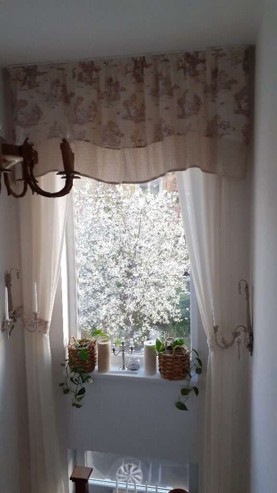

+++
date = 2022-04-15
title = "Ziua 94"
description = "Libertatea vine de abia când ajungi să stăpânești ceva extrem de bine, să-l știi ca pe podul palmei tale, pentru că doar atunci mintea se odihnește, lasă pilotul automat in charge și astfel poți da frâu liber improvizațiilor. Mintea, asemeni unui câine, poate fi dresată să se poarte frumos. Că are și ea niște setări, nu toate venite din fabrică, și de câte ori noi vrem să facem salturi cuantice, să gândim ceva ce mintea nu e pregătită sau nu poate cuprinde, nu găsește în fișierele ei informația și-ți dă cu reject. Nu m-am gândit niciodată la perspectiva asta!"
authors = ["Biannca Locatelli"]
[taxonomies]
tags = []
[extra]
math = false
diagram = false
image = "images/Ziua-94-final.jpg"
+++
---

Am "ratat" la mustață o super-mega-extra-prea-dimineață cu artista în devenire Spiky la 04.17! Norocul meu a fost, ca întotdeauna și mereu de altfel, Mr. H care a fost pe fază și a dat drumul la difuzor. Deși la început nu a părut impresionată, până la urmă n-a mai suportat și s-a tirat la parter. 1-1 la meciul care se anunță de anvergură.

***

Așa am reușit să mai fur un strop de timp, dar nu prea mult, pentru că m-am trezit într-o schelelăială de am crezut că au pățit ceva lupițele vecinului. Am sărit și din două mișcări, am fost la geam, să văd ce se întâmplă. Nu e nicio tragedie, vecinul îl duce pe tatăl lui, prietenul meu octogenar, acasă la el, în Suceava și ia și fetele cu ei iar ele sunt în extaz de bucurie. Eu nu prea.

Evident că somnul nu m-a mai prins în viteza în care am zbughit-o la geam, l-am lăsat sub pilotă și de abia diseară mă mai întâlnesc cu el. Plec o țâră spășită la parter, unde mă regăsesc cu Chichirica.

***

Am o mică strângere de suflet și, în timp ce-mi beau apa caldă, îmi deschid inima să înțeleg de ce.

Mă întristează plecarea prietenului meu și-mi stăruie în minte cuvintele lui: la toamnă, dacă mai sunt în viață, vin să te ajut cu pomișorii. Nu știu de unde am împrumutat eu prostul obicei de a mă atașa de oameni așa de repede dar îl am și uite că-mi dă dureri de suflet aiurea la ceas de dimineață.

I-am trimis gând bun și îi promit în sinea mea că o să-l sun.

E timpul să mă întorc la ale mele și să-mi șterg lacrima mică care a căzut. Ei, hai, asta-mi mai lipsea acum, să plâng că a plecat vecinul! Pe bune?! Când m-am sensibilizat așa de mult?!

***

N-am ieșit pe terasă, n-am avut nici chef și nici pornire. Eram oricum alertă-n simțire și nu aveam nevoie de infuzie de aer rece să-mi trezească mișcările.

Coana mare s-a trezit, a deschis și geamul, e cazul să mă scutur puțin de melancolia asta și să mă duc întreagă la ea. Chiar dacă o parte din sufletul meu a plecat la drum spre Suceava cu omul care mi-a reamintit că "viața trebe cumpănită în toate".

Diminețile nu mai sunt de ceva timp impactante pentru mine. La mama, de cele mai multe ori, e curat și în cameră și în spirit. Dă Doamne să fie cât mai mult așa!

Închid ușa după mine, le las liniștite iar pe mine mă uimește priveliștea. Cum de nu am văzut până acum vișinii înfloriți?! Sunt o poezie albă! Am stat pe loc, într-un wow al momentului, și-ntr-o admirație adâncă. Clar, primăvara are cele mai multe pansamente pentru suflet și pentru simțuri!

  

***

Am o zi ciudată azi pentru că în timpul meu magic nu am avut chef de nimic. Inclusiv de timpul meu magic. Spiky deja doarme dar eu nu știu ce să fac. Dacă să fac ceva.

Mă hotărăsc să ascult un podcast, pentru că nu simt că vreau să văd ceva. Am descoperit o tipă, Dolores Cannon, terapeut prin hipnoză, care spune niște chestii tare interesante. Nu toate fac sens ÎN mine dar trebe să recunosc că-mi pune mintea nițel pe bigudiuri. Azi m-a incitat cu o perspectivă tare: libertatea vine de abia când ajungi să stăpânești ceva extrem de bine, să-l știi ca pe podul palmei tale pentru că doar atunci mintea se odihnește, lasă pilotul automat in charge și astfel poți da frâu liber improvizațiilor. Mintea, asemeni unui câine, poate fi dresată să se poarte frumos. Că are și ea niște setări, nu toate venite din fabrică, și de câte ori noi vrem să facem salturi cuantice, să gândim ceva ce mintea nu e pregătită sau nu poate cuprinde, nu găsește în fișierele ei informația și-ți dă cu reject. Nu m-am gândit niciodată la perspectiva asta! Mi-aduc aminte că profa mea de la cursul ce mi-a schimbat traiectoria și mi-a aranjat privirea pe ce trebe spunea că mintea este un simț și, la fel ca orice simț, poate fi educată.

Din starea de chefless pe care am avut-o la început, m-a încărcat femeia asta cu o super stare, cu o încântare pentru viața asta fascinantă! Doamne, cât ne autolimităm! Ni s-a dat planeta asta ca loc de joacă, să zumzăim pe ea, să facem ce vrem, să încercăm, să savurăm, să scuipăm dacă nu e cu savurat și noi ne ducem traiul doar într-o pătrățică toată viața. What a waste of life!!!

***

Cu exuberanța-n sânge, am adus-o pe mama la micul dejun, am ciripit într-una, dar nu să acopăr o liniște, ci din bucurie de viață. Mi-am adus înapoi bucuria de viață, chiar dacă momentan este trunchiată prin limitarea de mișcare. Am atâtea de văzut, auzit, simțit aici și acum și asta e tot ce contează!

Mi-am pregătit și eu salata de crudități în timp ce stau cu ea, fredonăm amândouă o melodie de la radio și plutește prin bucătărie o stare de mult bun. Incredibil, cât de influențabilă sunt dar nici nu mă cert, nici nu mă laud. Dacă-mi face bine și mai dau și mai departe binele ăsta, ce contează?

***

Ca și ieri, întâi îmi savurez sălățica și apoi mă apuc de treabă. Azi vreau să smulg buruienile care-mi invadează curticica de flori și, pentru că nu sunt la prima experiență de genul ăsta, știu ce mă așteaptă.

Tot terenul nostru a fost plin de rugi de mure sălbatic, de buruieni care mai de care mai invadatoare și greu de îndepărtat. Prima oară am apelat la un erbicid total. Dar a fost și ultima oară. Pentru că am înțeles ce dezastru este pentru pământ, am început să smulg buruienile cu propriile-mi lăbuțe. Și nu sunt decât vreo mie și un pic de metri pătrați. Până ajungeam în fața casei, creșteau din nou în fundul curții. Așa că am o istorie cu ele, le-am învățat pe fiecare în parte, pe unele le-am eradicat doar prin smulgere, cu altele încă mai muncesc să le conving.

Ronțăi salata și îmi bucur ochii cu curtea mare. La fel și Spiky care se bucură de libertate de mișcare și se prelinge pe lângă gard.

***

Probabil că m-a lovit întâi disperarea din energie că de abia după aia am auzit strigătele.

Mi-a vândut azi Spiky bilete la spectacolul ei în primă reprezentație pe sezonul ăsta "Viața la țară". Nebuna era în vârf de copac, lângă cuibul coțofenilor, atentă la puiuții lor iar coțofana, striga din toți rărunchii și o amenința țopăind pe deasupra ei. Am lăsat salata pe unde am nimerit, mi-am luat un arac și am fugit să o dau pe zgubilitică jos, să nu care cumva să facă praf cuibul și să cadă puișorii. Era un spectacol pe mai multe voci: coțofana, care-și chemase și consoarta și acum erau un strigăt aproape continuu, eu care strigam la Spiky că nu e voie acolo și agitam amenințător aracul spre ea și ea, care n-are voce, doar se uita, când la mine, când la coțofeni, și se-ntreba de ce a înnebunit toată lumea. Privit de afară, cred că era de râs. Dar acolo, în miezul acțiunii, mă străpungea în inimă disperarea cu care se agitau coțofenii, acum hotărâți să mă ușuie și pe mine. Reușesc să o ademenesc pe nebunică jos, o iau pe sus și intrăm în curte, certând-o. Știu că nu înțelege ce spun dar știu că simte din tonalitate și din energie că-s supărată. Așa că se așează pe trepte, lângă mine, iar eu-mi reiau ronțăitul de unde l-am lăsat. S-au liniștit și coțofenii, sunt pe undeva prin zonă și păzesc cu strășnicie bogăția mică pe care o au în căsuța lor.

***

S-a terminat spectacolul fără bis, am gătat și salata, e timpul să mă apuc de buruieni. Afară e tare plăcut așa că mă ajută și natura. Doar că-s eu obosită, parcă nu mai am sporul pe care-l aveam în anii trecuți. Dar am răbdare și am perseverență. Când mă decid să fac, nu mă poate opri nimeni, fie că fac tâmpenii, fie că fac lucruri mișto. Bine că am mâncare pentru prânz, nu mă mai întrerup să intru la bucătăreală.

Nu știu cât timp a trecut cu mine în el observând și ferind gărgărițele din calea lopățelei de mâini, sau gândăceii, sau râmele dar știu că la un moment dat am realizat că nu mai e Spiky prin zonă. O strig, o pâsâi, și o văd pe terasă cum se joacă cu ceva. E clar, iar a cules de pe undeva un șoricel și se joacă cu el până-l omoară, că de mâncat nu mai mănâncă decât delicatese de la "mamă-sa". Fug să salvez șoricelul care nu era șoricel, era o șopârliță, dată pe spate. O protejez de Spiky și încerc să o iau dar mănușile astea de grădinărit nu-s așa de fine iar fără mănuși, mi-e că mă pișcă. Sunt atentă să văd dacă mișcă dar pare deja trecută la cele veșnice. Reușeșc să o culeg, Spiky mi se freacă mândră tare de picioare, iar eu plec cu șopârlița cât mai departe de curtea noastră, să nu se ducă Spiky să mi-o aducă înapoi. E vie, draga de ea doar s-a prefăcut că e moartă, ca să scape. Îi simt inimioara cum bate prin pieptișorul ăsta verzuliu și mă bucură imens că a scăpat.

***

De când sunt vegană, am devenit infinit mai atentă la toate formele de viață. Sunt mult mai atentă pe unde merg și feresc, pe cât mi-este posibil, orice vietate. Astăzi m-am prins că respect formele de viață care nu-s umane dar nu pot să spun același lucru și despre alea umane. Am înțelegere și grijă pentru vietăți dar oamenii îmi repugnă câteodată, pe ei îi judec de cele mai multe ori. Programele alea sedimentate în mine de la părinți, de la școală, de la societate, mi-au pus zoaie peste inimă și mai trebe spălat acolo până mi-oi curăța lentilele prin care-i privesc. Mă învață natura că tot ce trebe făcut e să fii blând și bun. Dar ingenuu așa. Și eu știu că sunt și blândă și bună dar mai știu și că nu sunt așa tot timpul și nu cu toată lumea.

***

Am terminat doar o treime din curtea de flori de dezburuienit, cu pauza de prânz aferentă, dar mă dor toate cele. De la atâta aplecat, mă doare spatele iar picioarele parcă îmi tremură așa că mă opresc că oricum nu mai apuc decât un duș că vin tablele peste mine.

Universul complotează cu mama, fără știrea mea, să mă relaxez la table. Altfel nu-mi explic cum, deși statul pe scaun două ore acum nu e deloc o plăcere pentru corpul meu muncit, mă simt bine, râdem, mama e fericită că jucăm și ăsta e prezentul care încapsulează în el două suflete. Am o mare permisivitate azi în el pentru tot și orice și mama e destinatarul primar al acestei disponibilități.

***

Trebe să mă opresc nițeluș și să descopăr cum pot "vindeca" adicția mea de a mă recompensa, în special seara, în special cu mâncare. Încep dimineața și până la prânz reușesc să mă țin de hrana vie, de crudități, doar legume și fructe și, după aia, dau iama în toate. O zbârcesc într-un stil grande. Partea nasoală nu e asta ci faptul că, în mintea mea, îmi pun parafa cu vinovată. Vorba și a lui Joe Dispenza și a lui Dolores: gândurile te pot îmbolnăvi. La fel cum tot ele te pot face și bine.

Lasă, mă apuc de mâine, azi merit o recompensă mică.

***

O să intru repede în lumea viselor așa că trec în revistă recunoștințele zilei:
1. Micii bulgărași de flori albe ale vișinilor înfloriți, ca niște globulețe de frumos atârnate pe ramuri!
2. Triumful vieții!
3. Senzația, care sper eu să devină obișnuință, că mă pot relaxa la table și chiar să mă bucur de moment!

Clipa de frumos ce mi-a hrănit inima este:

  

