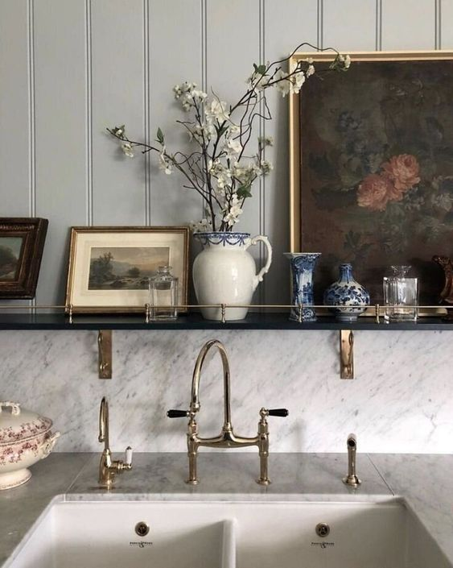

+++
date = 2022-04-18
title = "Ziua 97"
description = "Dacă cineva nu apreciază ce am eu de oferit, nu înseamnă că ce ofer eu nu e bun. Înseamnă că omul vrea portocale și eu ofer mere. As simple as that. Nu-i cu supărare. Sau așa ar trebui. Pentru că în realitatea mea, am perceput asta mereu ca o respingere și am suferit și m-am micit. Târzior m-am prins și eu cum stă treaba, așa că acum dacă vreau să ofer sau să cumpăr mere, mă duc la piață doar la tarabele cu mere. Iar dacă cineva vrea de la mine portocale, e fix problema lui, nu a mea."
authors = ["Biannca Locatelli"]
[taxonomies]
tags = []
[extra]
math = false
diagram = false
image = "images/ziua-97-final.jpg"
+++
---

Iuhuu! Prima mea noapte și dimineață normale după multișor timp. Fără frichineli, cutremure, schelălăituri, sforăituri și tot tacâmul. Chiar uitasem cum e și, când am deschis încetișor ochii, am avut un moment de mică panică: oi mai fi în viață? Hahaha! Superb să te trezești într-un ritm care pornește lent și crește o dată cu trezirea, fără înghionteli și fără grăbiri. Doamne, ce mi-a plăcut! Can I have another one, and another one, and another one?

Când ți-e pasul liniștit, când se aliniază toate cum și în cât timp le e nevoie, altfel se așează lucrurile în tine și în mintea ta. Parcă ai mai mult spațiu de manevră, nu te mai simți strâns, ți se întind aripile și câștigă în anvergură, ce să mai, e tare bine!

***

În pacea asta mișto, am ieșit și cu Spikylina afară, în friguț, am făcut pregătelile dimineții în pas mic, mi-am adunat gândurile care deja încep să se împrăștie și le-am ordonat pe făgașul zilei care s-a născut și-am pornit cu inima mare și deschisă către mama și Sassy. Nici faptul că mama e între două lumi, nu e nici total prezentă dar nici total absentă, are scăpări de atitudine în ambele, nu mi-a îngustat starea de spirit faină și nici nu mi-a pus nori pe suflet. Îmi văd de treabă, le dau să pape, le vorbesc blând cu zâmbet în glas și parcă le las o țâră mai sus decât le-am găsit.

***

M-am întâlnit din nou cu prietenul meu drag, timpul meu magic, ca în vremurile trecute.

Mi-am permis relaxare totală și am pornit într-o visare cu o emisiune care-mi place tare mult pe BBC, "Unde trăiesc oamenii sălbatici". Am simțit, cred că dintotdeauna, un imbold înăuntrul meu pentru sălbăticie. Când eram mică și apoi adolescentă, locul în care mă refugiam cu orele era unul din cimitirele orașului, situat pe un deal, aproape de pădure. Nu mi-era frică ci îmi plăcea la nebunie liniștea care domnea, în timpul săptămânii, când nu se perinda multă lumea pe acolo. Liniștea și sunetele naturii. Pe astea le-am regăsit în toate cimitirele în care am pășit în viața asta.

Am cochetat și încă mai cochetez cu ideea unui trai mai izolat, mai întors spre și la natură. Nu m-am dat în vânt niciodată după oameni, nu sunt genul care să facă băi de mulțime dar dacă aș avea o mână de oameni dragi dispuși să facem o mică comunitate cât mai departe de civilizație, nu cred că aș zice nu. Încă sunt în cumpănă între un castel sau o mică sălbăticie. Sau poate amândouă, cine știe ce-mi rezervă viața?!

În genere, eu am luat decizii rapid. Nu sunt genul care să facă algoritmi decizionali pentru că, tot în genere, dacă iau o decizie proastă, eu trag ponoasele. Dar și foloasele, dacă se dovedește mișto. Am luat câteva decizii tare bune la viața mea și-mi place să cred că, taman când cică mă înțelepțesc, nu o să zbârcesc spre final. Nu s-a copt ideea în mine așa că nu grăbesc nicio pârguire.

Visarea de azi a hrănit mult părticica aia din mine care vrea libertate de viață. Să nu fii constrâns de nimeni și de nimic, evident cu un preț al confortului de plătit, este o fantezie dulce și dragă inimii mele. Oamenii ăștia "sălbatici" au atâta respect față de natură, față de viață și o așa simplitate în gândire, încât nu poți să nu-ți dorești să faci și tu parte din asta. Au lăsat toate straiele alea inutile puse peste gândire și peste suflet și peste purtare și au o lumină vie în ochi și o vorbă molcomă în gură. Nu-i grăbește nimeni către nimic și nu mai aleargă după himere.

***

M-a trezit din visarea mea whatsappul, cu mesaje de la copila mea. Dragul ei are febră și a avut frisoane toată noaptea.

Prima mea reacție a fost de panică: ieri au fost la noi, au purtat mască ce-i drept, dar am stat o grămadă împreună. A doua reacție, după un respirat adânc: nu am făcut eu Covid când era în frenezia maximă și eu ieșeam să fac cumpărăturile, așa că nu o să fac nici acum. A treia reacție: totul o să fie bine.

Nesperat de rapid, am calmat în mine o potențială mică furtună cu nori pe suflet și am pregătit micul dejun pentru coana mare.

***

Mâncarea a fost și rămâne principala zonă gri între mine și mama. De câte ori o întreb ce vrea să mănânce, invariabil, primul răspuns e nu știu. Dacă îi ofer variante, le respinge rând pe rând până rămânem la omleta ei care mă disperă. Că "nu le are ea cu cerealele și cu laptele", că nu vrea roșii cu brânză, că nu aia, că nu ailaltă, îmi trebe multă răbdare la capitolul ăsta. Pe bune, câte variante de mic dejun poți să dai unui om mofturos?!

În fine, am bifat și dimineața asta, a vrut și cafea că l-a văzut pe Mr. H că-și face una, am pregătit-o că plec până la Metro și apoi o fugă și la copii, să le duc medicamente și ce mai au nevoie și, atât timp cât de pe drum de undeva, îi iau și ei prăjiturele, pot să mă duc și în lună. Interesul poartă fesul, as usual.

***

Am început alergătura.

Prima oprire Metro, să-mi iau afinele de pădure pentru smoothieuri și câte ceva pentru Paște. Apoi la mall, să-i repar ceasul de mână al mamei, care nu mai merge și pe care oricum nu prea mai reușește să-l citească dar dacă ea îl vrea, cine sunt eu să zic că nu? După, fuga și la farmacie de unde plec cu o pungă de medicamente și teste de covid și gripă, conform cererii. Cred că vor mai trece multe generații până ne vom întoarce la natură și la noi să încercăm să ne vindecăm. Până atunci, îngrășăm industria farma și ne înbolnăvim și mai rău. Copila mea vrea supă cu găluște, așa că mă duc și la Lidl să iau ce am nevoie pentru asta. 2 ore și ceva mai târziu, iată-mă-s în bucătăria lor, spăl vase și pornesc supa, într-o companie foarte selectă: iubirea botoasă a vieții mele, Maya. Stă în curuleț, cu un copănel întins grațios, ca o balerină, și mă urmărește cu privirea. Poate-poate scap ceva și pentru mustăcioarele ei. Sunt topită după grăsanca asta! Întotdeauna a făcut ce-a vrut din mine, pentru că este feblețea și slăbiciunea mea.

Alte aproape 2 ore mai târziu, mă pornesc spre casă pentru că s-a făcut de prânzul mamei și eu nu am nimic gătit acasă. Drept urmare, fac un popas la Carrefourul de lângă noi să cumpăr ceva la pachet și ajung acasă taman la țanc.

Îmi vâjâie puțin capul, nici apă nu am băut de când am plecat de acasă dar vreau să pun masa, să o chem pe mama la prânz și apoi să văd restul.

***

Ziceam eu că zona de mâncare e o zonă gri?! Ei, azi s-a înnegrit de-a binelea, că ciorba e prea acră iar din felul doi ia doar câteva guri și gata. Mare risipă! Deși domnul meu mă alimentează, încerc să nu o judec și să mă abțin de la comentarii.

Dacă cineva nu apreciază ce am eu de oferit, nu înseamnă că ce ofer eu nu e bun. Înseamnă că omul vrea portocale și eu ofer mere. As simple as that. Nu-i cu supărare. Sau așa ar trebui. Pentru că în realitatea mea, am perceput asta mereu ca o respingere și am suferit și m-am micit. Târzior m-am prins și eu cum stă treaba așa că acum dacă vreau să ofer sau să cumpăr mere, mă duc la piață doar la tarabele cu mere. Iar dacă cineva vrea de la mine portocale, e fix problema lui, nu a mea.

Chiar dacă fac eforturi să nu pornesc în mine dialoguri inutile cu mama, simt că peste mine s-a așezat o stare de tristețe. Sunt și puțin alergată, poate că mi se mai domolesc motoarele și m-a prins cu garda jos. Încă nu pot să las să curgă mai departe, fără să mă râcâie pe interior, interacțiunea asta a ei extrem de egoistă cu exteriorul. Dar azi, în mașină, am auzit o întrebare care mi s-a părut atât de tare în simplitatea ei, pentru că deși am auzit-o de nșpe ori, niciodată nu am pus-o în contextul potrivit: "mă ajută?" Când sunt pe cale să (mă) judec, să iau o decizie, să pornesc o ceartă sau un război, să am un regret, să mă consum în mine, aș vrea să nu uit să bag în pliul clipei inițiale întrebarea asta plină de miez: Mă ajută să cresc? Mă ajută la ceva bun? E sămânță bună ce vreau să sădesc?

Așa că poate nu-mi iese din prima azi, dar am avut o tresărire, parcă m-a scos puțin dinăuntrul "problemei" false pe care o traversez. Nu, nu mă ajută la nimic tristețea asta. Chiar dacă nu o pot șterge brusc, măcar am luat decizia că nu o întrețin. Stau în starea asta să se consume de la sine dar cu siguranță nu mai chem armata de gânduri și justificări și motive pentru care merit, ba chiar am tot dreptul să fiu tristă. Că n-am de ce, totul e trecător.

În toată agitația asta interioară și în datul din mâini în exteriorul meu, că treaba trebe făcută chiar dacă am eu întrebări existențiale, nici nu știu când s-a făcut timpul de table.

***

Iar n-am chef de table. Dacă fac o statistică, învinge covârșitor majoritatea dăților când nu am chef. Dar azi mă enervează de la bun început. Hai că e tare asta! Tocmai azi, când am încercat aproape toată ziua să mă dezlipesc de carcasa asta de carne și să privesc din perspectiva spiritului. Să-mi dau seama că toate astea "lumești" sunt mici și trecătoare și să nu mă las afectată de ele. Uite că, spre seară, pesemne că voința și vigilența mea slăbesc și alunec cu totul în uman. Și, ca orice ființă umană căreia îi este limitată alegerea, mă apucă nervii. Pentru că mi se pare tare nașpa ca ziua mea să se termine brusc pe la 17:00 după-amiaza.

Și, atunci când te enervează ceva, tot ce gravitează prin jur devine motiv de exacerbare a stării de nervozitate.

Am obosit să trag de ea să facă duș. Am obosit să o rog să-i fac masaj. Sau să ia pastilele. Iar azi, mai mult ca oricând, îmi vine să le las baltă, să stea așa, să nu fac nimic din toate astea. Dar știu că ea nu e ea și că eu trebe să mă îngrijesc și de corpul ei. Și uite cum, pe nesimțitelea și cu încrâncenare finalizată întotdeauna cu încântare, trec peste trei ore din viața mea, ore pe care nu le trăiesc în viața mea.

Am o stare neutră, parțial de la oboseala fizică pe care o resimt în pleoapele de plumb și în amorțeala din interior, pe care o percep de fiecare dată când îmi înfrâng timpul. Când îl dau dar nu l-aș da.

***

Cu toate astea, nu am cum să nu bifez la căsuța recunoștinței:
1. O noapte și o dimineață normale și line!
2. Bucuria de a face bucurii, inegalabilă și priceless!
3. Momentele mele de iubire plină cu Măyuca mea balerină!

Un frumos strecurat azi a fost o bucurie pentru ochii sufletului:

  

Carley Simmers design

 

 

  

    <a href="/blog/ziua-96/">Postarea anterioară</a>
  

  

    <a href="/blog/ziua-98/">Postarea următoare</a>
  

