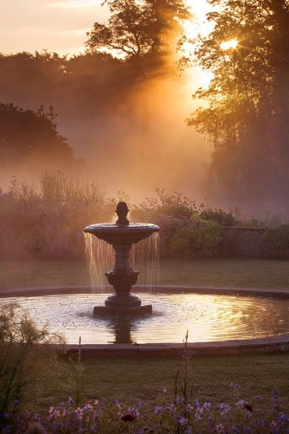

+++
date = 2022-04-19
title = "Ziua 98"
description = "Ruptura asta a fost subtilă, imperceptibilă, dar s-a adâncit cu fiecare zi care a trecut și eu nu m-am mai adăpat din agitația unei vieți trăite pentru a face bani, a-i cheltui și a o lua de la început, cu pauze pentru trăit în weekend sau în concediu. Eu cred că toți suntem Dumnezei adormiți, cu potențial uriaș netrezit, latent, care așteaptă cuminte deșteptarea. Nu cred în biserică, nu cred în toate îndatoririle care vin cu o înmormântare, sub nicio formă nu cred în amenințările unor pedepse cu arderi în focuri veșnice. Cred în viața trăită pentru scopul pentru care am primit-o, dacă suntem atât de curioși și perseverenți să-l aflăm și să-l îndeplinim, cred în karma, cred în energie, cred în puterea gândului și cred că putem facem orice. "
authors = ["Biannca Locatelli"]
[taxonomies]
tags = []
[extra]
math = false
diagram = false
image = "images/ziua-98-final.jpg"
+++
---

O noapte și o dimineață bunicele, poate o trezire prea devreme generată de țopăielile ostentative ale divei Spiky din pat pe parchet, de la fereastră pe parchet, aterizări cu aplomb care să sublinieze, nu chiar subtil, că trebe să mă ridic și să ieșim afară. Suflet și apucături de cățel deghizat în trup de felină, asta este Spikylina. Nu pot ignora atacul subliminal așa că la 5 și aproape de jumate, suntem deja pe terasă.

***

Brrr, dar cred că vine Crăciunul, nu Paștele, că-i frig tare! Sărită de sub pilota călduroasă direct în frig, m-a apucat o clănțăneală de mi-am făcut și-un detartraj gratis. N-am rezistat decât câteva minute, că mi s-a făcut milă de mine. Nu mai nimeream butonul la aragaz să pornesc de ceai și să-mi încălzesc apa, care a alunecat atât de plăcut și mi-a potolit tremurul pe dinăuntru.

Nebunica a fugit, ea știe pe unde s-o fi dus în defilare. Am descoperit că wc-ul ei din curte, ca o țărancă veritabilă ce este, se află fix în mijlocul locului unde eu am pus bulbii de iriși. Am prins-o de două ori, săpând acolo, fie înainte, fie după actul incriminatoriu. Trebe să pun în zonă niște bețișoare sau furculițe de plastic cu furcile în sus, să-și găsească altă toaletă.

***

Afară plouă încețișor, mocănește și este o atmosferă închisă, însă mie-mi place așa. Nu știu când s-a făcut shiftul în viața mea de la zilele cu soare la zilele cu ploaie, dar îmi plac mult ultimele. E drept că nu le-aș vrea una după alta o perioadă lungă de timp, e fain să mai apară și-o senină, două dar am ajuns să le iubesc și nu mă mai deprimă.

S-a trezit și mama, numai bine că am terminat tot ce era de făcut și vreau să bifez și la ea. E curat, e cald, e bine. Checked, checked, checked! Mai arunc o privire admirativă către vișinii înfloriți, o alint pe sora mea blănoasă, Sassy, mamei îi dau smoothieul bun și pastilele și căldura mea sufletească și mă refugiez avidă să stau cu mine. Doar să stau. Iar simt că mi s-a mișcorat timpul doar al meu: am o oră jumate dimineața și tot cam atât seara. În rest, nu-mi mai aparține...

***

Nici nu știu ce să fac mai întâi: m-aș uita pe antichități, dar aș vrea și puțin design, mi-e dor și de castele și muzică clasică, trebe să-mi fac puțină ordine și-n lista de to do-uri, aș vrea să înghesui multe, multe dar nu intră toate.

În toată grămada asta de "fă și aia, fă și ailaltă", corpul meu, care nu dă doi bani pe ce vrea mintea când el nu mai poate, mi-a dat shutdown. Habar n-am când am ațipit, cert este că am plecat prin alte sfere preț de vreo jumătate de oră. A fost tare odihnitor. Pesemne ploaia asta m-a ademenit și toropit mai mult decât credeam că poate. Bun așa!

***

Scrollez puțin pe social media, de ajuns cât să văd o veste grea, un deces. Cancer, de o vârstă cu mine. Inițial, vestea m-a chircit în mine. Din expansiunea pe care o trăiam, am simțit fizic, cum mă reduc. Nu a fost nimic gândit ci doar simțit. Am chemat și mintea la masă, și, pe lângă emoționalul care-mi spunea că dorul e cel mai greu de dus după moartea cuiva drag, mi-am dat seama că ăsta e firescul vieții, asta e continuarea vieții, că asta ne paște pe toți.

Într-un mod care încă nu e palpabil, simt că în mine s-a întâmplat o mare schismă. Nu s-a întâmplat brusc, este un proces care a început cu burnoutul de acum câțiva ani și probabil că va continua tot restul vieții mele, dar încep să văd că părerile mele nu se mai aliniază la părerile generale. Nu e nici bine, nici rău, doar este. Ruptura asta a fost subtilă, imperceptibilă dar s-a adâncit cu fiecare zi care a trecut și eu nu m-am mai adăpat din agitația unei vieți trăite pentru a face bani, a-i cheltui și a o lua de la început, cu pauze pentru trăit în weekend sau în concediu.

Când am putut să dau pătura asta groasă și grosolană, de griji, la o parte, am descoperit o altă lume, fascinantă pentru mine, care implică destul de puțin materialitatea. Eu cred că toți suntem Dumnezei adormiți, cu potențial uriaș netrezit, latent, care așteaptă cuminte deșteptarea. Nu cred în biserică, nu cred în toate îndatoririle care vin cu o înmormântare, sub nicio formă nu cred în amenințările unor pedepse cu arderi în focuri veșnice. Cred în viața trăită pentru scopul pentru care am primit-o, dacă suntem atât de curioși și perseverenți să-l aflăm și să-l îndeplinim, cred în karma, cred în energie, cred în puterea gândului și cred că putem facem orice.

Nu mai știu cum am ajuns la el, dar Miceal Ledwith a fost primul pe care l-am ascultat după burnout și mi s-a dus direct în suflet, care a rezonat puternic cu adevărurile pe care le simțeam spuse de omul ăsta în The hamburger Universe. Ora aia din viața mea cât mi-a luat să îl ascult a echivalat cu vreo 40 de ani de orbecăială. Și a fost primul meu pas spre viață.

https://www.youtube.com/watch?v=xAS77rIRdt8

Am priceput clar că reacțiile mele în dimineața asta au fost duale, că fiecare a venit din ființele care mă alcătuiesc. Reacția de grijă, de compasiune pentru cel rămas în viață a venit de la umanul din mine iar cea de liniște, de înțelegere profundă a unei treceri a venit din spiritul meu. Mă bucură claritatea avută azi pentru că nu-mi lasă loc niciunei învinovățiri, niciunei interpretări.

***

Micul dejun cu domnul meu, care, chiar dacă nu are toate cuvintele trezite în el dimineața, mă bucură mereu, la un nivel unde vorbele nu reprezintă mare lucru. Acolo doar energia se simte, iar lângă el, mereu mi-a fost bine. Chiar și când mi-a fost rău.

Apoi mic dejun cu mama, mofturoasă ca de obicei, dar și cu asta mă obișnuiesc. Nu vrea să meargă cu mine la cumpărături, că e frig, că o dor toate oasele, are toate scuzele din lume gata să mi le servească. Nu mai insist, deși domnul meu zice să forțez. Nu pot și nu cred că am dreptul ăsta. Până la urmă, fiecare își duce viața cum trebe să și-o ducă. Eu îi pun la dispoziție tot ce am și tot ce sunt, mai departe trebe să facă ea. Fie că e sau nu e cu mințile unde trebe. Dumnezeu îți dă dar nu-ți bagă în sac. Cam așa.

***

Mă apuc să gătesc întâi, să nu mai alerg pe la cumpărături ca să ajung la timp acasă. Fac vreo trei feluri de mâncare, să fie, să aibă de unde alege.

Amândouă am început să ne aventurăm mai mult. Eu, afară din casă, mama, afară din camera ei. Când urcam să mă schimb, m-am și speriat că s-a deschis brusc ușa la ea. Era hotărâtă să coboare, să-și facă o ceașcă de cafea. Chiar dacă a băut și ieri și știe că nu vreau să îi dau zilnic. Dar nu contează, îmi repetă tăios că vrea cafea. Și continuă să coboare.

Dacă ar fi să-l ascult pe Mr. H, să fiu fermă, cum ar trebui oare să o opresc?! Să o țin cu forța să nu coboare? Sau să nu îi dau voie fizic să facă ceașca aia de cafea?

Surprinzător, nu mă enervează nici atitudinea și tăișul vorbei. Cobor cu ea și îi fac cafeaua. Ba mai mult, îi vorbesc calm, de cu totul altceva, ca și cum episodul de mai devreme nu mai există. Pentru că, literalmente, nu mai există, face deja parte din trecut.

Decid cu ea că e totuși prea devreme pentru cumpărăturile de carne așa că, am scăpat, nu mă duc azi nicăieri. Afară toarnă cu găleata și nu am niciun chef de plecat. Până la urmă, am salvat o situație cu potențial de harță și a ieșit chiar ceva bun din ea. Bravo!

***

Dindr-odată, m-am trezit cu o bucată de timp liber, al meu. Pe care am înșfăcat-o cu sete și mi-am terminat mini proiectul de bricolaj, cu tablouașele pentru peretele din baie. Am luat 4 tablouri mici, rotunde, cu cele patru anotimpuri pictate dar am știut din start că nu le las așa. Culorile folosite erau triste iar rama de lemn, prea închisă pentru gustul meu. Așa că ramele le-am aurit (cum altfel?) și am printat citate în franceză pe coli învechite cu cafea. Îmi place cum au ieșit! Sunt cu totul altceva decât erau și cu totul altfel decât majoritatea tablourilor. Dar mie-mi plac și asta e tot ce contează. Că Mr. H nu acordă prea mare atenție la detaliile astea.

***

În timpul prânzului cu domnul meu, mă sună prietena mea dragă care mă anunță, fără nicio pregătire prealabilă, că într-o oră pleacă spre mine. Un val de emoție caldă mă trece prin tot corpul. Mă bucur imens! Pe lângă că mi-e un dor de ea mare, mare, în sfârșit mai vorbesc și eu, față în față, cu un om drag mie, altul decât Mr. H, mama sau copiii. Nu cred că știe cât bine îmi face dar știu eu și mai știu că fiecare gest al nostru se înscrie undeva. Acolo, în undeva-ul ăla, ea a marcat azi un plus. Și pentru mine și pentru ea. Plâng mic și scurt, ca un copiluț, de bine și de bucurie. Mulțam cu recunoștință!

***

Mama nu vrea prânz, deși tocmai ce-am gătit. Nu-mi stric starea, prea bună de altfel, și o anunț că o să am musafiri. Nu o interesează, vrea doar să știe dacă vin la table. Nu știu să îi răspund.

***

Avem atâtea să ne spunem, să ne povestim și atât de puțin timp, că ni se bulucesc povestirile unele într-altele. Râdem, ne bucurăm, ne completăm vorbele, visăm, filozofăm, suntem două vrăbiuțe gureșe care se simt bine împreună. Și când ți-e bine, zboară timpul. Recunosc, nu am ajuns la înțelepciunea de a mă bucura când ceva se termină, că a fost. Pentru că am vizitatori atât de rar, nu aș vrea să se termine repede. Dar asta este, ne îmbrățișăm și ne vom mai vedea când ne vom mai vedea. De auzit ne auzim însă săptămânal.

Probabil că Universul mi-a văzut inima mică, strânsă o țâră a deznădejde, a agățare că în timp ce o conduceam pe doamna mea dragă, cine-mi bate-n poartă? Vecinul meu, bătrânul! Cu brațele pline, cu mere și cu ceapă! Dragul de el! Nu am apucat să aflu cât stă dar m-am bucurat tare mult să-l văd! Mulțam cu recunoștință și pentru asta!

***

Fără table, fără duș și masaj, ziua mea s-a dilatat brusc azi și a fost plină de surprize. Mi-e inima plină de drag, și de bine, și de bucurie, și de oameni faini, că simt cum dau pe dinafară. Și număr recunoștința pentru:

1. Momentul ăla mic și neînsemnat când, la o țigară, pe un balcon, într-o corporație, am cunoscut un suflet extrem de nobil, de generos, de autentic, de curat și de deschis!
2. Parcursul meu de la lipsa de încredere în sine la suveranitate!
3. Toți oamenii ăștia faini de pretutindeni care deschid gura și spun perspective, cu tot riscul de a fi luați peste picior, deschizând drumuri spre adevăruri depuse în adâncuri și uitate acolo!

Clipa mea de frumos este:

  

Clive Nichols photograph
